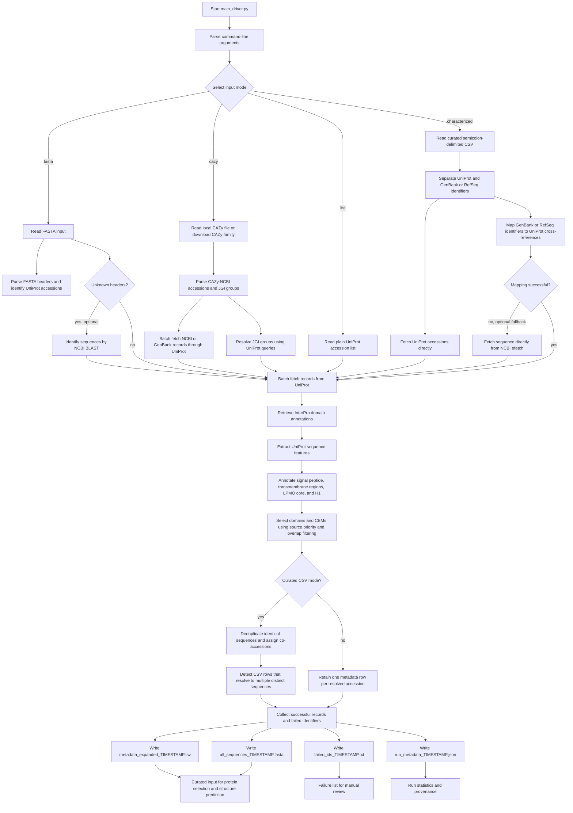
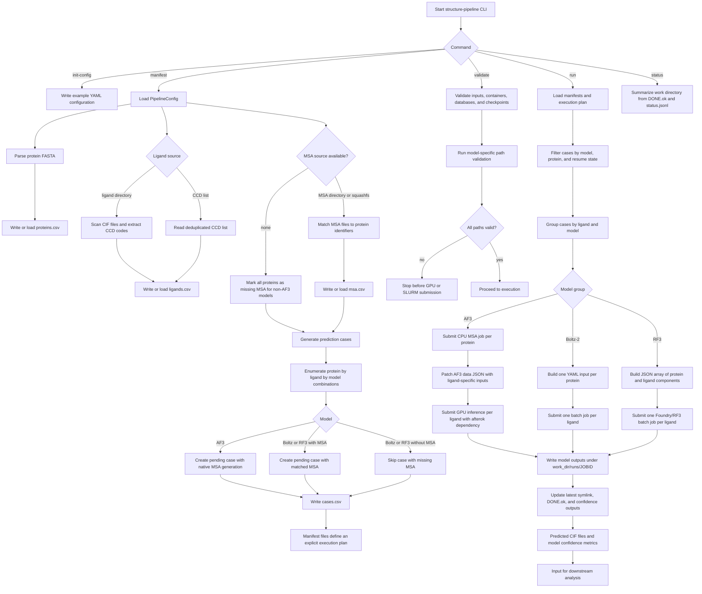
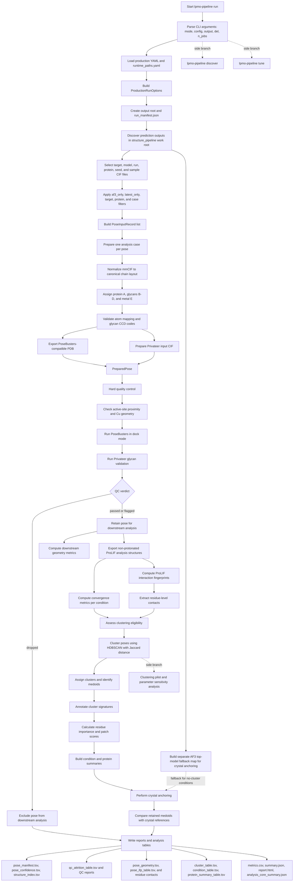

# Pipeline flowcharts for Masteroppgave_clean

This document provides four Mermaid flowcharts describing the main processing
stages in `Masteroppgave_clean`:

- `pipe_test/scripts/module_2_new`: protein metadata and sequence enrichment
- `structure_pipeline`: manifest-driven structure prediction on HPC
- `analyse`: downstream analysis of predicted AF3 structures
- an integrated overview showing how the modules are connected

The diagrams are based on the project documentation and current code
walkthroughs in `module_2_new`, `structure_pipeline`, and `analyse`.

## 1. Metadata and Sequence Enrichment

## 2. Structure Prediction Pipeline

## 3. Downstream Analysis Pipeline

## 4. Integrated Workflow

```mermaid
flowchart TD
  A[Public and curated protein sources] --> B

  subgraph M2[Part 1: Protein set construction]
    B[Input records from FASTA, CAZy, accession lists, or curated tables]
    C[Resolve identifiers and retrieve sequence metadata]
    D[Annotate domains, signal peptides, LPMO core regions, H1, and CBMs]
    E[Export curated protein metadata and sequence sets]
    B --> C --> D --> E
  end

  E --> F[Selected protein and ligand set]

  subgraph SP[Part 2: Structure prediction]
    G[Define proteins, ligands, model settings, and MSA resources]
    H[Build explicit manifests and prediction cases]
    I[Validate HPC environment and model dependencies]
    J[Run structure prediction jobs]
    K[Collect predicted structures and confidence metrics]
    G --> H --> I --> J --> K
  end

  F --> G
  K --> L[Predicted protein-ligand structures]

  subgraph AN[Part 3: Downstream structural analysis]
    M[Discover prediction outputs and prepare analysis cases]
    N[Normalize structures and perform hard quality control]
    O[Compute geometric, interaction, and convergence descriptors]
    P[Cluster retained poses and identify representative medoids]
    Q[Compare predictions with crystal references]
    R[Summarize results for figures, tables, and interpretation]
    M --> N --> O --> P --> Q --> R
  end

  L --> M
  R --> S[Thesis figures, statistical summaries, and biological interpretation]

  classDef module2 fill:#e8f4ff,stroke:#2f6f9f,stroke-width:1.5px,color:#111827
  classDef structure fill:#ecfdf3,stroke:#2f7d4f,stroke-width:1.5px,color:#111827
  classDef analysis fill:#fff4e6,stroke:#b36b00,stroke-width:1.5px,color:#111827
  classDef bridge fill:#f7f7f7,stroke:#6b7280,stroke-width:1px,color:#111827

  class B,C,D,E module2
  class G,H,I,J,K structure
  class M,N,O,P,Q,R analysis
  class A,F,L,S bridge

  style M2 fill:#e8f4ff,stroke:#2f6f9f,stroke-width:2px
  style SP fill:#ecfdf3,stroke:#2f7d4f,stroke-width:2px
  style AN fill:#fff4e6,stroke:#b36b00,stroke-width:2px
```

