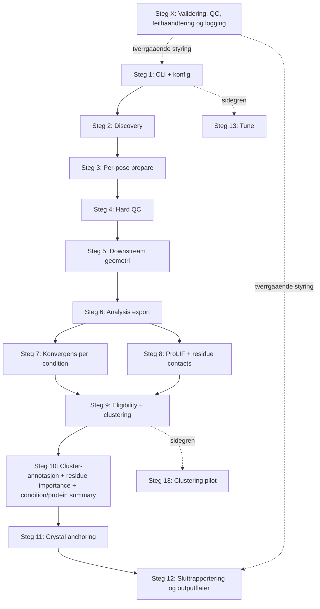

# Codewalkthrough

Runtime update 2026-05-22: ProLIF-facing downstream preparation now writes
non-protonated `analysis_export/complex_for_prolif.pdb` and
`analysis_export/ligand_only_for_prolif.pdb`. ProLIF computes implicit
H-bonds plus VdW; main clustering uses implicit H-bonds only.

## 1. Introduksjon

Denne walkthroughen dekker den produksjonsnaere analysepipen under `analyse/`, fra entrypoint og konfigurasjon via discovery og poseforberedelse videre til hard QC, downstream analyse, clustering, crystal anchoring, rapportering og sidegrener (tune/pilot).

Dokumentet er konsolidert for sluttkontroll: det beskriver flyt paa pipeline-/fase-/stegniva, med fokus paa input, behandling, output, begrunnelse (der kode/stottekilder faktisk viser den), relevante fil/linje-referanser og eksplisitt markerte usikkerheter.

Gjennomgangen er kodebasert. Runtime-kode under `src/` og config-filer som faktisk lastes av koden prioriteres, mens README, TODO, dokumentasjon og planer brukes som stotte bare der de stemmer med implementasjonen (`DECISIONS.md:3-8`; `human_readability_code_walkthrough/CODEWALKTHROUGH_STATUS.md:31-33`).

## 2. Hvordan lese dette dokumentet

Denne walkthroughen beskriver pipen paa hoeyt nivaa, ikke funksjon for funksjon. Hensikten er aa rekonstruere faktisk flyt, ikke aa lage en API-katalog.

For hvert pipeline-steg skal teksten etter hvert beskrive:

- input
- hva som skjer
- hvorfor det gjoeres, hvis koden eller lastet config faktisk forklarer det
- output

Alle viktige paastander skal forankres med fil- og linjehenvisninger. Hvis dokumentasjon, config-kommentarer og kode peker i ulike retninger, skal avviket sies eksplisitt i stedet for aa glattes over (`DECISIONS.md:6-8`; `human_readability_code_walkthrough/CODEWALKTHROUGH_STATUS.md:31-33`).

Usikkerheter markeres eksplisitt. Der walkthroughen forelopig bygger paa en arbeidsantakelse, skal det staa at det er en arbeidsantakelse og hva som maa verifiseres i kode senere.

## Overordnet flyt (konsolidert)

Standard navnekonvensjon i dette dokumentet:

- Steg 1-13 brukes konsekvent for sekvensen i production-stien + sidegrener.
- Faseoverskrifter grupperer steg uten aa introdusere alternativ stegnummerering.
- "Production-sti" betyr `lpmo-pipeline run --mode production ...`.



Kort fasekart:

| Fase | Dekker steg | Kjerneleveranse |
|---|---|---|
| Oppstart og discovery | 1-2 | Kjoerbar produksjonskontekst og valgt posegrunnlag |
| Case-prep og hard QC | 3-4 | `PreparedPose` + QC-verdict med fail-closed policy |
| Downstream signalbygging | 5-8 | geometri, analysis_export, konvergens, IFP og residue contacts |
| Clustering og annotasjon | 9-10 | cluster assignments/medoids, signaturtabeller, residue/patch-score, condition/protein summary |
| Crystal + rapportering | 11-12 | crystal-sammenligning og sluttflater (`metrics.csv`, `summary.json`, `report.html`) |
| Sidegrener | 13 | tune + pilotorkestrering (ikke erstatning for production-sti) |

## 3. Kildegrunnlag

Kildegrunnlaget bygger forelopig paa de kildekategoriene som allerede er kartlagt i statusdokumentet, med kode som primaergrunnlag og stottedokumenter som sekundaergrunnlag (`human_readability_code_walkthrough/CODEWALKTHROUGH_STATUS.md:7-29`; `DECISIONS.md:6-8`).

- kode: runtime-kode under `src/`, spesielt CLI, orkestrering, I/O, QC, analyse og rapportering
- config: YAML-filer under `configs/` som faktisk lastes av koden
- README: overordnet oversikt over pipens naavaerende flate og status (`README.md:6-18`)
- TODO: dokumenter som blander status, restarbeid og manuelle kontroller
- documentation: beslutningsdokumenter, playbooks og eksplisitte open-questions-dokumenter
- planer: plan- og designfiler som forklarer intendert struktur, men som kan vaere fremoverskuende eller utdaterte

Stottedokumenter kan vaere utdaterte. Hvis de avviker fra runtime-koden, prioriteres kode under `src/`, relevante config-filer under `configs/`, og tester eller harnesser som faktisk bekrefter produksjonsstien (`DECISIONS.md:6-8`; `human_readability_code_walkthrough/CODEWALKTHROUGH_STATUS.md:31-33`).

## 4. Filplasseringstre

Treverket under er et forelopig arbeidsutvalg over filene og mappene som ser mest relevante ut for aa rekonstruere den produksjonsnaere analyseflyten. Det er med vilje filtrert og er ikke et fullstendig repo-tre (`human_readability_code_walkthrough/CODEWALKTHROUGH_STATUS.md:11-29`).

```text
analyse/
├── pyproject.toml                                  # pakkeoppsett og CLI-registrering
├── src/
│   └── lpmo_pipeline/
│       ├── cli.py                                  # CLI entrypoints for run, discover og tune
│       ├── config.py                               # lasting av runtime paths og felles assets
│       ├── analysis/
│       │   ├── analysis_orchestrator.py            # hovedorkestrator for produksjonsflyten
│       │   ├── mdanalysis_metrics.py               # downstream pose-geometri etter hard QC
│       │   ├── convergence_metrics.py              # konvergensberegning per condition
│       │   ├── prolif_ifp.py                       # ProLIF/IFP-bygging og featureflate
│       │   ├── residue_contact_extraction.py       # residue-level contact-tabeller
│       │   ├── clustering_hdbscan.py               # naavaerende produksjonsclustering (HDBSCAN/Jaccard)
│       │   ├── clustering_agglomerative.py         # eldre/alternativ metode, ikke primaer production-sti
│       │   ├── cluster_signatures.py               # clusterannotasjon og signaturtabeller
│       │   ├── residue_importance.py               # residue- og patch-scorer
│       │   └── crystal_anchoring.py                # screening mot crystal references
│       ├── io/
│       │   ├── discovery.py                        # discovery av poser fra work-root
│       │   ├── mmcif_ingest.py                     # innlasting av mmCIF-strukturer
│       │   ├── normalize_mmcif.py                  # normalisering av mmCIF
│       │   ├── analysis_export.py                  # non-protonated PDB-eksport for ProLIF og konvergens
│       │   ├── cif_to_pdb.py                       # eksport til PoseBusters-kompatibel PDB
│       │   └── protonate_export.py                 # legacy protonering; ikke aktiv ProLIF-produksjonssti
│       ├── qc/
│       │   ├── hard_qc_orchestrator.py             # hard-QC-rekkefolge og verdict
│       │   ├── active_site_proximity.py            # pre-QC sjekker rundt aktivt sete
│       │   ├── custom_geometry_checks.py           # Cu-geometri og andre strukturregler
│       │   ├── gates.py                            # lasting av terskler fra YAML
│       │   ├── posebusters_runner.py               # PoseBusters-wrapper
│       │   ├── privateer_runner.py                 # Privateer-wrapper
│       │   └── qc_report.py                        # bygging av QC-rapport
│       ├── utils/
│       │   ├── logging.py                          # strukturert JSONL-logging + failure logs
│       │   └── manifest.py                         # run-manifest, gates og tool-versioner
│       └── report/
│           ├── build_metrics_csv.py                # skriver metrics.csv
│           ├── build_summary_json.py               # skriver summary.json
│           └── build_report_html.py                # bygger report.html
├── configs/
│   ├── production.analysis_core.example.yaml       # eksempelkonfig for analysekjoring
│   ├── thresholds.yaml                             # terskler for QC, geometri og clustering
│   ├── runtime_paths.yaml                          # runtime path-oppslag
│   ├── prolif_features.yaml                        # featuredefinisjoner for IFP
│   ├── residue_rules.yaml                          # regler for residue-sammendrag
│   └── geometry_rules.yaml                         # geometri- og valideringsregler
├── tests/
│   ├── test_cli_run.py                             # forventede produksjonsoutputs fra CLI
│   ├── test_analysis_orchestrator.py               # tester for hovedorkestrator
│   └── run_tests_scripts/
│       ├── run_analysis_core_real_cifs.py          # real-data harness for analysekjeden
│       ├── run_clustering_pilot_real_case.py       # resumerbar pilot-entrypoint
│       └── submit_clustering_pilot_staged.sh       # staged multi-node wrapper for pilotkjoring
├── human_readability_code_walkthrough/
│   ├── CODEWALKTHROUGH_STATUS.md                   # arbeidsstatus, scope og kildeinventar
│   └── open_questions.md                           # egne sporsmal for walkthrougharbeidet
├── README.md                                       # overordnet oversikt, ikke nodvendigvis fasit
├── DECISIONS.md                                    # implementasjonsforankret beslutningslogikk
├── IMPLEMENTATION_PLAYBOOK.md                      # stegoversikt og implementasjonsstatus
├── MASTERPLAN.md                                   # planverk, delvis fremoverskuende
├── AF3_LPMO_pipeline_detailed_plan.md              # hovedplan omtalt i README
├── DOCUMENTATION_TODO_AND_MANUAL_CHECKS.md         # TODO, historikk og manuelle oppfolginger
└── OPEN_QUESTIONS.md                               # eksplisitte apne usikkerheter
```

Dette treet er bevisst filtrert til filer som brukes direkte i walkthroughen. Urelaterte hjelpefiler, mellomlag og historiske artefakter er utelatt.

## 5. Pipeline-steg

### Steg 1: Pipeline-start, entrypoint og konfigurasjon

#### Status
Ferdig

#### Formaal
Dette steget etablerer en konkret produksjonskjoring av analysepipen. Det er her et skallkall eller en dokumentert kommando blir gjort om til en faktisk kjoring: CLI-entrypointen parser argumenter, hovedkonfigurasjonen lastes fra YAML, output-roten opprettes, en manifestramme initialiseres, og produksjonskonfigurasjonen blir oversatt til en intern `ProductionRunOptions` som styrer discovery og videre orkestrering. I praksis er dette broen mellom en manuell kommando og resten av analysis-core-flyten.

#### Input
- CLI-argumenter: den kanoniske produksjonsinngangen er `lpmo-pipeline run --mode production --config ... --output ... --del ... [--n-jobs N]`. Konsollskriptet `lpmo-pipeline` registreres i `pyproject.toml`, og `main()` i `src/lpmo_pipeline/cli.py` eksponerer tre subcommands: `run`, `discover` og `tune`. Bare `run` starter den integrerte produksjonsstien. `--mode` er obligatorisk, men har i praksis bare ett lovlig valg (`production`), `--config`, `--output` og `--del` er obligatoriske, og `--n-jobs` defaultes til `1`.
- config-filer: `--config` peker til hoved-YAML-en som leses med `yaml.safe_load()` i `cmd_run()`. Ved produksjonskjoring er det feltene under `production` som faktisk brukes til oppstarten: `construct_type`, `work_roots` eller `work_root`, `run_id`, `af3_only`, `latest_only`, `max_cases`, `include_targets`, `include_proteins`, `run_posebusters`, `run_privateer`, `n_jobs`, `collect_timing_events` og eventuelt `clustering_pilot.*`. `configs/production.analysis_core.example.yaml` matcher disse navna, men toppkommentarene i filen beskriver en eldre og smalere produksjonsslice enn den som kjorer i dagens kode.
- miljoevariabler: jeg fant ingen miljoevariabel i `cmd_run()` eller `run_analysis_core()` som velger produksjonssteg. Den relevante startnaere miljoevariabelen er `LPMO_PIPELINE_RUNTIME_PATHS_CONFIG`, som lar downstream-moduler bytte ut `configs/runtime_paths.yaml` nar de resolver eksterne verktoypaths og sentrale asset-filer. I tillegg ekspanderer `lpmo_pipeline.config` miljoevariabler og `~` inne i path-strenger i runtime-paths-YAML-en.
- hardkodede defaults: produksjonsopsjonene defaultes i kode dersom YAML-en ikke setter dem. Viktige defaults er `construct_type="domain_only"`, `af3_only=True`, `latest_only=True`, `run_posebusters=True`, `run_privateer=True`, `n_jobs=1` og `collect_timing_events=False`. Hvis `latest_only` er aktivt og `latest`-symlinken i en modellmappe er ubrukelig, faller discovery-koden tilbake til hoyeste numeriske run-ID. Runtime-paths loaderen faller ogsa tilbake til den bundlete `configs/runtime_paths.yaml` hvis ingen eksplisitt config-path eller miljoevariabel er satt.
- filer eller mapper: `--output` bestemmer output-roten og opprettes hvis den mangler. Data-roten velges fra `production.work_roots[construct_type]`, med fallback til `production.work_root`. Ekstra runtime-konfig ligger separat i `configs/runtime_paths.yaml`, som peker til felles assets som `configs/thresholds.yaml`, `configs/prolif_features.yaml`, `configs/defaults.yaml`, `configs/geometry_rules.yaml`, `configs/residue_rules.yaml`, `configs/cv_hierarchy.yaml` og `schemas/qc_report_schema.json`.
- dokumenterte kommandoer som stemmer med kode: README-kommanden `lpmo-pipeline run --mode production --config configs/production.analysis_core.example.yaml --output results/del_a --del del_a --n-jobs 4` matcher parseren i `cli.py`. I tillegg finnes en reell smoke-harness under `tests/run_tests_scripts/run_analysis_core_real_cifs.py` som skriver en liten produksjons-YAML, peker den mot en staged `work_root`, og kaller `cmd_run()` direkte.

#### Hva skjer
1. `pyproject.toml` registrerer `lpmo-pipeline` som konsollskript som peker til `lpmo_pipeline.cli:main`.
2. `main()` bygger en `argparse`-basert kommandoflate med `run`, `discover` og `tune`. `discover` er en separat discovery-only flate, og `tune` er en sidegren for post-analyse-tuning. Den integrerte analysepipen starter bare via `run`.
3. `cmd_run()` oppretter output-mappen, initialiserer `run_manifest.json`, laster YAML-konfigen, og registrerer eventuell `tuning_reference` dersom den finnes i configen.
4. Deretter kalles `run_analysis_core(config, output_dir, del_variant, n_jobs)`. Her blir den ra YAML-konfigurasjonen og CLI-verdiene oversatt til en `ProductionRunOptions` med resolverte stier, discoveryfiltre og worker-innstillinger. `--del del_a` eller `--del del_b` blir samtidig normalisert internt til `a` eller `b`.
5. `run_analysis_core()` starter saa discovery over valgt `work_root`, bygger ogsa en separat AF3 top-model fallback-map for senere crystal anchoring, og forbereder case-mapper per pose. Dette er fortsatt en del av pipeline-starten fordi det er her den generelle produksjonskjoringen blir konkretisert til et sett poser som resten av pipen kan arbeide videre med.
6. Videre steg velges ikke gjennom et generelt stage-register eller en eksplisitt `run_ifp/run_clustering/run_reporting`-familie av flagg. I stedet er flyten fast, mens data-tilgjengelighet og tidligere resultater gate'r hva som faktisk kjorer videre:
- bare hvis minst en pose ble forberedt (`prepared_poses`) gaar kjoringen videre til hard QC og resten av produksjonsstien
- bare poser som ikke er `dropped` av QC gaar videre til downstream geometri og non-protonated analysis export
- bare poser med vellykket analysis export samles opp som input til condition-vis konvergens og ProLIF/IFP
- bare hvis det finnes IFP-resultater skrives `pose_ifp_table.tsv` og `pose_residue_contact_table.tsv`
- bare hvis det finnes QC-pass-poser per condition skrives clustering-relaterte tabeller og cluster-annotasjon
- `clustering_pilot.enabled` legger til ekstra pilot-output, men erstatter ikke den primare HDBSCAN-produksjonsclusteringstien
7. Feil og manglende input handteres relativt sent og pragmatisk, ikke gjennom en samlet schema-validering i starten. YAML-lesefeil stoppes i `cmd_run()`. Ugyldig `work_roots`-type eller manglende `work_root` utloser unntak i `load_production_options()`, som saa fanges av `cmd_run()` som en generell produksjonsfeil. Hvis ingen poser blir forberedt, skriver `run_analysis_core()` fortsatt en oppsummering med `qc_report_error`, men returnerer `success=False`, og CLI-en avslutter med feilstatus. Discovery-only kommandoen validerer eksplisitt at `--work-root` er en katalog.

#### Hvorfor det gjoeres
- CLI-en holder et smalt offentlig grensesnitt, mens den storre styringen ligger i YAML. Det ser ut til aa vaere et bevisst skille: output-rot og DEL-branch holdes paa kommandolinjen, mens datakilde, filtre og flere runtimevalg holdes i produksjonsconfigen. README beskriver dette, og koden bekrefter det.
- Runtime-paths ligger i en separat YAML fordi containerpaths, eksterne verktoy og asset-referanser skal kunne endres uten aa hardkode dette i hver modul. Dette er eksplisitt forklart i `src/lpmo_pipeline/config.py` og i kommentarene i `configs/runtime_paths.yaml`, og koden bekrefter at dette er den faktiske mekanismen.
- Discovery er dynamisk i stedet for bygget paa hardkodede target- eller proteinlister. `io/discovery.py` sier dette eksplisitt i moduldocstringen, og filtrene (`include_targets`, `include_proteins`, `latest_only`) brukes faktisk som runtimevalg i oppstartsfasen.
- `latest_only` finnes for aa holde produksjonskjoringer fokusert paa ett valgt run per modelltre, men uten aa gjore kjoringen skjore dersom `latest`-symlinken mangler eller peker feil. Denne begrunnelsen kommer fra discovery-docstringen og bekreftes av fallback-koden til hoyeste numeriske run-ID.
- Jeg fant ingen kode som tilsier at IFP, clustering eller crystal anchoring er valgfrie hovedsteg i dagens `run`-modus. Tvert imot ser `run` ut til aa representere en fast analysis-core-sti der senere steg bare faller bort hvis upstream-data mangler. Det er en kodebasert observasjon, ikke bare en planantakelse.

#### Output
- `cmd_run()` sender videre en ra `config`-dict, en konkret `output_dir`, valgt DEL-branch og worker-antall til orkestratoren.
- `load_production_options()` produserer en `ProductionRunOptions` som samler de startrelevante valgene i en intern struktur.
- `run_analysis_core()` bygger tidlig en `analysis_summary` med blant annet `run_id`, `work_root`, discoveryfiltre, `discovery_summary`, `discovery_errors` og `crystal_top_model_fallback_candidates`.
- Pipeline-starten produserer ogsaa de sentrale mellomobjektene som senere steg bruker videre: `pose_inputs`, `cases`, `prepared_poses`, og en condition-keying som senere styrer konvergens, IFP og clustering.
- Manifestlagene oppdateres allerede fra start: `run_manifest.json` far gates som `production_pipeline_started`, `analysis_core_completed`, `hard_qc_completed`, `geometry_stage_completed`, `ifp_stage_completed`, `clustering_stage_completed`, `cluster_annotation_stage_completed` og `crystal_anchoring_stage_completed`.
- Selv nar kjoringen ikke kommer langt downstream, skrives det fortsatt en `analysis_core_summary.json` og de basisnare tabellene `pose_manifest.tsv`, `pose_confidence.tsv`, `structure_index.tsv` og `qc_attrition_table.tsv`. De rikere outputflatene blir bare satt dersom de tilsvarende stegene faktisk fikk brukbare upstream-data.

#### Relevante filer og linjer
- `pyproject.toml:L54-L55` - registrerer `lpmo-pipeline` som konsollskript mot `lpmo_pipeline.cli:main`
- `src/lpmo_pipeline/cli.py:L21-L88` - definerer CLI-flaten med `run`, `discover` og `tune`, og viser hvilke argumenter `run` faktisk krever
- `src/lpmo_pipeline/cli.py:L144-L205` - produksjonsentrypointen `cmd_run()`: oppretter output-dir, laster YAML, kaller `run_analysis_core()` og skriver manifest-gates
- `src/lpmo_pipeline/cli.py:L208-L254` - feilhandtering for tom produksjonskjoring og generelle exceptions i `cmd_run()`
- `src/lpmo_pipeline/config.py:L18-L18` - miljoevariabelnavnet `LPMO_PIPELINE_RUNTIME_PATHS_CONFIG`
- `src/lpmo_pipeline/config.py:L96-L125` - runtime-paths loaderen og prioriteringsrekkefolgen mellom eksplisitt path, miljoevariabel og bundlet standardfil
- `src/lpmo_pipeline/analysis/analysis_orchestrator.py:L131-L146` - `ProductionRunOptions` og hvilke startvalg som finnes med defaults
- `src/lpmo_pipeline/analysis/analysis_orchestrator.py:L376-L475` - `load_production_options()`, inkludert `construct_type`, `work_roots`/`work_root`, filtre, QC-toggle og `clustering_pilot`
- `src/lpmo_pipeline/analysis/analysis_orchestrator.py:L825-L951` - discovery av ordinare pose-inputs og separat AF3 top-model fallback-input for senere crystal anchoring
- `src/lpmo_pipeline/analysis/analysis_orchestrator.py:L1583-L1671` - starten av `run_analysis_core()`: option-loading, discovery, summary-oppsett og tidlig pilot-metadata
- `src/lpmo_pipeline/analysis/analysis_orchestrator.py:L1732-L2037` - overgangen fra forberedte poser til hard QC, downstream geometri, non-protonated analysis export, konvergens, IFP og contact eligibility
- `src/lpmo_pipeline/analysis/analysis_orchestrator.py:L2302-L2466` - ekstra pilot-output, betingede IFP-/clustering-flater og cluster-annotasjon nar upstream-data finnes
- `src/lpmo_pipeline/analysis/analysis_orchestrator.py:L2636-L2679` - fallback nar ingen poser ble forberedt, og skriving av basis-tabeller som alltid henger paa sluttfasen
- `src/lpmo_pipeline/io/discovery.py:L62-L105` - offentlig discovery-kontrakt med `af3_only`, `latest_only` og `include_targets`
- `src/lpmo_pipeline/io/discovery.py:L143-L180` - `latest_only`-logikken og fallback til hoyeste numeriske run
- `configs/production.analysis_core.example.yaml:L1-L40` - eksempelkonfig for produksjonsstart; toppkommentarene er delvis utdaterte, men nodene og feltnavna matcher dagens loader
- `configs/runtime_paths.yaml:L7-L36` - sentrale runtime-paths for verktoy og asset-filer
- `README.md:L125-L199` - dokumentert produksjonskommando og beskrivelse av hva som styres av CLI versus YAML
- `IMPLEMENTATION_PLAYBOOK.md:L386-L401` - playbook-status for at `lpmo-pipeline run` er koblet til analysis-core-stien og senere fikk `n_jobs`
- `tests/run_tests_scripts/run_analysis_core_real_cifs.py:L110-L166` - smoke-harness som bygger minimal produksjonsconfig og kaller `cmd_run()` direkte
- `tests/test_cli_run.py:L11-L125` - focused test som bekrefter at `cmd_run()` skriver manifest-gates for downstream-steg

#### Samsvar med stottedokumenter

| Dokument/kommentar | Hva den sier | Bekreftet i kode? | Avvik/usikkerhet | Linjereferanser |
|---|---|---|---|---|
| `README.md` | Dokumenterer `lpmo-pipeline run` som kanonisk produksjonskommando, og sier at `--output` og `--del` fortsatt styres fra CLI mens datavalg ligger i YAML | Ja | README ser ut til aa vaere oppdatert for dagens kommandoflate | `README.md:L125-L199`; `src/lpmo_pipeline/cli.py:L67-L76`; `src/lpmo_pipeline/analysis/analysis_orchestrator.py:L376-L475` |
| `configs/production.analysis_core.example.yaml` | Viser riktige produksjonsnoder som `construct_type`, `work_roots`, `run_id`, `af3_only`, `latest_only`, `max_cases` og `include_targets` | Delvis | Selve feltnavna matcher loaderen, men toppkommentarene sier fortsatt at ProLIF, clustering og crystal anchoring ikke er med i produksjonsslicen; det stemmer ikke med dagens kode | `configs/production.analysis_core.example.yaml:L1-L40`; `src/lpmo_pipeline/analysis/analysis_orchestrator.py:L1934-L2595`; `src/lpmo_pipeline/cli.py:L183-L202` |
| `configs/runtime_paths.yaml` + `src/lpmo_pipeline/config.py` | Beskriver en separat, sentral mekanisme for eksterne verktoypaths og asset-filer | Ja | Dette er ikke hoved-YAML-en for `cmd_run()`, men en parallell runtime-konfig som downstream-moduler bruker | `configs/runtime_paths.yaml:L7-L36`; `src/lpmo_pipeline/config.py:L96-L125` |
| `IMPLEMENTATION_PLAYBOOK.md` | Beskriver at `lpmo-pipeline run` er koblet til analysis-core-stien, senere utvidet med IFP, clustering, crystal anchoring og `n_jobs` | Ja, med tidslinjeforbehold | Eldre statuslinjer beskriver en tidligere smalere slice; de senere linjene stemmer bedre med dagens kode enn de tidlige | `IMPLEMENTATION_PLAYBOOK.md:L386-L401`; `src/lpmo_pipeline/cli.py:L173-L205`; `src/lpmo_pipeline/analysis/analysis_orchestrator.py:L1732-L2595` |
| `src/lpmo_pipeline/cli.py` moduldocstring | Viser et `python -m lpmo_pipeline run ...`-eksempel for produksjon | Nei | Eksempelet mangler det obligatoriske `--del`-argumentet og er derfor ikke kjorbart slik det star | `src/lpmo_pipeline/cli.py:L1-L7`; `src/lpmo_pipeline/cli.py:L67-L76` |

#### Usikkerheter
- Jeg fant ingen egen schema-validering for hoved-YAML-en ved pipeline-start. Det betyr at beskrivelsen over bygger paa feltene som faktisk leses i `cmd_run()` og `load_production_options()`, ikke paa en separat kontraktfil.
- `--mode` er obligatorisk i CLI-en, men den styrer ikke noen reell modusgren i dagens produksjonskode fordi eneste lovlige verdi er `production`. Begrunnelsen for aa beholde flagget fremgar ikke tydelig av kommenterer eller dokumentasjon.
- Jeg har bekreftet at `configs/runtime_paths.yaml` er den delte runtime-path-mekanismen, men jeg har ikke i dette steget kartlagt alle downstream-moduler som laster den. Denne seksjonen behandler derfor runtime-paths som en startnaer konfigurasjonsflate, ikke som en fullstendig dependency-gjennomgang.
- README dokumenterer ogsaa sbatch-baserte smoke-kommandoer rundt produksjonsstien. I denne runden har jeg verifisert den Python-baserte harnessen som kaller `cmd_run()` direkte, men jeg har ikke walket alle wrapper-shellskriptene ende til ende.

### Steg 2: Discovery av arbeidsrot og poseutvalg

#### Status
Ferdig

#### Formaal
Discovery-steget gjoer produksjonskonfigens `work_root` om til et konkret sett pose-inputs som resten av analysepipen kan arbeide paa. I praksis betyr det to ting: for det forste traverseres work-rooten etter target-, modell-, run-, protein- og seed/sample-strukturen som `structure_pipeline` skriver; for det andre separeres top-level AF3 model-CIF-er ut i en egen fallback-struktur som bare brukes senere i crystal anchoring hvis en condition ikke ender opp med en brukbar cluster-medoid. Koden viser at discovery derfor ikke bare er en filskann, men et eksplisitt utvalgstrinn som bestemmer hva som teller som ordinare genererte poser og hva som holdes utenfor de vanlige denominatorene.

#### Input
- arbeidsrot/work root: `ProductionRunOptions.work_root` resolves fra produksjonsconfigen og sendes inn til `discover_work_root()` som rotnode for traverseringen. README og eksempelconfigen beskriver dette som AF3-/structure_pipeline-work-rooten valgt via `work_roots.domain_only` eller `work_roots.full_length`.
- CLI-argumenter eller config: discovery bruker ikke egne CLI-flagg i production-pathen, men arver `af3_only`, `latest_only`, `max_cases`, `include_targets`, `include_proteins` og `construct_type` fra `ProductionRunOptions`. Av disse er `include_proteins` kodeforankret i orkestratoren og testene, men ikke tydelig dokumentert i README-eksempelet.
- mapper/filer som skannes: koden forventer et tre paa formen `TARGET/model/runs/run_id/UNIPROT_TARGET/`, med eventuell top-level `*_model.cif`, top-level JSON-filer og `seed-N_sample-M/`-mapper med CIF/JSON. Regexene i `io/discovery.py` er den faktiske kontrakten for target-navn, run-ID-er og uniprot-target-kataloger.
- pose-/modellkandidater: ordinare kandidater er CIF-filer inne i `seed-*_sample-*`-mapper. Hvis en uniprot-target-mappe ikke har noen sample-CIF-er, men har en top-level `model.cif`, kan denne top-level modellen brukes som ordinart pose-input for akkurat den katalogen.
- fallback-input: `_discover_top_model_fallback_inputs()` kjores separat og ser bare etter top-level AF3 `model.cif` per uniprot-target, uten aa blande disse inn i den ordinare poselista.
- testdata eller harness-input som viser forventet bruk: `tests/test_discovery.py` bygger minimale work-root-traer for `discover_work_root()`, `tests/test_analysis_orchestrator.py` bekrefter hvordan discovery-resultatet blir oversatt til `PoseInputRecord`, og `tests/run_tests_scripts/run_analysis_core_real_cifs.py` viser en reell harness som lager en staged work-root og setter `af3_only=True`, `latest_only=True` og `include_targets` i configen.

#### Hva skjer
Discovery begynner med at `discover_work_root()` gaar gjennom work-rooten dynamisk. Bare kataloger som matcher target-regexen tas med videre, og `include_targets` fungerer som en eksplisitt allowlist dersom den er satt. For hver target-mappe skannes bare modellnavn i `ALLOWED_MODELS`, slik at AF3 og eventuelt RF3 kan inngaa, mens Boltz holdes utenfor av modellfilteret. Dette er discovery av arbeidsrot i streng forstand: koden bestemmer hvilken del av katalogtreet som i det hele tatt er gyldig input for resten av pipen.

Deretter velges hvilke runs som skal representere hver target/model-kombinasjon. Nar `latest_only=True`, prover discovery-koden forst aa resolvere `latest`-symlinken og mappe den tilbake til en lokal katalog under `runs/`. Hvis det lykkes, skannes bare det ene runnet. Hvis symlinken mangler eller ikke kan mappes tilbake til en lokal run-katalog, velges i stedet hoyeste numeriske run-ID. Koden skanner altsaa ikke alle historiske runs nar `latest_only=True`; den komprimerer eksplisitt til ett representativt run per modelltre. Nar `latest_only=False`, traverseres alle numeriske run-kataloger.

Innenfor hvert valgt run filtreres kataloger videre paa `{UNIPROT}_{TARGET}`-moensteret. Her bygges den faktiske manifeststrukturen som analysis-orchestratoren bruker videre. Top-level `model.cif` og tilhorende JSON-filer registreres separat fra seed/sample-mappene, og hver `seed-N_sample-M`-mappe klassifiseres etter hvilke filer som finnes der. Sample-statusen blir derfor en del av discovery-resultatet, ikke noe som utledes senere.

Nar orkestratoren bygger vanlige pose-inputs i `_discover_pose_inputs()`, brukes manifestet som fasit. For hver uniprot-target-katalog filtreres eventuelt proteinet bort hvis `include_proteins` er satt og UniProt-ID-en ikke er med. Deretter bygges vanlige pose-inputs for alle sample-CIF-er som finnes i `seed-*_sample-*`-mappene. Hver pose faar med resolved CIF-path, valgt confidence-JSON, protein-ID, target/ligand-ID, modellnavn, seed/sample-indekser, sample-status og baade `source_run_id` og `discovered_run_id`. Det viktige skillet er at `source_run_id` infereres fra den resolverte filstien, slik at en symlinket staging-work-root kan beholde upstream-run-ID-en selv om discovery skjedde under en lokal staging-runmappe.

Poseutvalget bygges altsaa sample-for-sample nar sample-CIF-er finnes. Bare dersom en uniprot-target-katalog ikke har noen sample-CIF-er i det hele tatt, men faktisk har en top-level `model.cif`, legges denne modellen inn som et ordinart pose-input med `run_status="model_cif"`. Det betyr at top-level model-CIF ikke er den normale produksjonsposen nar seed/sample-poser finnes; den er bare en ordinær fallback inne i pose discovery for kataloger uten sample-CIF-er.

Etter at den ordinare poselista er bygd, sorteres den deterministisk paa target, protein, modell, source-run, seed, sample og sti. `max_cases` trunkerer deretter listen etter sorteringen. Dette er siste poseutvalgstrinnet foer neste pipeline-steg tar over.

Parallelt bygger `_discover_top_model_fallback_inputs()` en egen fallback-map for crystal anchoring. Den kaller `discover_work_root()` paa nytt, men hardkoder `af3_only=True` for denne delen og krever at `ut.model_cif_path` finnes. Resultatet indekseres per `condition_id`, ikke som en flat pose-liste. Disse recordene merkes med `run_status="af3_top_model_fallback"` og holdes eksplisitt utenfor den ordinare poselista. `run_analysis_core()` lagrer baade `discovery_summary`, kombinerte discovery-feil og `crystal_top_model_fallback_candidates` i `analysis_summary` foer den sender de vanlige pose-inputene videre til poseforberedelse.

#### Hvorfor det gjoeres
- bekreftet av kode: discovery-modulen sier eksplisitt at alt skal oppdages dynamisk uten hardkodede target- eller uniprotlister, og implementasjonen bruker regex- og katalogfiltre i stedet for forhåndsdefinerte objekter.
- bekreftet av kode: `latest_only` er laget for aa velge ett representativt run per modelltre uten aa bli skjort hvis `latest`-symlinken peker paa et annet work-tre eller mangler. Dette bekreftes baade av `_resolve_latest_run_dir()` og testene som dekker ekstern symlink og fallback til hoyeste numeriske run-ID.
- bekreftet av kode: top-level AF3 fallback holdes utenfor ordinare generated-pose/QC/IFP/clustering-denominatorer. Dette er ikke bare en implisitt effekt; `_discover_top_model_fallback_inputs()` og senere crystal-anchoring-flyt bruker en separat map, og `DECISIONS.md` dokumenterer samme skille.
- dokumentert i stottedokumenter og bekreftet i kode: README beskriver `work_roots`, `af3_only`, `latest_only` og `include_targets` som discovery-kontroller for production-run configen, og disse feltene brukes faktisk i `load_production_options()` og discovery-funksjonene.
- dokumentert i stottedokumenter og bekreftet i kode: playbooken omtaler `io/discovery.py` som ferdig og verifisert med `af3_only` og `latest_only`; testene bekrefter at akkurat disse filtrene er operative.
- usikkert eller antatt: jeg kan ikke fra koden alene fastslaa hvor ofte top-level `model.cif` faktisk brukes som ordinart pose-input i reelle produksjonskjoringer. Koden stotter det, men harnesser og de naermeste testene fokuserer hovedsakelig paa sample-CIF-er som ordinare poser og top-level model-CIF som crystal-fallback.

#### Output
- identifisert arbeidsrot: `WorkRootManifest.summary` gir en kort oppsummering med `work_root`, antall targets, modellmapper, runs, uniprot-target-mapper, totale CIF-filer og antall errors.
- liste over pose-inputs: `_discover_pose_inputs()` returnerer en sortert liste `PoseInputRecord`-objekter som representerer de ordinare posene neste steg skal forberede.
- fallback-inputs: `_discover_top_model_fallback_inputs()` returnerer en separat `dict[condition_id, PoseInputRecord]` for top-level AF3 fallback-kandidater.
- metadata/paths: hver pose inneholder resolved CIF-path, valgt confidence-JSON, modell, protein, ligand/target, sample-status, seed/sample og run-metadata (`source_run_id`, `discovered_run_id`).
- signaler til senere normalisering, QC eller analyse: `run_analysis_core()` legger discovery-resultatet inn i `analysis_summary` som `discovery_summary`, `discovery_errors` og `crystal_top_model_fallback_candidates`, og sender `pose_inputs` videre til case-preparering. Selve fallback-mappen holdes igjen til crystal-anchoring-stien senere i pipen.

#### Relevante filer og linjer
- `src/lpmo_pipeline/io/discovery.py:L1-L15` - moduldocstringen beskriver den faktiske work-root-strukturen discovery forventer.
- `src/lpmo_pipeline/io/discovery.py:L46-L56` - regex-kontraktene for target-navn og `{UNIPROT}_{TARGET}`-kataloger.
- `src/lpmo_pipeline/io/discovery.py:L62-L108` - `discover_work_root()` filtrerer work-rooten paa target-navn, `af3_only` og `include_targets`.
- `src/lpmo_pipeline/io/discovery.py:L138-L201` - `_discover_model()` implementerer `latest_only` med symlinkpreferanse og fallback til hoyeste numeriske run-ID.
- `src/lpmo_pipeline/io/discovery.py:L203-L208` - `_resolve_latest_run_dir()` forklarer hvorfor eksterne `latest`-symlinker fortsatt kan mappes til lokal `runs/`-katalog.
- `src/lpmo_pipeline/io/discovery.py:L214-L283` - run- og uniprot-target-discovery, inkludert top-level `model.cif`, confidence-JSON og seed/sample-kataloger.
- `src/lpmo_pipeline/io/discovery.py:L285-L316` - `_discover_sample()` klassifiserer sample-status fra filinnholdet.
- `src/lpmo_pipeline/utils/data_models.py:L398-L436` - `WorkRootManifest` eksponerer `iter_all_uniprot_targets()` og `summary`, som analysis-orchestratoren bygger videre paa.
- `src/lpmo_pipeline/analysis/analysis_orchestrator.py:L1008-L1090` - `_discover_pose_inputs()` bygger den ordinare poselista fra sample-CIF-er, med top-level `model.cif` bare som lokal fallback nar sample-CIF-er mangler.
- `src/lpmo_pipeline/analysis/analysis_orchestrator.py:L1092-L1137` - `_discover_top_model_fallback_inputs()` bygger separat AF3-only fallback per condition.
- `src/lpmo_pipeline/analysis/analysis_orchestrator.py:L1818-L1888` - `run_analysis_core()` kombinerer discovery-feil, legger `discovery_summary` i `analysis_summary` og lagrer fallback-kandidater separat.
- `tests/test_discovery.py:L264-L291` - tester at `latest_only` bruker `latest`-symlink eller faller tilbake til hoyeste numeriske run-ID.
- `tests/test_discovery.py:L520-L565` - bekrefter at `latest_only`, `af3_only` og `include_targets` faktisk avgrenser discovery-scope.
- `tests/test_analysis_orchestrator.py:L198-L214` - viser at `include_proteins` filtrerer bort andre UniProt-kandidater i den ordinare poselista.
- `tests/test_analysis_orchestrator.py:L222-L243` - viser at top-level AF3-modellen holdes separat fra vanlige sample-poser som crystal-fallback.
- `tests/test_analysis_orchestrator.py:L390-L407` - viser at discovery bevarer upstream `source_run_id` gjennom symlinket staging-work-root.
- `tests/run_tests_scripts/run_analysis_core_real_cifs.py:L110-L118` - harnessen skriver produksjonsconfig med `work_root`, `af3_only`, `latest_only` og `include_targets`.
- `tests/run_tests_scripts/run_analysis_core_real_cifs.py:L155-L158` - harnessen lager en staged work-root og lar discovery jobbe mot denne strukturen.
- `README.md:L290-L303` - README beskriver discovery-relevant production-config med `work_roots`, `af3_only`, `latest_only` og `include_targets`.
- `README.md:L312-L312` - README beskriver at top-level AF3 model-CIF bare brukes som fallback nar en condition ikke har beholdte clusters.
- `IMPLEMENTATION_PLAYBOOK.md:L40-L40` - playbooken oppsummerer `io/discovery.py` som ferdig og verifisert med `af3_only` og `latest_only`.
- `DOCUMENTATION_TODO_AND_MANUAL_CHECKS.md:L77-L81` - dokumenterer samme `latest_only`-oppstramming som testene dekker.
- `DECISIONS.md:L671-L681` - dokumenterer at top-level AF3 fallback er separat fra generated-pose-, QC-, IFP-, clustering- og medoid-denominatorer.

#### Samsvar med stottedokumenter

| Stottedokument | Hva dokumentet sier | Hva koden viser | Vurdering | Relevante linjer |
|---|---|---|---|---|
| `README.md` | Production-run bruker discovery over `work_roots`, med `af3_only`, `latest_only` og `include_targets` som discovery-kontroller | `load_production_options()` leser disse feltene, og discovery-funksjonene bruker dem direkte | Bekreftet | doc: `README.md:L290-L303`; kode: `src/lpmo_pipeline/analysis/analysis_orchestrator.py:L376-L475`, `src/lpmo_pipeline/analysis/analysis_orchestrator.py:L1008-L1137` |
| `README.md` | README beskriver discovery-kontrollene, men nevner ikke `include_proteins` | Koden filtrerer ogsaa paa `include_proteins` i baade vanlig discovery og top-model fallback | Delvis bekreftet | doc: `README.md:L290-L303`; kode: `src/lpmo_pipeline/analysis/analysis_orchestrator.py:L1018-L1019`, `src/lpmo_pipeline/analysis/analysis_orchestrator.py:L1111-L1112`; test: `tests/test_analysis_orchestrator.py:L198-L214` |
| `configs/production.analysis_core.example.yaml` | Eksempelconfigen viser `work_roots`, `af3_only`, `latest_only`, `max_cases` og `include_targets` som discovery-scope | Disse nodene matcher faktisk feltene som loaderen og discovery-koden leser | Bekreftet | doc: `configs/production.analysis_core.example.yaml:L24-L40`; kode: `src/lpmo_pipeline/analysis/analysis_orchestrator.py:L376-L475` |
| `IMPLEMENTATION_PLAYBOOK.md` | `io/discovery.py` er ferdig og verifisert med `af3_only` + `latest_only` | Testene og implementasjonen bekrefter at begge filtrene er operative | Bekreftet | doc: `IMPLEMENTATION_PLAYBOOK.md:L40-L40`; kode/test: `src/lpmo_pipeline/io/discovery.py:L62-L108`, `src/lpmo_pipeline/io/discovery.py:L138-L201`, `tests/test_discovery.py:L520-L549` |
| `DOCUMENTATION_TODO_AND_MANUAL_CHECKS.md` | `latest_only=True` skal respektere `latest` og ellers falle tilbake til hoyeste numeriske run-ID | Discovery-koden gjor akkurat dette, og testene dekker begge grenene | Bekreftet | doc: `DOCUMENTATION_TODO_AND_MANUAL_CHECKS.md:L77-L81`; kode: `src/lpmo_pipeline/io/discovery.py:L152-L180`, `src/lpmo_pipeline/io/discovery.py:L203-L208`; test: `tests/test_discovery.py:L264-L291` |
| `DECISIONS.md` | Top-level AF3 fallback skal oppdages separat og ikke inngaa i generated-pose, QC, IFP, clustering eller medoid-denominatorer | `_discover_top_model_fallback_inputs()` bygger en separat map, og den ordinare pose discovery bruker sample-CIF-er som hovedkilde | Bekreftet | doc: `DECISIONS.md:L671-L681`; kode: `src/lpmo_pipeline/analysis/analysis_orchestrator.py:L1008-L1137`, `src/lpmo_pipeline/analysis/analysis_orchestrator.py:L1818-L1888` |
| `README.md` | Production-pathen beskriver at alle beholdte cluster-medoider screenes, og at no-cluster conditions bare kan bruke top-level AF3 model-CIF etter hard QC | Dette matcher discovery- og crystal-anchoring-koden, der fallbacken holdes i en separat map og ikke blandes inn i ordinare pose-/clustering-denominatorer | Bekreftet | doc: `README.md:L65-L67`, `README.md:L312-L312`; kode: `src/lpmo_pipeline/analysis/analysis_orchestrator.py:L1092-L1137`, `src/lpmo_pipeline/analysis/analysis_orchestrator.py:L1819-L1888` |

#### Usikkerheter
- Jeg kan ikke fra discovery-koden alene fastslaa om top-level `model.cif` som ordinart pose-input faktisk forekommer i dagens reelle produksjonsdata, bare at koden stotter det nar sample-CIF-er mangler.
- `include_proteins` filtrerer paa `ut.uniprot_id` etter at manifestet allerede er bygd. Det er klart hva koden gjor, men det fremgar ikke eksplisitt av README hvorfor proteinfilteret ligger i orkestratoren og ikke i `discover_work_root()`.
- Discovery returnerer `manifest.errors`, men de naermeste testene fokuserer mest paa vellykket traversering. Jeg har derfor ikke i denne runden kartlagt hele feilflatens praktiske variasjon utover target-mismatch, permission-feil og ugyldig work-root.

### Steg 3: Per-pose forberedelse og case-bygging

#### Status
Ferdig for dagens production-path; detaljer om normaliseringens interne kjemiregler kan fortsatt walkthroughes dypere senere.

#### Formaal
Dette steget gjoer hver oppdaget `PoseInputRecord` om til en case-mappe og et `PreparedPose`-objekt som hard QC kan bruke. Det er her den raa AF3-CIF-en blir normalisert, eksportert til en PoseBusters-spesifikk PDB, kopiert/validert som Privateer-input og lest tilbake som in-memory gemmi-struktur. Steget endrer ikke hvilke poser som er QC-pass eller analysert videre; det etablerer bare de case-lokale artefaktene og markerer tidlige prep-feil.

#### Input
- `PoseInputRecord`: kommer fra discovery og inneholder resolved CIF-path, pose-ID, protein-ID, ligand/target, modell, run-ID, seed/sample og eventuell confidence-JSON.
- output-rot: `ProductionRunOptions.output_dir` brukes til aa lage `cases/{index:04d}_{slug(pose_id)}`.
- normalisering: `NormalizeMMCIFRunner(input_cif, case_dir / "normalize")` leser raa CIF, bygger chain remap, validerer atom-mapping og glykan-CCD, og skriver `normalized.cif` ved suksess.
- PoseBusters-input: `convert_cif_to_pdb(normalized.cif, case_dir / "posebusters_input")` skriver `for_posebusters.pdb` og `cif_to_pdb_report.json`.
- Privateer-input: `prepare_privateer_input(normalized.cif, case_dir / "privateer_input.cif")` validerer CCD-koder og kopierer kontrollert til case-lokal CIF.

#### Hva skjer
1. `_prepare_pose_case()` lager case-mappen og starter en case-dict med posemetadata, `case_dir` og `status="preparing"`.
2. Normalisering kjorer forst. `NormalizeMMCIFRunner.run()` parser CIF-en med gemmi, bygger chain mapping fra `_entity`/`_struct_asym`, remapper protein/glykan/metall til canonical chain schema, sjekker atom-mapping coverage, validerer glykanresiduer mot CCD-reglene, sjekker `_struct_conn` og `_chem_comp_bond`, skriver `normalize_report.json`, og returnerer `normalized.cif` bare ved suksess.
3. Dersom atom mapping coverage er under 100 %, eller glykanvalideringen feiler, stopper normalisering med `False, None`. Missing glycan chain er en hard normalization failure, ikke en soft downstream-warning.
4. CIF-til-PDB-konverteringen kjorer etter normalisering. Den prover PDBFixer/OpenMM forst, faller tilbake til gemmi hvis PDBFixer ikke kan brukes, og skriver alltid en konverteringsrapport ved suksess. PoseBusters-eksporten er metall-strippet som default fordi Cu/metaller kan vaere inkompatible med PoseBusters' ligand/protein-splitting.
5. Privateer-input bygges fra den normaliserte CIF-en. Dagens `prepare_privateer_input()` er ikke en kjemisk transformasjon; den validerer at CIF-teksten bare bruker tillatte monosakkarid-CCD-koder og kopierer filen til `privateer_input.cif`.
6. Den normaliserte CIF-en leses inn med `gemmi.read_structure()`, og et `PreparedPose` bygges med `pose`, `case_dir`, `normalized_cif`, `posebusters_pdb`, `privateer_input_cif` og `structure`.
7. Ved suksess oppdateres case-dicten til `status="prepared"` og faar paths til `normalized_cif`, `posebusters_pdb` og `privateer_input_cif`. Ved exception settes `status="prep_error"`, med error-string og traceback, og posen blir ikke med i `prepared_poses`.
8. `_prepare_pose_cases()` kjorer enten seriell loop eller `ProcessPoolExecutor`, avhengig av `n_jobs` og antall poser. I parallellgrenen returnerer workerne bare path-payloads; parent-prosessen bygger `PreparedPose` pa nytt og leser gemmi-strukturen lokalt. Outputrekkefolgen beholdes etter original poseindeks.

#### Hvorfor det gjoeres
- Case-mappen samler alle per-pose artefakter paa ett sted, slik at senere hard QC, analysis export, IFP og feilsoking kan referere til samme `case_dir`.
- Normalisering maa skje foer hard QC fordi downstream-stegene forventer canonical chain schema: protein `A`, glykaner `B..D`, metall `E`.
- Missing glycan-chain stoppes tidlig fordi protein+metal-only CIF-er ellers ville sett ut som vellykket normalisering og feilet mye senere som "no ligand atoms".
- `for_posebusters.pdb` er et PoseBusters-spesifikt artefakt, ikke masterstrukturen. Masterformatet for analyse er fortsatt normalisert mmCIF.
- Privateer-input holdes case-lokalt selv om den for oyeblikket er en validert kopi; det gir en stabil kontrakt for hard-QC-orchestratoren og Privateer-batchen.
- Parallell prepare holder de uavhengige per-pose I/O-stegene skalerbare, men rebuild i parent-prosessen gjor at `PreparedPose.structure` ikke maa serialiseres mellom prosesser.

#### Output
- per case-mappe:
  - `normalize/normalized.cif`
  - `normalize/normalize_report.json`
  - eventuelle debug/failure-artefakter som `atom_map.tsv`, `rename_log.json` og `normalize_failures.json`
  - `posebusters_input/for_posebusters.pdb`
  - `posebusters_input/cif_to_pdb_report.json`
  - `privateer_input.cif`
- in-memory:
  - `cases`: en liste med case-dicter for alle pose-inputs, inkludert prep-feil
  - `prepared_poses`: bare de posene som faktisk fikk alle prep-artefaktene
  - `PreparedPose`: objektet som `_hard_qc_input()` senere oversetter til `HardQCInput`
- tabellflater senere i samme orkestrator:
  - `pose_manifest.tsv` bruker case-status, `case_dir` og `normalized_cif`
  - `structure_index.tsv` bruker raw path, normalized CIF, PoseBusters-PDB, Privateer-input og senere analysis-export paths

#### Relevante filer og linjer
- `src/lpmo_pipeline/analysis/analysis_orchestrator.py:L201-L208` - `PreparedPose`-dataklassen og feltene som hard QC bruker videre.
- `src/lpmo_pipeline/analysis/analysis_orchestrator.py:L1031-L1099` - `_prepare_pose_case()` bygger case-mappe, normaliserer, konverterer til PDB, forbereder Privateer-input og handterer prep-feil.
- `src/lpmo_pipeline/analysis/analysis_orchestrator.py:L1102-L1131` - worker-payload og rebuild av `PreparedPose` etter parallell prepare.
- `src/lpmo_pipeline/analysis/analysis_orchestrator.py:L1134-L1194` - `_prepare_pose_cases()` velger seriell eller prosessbasert prepare og bevarer inputrekkefolgen.
- `src/lpmo_pipeline/analysis/analysis_orchestrator.py:L1197-L1203` - `_hard_qc_input()` viser hvilke prepared artefakter som gaar inn i hard QC.
- `src/lpmo_pipeline/analysis/analysis_orchestrator.py:L1206-L1270` - `pose_manifest.tsv` bruker case-status og normalized-CIF-path fra prepare.
- `src/lpmo_pipeline/analysis/analysis_orchestrator.py:L1324-L1362` - `structure_index.tsv` samler raw, normalized, PoseBusters- og Privateer-paths.
- `src/lpmo_pipeline/io/normalize_mmcif.py:L109-L232` - `NormalizeMMCIFRunner.run()` og normaliseringsrekkefolgen.
- `src/lpmo_pipeline/io/normalize_mmcif.py:L244-L319` - chain mapping fra AF3/entity-layout til canonical chain IDs.
- `src/lpmo_pipeline/io/normalize_mmcif.py:L331-L384` - remap av gemmi-struktur og relevante CIF-loop-tags.
- `src/lpmo_pipeline/io/normalize_mmcif.py:L389-L435` - AF3 identity atom-mapping og 100 % coverage-kontrakt.
- `src/lpmo_pipeline/io/normalize_mmcif.py:L437-L494` - glykan-CCD-validering og hard fail ved manglende glykan.
- `src/lpmo_pipeline/io/normalize_mmcif.py:L602-L678` - debug-artefakter og `normalize_report.json`.
- `src/lpmo_pipeline/io/cif_to_pdb.py:L81-L151` - `CIFToPDBRunner.run()` og rapportskriving.
- `src/lpmo_pipeline/io/cif_to_pdb.py:L153-L239` - PDBFixer-primaerbackend og gemmi-fallback.
- `src/lpmo_pipeline/io/cif_to_pdb.py:L717-L728` - `convert_cif_to_pdb()` wrapperen som orkestratoren kaller.
- `src/lpmo_pipeline/qc/privateer_runner.py:L241-L258` - `prepare_privateer_input()` validerer og kopierer normalized CIF til case-lokal Privateer-input.
- `tests/test_analysis_orchestrator.py:L305-L394` - fake prepare/QC-harness som bekrefter orkestratorens case-byggingskontrakt.
- `tests/test_normalize.py:L278-L480` - normaliseringsregresjoner for success, remap, invalid glykan og missing glykan.
- `tests/test_io_contracts.py:L147-L288` - CIF-to-PDB-kontrakter og PDBFixer/gemmi-fallbackrelaterte forventninger.

#### Samsvar med stottedokumenter

| Stottedokument | Hva dokumentet sier | Hva koden viser | Vurdering | Relevante linjer |
|---|---|---|---|---|
| `IMPLEMENTATION_PLAYBOOK.md` | Normalisering, mapping, non-protonated analysis export og CIF-to-PDB er implementert/verifisert, og rutinemessig atom-map debug-output er redusert | Koden skriver `normalize_report.json` alltid, men skriver atom-map/rename debug bare ved mapping- eller CCD-failure | Bekreftet | doc: `IMPLEMENTATION_PLAYBOOK.md:L42-L46`; kode: `src/lpmo_pipeline/io/normalize_mmcif.py:L602-L678` |
| `MASTERPLAN.md` | Canonical chain schema er protein `A`, glycans `B..D`, metal `E`; missing glycan etter remap skal hard-faile | `_build_chain_mapping()` og `_validate_glycan_residues()` implementerer dette i prepare-steget | Bekreftet | doc: `MASTERPLAN.md:L44-L47`; kode: `src/lpmo_pipeline/io/normalize_mmcif.py:L244-L319`, `src/lpmo_pipeline/io/normalize_mmcif.py:L437-L494` |
| `DOCUMENTATION_TODO_AND_MANUAL_CHECKS.md` | Missing-glycan normalization false-success path er resolved, og no-glycan inputs skal stoppe ved normalisering | `_validate_glycan_residues()` returnerer `MISSING_GLYCAN_CHAIN` som hard fail, og `run()` returnerer `False, None` | Bekreftet | doc: `DOCUMENTATION_TODO_AND_MANUAL_CHECKS.md:L43-L81`; kode: `src/lpmo_pipeline/io/normalize_mmcif.py:L179-L207`, `src/lpmo_pipeline/io/normalize_mmcif.py:L450-L463` |
| `IMPLEMENTATION_PLAYBOOK.md` | CIF-to-PDB bruker PDBFixer som primaer backend og gemmi som fallback | `_convert_auto()` prover PDBFixer og faller tilbake til gemmi med `backend_fallback_reason` | Bekreftet | doc: `IMPLEMENTATION_PLAYBOOK.md:L46-L46`; kode: `src/lpmo_pipeline/io/cif_to_pdb.py:L153-L239` |
| `README.md` | Production-run skriver `pose_manifest.tsv`, `structure_index.tsv` og QC-/analysis-artefakter fra samme production-path | Orkestratoren skriver manifest og structure index fra case-dictene etter prepare | Bekreftet | doc: `README.md:L156-L214`; kode: `src/lpmo_pipeline/analysis/analysis_orchestrator.py:L1206-L1362` |

#### Usikkerheter
- Normaliseringens topologi- og CIF-remap-detaljer er bare walket paa kontrollflytnivaa her. En egen modulgjennomgang av `gemmi_compat.py`, atom-map-debugging og CCD-oppslag kan fortsatt vaere nyttig.
- `prepare_privateer_input()` er i dag en validert kopi, men navnet gir rom for mer transformasjon senere. Hvis Privateer-input senere divergerer fra `normalized.cif`, maa denne seksjonen oppdateres.
- `convert_cif_to_pdb()` stripper metaller for PoseBusters som default. Det er riktig for dette artefaktet, men maa ikke forveksles med analyse-/geometri-strukturen, som fortsatt bruker normalisert CIF og non-protonated `analysis_export/complex_for_prolif.pdb`.

### Steg 4: Hard QC og kvalitetsgrenser

#### Status
Ferdig

#### Formaal
Hard QC bestemmer hvilke forberedte poser som kan gaa videre til downstream geometri, analysis export, IFP og clustering. Steget er en hard gate, men det sletter ikke maalinger: pre-QC- og geometriavstander bevares i verdict-data selv naar posen droppes. Koden er fasit for rekkefolgen: aktiv-sete-proximity, Cu-His/substratgeometri, PoseBusters og deretter Privateer-batch for eligible poser.

#### Input
- `PreparedPose` fra steg 3, oversatt til `HardQCInput` med `pose_id`, `for_posebusters.pdb`, in-memory struktur og `privateer_input.cif`.
- QC-flagg fra production-config: `run_posebusters`, `run_privateer`, `n_jobs` og `collect_timing_events`.
- Terskler fra `configs/thresholds.yaml`, lastet via `load_gate_config_from_yaml()`: aktiv-sete hard cutoff, Cu-His hard/soft band, Cu-C soft flag og his-brace search radius.

#### Hva skjer
1. `run_analysis_core()` bygger en liste `HardQCInput` og kaller `run_hard_qc()` for alle prepared poser. Rapporten skrives til `qc_report.json`, valideres mot schema, og verdicts legges tilbake paa `case_by_pose_id`.
2. `run_hard_qc()` kjorer `check_active_site_proximity()` for hver pose. Manglende Cu, manglende glykanatomer eller `min_cu_ligand_distance` over hard cutoff dropper posen foer geometri, PoseBusters og Privateer.
3. Hvis pre-QC passerer, kjorer `check_geometry()`. Cu-His hard range er `1.5-3.0 A`; preferred/soft band er `1.8-2.6 A`. Hard range-feil dropper posen. Preferred-band-feil blir soft warning dersom hard range fortsatt passerer.
4. Bare poser som passerer pre-QC og geometri er `qc_eligible` for PoseBusters og Privateer. PoseBusters kjorer per pose hvis `run_posebusters=True`. Uventet PoseBusters-exception blir naa en eksplisitt hard fail med `posebusters_runner_error`.
5. Privateer kjorer som batch for eligible poser med `privateer_input.cif` hvis `run_privateer=True`. Batch-exception eller manglende resultat for en eligible pose failer lukket med `privateer_batch_runner_error` eller `privateer_missing_result`.
6. `compute_verdict()` samler proximity, PoseBusters, Privateer og geometri til `passed`, `flagged` eller `dropped`. `flagged` teller som beholdt pose videre; bare `dropped` stoppes foer downstream analyse.

#### Hvorfor det gjoeres
- Aktiv-sete-proximity ligger forst for aa unngaa dyre og misvisende kjemiverktoy paa poser der ligand/Cu allerede er fysisk for langt unna.
- Cu-His-geometri kjorer foer PoseBusters i dagens kode fordi det er en LPMO-spesifikk hard gate og avgjor `qc_eligible` for resten av hard-QC-stakken.
- Fail-closed for aktive backendfeil er viktig for hovedanalysen: en manglende PoseBusters- eller Privateer-kjoring skal ikke se ut som en kjemisk pass.
- `run_posebusters=False` og `run_privateer=False` er fortsatt bevisste deaktiveringer, ikke fail-closed-feil.

#### Output
- `qc_report.json` med `poses` og `verdicts`, validert mot `schemas/qc_report_schema.json`.
- `analysis_summary["qc_counts"]` med total/pass/flagged/dropped.
- `case["qc_verdict"]` per pose, som senere brukes av `pose_manifest.tsv`, `qc_attrition_table.tsv` og downstream-gating.
- `qc_attrition_table.tsv` aggregerer hard-fail og soft-flag reasons per condition.
- Timing-events for hard-QC-delsteg hvis `collect_timing_events=True`.

#### Relevante filer og linjer
- `src/lpmo_pipeline/analysis/analysis_orchestrator.py:L1246-L1252` - oversetter `PreparedPose` til `HardQCInput`.
- `src/lpmo_pipeline/analysis/analysis_orchestrator.py:L1871-L1907` - kjorer hard QC, skriver/validerer `qc_report.json` og lagrer `qc_counts`.
- `src/lpmo_pipeline/analysis/analysis_orchestrator.py:L1925-L1940` - legger verdict paa case og stopper bare `dropped` poser fra downstream geometri.
- `src/lpmo_pipeline/analysis/analysis_orchestrator.py:L1414-L1495` - bygger `qc_attrition_table.tsv` fra verdict-status, drop reasons og warnings.
- `src/lpmo_pipeline/qc/hard_qc_orchestrator.py:L113-L152` - offentlig hard-QC-kontrakt og fail-closed-dokumentasjon.
- `src/lpmo_pipeline/qc/hard_qc_orchestrator.py:L183-L301` - per-pose proximity, geometri og PoseBusters-rekkefolge.
- `src/lpmo_pipeline/qc/hard_qc_orchestrator.py:L350-L415` - Privateer-batch, missing-result og batch-exception-policy.
- `src/lpmo_pipeline/qc/qc_report.py:L71-L180` - verdict-aggregasjon og endelig status.
- `src/lpmo_pipeline/qc/active_site_proximity.py:L62-L164` - pre-QC proximity-metrikker og hard cutoff.
- `src/lpmo_pipeline/qc/custom_geometry_checks.py:L100-L294` - Cu-His hard/soft geometri og Cu-C1/C4-maalinger.
- `src/lpmo_pipeline/qc/gates.py:L243-L280` - faktisk YAML-mapping for hard/soft QC-terskler.
- `tests/test_hard_qc_orchestrator.py:L194-L337` - dekker soft geometri, config-overstyring og fail-closed backendfeil.

#### Samsvar med stottedokumenter

| Dokument/kommentar | Hva den sier | Bekreftet i kode? | Avvik/usikkerhet | Linjereferanser |
|---|---|---|---|---|
| `README.md` | Hard QC har aktiv-sete pre-gate, PoseBusters dock-mode og fail-closed backendfeil | Ja | README beskriver ikke alle verdictfeltene; schema/kode er fasit | `README.md`; `src/lpmo_pipeline/qc/hard_qc_orchestrator.py:L113-L152` |
| `MASTERPLAN.md` | Pre-QC, PoseBusters, Privateer og Cu-His er hard/soft gates med metrics beholdt | Ja | Stage-navnene er grovere enn dagens kode, men policyen stemmer etter oppdatering | `MASTERPLAN.md`; `src/lpmo_pipeline/qc/qc_report.py:L71-L180` |
| `IMPLEMENTATION_PLAYBOOK.md` | Pre-QC, PoseBusters, Privateer og QC-report er implementert og real-data-verifisert | Ja | Eldre stoppunkt om pose-manifest for droppede metrics er delvis avklart av dagens `qc_report`/attrition-flater, men final rapportflate kan fortsatt diskuteres | `IMPLEMENTATION_PLAYBOOK.md`; `src/lpmo_pipeline/analysis/analysis_orchestrator.py:L1414-L1495` |
| `schemas/qc_report_schema.json` | `qc_report.json` krever per-pose PoseBusters, Privateer, Cu-geometri og overall status | Ja | Schemaet er bredt og tillater ikke alle interne verdict-detaljer; `verdicts`-delen er runtime-ekstra | `schemas/qc_report_schema.json`; `src/lpmo_pipeline/qc/qc_report.py:L224-L287` |

#### Usikkerheter
- Privateer-input er fortsatt en validert kopi av normalized CIF. Hvis dette senere blir en reell transformasjon, maa hard-QC-beskrivelsen oppdateres.
- `qc_report_schema.json` beskriver den offentlige rapportflaten, men de rikeste interne feltene ligger i `verdicts` og case-metadata. En endelig rapporteringskontrakt for alle droppede-pose-metrikker kan fortsatt strammes.
- Hard-QC-rekkefolgen er naa dokumentert som kode faktisk kjorer den. Eventuelle eldre dokumenter som sier PoseBusters foer geometri er utdaterte.

## Fase: Downstream analyseforberedelse og signalbygging per condition

### Dekker steg
- Steg 5: Downstream geometri
- Steg 6: Analysis export for ProLIF
- Steg 7: Konvergens per condition
- Steg 8: ProLIF og residue contacts

### Formaal
Denne fasen tar poser som hard QC har beholdt, og gjoer dem om til de downstream-artefaktene som senere clustering, cluster-annotasjon og crystal anchoring bygger paa. I koden er dette ikke fire uavhengige sidegreiner, men en sammenhengende dataflyt: forst beregnes pose-lokal geometri direkte fra den normaliserte strukturen, deretter eksporteres non-protonated PDB-artefakter, og bare poser med vellykket analysis export gaar videre til condition-lokal konvergens, ProLIF og residue-contact-tabellen. Fasen er derfor baade en analyseforberedelse og et signalbyggende mellomlag mellom hard QC og clustering.

### Input
- beholdte poser: bare `PreparedPose` med QC-verdict ulik `dropped` gaar inn i denne fasen; `dropped`-poser blir staende i manifest/QC-flater, men faar ikke downstream analyse.
- normalisert struktur og case-paths: downstream geometri bruker in-memory `prepared_pose.structure`, mens analysis export bruker `prepared_pose.normalized_cif` og skriver til `case_dir/analysis_export/`.
- terskler og regler: geometri laster `geometry_plausibility` og `geometry_rules` fra `configs/thresholds.yaml`; konvergens laster `convergence` fra samme fil; ProLIF laster interaksjons- og contact-eligibility-regler fra `configs/prolif_features.yaml`.
- condition-lokal gruppering: orkestratoren bygger `condition_id` tidlig i loopen og samler bare analysis-export-vellykkede poser i `ifp_pose_inputs_by_condition` for senere konvergens og ProLIF.
- posemetadata: `pose_id`, `protein_id`, `ligand_id`, `model`, `seed`, `sample`, QC-status og paths viderefoeres inn i metrics-records, convergence-input og IFP-input.
- tester og harnesser: focused pytest for `mdanalysis_metrics`, `convergence_metrics`, `prolif_ifp`, `residue_contact_extraction` og integrasjonstester i `test_analysis_orchestrator.py` viser den forventede runtime-bruken; real-data-harnessen `run_analysis_core_real_cifs.py` bekrefter at minst `pose_geometry.tsv` og `pose_ifp_table.tsv` faktisk forventes i produksjonsoutput.

### Hva skjer
Fasen starter per pose, ikke per condition. Nar orkestratoren gaar gjennom `prepared_poses`, sjekker den foerst QC-verdict. Hvis posen er `dropped`, blir downstream geometri og analysis export eksplisitt markert som `skipped`, og posen stopper der. Hvis posen er beholdt, beregnes downstream geometri direkte fra den normaliserte, in-memory strukturen. Dette bruker samme grunnleggende Cu/his-brace-logikk som hard QC, men beregner en separat, ikke-gatende geometri-rad for `pose_geometry.tsv`. Dersom geometri-backenden feiler etter hard QC-pass, erstattes resultatet med en `geometry_not_computable`-rad, og posen blir flagget med `geometry_metrics_error` i stedet for a bli fjernet fra videre analyse.

Etter geometri kjorer analysis export per pose. Her blir den normaliserte CIF-en gjort om til to non-protonated PDB-flater: ett komplett `complex_for_prolif.pdb` og ett ligand-only `ligand_only_for_prolif.pdb`. Exporten er en reell gate for resten av fasen: bare poser uten analysis-export-blockers legges inn i de condition-lokale inputlistene for konvergens og ProLIF. Hvis analysis export feiler, lager orkestratoren i stedet en eksplisitt feilet IFP-record for posen, slik at sluttabellen fortsatt viser at denne posen kom saa langt men stoppet foer faktisk IFP-generering.

Nar per-pose-laget er ferdig, skifter fasen til condition-nivaa. For hver condition med minst ett analysis-export-vellykket pose-input beregnes konvergens foerst. Koden aligner proteinstrukturen paa `complex_for_prolif.pdb` og maaler deretter ligand-RMSD mot en fast referansepose innen samme condition. Referansen velges ikke bare ved hoyeste score; koden prioriterer seed-1-poser hvis de finnes, og bruker ranking score, mean pLDDT, seed, sample og `pose_id` som deterministisk tie-break innen kandidatsettet. Per-pose convergence-metrics skrives tilbake paa case-nivaa og brukes senere i summary-lagene.

Deretter kjorer ProLIF per condition-batch over de samme analysis-export-artefaktene. `compute_ifp_batch()` standardiserer alle pose-resultatene til en felles feature-union, slik at hver condition faar en sammenlignbar `ifp_matrix.csv` selv om enkeltposer ikke observerer de samme kontaktfeature-ne. Resultatene holdes samtidig i en flat liste `all_ifp_results` for global TSV-skriving senere.

Etter IFP-beregningen klassifiseres hver brukbar IFP med contact-eligibility-regelen, allerede i denne fasen. Det betyr at orkestratoren skiller mellom null-signal, vdw-only, low-specific-contact og faktisk clusterable kontaktmønster foer clustering-steget begynner. Denne klassifiseringen legges baade paa case-records og metrics-records, slik at senere clustering og rapportering kan bruke samme grunnlag.

Residue-contact-tabellen bygges ikke fra en egen strukturanalyse, men direkte fra ProLIF-feature-navnene og bitvektoren. Bare `ok`-resultater med gyldig feature-shape blir tatt med. Hver rad i `pose_residue_contact_table.tsv` speiler derfor en konkret feature-bit, inkludert `0`-biter, og beholder ligandresiduetiketten fra ProLIF-formatet. Dette holder residue-contact-tabellen synkron med `pose_ifp_table.tsv` i stedet for a innfoere en separat mappinglogikk.

Selve TSV-skrivingen skjer samlet sent i orkestratoren, etter at alle condition-looper er ferdige. Da skrives `pose_ifp_table.tsv`, `pose_residue_contact_table.tsv`, `pose_convergence.tsv`, `condition_convergence_summary.tsv` og til slutt `pose_geometry.tsv`, og pathene legges inn i `analysis_summary`. Det betyr at downstream-fasen baade produserer artefakter per case/per condition underveis og kondenserer dem til globale run-flater helt mot slutten av produksjonskjoringen.

### Hvorfor det gjores
- bekreftet av kode: downstream geometri er en beskrivende analyseflate, ikke en ny hard gate. Nar geometri-kalkulasjonen feiler etter hard QC-pass, skriver koden fortsatt `geometry_not_computable`, setter `geometry_metrics_error`, og lar analysis export og IFP fortsette.
- bekreftet av kode: analysis export er nodvendig fordi baade konvergens og ProLIF jobber paa non-protonated PDB-artefakter, ikke direkte paa mmCIF. Dette er ogsaa grunnen til at analysis export ligger foer konvergens og IFP i den faktiske kontrollflyten.
- bekreftet av kode: ProLIF-batchen aligner alle feature-navn til en union per condition foer matrisa brukes videre. Uten dette ville clustering-input og residue-contact-avledninger variere med hvilke features den enkelte pose tilfeldigvis observerte.
- bekreftet av kode: residue-contact-tabellen avledes direkte fra IFP-feature-navnene for a unngaa divergens mellom `pose_ifp_table.tsv` og `pose_residue_contact_table.tsv`.
- bekreftet av kode: konvergens bruker seed-1-foerst referansevalg, med ranking score og mean pLDDT bare som senere sorteringskriterier. Dette er viktig fordi noen stoettedokumenter beskriver referansen grovere som topprangert pose.
- stoettet av dokumentasjon: README og playbook beskriver non-protonated analysis export, aktivt ProLIF-feature-sett, geometry-not-computable som ikke-gatende feiltilstand, residue-contact-tabellen og convergence-outputene. Dette stemmer i hovedsak med koden.
- usikkert: den naermeste integrerte real-data-harnessen `run_analysis_core_real_cifs.py` forventer eksplisitt `pose_geometry.tsv` og `pose_ifp_table.tsv`, men den oppsummerer ikke eksplisitt convergence-outputene. Koden skriver dem, og focused tester bekrefter dem, men den brede integrerte real-data-oppsummeringen i denne harnessen ser ikke ut til a vaere fullt oppdatert for hele fasen.

### Output
- per pose:
  - geometri-rad i `pose_geometry.tsv`
  - `analysis_export/complex_for_prolif.pdb`
  - `analysis_export/ligand_only_for_prolif.pdb`
  - `analysis_export/analysis_export_report.json`
  - oppdaterte casefelt som `analysis_status`, `geometry_metrics_status`, `analysis_export_ok`, `ifp_generation_status`, `contact_eligible`, `contact_exclusion_class`, `ligand_rmsd_to_reference` og `convergent_flag`
- per condition:
  - `ifp_matrices/<condition>/ifp_matrix.csv`
  - condition-lokal convergence-summary i `condition_convergence_summary.tsv`
  - contact-eligibility-grunnlag for neste clustering-fase
- per run:
  - `pose_geometry.tsv`
  - `pose_ifp_table.tsv`
  - `pose_residue_contact_table.tsv`
  - `pose_convergence.tsv`
  - `condition_convergence_summary.tsv`
  - oppdaterte `metrics_record_by_pose_id` og `analysis_summary`-paths som neste fase bruker videre til clustering, summary-lag og rapportering

### Relevante filer og linjer
- `src/lpmo_pipeline/analysis/analysis_orchestrator.py:L2036-L2114` - beholdte poser faar downstream geometri og analysis export; geometri-feil flagger, men stopper ikke analysis export.
- `src/lpmo_pipeline/analysis/analysis_orchestrator.py:L2194-L2233` - condition-lokal konvergens kjorer foer ProLIF-batch paa analysis-export-vellykkede poser.
- `src/lpmo_pipeline/analysis/analysis_orchestrator.py:L2239-L2277` - contact eligibility beregnes direkte fra IFP-resultatene og skrives tilbake paa case-/metrics-nivaa.
- `src/lpmo_pipeline/analysis/analysis_orchestrator.py:L2603-L2633` - globale TSV-er for IFP, residue contacts og konvergens skrives etter condition-loopene.
- `src/lpmo_pipeline/analysis/analysis_orchestrator.py:L2880-L2913` - `pose_geometry.tsv` og summary-pathene skrives sent i outputfasen.
- `src/lpmo_pipeline/analysis/mdanalysis_metrics.py:L198-L205` - downstream geometri laster terskler fra `thresholds.yaml`.
- `src/lpmo_pipeline/analysis/mdanalysis_metrics.py:L272-L356` - `compute_pose_metrics_from_structure()` beregner pose-lokal geometri fra in-memory struktur.
- `src/lpmo_pipeline/analysis/mdanalysis_metrics.py:L301-L321` - downstream geometri gjenbruker `check_geometry()` som grunnlag, men bygger egen analyseflate.
- `src/lpmo_pipeline/analysis/mdanalysis_metrics.py:L398-L408` - `write_pose_geometry_tsv()` skriver den kanoniske pose-geometritabellen.
- `src/lpmo_pipeline/analysis/mdanalysis_metrics.py:L727-L741` - `_assign_geometry_status()` viser hvordan `geometry_not_computable` og plausibilitetsnivaa settes.
- `src/lpmo_pipeline/io/analysis_export.py:L57-L81` - analysis export lager non-protonated complex- og ligand-PDB og blokkerer videre bruk hvis ligand-only blir tom.
- `src/lpmo_pipeline/io/analysis_export.py:L132-L133` - `export_analysis_artifacts()` er orkestratorens wrapper.
- `src/lpmo_pipeline/analysis/convergence_metrics.py:L127-L145` - `select_reference_pose()` prioriterer seed 1 og bruker ranking/plddt som senere sortering.
- `src/lpmo_pipeline/analysis/convergence_metrics.py:L151-L186` - `compute_condition_convergence()` aligner protein og beregner ligand-RMSD og `convergent_flag`.
- `src/lpmo_pipeline/analysis/convergence_metrics.py:L227-L247` - writerne for `pose_convergence.tsv` og `condition_convergence_summary.tsv`.
- `src/lpmo_pipeline/analysis/prolif_ifp.py:L133-L149` - contact-eligibility-regelen lastes fra `prolif_features.yaml`.
- `src/lpmo_pipeline/analysis/prolif_ifp.py:L162-L209` - `evaluate_contact_eligibility()` klassifiserer `null_ifp`, `vdw_only`, `low_specific_contact` eller clusterable signal.
- `src/lpmo_pipeline/analysis/prolif_ifp.py:L487-L540` - `compute_ifp_batch()` kjorer per-pose IFP og aligner dem til en feature-union per condition.
- `src/lpmo_pipeline/analysis/prolif_ifp.py:L552-L575` - `write_ifp_matrix()` og `write_pose_ifp_table()` skriver condition- og run-flatene.
- `src/lpmo_pipeline/analysis/residue_contact_extraction.py:L110-L157` - residue-contact-rader bygges direkte fra IFP-feature-navn og bitvektor.
- `src/lpmo_pipeline/analysis/residue_contact_extraction.py:L127-L133` - bare `ok`-resultater med samsvarende feature-shape tas med.
- `src/lpmo_pipeline/analysis/residue_contact_extraction.py:L167-L175` - writeren for `pose_residue_contact_table.tsv`.
- `tests/test_analysis_orchestrator.py:L777-L895` - integrasjonstesten bekrefter at geometri, IFP, residue contacts og konvergens skrives i samme production-path.
- `tests/test_analysis_orchestrator.py:L1397-L1408` - bekrefter at `geometry_metrics_error` ikke stopper analysis export eller IFP.
- `tests/test_mdanalysis_metrics.py:L162-L234` - focused tester for pose-geometri og TSV-kontrakt.
- `tests/test_convergence_metrics.py:L70-L204` - focused tester for seed-1-foerst referansevalg, proteinalignment og convergence-summary.
- `tests/test_prolif_ifp.py:L31-L301` - focused tester for feature-union, aktivt featureformat og contact eligibility.
- `tests/test_residue_contact_extraction.py:L15-L113` - focused tester for at residue-contact-tabellen speiler IFP-features direkte.
- `tests/test_io_contracts.py:L135-L143` - bekrefter at ligand-only PDB ekskluderer Cu og andre ikke-ligandrester.
- `README.md:L20-L21` - beskriver non-protonated analysis export og aktivt ProLIF-feature-sett.
- `README.md:L34-L49` - oppsummerer status for downstream geometri, residue contacts og konvergens.
- `README.md:L60-L61` - beskriver skillet mellom `complex_for_prolif.pdb` og `ligand_only_for_prolif.pdb`.
- `README.md:L175-L175` - sier eksplisitt at downstream geometri ikke er en hard QC-gate.
- `IMPLEMENTATION_PLAYBOOK.md:L53-L60` - playbook-status for analysis export, residue contacts, downstream geometri og konvergens.
- `IMPLEMENTATION_PLAYBOOK.md:L228-L228` - dokumenterer at `geometry_metrics_error` ikke stopper analysis export / IFP.
- `IMPLEMENTATION_PLAYBOOK.md:L248-L253` - dokumenterer seed-1-foerst convergence-referanse og TSV-outputene.
- `MASTERPLAN.md:L146-L157` - stoetter dagens ProLIF-feature-sett og geometry-not-computable-policy, men beskriver fasen med en grovere stage-inndeling.
- `MASTERPLAN.md:L163-L165` - beskriver convergence-outputene, men ikke helt dagens referansevalg.

### Samsvar med stottedokumenter

| Stottedokument | Hva dokumentet sier | Hva koden viser | Vurdering | Relevante linjer |
|---|---|---|---|---|
| `README.md` | ProLIF bruker non-protonated `analysis_export/`-artefakter med `ImplicitHBAcceptor`, `ImplicitHBDonor` og `VdWContact` | Analysis export lager disse PDB-flisene, og ProLIF bruker samme aktive interaksjonstyper | Bekreftet | doc: `README.md:L20-L21`, `README.md:L60-L61`; kode: `src/lpmo_pipeline/io/analysis_export.py:L57-L81`, `src/lpmo_pipeline/analysis/prolif_ifp.py:L133-L149`, `src/lpmo_pipeline/analysis/prolif_ifp.py:L487-L540` |
| `README.md` | Downstream geometri er ikke en hard QC-gate; feil skal gi `geometry_not_computable` men la posen gaa videre | Orkestratoren flagger `geometry_metrics_error`, skriver fallback-geometri og fortsetter til analysis export / IFP | Bekreftet | doc: `README.md:L175-L175`; kode: `src/lpmo_pipeline/analysis/analysis_orchestrator.py:L2036-L2114`; test: `tests/test_analysis_orchestrator.py:L1397-L1408` |
| `IMPLEMENTATION_PLAYBOOK.md` | Analysis export, residue contacts, downstream geometri og konvergens er implementert; convergence bruker seed-1-foerst referansevalg | Koden matcher dette og skriver de forventede TSV-flatene | Bekreftet | doc: `IMPLEMENTATION_PLAYBOOK.md:L53-L60`, `IMPLEMENTATION_PLAYBOOK.md:L228-L228`, `IMPLEMENTATION_PLAYBOOK.md:L248-L253`; kode: `src/lpmo_pipeline/io/analysis_export.py:L57-L81`, `src/lpmo_pipeline/analysis/convergence_metrics.py:L127-L186`, `src/lpmo_pipeline/analysis/analysis_orchestrator.py:L2603-L2633` |
| `MASTERPLAN.md` | ProLIF-feature-sett og geometry-not-computable-policy er som i dagens kode | Dette stemmer i hovedsak, men stage-rekkefolgen er grovere enn dagens orkestrator | Delvis bekreftet | doc: `MASTERPLAN.md:L146-L157`; kode: `src/lpmo_pipeline/analysis/analysis_orchestrator.py:L2036-L2233`, `src/lpmo_pipeline/analysis/prolif_ifp.py:L162-L209` |
| `MASTERPLAN.md` | Convergence bruker topprangert QC-pass-pose som fast referansepose | Koden prioriterer seed 1 foerst, og bruker ranking/plDDT bare innen kandidatsettet | Motsagt av kode | doc: `MASTERPLAN.md:L163-L165`; kode: `src/lpmo_pipeline/analysis/convergence_metrics.py:L127-L166`; test: `tests/test_convergence_metrics.py:L70-L113` |
| `MASTERPLAN.md` | `pose_residue_contact_table.tsv` er fortsatt planlagt | Produksjonskoden bygger og skriver tabellen direkte fra ProLIF-resultatene | Motsagt av kode | doc: `MASTERPLAN.md:L149-L149`; kode: `src/lpmo_pipeline/analysis/residue_contact_extraction.py:L110-L175`, `src/lpmo_pipeline/analysis/analysis_orchestrator.py:L2616-L2623` |

### Usikkerheter
- Konvergens-inputen `ConvergencePoseInput` har felter for `ranking_score` og `mean_plddt`, men i den naermeste orkestratorstien fylles bare `pose_id`, `condition_id`, `complex_pdb`, `seed` og `sample`. Det betyr at referansevalget i praksis kan bli seed/sample-drevet oftere enn dokumentene antyder, men hvor ofte dette skjer i ekte produksjonsdata kan ikke fastslaas sikkert herfra alene.
- `run_analysis_core_real_cifs.py` ser ut til a oppsummere `pose_geometry.tsv` og `pose_ifp_table.tsv`, men ikke eksplisitt convergence-flatene. Det kan vaere et harmlost hull i harnessen, men jeg kan ikke ut fra denne runden avgjore om det er tilsiktet eller bare ikke oppdatert.
- Residue-contact-tabellen skriver en rad per feature-bit, inkludert `0`-biter. Det er tydelig i koden og testene, men stoettedokumentene beskriver som regel bare tabellen som observed contacts, ikke som en full feature-avledning.

## Fase: Clustering, cluster-annotasjon og condition/protein-aggregering

### Dekker steg
- Steg 9: Contact eligibility og clustering
- Steg 10: Cluster annotation og residue importance
- Steg 10 (tilgrensende aggregasjonslag): condition- og protein-summary (`condition_table.tsv`, `protein_summary_table.tsv`)

### Formaal
Denne fasen tar condition-lokale IFP-resultater fra forrige fase og gjor dem om til tre ting: (1) formell condition-wise clustering av contact-eligible signal, (2) cluster-nivaa annotasjon/signaturer og residue-importance-tabeller, og (3) samledokumenterte condition/protein-tabeller som fungerer som stabilt grensesnitt videre mot crystal anchoring, rapportering og senere postprocess/analyse. I runtime-koden er dette en sammenhengende kjede i `run_analysis_core()`, ikke separate, manuelt sammensatte ettersteg.

### Input
- condition-lokale IFP-batcher: `IFPBatch` med feature-union, bitmatrise og per-pose IFP-status fra steg 8.
- contact eligibility per pose: klassifisering fra `evaluate_contact_eligibility()` med `eligible` og exclusion-klasser (`null_ifp`, `vdw_only`, `low_specific_contact`).
- clustering-policy fra produksjonsopsjoner: `minimum_clusterable_n`, `insufficient_clusterable_signal_label`, HDBSCAN-parametre, og main-feature-policy (`ImplicitHBAcceptor` + `ImplicitHBDonor` som default).
- per-pose metadata: `pose_id`, `condition_id`, `protein_id`, `ligand_id`, `seed`, `sample`, geometri-/confidence-/convergence-rader og residue-contact-rader.
- terskler for cluster type: `cluster_type`-blokken i `configs/thresholds.yaml`.

### Hva skjer
Fasen starter condition for condition etter at IFP-resultatene foreligger. Først oppdateres case- og metrics-lag med IFP-status og antall kontakter. Deretter brukes contact-eligibility direkte til aa splitte resultatene i clusterable og ikke-clusterable signal. Bare `status == ok` og `eligible == True` blir kandidater for formell clustering.

For disse kandidatene bygges en condition-lokal `main_clustering_ifp_matrix.csv` ved aa filtrere IFP-feature-unionen til aktiv main-feature-policy. Samtidig klassifiseres conditionen til en eksplisitt clustering-status (`no_clusterable_poses`, `insufficient_clusterable_signal`, `empty_main_matrix`, `ok`) via antall clusterable poser og antall main-features. Formell clustering skjer kun i `ok`-grenen.

Nar formell clustering er tillatt, kjorer produksjonsstien HDBSCAN paa Jaccard-avstand. Resultatet materialiseres direkte til `cluster_assignments.tsv` og `medoid_manifest.tsv`, og condition-oppsummering bygges med noise-/entropi-/occupancy-metrikker i `condition_cluster_summary.tsv`. Ikke-formelt-clusterte conditions far fortsatt condition-summary-rad med samme statusfelt, men uten assignments/medoids.

Etter Stage 6-tabellene bygges Stage 7/16-annotasjon uten ny clustering. `build_cluster_signature_tables()` rekonstruerer cluster-medlemskap fra assignment-radene, ekskluderer noise (`cluster_id=-1`), henter medoids, beregner occupancy, cluster-type (fra geometry-plausibility + occupancy-terskler), geometri median/IQR, confidence-/convergence-aggregater, og avleder IFP-/residue-signaturfrekvenser. Dette skrives til `cluster_table.tsv`, `cluster_ifp_signature.tsv`, `cluster_residue_signature.tsv` og `cluster_signatures.json`.

Deretter bygger Stage 16b residue-importance videre paa Stage 16-signaturene. Koden vekter residue-scorer med `cluster_occupancy * contact_frequency`, beregner C1-vs-C4-delta, lager condition-patch-fraksjoner, og aggregerer videre til proteinnivaa. Viktig: conditions med observerte residue-kontakter men uten retained clusters faar eksplisitte nullrader (ikke bare header-only) i Stage 16b-output.

Til slutt bygges condition- og protein-tabellene som et separat sammendragslag over allerede skrevne tabeller. `condition_table.tsv` bruker `qc_attrition_table.tsv` som masterradsett og joiner inn cluster/convergence/patch/confidence/cluster_table-felter. `protein_summary_table.tsv` er et rent groupby-lag over condition-tabellen.

### Hvorfor det gjores
- bekreftet av kode:
  - Contact-eligibility brukes som hard input-gate for clustering-matrisa, men ikke som sletting av posehistorikk; ikke-eligible poser bevares i case-/summaryfelter.
  - Main clustering matrix filtreres til main-interaksjonstyper foer clustering, slik at deskriptive VdW-/andre signal fortsatt finnes i ra IFP-flater uten aa drive hovedklyngingen.
  - `minimum_clusterable_n` og `empty_main_matrix` styres som eksplisitte condition-statuser i stedet for stille no-op, og disse statusene baeres videre til `condition_cluster_summary.tsv` og `condition_table.tsv`.
  - Stage 7/16 gjor annotasjon paa Stage 6-medlemskap og medoids; den re-clustrer ikke.
  - Stage 16b bruker cluster-signaturflater, ikke ra Stage 6-tabeller direkte, og bevarer no-valid-cluster-conditions via nullrad-backfill.
  - Condition/protein-summary bygges sent som tabellaggregering over allerede materialiserte run-tabeller.
- stoettet av dokumentasjon:
  - README, playbook og masterplan beskriver condition-wise clustering, main-feature-policy, Stage 7-signaturflater og condition/protein-tabeller som kjerneoutput i production-slicen.
  - DECISIONS forklarer eligibility-denominatorer, cluster-type-logikk og Stage 16/16b-kontrakter i detalj.
- usikkert:
  - `DECISIONS.md` inneholder baade eldre og nyere metodebeskrivelser i ulike seksjoner; enkelte linjer peker paa agglomerative som produksjon, mens orkestratoren naa instansierer HDBSCAN i primaerstien.
  - Klassifiseringen av cluster-type er terskelstyrt og dokumentert, men biologisk tolkning av terskelverdiene er ikke fullstendig forankret i kodekommentarer alene.

### Output
- Stage 6 primaarclustering:
  - `ifp_matrices/<condition>/main_clustering_ifp_matrix.csv`
  - `cluster_assignments.tsv`
  - `medoid_manifest.tsv`
  - `condition_cluster_summary.tsv`
- Stage 7/16 annotasjon:
  - `cluster_table.tsv`
  - `cluster_ifp_signature.tsv`
  - `cluster_residue_signature.tsv`
  - `cluster_signatures.json`
  - `cluster_annotation_stage_completed` i `analysis_core_summary.json`
- Stage 16b residue-importance:
  - `protein_condition_residue_scores.tsv`
  - `protein_residue_regio_delta.tsv`
  - `condition_patch_summary.tsv`
  - `protein_patch_summary.tsv`
- aggregasjonslag:
  - `condition_table.tsv`
  - `protein_summary_table.tsv`

### Relevante filer og linjer
- `src/lpmo_pipeline/analysis/analysis_orchestrator.py:L2176-L2369` - condition-loop for primaarclustering: eligibility, `main_clustering_ifp_matrix.csv`, statusklassifisering og formell HDBSCAN-greining.
- `src/lpmo_pipeline/analysis/analysis_orchestrator.py:L2298-L2353` - bygging av main matrix, kjoring av clusterer, assignment/medoid-skriving og tilbakefoering av `cluster_id`.
- `src/lpmo_pipeline/analysis/analysis_orchestrator.py:L2565-L2689` - skriving av `condition_cluster_summary.tsv`, `cluster_assignments.tsv`, `medoid_manifest.tsv` med statusfelt.
- `src/lpmo_pipeline/analysis/analysis_orchestrator.py:L662-L699` - helpere for main-feature-matrise og `clustering_status`/`formal_clustering_allowed`.
- `src/lpmo_pipeline/analysis/analysis_orchestrator.py:L2729-L2808` - Stage 16/16b-kall og skriving av cluster-signatur- og residue-importance-tabeller.
- `src/lpmo_pipeline/analysis/analysis_orchestrator.py:L2973-L2984` - bygging av `condition_table.tsv` og `protein_summary_table.tsv`.
- `src/lpmo_pipeline/analysis/clustering_hdbscan.py:L197-L296` - `build_condition_cluster_summary()`-konvensjoner for eligibility-fraksjoner, noise og occupancy-fordeling.
- `src/lpmo_pipeline/analysis/clustering_hdbscan.py:L299-L476` - HDBSCAN-klynging paa precomputet Jaccard og eksakt medoidvalg med minimum summed distance.
- `src/lpmo_pipeline/analysis/clustering_pilot.py:L14-L18` - default main/excluded interaksjonstyper for clustering-policy.
- `src/lpmo_pipeline/analysis/cluster_signatures.py:L326-L413` - terskellasting og cluster-type-klassifisering.
- `src/lpmo_pipeline/analysis/cluster_signatures.py:L414-L541` - rekonstruksjon av cluster-medlemmer og frekvensbygging for IFP/residue-signaturer.
- `src/lpmo_pipeline/analysis/cluster_signatures.py:L544-L727` - `build_cluster_signature_tables()` som bygger Stage 16 summary-rader.
- `src/lpmo_pipeline/analysis/cluster_signatures.py:L739-L751` - skrivere for `cluster_table.tsv` og `cluster_signatures.json`.
- `src/lpmo_pipeline/analysis/residue_importance.py:L280-L457` - Stage 16b residue score-formler og C1/C4-vekting.
- `src/lpmo_pipeline/analysis/residue_importance.py:L460-L615` - condition patch summary, protein-regio-delta og nullrad-backfill ved no-valid-cluster.
- `src/lpmo_pipeline/analysis/condition_summary.py:L261-L361` - condition-table builder med `qc_attrition_rows` som master og join av cluster/convergence/patch/confidence.
- `src/lpmo_pipeline/analysis/condition_summary.py:L365-L439` - protein-summary som groupby over condition-tabellen.
- `configs/thresholds.yaml:L135-L162` - `cluster_type`-terskler og aktiv clustering-konfig.
- `tests/test_analysis_orchestrator.py:L784-L805` - integrasjon forventer at clustering- og annotasjonsflater faktisk skrives.
- `tests/test_analysis_orchestrator.py:L919-L955` - kontrakt for `condition_cluster_summary.tsv`, cluster-signaturfiler og nøkkelfelt.
- `tests/test_analysis_orchestrator.py:L1041-L1071` - kontrakt for `condition_table.tsv` og `protein_summary_table.tsv`.
- `tests/test_clustering.py:L18-L36` - lastepolicy for HDBSCAN-config og produksjonsclusterer.
- `tests/test_clustering.py:L54-L95` - noise/outlier-oppforsel og condition summary-konvensjoner.
- `tests/test_clustering.py:L119-L137` - medoidvalg ved minimum summed Jaccard distance.
- `tests/test_cluster_signatures.py:L37-L232` - Stage 16-aggregasjon av cluster_type, geometri og signaturfrekvenser.
- `tests/test_condition_summary.py:L18-L136` - `qc_attrition` som masterradsett og occupancy-vektede clusteraggregater.
- `tests/test_condition_summary.py:L145-L193` - protein-summary som ren groupby over condition-tabellen.
- `tests/test_residue_importance.py:L89-L259` - Stage 16b scorekontrakter for residue-contact, C1/C4-vekting og regio-delta.

### Samsvar med stottedokumenter

| Stottedokument | Hva dokumentet sier | Hva koden viser | Vurdering | Relevante linjer |
|---|---|---|---|---|
| `README.md` | Production bruker condition-wise clustering med main-feature-policy og skriver cluster/signature/condition/protein-tabeller | Orkestratoren bygger `main_clustering_ifp_matrix.csv`, cluster-tabeller, signaturer og summary-tabeller i samme produksjonssti | Bekreftet | doc: `README.md:22`, `README.md:91`, `README.md:264`, `README.md:266`; kode: `src/lpmo_pipeline/analysis/analysis_orchestrator.py:2298`, `src/lpmo_pipeline/analysis/analysis_orchestrator.py:2729`, `src/lpmo_pipeline/analysis/analysis_orchestrator.py:2973` |
| `IMPLEMENTATION_PLAYBOOK.md` | Stage 6 er HDBSCAN Jaccard (min_cluster_size=5), Stage 16/16b skriver cluster-signatur- og residue-importance-flater, og condition/protein-summary er koblet inn | Dette matcher aktiv kode i orkestrator, clustering_hdbscan, cluster_signatures, residue_importance og condition_summary | Bekreftet | doc: `IMPLEMENTATION_PLAYBOOK.md:61`, `IMPLEMENTATION_PLAYBOOK.md:62`, `IMPLEMENTATION_PLAYBOOK.md:63`, `IMPLEMENTATION_PLAYBOOK.md:530`; kode: `src/lpmo_pipeline/analysis/analysis_orchestrator.py:2176`, `src/lpmo_pipeline/analysis/analysis_orchestrator.py:2772`, `src/lpmo_pipeline/analysis/analysis_orchestrator.py:2973` |
| `DECISIONS.md` | Eligibility gate, denominator-konvensjoner, Stage 16/16b-logikk og flat `cluster_table.tsv`-eksport er presisert | Koden følger dette: eligible-gating, statusfelter, non-noise Stage 16-medlemskap, og Stage 16b scoreformler/nullrad-backfill | Delvis bekreftet | doc: `DECISIONS.md:106`, `DECISIONS.md:131`, `DECISIONS.md:340`, `DECISIONS.md:346`, `DECISIONS.md:427`, `DECISIONS.md:480`; kode: `src/lpmo_pipeline/analysis/analysis_orchestrator.py:2290`, `src/lpmo_pipeline/analysis/analysis_orchestrator.py:2309`, `src/lpmo_pipeline/analysis/cluster_signatures.py:414`, `src/lpmo_pipeline/analysis/residue_importance.py:367` |
| `DECISIONS.md` | Enkelte eldre seksjoner omtaler agglomerative som aktiv produksjonssti | Aktiv produksjonssti instansierer HDBSCAN-clusterer i condition-loop | Delvis motsagt (dokumentblanding over tid) | doc: `DECISIONS.md:117`; kode: `src/lpmo_pipeline/analysis/analysis_orchestrator.py:2176` |
| `MASTERPLAN.md` | Stage 6-7 beskriver HDBSCAN-basert condition-clustering, `minimum_clusterable_n`-gate, og Stage 7-annotasjon uten re-clustering | Dette samsvarer med helper-logikk og Stage 16-builderen | Bekreftet | doc: `MASTERPLAN.md:169`, `MASTERPLAN.md:175`, `MASTERPLAN.md:183`, `MASTERPLAN.md:201`, `MASTERPLAN.md:207`; kode: `src/lpmo_pipeline/analysis/analysis_orchestrator.py:684`, `src/lpmo_pipeline/analysis/analysis_orchestrator.py:2298`, `src/lpmo_pipeline/analysis/cluster_signatures.py:544` |

### Usikkerheter
- `DECISIONS.md` har historiske avsnitt med ulike metodebeskrivelser; det er ikke alltid entydig uten aa lese dato/kontekst hvilke avsnitt som er nyest.
- `condition_table.tsv` er et aggregasjonslag over tabeller skrevet tidligere i samme run. Hvis noen upstream-tabeller mangler eller er tomme, vil tomverdier flyte videre; dette er forventet av kode, men ikke alltid eksplisitt forklart i dokumentasjonen.
- Stage 16 legacy-hjelperen `compute_cluster_signatures()` finnes fortsatt i `cluster_signatures.py`, men brukes ikke i den aktive produksjonsstien. Potensiell forvirring i kodebasen bestaar selv om DECISIONS dokumenterer hvilket API som er aktivt.

## Fase: Crystal anchoring og sluttmaterialisering av output/rapport

### Dekker steg
- Steg 11: Crystal anchoring
- Steg 12: Rapportering og eksportflater

### Formaal
Denne fasen kobler condition-lokale representanter fra clustering til deposited crystal references, og materialiserer deretter en samlet runflate for videre analyse og lesbar rapportering. I praksis er dette siste produksjonskjede i `run_analysis_core()`: representative poser velges (medoid eller kontrollert fallback), crystal-sammenligning kjores med sporbar status per sammenligning, og resultatene skrives videre til crystal-tabeller, `metrics.csv`, `summary.json`, `report.html`, `analysis_core_summary.json` og slutt-tabellene for pose/condition/protein.

### Input
- representanter per condition:
  - primaert: medoid-poser fra `clustering_result.medoids`
  - fallback: top-level AF3 model-CIF per condition, men bare hvis ingen representanter finnes og fallback-posen passerer en egen hard-QC.
- representative pose-CIF og condition-metadata (`protein_id`, `ligand_id`, `condition_id`, cluster-id).
- crystal reference index + crystal-rot for `run_crystal_reference_screen()`.
- tidligere produserte runflater som brukes i sluttaggregering: blant annet `qc_attrition_table.tsv`, `condition_cluster_summary.tsv`, `condition_convergence_summary.tsv`, `condition_patch_summary.tsv`, `pose_confidence.tsv` og `cluster_table.tsv`.

### Hva skjer
Fasen starter condition-vis i orkestratorens hovedloop. For hver condition velges crystal-representanter i prioritert rekkefolge. Forst hentes medoid-indeksene fra clusteringresultatet og mapes tilbake til `pose_id`/`PreparedPose` via `cluster_pose_ids` og `prepared_pose_by_id`. Hvis dette ikke gir noen representanter, prover koden top-model fallback for samme condition. Denne fallbacken er ikke automatisk beholdt: `_prepare_hard_qc_passing_top_model_fallback()` kjorer en separat prepare + hard-QC og slipper bare gjennom fallback-kandidater som ikke blir `dropped`.

For hver valgt representant kjores `run_crystal_reference_screen()`, og resultatet skrives umiddelbart til `crystal_reference_screen.json` under en representantspesifikk outputmappe. Inne i crystal-modulen skjer sammenligningen per crystal-reference i en eksplisitt statuskjede:
- representative pose forberedes for IFP
- crystal-reference forberedes (site-seleksjon, subset, normalisering, analysis-export, crystal-IFP)
- pocket-RMSD beregnes nar residuepar kan mappes
- IFP-sammenligning tillates bare hvis baade representant-IFP er `ok` og crystal-IFP er contact-eligible (ikke `vdw_only`/annen ekskludert klasse)
- selve IFP-likhet beregnes som feature-aligned Tanimoto over union-feature-rommet, ikke via antatt identisk bitvektorlayout.

Orkestratoren tar deretter crystal-reporten og projiserer den til runflatene:
- oppdaterer representative posers metrics/case-felt med beste tanimoto og beste pocket-RMSD
- bygger `crystal_anchor_rows` (en rad per representant x crystal-sammenligning) med eligibility-/exclusion-felter, geometriutdrag og sammenligningsstatus
- bygger `crystal_geometry_rows` for crystal-geometri
- registrerer separate error-entries ved exceptions, inkludert en eksplisitt `comparison_status=error`-rad i anchor-tabellen slik at sporbarheten beholdes selv om en representant feiler.

Etter condition-loop materialiseres crystal-flatene:
- `crystal_anchor_table.tsv`
- `crystal_geometry_table.tsv` (deduplisert per `(protein_id, pdb_code, source_cif)`)
- `crystal_ifp_diagnostic_summary.tsv` med to scope-rader: `unique_crystal_reference` og `medoid_or_fallback_comparison`.

Rapporteringsdelen kjorer i samme output-skriveblokk. `metrics.csv` bygges fra `metrics_record_by_pose_id` via `build_metrics_csv()`, som default ekskluderer `qc_status=dropped`. Deretter aggregeres `summary.json` via `build_summary()` over QC-, cluster-, geometri- og crystal-inndata. Til slutt rendres `report.html` fra summary + metrics med faste seksjoner for Dataset, QC, Cluster Landscape, Geometry og Crystal Comparison.

Uavhengig av hvor langt crystal-/reportgrenen kom, skrives sluttabellene i den avsluttende delen av `run_analysis_core()`: `pose_manifest.tsv`, `pose_confidence.tsv`, `structure_index.tsv`, `qc_attrition_table.tsv`, `condition_table.tsv` og `protein_summary_table.tsv`. Samtidig oppdateres `analysis_summary` med path-felter, stage-flagg og crystal-aggregater, og hele objektet serialiseres til `analysis_core_summary.json`.

### Hvorfor det gjores
- bekreftet av kode:
  - Medoid er primaarrepresentant fordi crystal-anchoring bygger videre paa conditionens formelle clusteringresultat; fallback aktiveres bare i no-representative-grenen.
  - Fallbacken hard-gates med egen hard-QC for aa unngaa at top-model CIF uten kvalitetspass blir brukt som crystal-representant.
  - Crystal-IFP comparability er eksplisitt gate'et via contact-eligibility, slik at `vdw_only`/lav-spesifikk kontakt ikke bidrar med misvisende tanimoto.
  - Feature-aligned Tanimoto over union-feature-rommet beskytter mot feillikhet nar pose- og crystal-IFP har ulik feature-layout.
  - Exception-rader i `crystal_anchor_table.tsv` bevarer sporbarhet i stedet for stille bortfall.
  - `metrics.csv` ekskluderer droppede poser med vilje, mens `summary.json` aggregerer over de innmatede QC/cluster/geometry/crystal-flatene.
  - Sluttabellene for pose/condition/protein skrives i en felles sluttmaterialisering for aa gi en stabil runflate uansett variasjon i mellomsteg.
- stottet av dokumentasjon:
  - README beskriver medoid-basert crystal-screening med hard-QC-fallback for no-cluster conditions, samt sluttflater som `metrics.csv`, `summary.json` og `report.html`.
  - DECISIONS/Open-questions peker paa contact-eligibility og crystal-comparability som sentral beslutningsflate.
- usikkert:
  - Dokumentasjonen beskriver intensjon og kontrakt, men reell andel conditions som gaar via fallback versus medoid i stor-skala run maa fortsatt bekreftes gjennom bred real-data kjoring.

### Output
- crystal-anchoringflater:
  - `crystal_anchoring/<condition>/<representative_pose>/crystal_reference_screen.json`
  - `crystal_anchor_table.tsv`
  - `crystal_geometry_table.tsv`
  - `crystal_ifp_diagnostic_summary.tsv`
- rapportflater:
  - `metrics.csv`
  - `summary.json`
  - `report.html`
  - `analysis_core_summary.json` med crystal/report paths, stageflagg og tellerfelt
- slutt-tabeller/materialisering:
  - `pose_manifest.tsv`
  - `pose_confidence.tsv`
  - `structure_index.tsv`
  - `qc_attrition_table.tsv`
  - `condition_table.tsv`
  - `protein_summary_table.tsv`

### Relevante filer og linjer
- `src/lpmo_pipeline/analysis/analysis_orchestrator.py:L1611-L1665` - medoid-representantvalg og hard-QC-gatet top-model fallback.
- `src/lpmo_pipeline/analysis/analysis_orchestrator.py:L2378-L2510` - condition-loop for crystal anchoring: kjoring, case/metrics-berikning og feilhandtering.
- `src/lpmo_pipeline/analysis/analysis_orchestrator.py:L2809-L2916` - skriving av `crystal_anchor_table.tsv`, `crystal_geometry_table.tsv`, `crystal_ifp_diagnostic_summary.tsv`, `metrics.csv`, `summary.json`, `report.html`.
- `src/lpmo_pipeline/analysis/analysis_orchestrator.py:L2942-L3140` - sluttmaterialisering av `pose_manifest.tsv`, `pose_confidence.tsv`, `structure_index.tsv`, `qc_attrition_table.tsv`, `condition_table.tsv`, `protein_summary_table.tsv`, og returfelter i `AnalysisCoreResult`.
- `src/lpmo_pipeline/analysis/crystal_anchoring.py:L1260-L1283` - feature-aligned Tanimoto over union-feature-sett.
- `src/lpmo_pipeline/analysis/crystal_anchoring.py:L1322-L1324` - contact-eligibility-avledning for crystal-IFP.
- `src/lpmo_pipeline/analysis/crystal_anchoring.py:L1400-L1579` - crystal-reference prepare-linje (site-seleksjon, normalisering, export, IFP, geometri).
- `src/lpmo_pipeline/analysis/crystal_anchoring.py:L1582-L1762` - `run_crystal_reference_screen()` og statuskjeden for comparability.
- `src/lpmo_pipeline/analysis/crystal_anchoring.py:L1764-L1835` - serialisering av representant-vs-crystal-report.
- `src/lpmo_pipeline/report/build_metrics_csv.py:L56-L86` - `metrics.csv`-bygging og ekskludering av droppede poser.
- `src/lpmo_pipeline/report/build_summary_json.py:L30-L157` - aggregering til `summary.json`, inkludert crystal-stats.
- `src/lpmo_pipeline/report/build_report_html.py:L104-L257` - HTML-rapportseksjoner og metrics-drevne fordelinger.
- `tests/test_crystal_anchoring.py:L367-L410` - tester feature-aligned tanimoto og non-vdW contact-eligibility.
- `tests/test_crystal_anchoring.py:L626-L629` - tester at crystal-comparison blir eligible og får tanimoto i positiv case.
- `tests/test_analysis_orchestrator.py:L760-L803` - integrasjon forventer crystal/report/sluttflater skrevet og stageflagg satt.
- `tests/test_analysis_orchestrator.py:L1069-L1104` - validerer feltinnhold i crystal-tabeller og `summary.json` crystal-stats.
- `tests/test_analysis_orchestrator.py:L1127-L1130` - validerer paths for slutt-tabeller i `analysis_core_summary`.
- `tests/test_analysis_orchestrator.py:L1170-L1176` - validerer crystal paths + best_tanimoto/pocket_rmsd i summary.
- `tests/test_build_summary_json.py:L6-L22` - verifiserer at manglende tanimoto ignoreres korrekt i mean-beregning.
- `tests/test_report_html.py:L11-L77` - verifiserer at HTML-rapport rendrer konkrete seksjoner uten placeholder.

### Samsvar med stottedokumenter

| Stottedokument | Hva dokumentet sier | Hva koden viser | Vurdering | Relevante linjer |
|---|---|---|---|---|
| `README.md` | Beholdte medoid-representanter screenes mot crystal references; no-cluster conditions kan bruke hard-QC-passert top-model fallback | Orkestratoren velger medoid-representanter foerst og aktiverer fallback bare nar ingen representanter finnes | Bekreftet | doc: `README.md:156`; kode: `src/lpmo_pipeline/analysis/analysis_orchestrator.py:L2378-L2466`, `src/lpmo_pipeline/analysis/analysis_orchestrator.py:L1611-L1665` |
| `README.md` | Sluttflater inkluderer `metrics.csv`, `summary.json`, `report.html` i production-run | Disse skrives eksplisitt i output-skriveblokken | Bekreftet | doc: `README.md:214`; kode: `src/lpmo_pipeline/analysis/analysis_orchestrator.py:L2886-L2912` |
| `DECISIONS.md` / `OPEN_QUESTIONS.md` | Contact-eligibility og crystal-comparability er sentrale beslutningspunkter | Crystal-modulen gate'r comparability paa contact-eligibility og markerer exclusion-klasser per sammenligning | Delvis bekreftet | doc: `OPEN_QUESTIONS.md:66`; kode: `src/lpmo_pipeline/analysis/crystal_anchoring.py:L1648-L1743` |
| `IMPLEMENTATION_PLAYBOOK.md` | Crystal anchoring og rapportflater er del av aktiv production-slice | Aktiv orkestrator skriver crystal-tabeller, metrics/summary/report og returnerer disse pathene i resultatobjektet | Bekreftet | doc: `IMPLEMENTATION_PLAYBOOK.md:63`; kode: `src/lpmo_pipeline/analysis/analysis_orchestrator.py:L2809-L3140` |

### Usikkerheter
- I integrert flyt leser `condition_table`-byggingen flere tabeller fra disk. I de naermeste testene er disse flatene tilstede, men fallbackoppforsel ved delvis manglende tabeller i store, avbrutte run er ikke dypverifisert her.
- `report.html` er en deskriptiv overflate over summary+metrics; biologisk tolkning av fordelingene ligger utenfor kodekontrakten og maa valideres i domeneanalyse.
- Crystal-modulen har ogsaa en eldre `run_crystal_anchoring()`-APIflate, men aktiv production-sti bruker `run_crystal_reference_screen()` gjennom orkestratoren.

## Fase: Tuning og pilotorkestrering

### Dekker steg
- Steg 13: Tuning og pilotorkestrering

### Formaal
Denne fasen beskriver sidegrenene ved siden av den ordinare production-runnen: (1) en dedikert `tune`-kommando for parameter-tuning, og (2) en production-naer clustering-pilotsti med resume/checkpoints, staged shard-kjoring og aggregering av outputs. I dagens kodebase er dette ikke ett enkelt runtime-steg i `run_analysis_core()`, men et sett med orchestreringsflater som gjenbruker deler av samme analysekjerne.

### Input
- tuning-CLI:
  - `lpmo-pipeline tune --model --config --output [--n-jobs]`
  - tuning-YAML + eventuelle run-config-overstyringer.
- production-integrert pilot:
  - `production.clustering_pilot.enabled=true` i production-config
  - conditionvise IFP-batcher/contact-eligibility fra ordinart run.
- real-case pilot wrappers:
  - seleksjonsmanifest (`selection.yaml`) med `work_root`, construct-type og protein/target-par
  - `run_clustering_pilot_real_case.py` for prepare/execute/resume
  - staged Slurm-wrapper `submit_clustering_pilot_staged.sh` som bygger manifests, splitter i shards, submitter arrays og samler resultater.

### Hva skjer
Steg 13 deler seg i tre operative spor i kode:

Forst finnes en dedikert `tune`-entrypoint i CLI (`cmd_tune`). Denne laster config, initialiserer manifest, og kaller `run_tuning(...)`. Selve tuning-orkestratoren i `tune_orchestrator.py` er fasebasert: laster parametergrid, hash-merker punkter, kjorer refinement sweep, velger beste punkt med beslutningsregel, resolver avhengigheter for diversity-fasen, kjorer ny sweep, merger beste params, og skriver laaste parametre + `tuning_summary.json`.

Deretter finnes en production-integrert pilotgren i `run_analysis_core()`. Hvis `options.clustering_pilot` er aktiv, samles `PilotConditionIFP` per condition under den vanlige analysen. Etter condition-loopen skrives pilot-output separat via `_write_clustering_pilot_outputs(...)`: prevalence-tabeller, feature-selection JSON, per-condition raw/main matrix-filer, method-sammenlikning (HDBSCAN + agglomerative_jaccard) og samlet `pilot_clustering_method_summary.tsv`. Dette endrer ikke den primare production-clusteringstien, men legger til en sideflate i `analysis_summary["clustering_pilot"]`.

Til slutt finnes real-case pilotorkestrering i test/run-scripts. `prepare_real_case_pilot_run(...)` materialiserer en resumevennlig pipeline med checkpoints:
- snapshot av selection manifest
- discovery-checkpoint for valgt protein/target-scope
- staging-checkpoint som lager symlinket fake work-root + `latest`-lenker
- generert production-config med `clustering_pilot.enabled=true`.

Wrapperen `run_clustering_pilot_real_case.py` kan kjores i prepare-only eller execute-modus, og bestemmer om den skal rerunne `cmd_run` basert paa `force-step`, `manifest_changed`, `config_changed` og om `analysis_core_summary.json` allerede finnes. Etter execute kan den bygge/oppdatere et execution summary via `summarize_pilot_execution(...)`.

For multi-node orkestrering bygger `submit_clustering_pilot_staged.sh` domain/full-length manifests, splitter disse i shards (balansert paa protein_count eller estimated_pose_count), submitter Slurm-arrays per construct-type, og trigger en samlesteg-jobb. Samlesteg (`collect_clustering_pilot_shards.py`) lager per-shard status, merger sentrale outputflater, bygger aggregert `summary.json` + `report.html`, og kan kjoere global postprocess (predictive/CBM/family) over merged output.

### Hvorfor det gjores
- bekreftet av kode:
  - Pilot i `analysis_orchestrator` er en add-on-output som gjenbruker IFP-signal og skriver egne artefakter; den erstatter ikke primar HDBSCAN-production-flyt.
  - Real-case pilot wrappers er laget for resumering/robust batch-kjoring via checkpoints og forceable steg.
  - Staged Slurm-wrapper separerer discovery/staging/sharding/execute/samling for aa skalere stor pilotkjoring uten aa miste sporbarhet.
  - Samlesteget merger shard-overflater til en felles runflate og muliggjør global postprocess etter array-kjoring.
- stottet av dokumentasjon/tests:
  - `test_clustering_pilot.py` og `test_clustering_pilot_real_case.py` beskriver forventet policy for feature-seleksjon, matrix-status og checkpoint/reuse-oppforsel.
  - Run-scripts dokumenterer eksplisitt staged, multi-node pilot som naavaerende anbefalt pilotorkestrering.
- usikkert/avvik:
  - Tune-signaturen er na gjort kompatibel i CLI-kallet: `cmd_tune()` sender `tuning_config_path`, `test_cases`, `output_dir`, `pipeline_config` og `max_parallel` til `run_tuning(...)`.
  - Dagens CLI-sti sender forelopig `test_cases=[]`; derfor er gjenvaerende usikkerhet ikke signaturmismatch, men hvordan tuning-datasettet skal materialiseres fra config til konkrete `TuningTestCase`-objekter i produksjonsbruk.

### Output
- tuning-spor:
  - `run_manifest.json` (mode=tune)
  - laast best-params YAML
  - `tuning_summary.json`
- production-integrert pilotspor:
  - `clustering_pilot/<label>/pilot_ifp_interaction_type_prevalence.tsv`
  - `clustering_pilot/<label>/pilot_ifp_feature_prevalence.tsv`
  - `clustering_pilot/<label>/pilot_feature_selection.json`
  - `clustering_pilot/<label>/pilot_clustering_method_summary.tsv`
  - conditionvise raw/main matrix-filer + method-spesifikke assignment/medoid-tabeller
- real-case staged spor:
  - checkpoint-json under `tmp/clustering_pilot_real_case/`
  - generert production-config for pilotrun
  - shard-sammendrag, merged outputflater og aggregert summary/report i staged run-root.

### Relevante filer og linjer
- `src/lpmo_pipeline/cli.py:L253-L322` - `cmd_tune()` og hvordan tuning entrypoint orchestreres.
- `src/lpmo_pipeline/tuning/tune_orchestrator.py:L28-L157` - `run_tuning()` sin faseflyt og outputskriving.
- `src/lpmo_pipeline/analysis/analysis_orchestrator.py:L193-L225` - `ClusteringPilotOptions` kontrakt.
- `src/lpmo_pipeline/analysis/analysis_orchestrator.py:L452-L617` - lasting/normalisering av `production.clustering_pilot`-opsjoner.
- `src/lpmo_pipeline/analysis/analysis_orchestrator.py:L700-L977` - `_write_clustering_pilot_outputs()` og pilotartefakter.
- `src/lpmo_pipeline/analysis/analysis_orchestrator.py:L2283-L2293` - innsamling av `PilotConditionIFP` i ordinart run.
- `src/lpmo_pipeline/analysis/analysis_orchestrator.py:L2586-L2600` - trigger for pilot-outputskriving og timing-event.
- `src/lpmo_pipeline/analysis/clustering_pilot.py:L1-L347` - prevalence, feature-seleksjon, filtrerte matriser og condition-status.
- `src/lpmo_pipeline/analysis/clustering_pilot_real_case.py:L659-L789` - prepare/checkpoint/resume-flyt for real-case pilot.
- `src/lpmo_pipeline/analysis/clustering_pilot_real_case.py:L792-L851` - execution summary og pilot-output readiness.
- `tests/run_tests_scripts/run_clustering_pilot_real_case.py:L1-L145` - CLI-wrapper for prepare/execute/reuse.
- `tests/run_tests_scripts/submit_clustering_pilot_staged.sh:L1-L320` - multi-node staged orchestration.
- `tests/run_tests_scripts/split_clustering_pilot_selection_manifest.py:L1-L229` - shard-splitting og balansepolicy.
- `tests/run_tests_scripts/collect_clustering_pilot_shards.py:L1-L360` - shard-samling, merge og global postprocess.
- `tests/test_clustering_pilot.py:L1-L307` - tester for pilot-featurepolicy og matrix-status.
- `tests/test_clustering_pilot_real_case.py:L1-L323` - tester for real-case manifest/staging/checkpoint/reuse.

### Samsvar med stottedokumenter

| Stottedokument | Hva dokumentet sier | Hva koden viser | Vurdering | Relevante linjer |
|---|---|---|---|---|
| `README.md` / statusdokumentasjon | Pilot er sidegren ved siden av production og bruker samme analyseflate som grunnlag | Orkestratoren bygger pilot-data fra conditionvise IFP-resultater og skriver separate pilotartefakter | Bekreftet | kode: `src/lpmo_pipeline/analysis/analysis_orchestrator.py:L2283-L2293`, `src/lpmo_pipeline/analysis/analysis_orchestrator.py:L2586-L2600` |
| run-scripts under `tests/run_tests_scripts/` | Staged pilot skal vaere resumebar og skaleres via shards/Slurm arrays | `run_clustering_pilot_real_case.py` + `submit_clustering_pilot_staged.sh` + shard collect/split implementerer dette | Bekreftet | script: `tests/run_tests_scripts/run_clustering_pilot_real_case.py:L1-L145`, `tests/run_tests_scripts/submit_clustering_pilot_staged.sh:L1-L320` |
| tuning-kontrakt i kode | `cmd_tune()` skal bruke tuning-orkestratorfunksjonen | `cmd_tune()` kaller na `run_tuning(...)` med kompatible argumentnavn (`tuning_config_path`, `test_cases`, `pipeline_config`, `max_parallel`) | Bekreftet | `src/lpmo_pipeline/cli.py:L286-L294`, `src/lpmo_pipeline/tuning/tune_orchestrator.py:L28-L35` |
| testdekning for tune | CLI-kontrakter boer vaere dekket av focused tester | `tests/test_cli_run.py` har na en egen test for `cmd_tune()`-kallet og manifest-gate `tuning_completed` | Bekreftet | `tests/test_cli_run.py:L10-L53` |

### Usikkerheter
- Jeg har ikke i denne runden kjort `lpmo-pipeline tune` end-to-end mot reelt tuning-datasett; focused testen verifiserer kallesignatur og manifest-gate, men ikke datamaterialisering av `test_cases`.
- Production-integrert pilot-output forutsetter at conditions med contact-eligible signal faktisk finnes; ved tom signalflate blir pilotdelen i praksis redusert til metadata/ingen outputskriving.
- Den staged wrapperen inkluderer ogsaa global postprocess (predictive/CBM/family) etter merge; dette overlapper delvis andre sidegrener og kan skape grenseuklarhet i dokumentasjonen dersom disse beskrives separat senere.

## Prompt 5-avgrensning: Hovedprosessering (kjerne)

Denne delleveransen avgrenser hovedprosesseringen til Steg 5-6 for aa holde analysen presis og ikke for bred. Steg 7-10 viderefoeres i neste runde (Prompt 6).

### Steg 5: Downstream geometri for beholdte poser

#### Status
Ferdig

#### Formaal
Bygge en stabil geometriflate per pose etter hard QC, uten aa innfore en ny hard gate. Steget produserer analyseklare geometriresultater som brukes videre i metrics/summary og senere annotasjon.

#### Input
- data fra tidligere steg:
  - `PreparedPose.structure` (in-memory struktur fra normalisert CIF)
  - `qc_verdict` per pose fra hard QC
  - posemetadata (`pose_id`, `protein_id`, `ligand_id`, `model`, `seed`, `sample`)
- config:
  - terskler/rules fra `configs/thresholds.yaml` via `mdanalysis_metrics`
- metadata:
  - `condition_id` avledet i orkestrator for videre condition-gruppering
- tidligere mellomresultater:
  - `case_by_pose_id` og `metrics_record_by_pose_id` bygges videre paa

#### Hva skjer
- Orkestratoren itererer over alle `prepared_poses` og stopper geometri helt for `qc_verdict.status == dropped`; disse markeres som `skipped` i analysefelt.
- For beholdte poser beregnes posegeometri via `compute_pose_metrics_from_structure(...)`, og raden lagres baade i geometri-listen og i case/metrics-lag.
- Hvis geometri-beregning kaster exception, blir posen ikke fjernet: orkestratoren skriver en fallback-rad (`geometry_not_computable`) og setter `geometry_metrics_error`/traceback i case.
- Data klargjoeres for neste steg ved at hver pose har en konsistent geometri-rad (ok eller fallback), og ved at analysen fortsatt fortsetter til analysis export.

#### Hvorfor det gjores
- Koden viser at geometri her er en beskrivende analyseflate, ikke en hard QC-gate: feil i geometri skal ikke blokkere analysis export/IFP.
- Dette reduserer tap av signal i downstream-kjeden ved tekniske geometri-feil, samtidig som feilen forblir eksplisitt sporbar i case- og metrics-felter.
- Begrunnelsen er direkte stottet av validerings-/feilhaandtering i orkestratoren og av statussettingen i `mdanalysis_metrics`.

#### Output
- datastrukturer:
  - `geometry_metrics` (liste av `PoseGeometryMetrics`)
  - `summary_geometry_rows`
  - oppdaterte `case_by_pose_id[*]["geometry_row"]`
  - oppdaterte `metrics_record_by_pose_id`
- mellomfiler (skrives senere i samme run):
  - `pose_geometry.tsv`
- output til neste steg:
  - case med geometri-status (`ok`/`flagged`/`skipped`) klar for analysis export og condition-looper

#### Relevante filer og linjer
- `src/lpmo_pipeline/analysis/analysis_orchestrator.py:L2036-L2078`
- `src/lpmo_pipeline/analysis/analysis_orchestrator.py:L2118-L2129`
- `src/lpmo_pipeline/analysis/mdanalysis_metrics.py:L272-L356`
- `src/lpmo_pipeline/analysis/mdanalysis_metrics.py:L398-L408`
- `src/lpmo_pipeline/analysis/mdanalysis_metrics.py:L727-L741`

#### Samsvar med stottedokumenter

| Stottedokument | Hva det sier | Hva koden viser | Samsvar/avvik | Linjereferanser |
|---|---|---|---|---|
| `README.md` | Downstream geometri er ikke ny hard gate | Geometri-feil gir fallback + flagg, men analysen fortsetter | Samsvar | doc: `README.md:L175`; kode: `src/lpmo_pipeline/analysis/analysis_orchestrator.py:L2036-L2114` |
| `IMPLEMENTATION_PLAYBOOK.md` | `geometry_metrics_error` skal ikke stoppe analysis export/IFP | Exception-gren setter flagged/error og gaar videre | Samsvar | doc: `IMPLEMENTATION_PLAYBOOK.md:L228`; kode: `src/lpmo_pipeline/analysis/analysis_orchestrator.py:L2057-L2114` |
| `MASTERPLAN.md` | Geometry-not-computable behandles som ikke-blokkerende analysetilstand | `_assign_geometry_status()` + orkestratorens fallback samsvarer | Delvis samsvar (planverk grovere) | doc: `MASTERPLAN.md:L146-L157`; kode: `src/lpmo_pipeline/analysis/mdanalysis_metrics.py:L727-L741` |

#### Usikkerheter
- Jeg har ikke i denne delrunden validert bred real-data-fordeling av `geometry_not_computable`; kun logikken i kode/test er analysert.
- Det er uklart om alle stoettedokumenter bruker samme begrepsskille mellom hard-QC-geometri og downstream-geometri.

### Steg 6: Analysis export som gate til condition-vis prosessering

#### Status
Ferdig

#### Formaal
Transformere normalisert CIF til to ikke-protonerte PDB-artefakter (`complex` + `ligand-only`) som er obligatorisk input for videre konvergens og ProLIF.

#### Input
- data fra tidligere steg:
  - `prepared_pose.normalized_cif`
  - case/posemetadata fra orkestratorloopen
- config/regler:
  - analysis-export-reglene i `io/analysis_export.py` (blockers/warnings)
- tidligere mellomresultater:
  - geometri-status fra Steg 5 (kan vaere `flagged`, men posen kan fortsatt eksporteres)

#### Hva skjer
- For hver beholdt pose kalles `export_analysis_artifacts(normalized_cif, analysis_export_dir)`.
- Exporten produserer:
  - `analysis_export/complex_for_prolif.pdb`
  - `analysis_export/ligand_only_for_prolif.pdb`
  - `analysis_export_report.json`
- Orkestratoren leser `analysis_export_ok` og blocker-liste:
  - ved suksess legges posen i `ifp_pose_inputs_by_condition` med paths/metadata
  - ved feil opprettes et eksplisitt IFP-feilresultat (`_make_ifp_failure_result`) i stedet for stille bortfall
- Resultatet er en tydelig condition-klar inputmengde for neste hovedprosessering (konvergens + ProLIF) og samtidig sporbarhet for poser som stoppet paa export.

#### Hvorfor det gjores
- Koden krever non-protonated PDB-flater for baade konvergens og ProLIF; analysis export er derfor en naturlig gate mellom per-pose geometri og condition-vis analyse.
- Blocker-begrepet gjør stoppgrunn eksplisitt (f.eks. tom ligand-only ekstraksjon), slik at senere tabeller ikke blander teknisk stopp med biologisk nullsignal.
- Explicit IFP-failure-rad bevarer posehistorikk i runflatene og forhindrer skjult attrisjon.

#### Output
- mellomfiler per pose:
  - `analysis_export/complex_for_prolif.pdb`
  - `analysis_export/ligand_only_for_prolif.pdb`
  - `analysis_export/analysis_export_report.json`
- oppdaterte objekter:
  - `case["analysis_export_ok"]`, `case["analysis_export_blockers"]`, `case["ifp_generation_status"]`
  - `ifp_pose_inputs_by_condition[condition_id]` for vellykkede poser
  - `all_ifp_results` beriket med feilrader for blokkerte poser
- output til neste steg:
  - condition-grupperte IFP-/konvergensinput fra eksporterte poser

#### Relevante filer og linjer
- `src/lpmo_pipeline/analysis/analysis_orchestrator.py:L2080-L2117`
- `src/lpmo_pipeline/analysis/analysis_orchestrator.py:L2176-L2233`
- `src/lpmo_pipeline/io/analysis_export.py:L47-L116`
- `src/lpmo_pipeline/io/analysis_export.py:L132-L133`

#### Samsvar med stottedokumenter

| Stottedokument | Hva det sier | Hva koden viser | Samsvar/avvik | Linjereferanser |
|---|---|---|---|---|
| `README.md` | ProLIF-facing input er non-protonated `complex_for_prolif.pdb` + `ligand_only_for_prolif.pdb` | Exporten skriver nettopp disse artefaktene og blokkerer ved ugyldig ligand-only | Samsvar | doc: `README.md:L20-L21`, `README.md:L60-L61`; kode: `src/lpmo_pipeline/io/analysis_export.py:L47-L81` |
| `CODEWALKTHROUGH_STATUS.md` | Steg 6 er `analysis_export`, ikke protonering | Orkestratoren bruker `export_analysis_artifacts` foer konvergens/IFP | Samsvar | doc: `human_readability_code_walkthrough/CODEWALKTHROUGH_STATUS.md:L3-L6`; kode: `src/lpmo_pipeline/analysis/analysis_orchestrator.py:L2083-L2233` |
| `IMPLEMENTATION_PLAYBOOK.md` | Analysis export er del av aktiv production-slice | Case-oppdatering og gating til condition-input viser aktiv bruk i hovedflyt | Samsvar | doc: `IMPLEMENTATION_PLAYBOOK.md:L53-L60`; kode: `src/lpmo_pipeline/analysis/analysis_orchestrator.py:L2080-L2189` |

#### Usikkerheter
- Jeg har ikke funnet en egen focused testfil kun for `analysis_export.py`; kontrakten bekreftes indirekte via orkestrator/io-tester.
- I denne avgrensningen er ikke hele condition-loopen (konvergens, IFP, clustering) detaljert utover at Steg 6 leverer input dit.

### Steg 7: Konvergens per condition

#### Status
Ferdig

#### Formål
Beregne reproduksjon av ligandplassering innen hver condition foer clustering, slik at hver pose faar et sammenlignbart RMSD-signal mot en fast condition-referanse.

#### Input
- data fra tidligere steg:
  - condition-grupperte poser fra analysis export (`complex_for_prolif.pdb`)
  - posemetadata (`pose_id`, `condition_id`, `seed`, `sample`)
- config:
  - `convergence`-seksjonen i `configs/thresholds.yaml`
  - `alignment_selection`, `ligand_selection`, `convergent_rmsd_max_a`, `low_convergence_flag_threshold`
- metadata:
  - condition-ID brukt som streng gate (noyaktig ett condition-ID per batch)
- tidligere mellomresultater:
  - per-pose case-records og metrics-records som berikes med konvergensfelter

#### Hva skjer
- Orkestratoren gaar condition-for-condition over `ifp_pose_inputs_by_condition`; konvergens kjorer bare nar conditionen har minst ett analysis-export-vellykket pose-input.
- Hver condition-input bygges om til `ConvergencePoseInput` og sendes til `compute_condition_convergence(...)`.
- Inne i konvergensmodulen velges en fast referansepose med seed-1-foerst policy. Hvis seed-1 finnes, velges referanse innen dette delsettet; ranking score og mean pLDDT brukes som tie-break dersom de er tilgjengelige, ellers sample/pose-id for determinisme.
- For hver pose alignes protein mot referansen (CA-seleksjon), ligandatomer velges fra konfigurasjon, og atomvis ligand-RMSD beregnes.
- Per pose settes `convergent_flag` via terskelen `ligand_rmsd_to_reference < convergent_rmsd_max_a`.
- Deretter bygges en condition-summary med `convergence_fraction`, median og IQR for ligand-RMSD, samt `low_convergence_flag` mot condition-terskelen.
- Orkestratoren beriker case-nivaa med `ligand_rmsd_to_reference`, `convergent_flag` og `convergence_reference_pose_id`, og samler tabellrader for senere TSV-skriving.

#### Hvorfor det gjøres
- Konvergens legges foer clustering for aa beskrive intern stabilitet i posemengden uten aa avhenge av cluster-utfall.
- Fast referanse per condition gir konsistente RMSD-sammenligninger i samme biologiske kontekst.
- Seed-1-prioritering er eksplisitt i kode/docstring og virker valgt for deterministisk og robust referansevalg i pre-clustering-fase.
- Protein-alignment foer ligand-RMSD reduserer rigid-body-forskyvning som feilkilde i ligand-sammenligning.
- Terskelstyrte flagg (`convergent_flag`, `low_convergence_flag`) gjor resultatet direkte brukbart videre i summary/aggregering.

#### Output
- datastrukturer:
  - `pose_convergence_metrics` (liste av `PoseConvergenceMetrics`)
  - `condition_convergence_summaries` (liste av `ConditionConvergenceSummary`)
  - oppdaterte case-felter per pose (`ligand_rmsd_to_reference`, `convergent_flag`, `convergence_reference_pose_id`)
- mellomfiler:
  - `pose_convergence.tsv`
  - `condition_convergence_summary.tsv`
- output til neste steg:
  - berikede pose-/condition-signaler videre til ProLIF/clustering og senere condition/protein-summary

#### Relevante filer og linjer
- `src/lpmo_pipeline/analysis/analysis_orchestrator.py:L2194-L2221`
- `src/lpmo_pipeline/analysis/analysis_orchestrator.py:L2628-L2635`
- `src/lpmo_pipeline/analysis/convergence_metrics.py:L92-L125`
- `src/lpmo_pipeline/analysis/convergence_metrics.py:L127-L149`
- `src/lpmo_pipeline/analysis/convergence_metrics.py:L151-L193`
- `src/lpmo_pipeline/analysis/convergence_metrics.py:L196-L225`
- `src/lpmo_pipeline/analysis/convergence_metrics.py:L227-L247`
- `configs/thresholds.yaml:L89-L98`
- `tests/test_convergence_metrics.py:L70-L153`

#### Samsvar med støttedokumenter

| Støttedokument | Hva det sier | Hva koden viser | Samsvar/avvik | Linjereferanser |
|---|---|---|---|---|
| `IMPLEMENTATION_PLAYBOOK.md` | Konvergens er koblet inn i production-sti, med seed-1-foerst referansevalg og TSV-output | Orkestrator + konvergensmodul skriver begge TSV-ene og bruker seed-1-prioritering | Samsvar | doc: `IMPLEMENTATION_PLAYBOOK.md:L245-L253`; kode: `src/lpmo_pipeline/analysis/analysis_orchestrator.py:L2194-L2221`, `src/lpmo_pipeline/analysis/convergence_metrics.py:L127-L149`, `src/lpmo_pipeline/analysis/convergence_metrics.py:L227-L247` |
| `README.md` | Stage 14b convergence er implementert i production, men integrert real-data verifisering gjenstaar | Koden viser aktiv wiring i production-loop; statuslinjen i README stemmer med at integrert verifisering fortsatt er markert som gjenstaaende | Samsvar | doc: `README.md:L46-L49`; kode: `src/lpmo_pipeline/analysis/analysis_orchestrator.py:L2194-L2221` |
| `MASTERPLAN.md` | Beskriver topprangert pose som referanse | Koden prioriterer seed-1 delsett foerst; ranking/plDDT brukes innen kandidatsortering | Avvik (kode er fasit) | doc: `MASTERPLAN.md:L163`; kode: `src/lpmo_pipeline/analysis/convergence_metrics.py:L127-L149`; test: `tests/test_convergence_metrics.py:L70-L113` |

#### Usikkerheter
- Orkestratoren sender per i dag ikke `ranking_score`/`mean_plddt` inn i `ConvergencePoseInput`; tie-break med disse feltene er implementert i modulen, men brukes bare hvis felt faktisk settes av kallende kode.
- Jeg har ikke i denne avgrensningen verifisert en ny integrert real-data-kjoring for hele production-stien, kun kode/test-kontrakt for konvergensdelen.

### Steg 8: ProLIF og residue contacts

#### Status
Ferdig

#### Formaal
Bygge et condition-alignet interaksjonssignal fra non-protonated analysis-export-artefakter, og avlede en residue-nivaa kontaktflate som er 1:1 med IFP-featurebittene.

#### Input
- condition-grupperte poser fra analysis export med:
  - `complex_for_prolif.pdb`
  - `ligand_only_for_prolif.pdb`
  - posemetadata (`pose_id`, `protein_id`, `ligand_id`, `model`, `condition_id`)
- ProLIF feature/config fra runtime-paths (`prolif_features.yaml`)
- contact-eligibility-regel (`main_rule`) lastet fra samme config

#### Hva skjer
- Orkestratoren gaar condition-vis og kjorer `compute_ifp_batch(...)` for alle analysis-export-vellykkede poser i conditionen.
- Batchen kjorer `compute_ifp_single(...)` per pose, bygger ProLIF-fingerprint med aktiv interaksjonstypepolicy, og aligner deretter feature-navn over alle poser i conditionen til en felles matrise (`batch.matrix`, `batch.feature_names`).
- Condition-lokal full IFP-matrise skrives til `ifp_matrices/<condition>/ifp_matrix.csv`.
- Per pose oppdateres case/metrics med IFP-status, feilstreng ved feil, og `n_ifp_contacts`.
- For IFP-resultater med status `ok` eller `zero_contacts` beregnes contact eligibility via `evaluate_contact_eligibility(...)`:
  - teller vdW og non-vdW signal
  - klassifiserer `null_ifp`, `vdw_only`, `low_specific_contact` eller eligible
  - beriker case/metrics med eligibility-feltene.
- Etter condition-loopen skrives samlet `pose_ifp_table.tsv`.
- Residue-contact-tabellen bygges direkte fra `feature_names` + `flat_bitvector` i hvert IFP-resultat:
  - hver feature blir en rad
  - `contact_present` settes fra bitverdi
  - proteinresidue parses fra feature-labelen
  - radene skrives til `pose_residue_contact_table.tsv`.

#### Hvorfor det gjores
- ProLIF trenger eksplisitt protein+ligand PDB-flater; analysis export fra steg 6 er derfor kontraktsinput til steg 8.
- Feature-union per condition gir sammenlignbare kolonner for videre clusteringmatriser.
- Contact eligibility skilles ut tidlig for aa hindre at vdw-dominert eller for svakt spesifikt signal gaar videre som clustergrunnlag.
- Residue-contact-avledning direkte fra IFP-featurebit holder tabellene konsistente og sporbare mellom `pose_ifp_table.tsv` og `pose_residue_contact_table.tsv`.

#### Output
- condition-lokale matriser:
  - `ifp_matrices/<condition>/ifp_matrix.csv`
- run-nivaa tabeller:
  - `pose_ifp_table.tsv`
  - `pose_residue_contact_table.tsv`
- berikede per-pose felt i case/metrics:
  - `ifp_generation_status`, `ifp_error`, `n_ifp_contacts`
  - `contact_eligible`, `contact_exclusion_class`
  - `n_vdw_interactions`, `n_non_vdw_interactions`, `n_non_vdw_contact_residues`

#### Relevante filer og linjer
- `src/lpmo_pipeline/analysis/analysis_orchestrator.py:L2222-L2312`
- `src/lpmo_pipeline/analysis/analysis_orchestrator.py:L2389-L2421`
- `src/lpmo_pipeline/analysis/prolif_ifp.py:L102-L146`
- `src/lpmo_pipeline/analysis/prolif_ifp.py:L156-L199`
- `src/lpmo_pipeline/analysis/prolif_ifp.py:L387-L486`
- `src/lpmo_pipeline/analysis/prolif_ifp.py:L500-L560`
- `src/lpmo_pipeline/analysis/residue_contact_extraction.py:L72-L157`
- `src/lpmo_pipeline/analysis/residue_contact_extraction.py:L160-L167`
- `tests/test_prolif_ifp.py:L31-L287`
- `tests/test_residue_contact_extraction.py:L15-L97`

#### Samsvar med stottedokumenter

| Stottedokument | Hva det sier | Hva koden viser | Samsvar/avvik | Linjereferanser |
|---|---|---|---|---|
| `README.md` | ProLIF bruker non-protonated `complex_for_prolif.pdb` + `ligand_only_for_prolif.pdb` | Batch-input bygges direkte fra disse feltene | Samsvar | doc: `README.md:L20-L21`, `README.md:L60-L61`; kode: `src/lpmo_pipeline/analysis/analysis_orchestrator.py:L2228-L2245` |
| `CODEWALKTHROUGH_STATUS.md` | Steg 8 beskriver ProLIF + residue-contact-avledning | Orkestratoren skriver baade `pose_ifp_table.tsv` og `pose_residue_contact_table.tsv` | Samsvar | doc: `human_readability_code_walkthrough/CODEWALKTHROUGH_STATUS.md:L69`; kode: `src/lpmo_pipeline/analysis/analysis_orchestrator.py:L2389-L2421` |
| `MASTERPLAN.md` | `pose_residue_contact_table.tsv` omtales som planlagt i eldre tekst | Tabell bygges aktivt i production-path | Avvik (kode er fasit) | doc: `MASTERPLAN.md:L139`, `MASTERPLAN.md:L149`; kode: `src/lpmo_pipeline/analysis/residue_contact_extraction.py:L110-L157` |

#### Usikkerheter
- Jeg har i denne runden ikke benchmarket runtime-kost for ProLIF batch paa stor conditionstorrelsen; vurderingen her er funksjonell, ikke ytelsesmessig.
- Region-annotasjoner i residue-contact-tabellen er stottet i API-et, men production-kallet sender per naa ingen ekstra annotasjonsmap.

### Steg 9: Contact eligibility og clustering

#### Status
Ferdig

#### Formaal
Filtrere condition-lokal IFP-signal ned til clusterable posemengde, bygge en policy-filtrert hovedmatrise, og kjorre formell HDBSCAN/Jaccard-clustering bare nar signalgrunnlaget faktisk er tilstrekkelig.

#### Input
- IFP-batch per condition (`IFPBatch`) fra steg 8
- contact-eligibility-resultater per pose
- clusteringpolicy fra config:
  - `minimum_clusterable_n`
  - `insufficient_clusterable_signal_label`
  - main-feature-policy (inkluderte/ekskluderte interaksjonstyper og sjeldenhetsfiltre)
- HDBSCAN-parametre (min cluster size, min samples, selection method, metric=jaccard)

#### Hva skjer
- Condition-vis velges `clusterable_indices` som poser med:
  - `result.status == "ok"`
  - eksplisitt contact-eligibility
  - `eligibility.eligible == True`
- For disse posene bygges `main_clustering_matrix` via:
  - `select_main_clustering_features_for_condition(...)`
  - `build_filtered_ifp_matrix(...)`
- Main-matrisen skrives til `ifp_matrices/<condition>/main_clustering_ifp_matrix.csv`.
- `_classify_primary_clustering_input(...)` avgjor om formell clustering er lov:
  - `no_clusterable_poses`
  - `insufficient_clusterable_signal_label`
  - `empty_main_matrix`
  - eller `ok`.
- Bare ved `ok` kalles `HDBSCANClusterer.cluster(...)` paa main-matrisen:
  - jaccard-distansene beregnes
  - labels produseres
  - medoids velges med minimum sum av within-cluster-distansene
  - rows bygges for `cluster_assignments.tsv` og `medoid_manifest.tsv`.
- Uansett clusteringutfall bygges conditionsummary med eligibility-fordelinger, noise/statistikk og occupancy-maal, og utvides med `clustering_status` + `formal_clustering_allowed`.

#### Hvorfor det gjores
- Eligibility-gating skiller spesifikt kontaktmønster fra uspesifikt/null signal foer clustering.
- Main-feature-policy (implicit H-bindingsfokus) reduserer stoy fra kontakttyper som ikke skal drive hovedclustering.
- `_classify_primary_clustering_input(...)` gjor skip-grunner eksplisitte i stedet for at tomme matriser eller for faa poser feiler implisitt.
- Medoidvalg paa jaccard-distanser gir en representativ pose per cluster som kan brukes videre i annotasjon og crystal-anchoring.

#### Output
- condition-lokale filer:
  - `ifp_matrices/<condition>/main_clustering_ifp_matrix.csv`
- run-nivaa tabeller:
  - `cluster_assignments.tsv`
  - `medoid_manifest.tsv`
  - `condition_cluster_summary.tsv`
- berikede felter i case/metrics for clusterlabel der relevant

#### Relevante filer og linjer
- `src/lpmo_pipeline/analysis/analysis_orchestrator.py:L666-L703`
- `src/lpmo_pipeline/analysis/analysis_orchestrator.py:L2298-L2377`
- `src/lpmo_pipeline/analysis/analysis_orchestrator.py:L2521-L2568`
- `src/lpmo_pipeline/analysis/clustering_pilot.py:L14-L20`
- `src/lpmo_pipeline/analysis/clustering_pilot.py:L258-L323`
- `src/lpmo_pipeline/analysis/clustering_hdbscan.py:L31-L58`
- `src/lpmo_pipeline/analysis/clustering_hdbscan.py:L127-L190`
- `src/lpmo_pipeline/analysis/clustering_hdbscan.py:L288-L405`
- `tests/test_clustering.py:L18-L119`
- `tests/test_analysis_orchestrator.py:L919-L1004`

#### Samsvar med stottedokumenter

| Stottedokument | Hva det sier | Hva koden viser | Samsvar/avvik | Linjereferanser |
|---|---|---|---|---|
| `CODEWALKTHROUGH_STATUS.md` | Steg 9 er eligibility-gating + HDBSCAN-basert formell clustering | Orkestratoren kobler eligibility, main matrix og HDBSCAN i samme condition-loop | Samsvar | doc: `human_readability_code_walkthrough/CODEWALKTHROUGH_STATUS.md:L70`; kode: `src/lpmo_pipeline/analysis/analysis_orchestrator.py:L2298-L2359` |
| `DECISIONS.md` | Eldre og nyere metodeavsnitt finnes side om side | Aktiv produksjonssti bruker HDBSCANClusterer (ikke agglomerativ som primarsti) | Delvis avvik i eldre tekst | doc: `DECISIONS.md:L101-L110`; kode: `src/lpmo_pipeline/analysis/clustering_hdbscan.py:L288-L360` |
| `README.md` | Main clustering bruker implicit H-bond-signal som hovedpolicy | Feature-policy i clustering-pilot/orkestrator ekskluderer vdW som default for main matrix | Samsvar | doc: `README.md:L32-L33`; kode: `src/lpmo_pipeline/analysis/clustering_pilot.py:L14-L20`, `src/lpmo_pipeline/analysis/analysis_orchestrator.py:L666-L684` |

#### Usikkerheter
- Real-datafordeling mellom `insufficient_clusterable_signal` og `empty_main_matrix` er ikke kvantifisert i denne runden.
- Agglomerativ implementasjon finnes fortsatt i repo som alternativ/legacy, og kan forvirre lesing uten tydelig produksjonskontekst.

### Steg 10: Cluster annotation og residue importance

#### Status
Ferdig

#### Formaal
Transformere ra clusteringflater til forklarbare cluster-signaturer, residue-/patch-signaler og condition/protein-aggregerte tabeller som kan brukes videre i tolkning og rapportering.

#### Input
- clusteringflater fra steg 9:
  - `cluster_assignment_rows`
  - `medoid_rows`
  - `condition_cluster_summary_rows`
- berikende datakilder:
  - geometri per pose
  - ProLIF-resultater
  - residue-contact-rader
  - posemetadata og conditionmetadata
  - confidence-rader og convergence-rader per pose

#### Hva skjer
- Orkestratoren bygger metadataindexer (`pose_metadata_by_id`, `condition_metadata_by_id`, confidence og convergence maps).
- `build_cluster_signature_tables(...)` kjores og produserer tre flater:
  - cluster summaries (`cluster_table.tsv` + JSON)
  - IFP-signaturfrekvenser (`cluster_ifp_signature.tsv`)
  - residue-signaturfrekvenser (`cluster_residue_signature.tsv`)
- Cluster-type klassifiseres med terskler fra `thresholds.yaml` basert paa C1/C4-plausible-andeler og occupancy.
- Deretter kjores `compute_residue_importance_outputs(...)` som bygger Stage 16b-tabeller:
  - `protein_condition_residue_scores.tsv`
  - `protein_residue_regio_delta.tsv`
  - `condition_patch_summary.tsv`
  - `protein_patch_summary.tsv`
- Til slutt aggregeres condition/protein-nivaa i `condition_summary.py`:
  - `condition_table.tsv` kobler QC-attrition + cluster/convergence/patch + confidence/clusteraggregater
  - `protein_summary_table.tsv` er ren groupby over condition-tabellen.

#### Hvorfor det gjores
- Ra clusterlabels alene forklarer ikke bindingstype eller residuebidrag; cluster-signaturtabellene gir tolkbarhet.
- Residue-importance/patch-flater gjor det mulig aa sammenligne kontaktprofil mellom conditions og proteiner med occupancy-vektet signal.
- Condition/protein-tabeller samler mange mellomflater i et robust oppsummeringslag som rapporteringen senere kan bruke direkte.

#### Output
- cluster-annotasjon:
  - `cluster_table.tsv`
  - `cluster_ifp_signature.tsv`
  - `cluster_residue_signature.tsv`
  - `cluster_signatures.json`
- residue-importance og patch:
  - `protein_condition_residue_scores.tsv`
  - `protein_residue_regio_delta.tsv`
  - `condition_patch_summary.tsv`
  - `protein_patch_summary.tsv`
- aggregert oppsummering:
  - `condition_table.tsv`
  - `protein_summary_table.tsv`

#### Relevante filer og linjer
- `src/lpmo_pipeline/analysis/analysis_orchestrator.py:L2521-L2652`
- `src/lpmo_pipeline/analysis/cluster_signatures.py:L326-L544`
- `src/lpmo_pipeline/analysis/cluster_signatures.py:L739-L798`
- `src/lpmo_pipeline/analysis/residue_importance.py:L280-L628`
- `src/lpmo_pipeline/analysis/condition_summary.py:L261-L365`
- `tests/test_cluster_signatures.py:L37-L201`
- `tests/test_residue_importance.py:L89-L257`
- `tests/test_condition_summary.py:L18-L145`
- `tests/test_analysis_orchestrator.py:L1005-L1118`

#### Samsvar med stottedokumenter

| Stottedokument | Hva det sier | Hva koden viser | Samsvar/avvik | Linjereferanser |
|---|---|---|---|---|
| `CODEWALKTHROUGH_STATUS.md` | Steg 10 dekker cluster-annotasjon, residue-importance og condition/protein-aggregering | Orkestratoren bygger alle disse flatene i samme fase etter clustering | Samsvar | doc: `human_readability_code_walkthrough/CODEWALKTHROUGH_STATUS.md:L71`; kode: `src/lpmo_pipeline/analysis/analysis_orchestrator.py:L2521-L2652` |
| `IMPLEMENTATION_PLAYBOOK.md` | Stage 16/16b og summaryflater er del av produksjonsflyten | `build_cluster_signature_tables`, `compute_residue_importance_outputs` og `build_condition_table_rows` er aktivt koblet | Samsvar | doc: `IMPLEMENTATION_PLAYBOOK.md:L183-L194`; kode: `src/lpmo_pipeline/analysis/cluster_signatures.py:L414-L544`, `src/lpmo_pipeline/analysis/residue_importance.py:L280-L628`, `src/lpmo_pipeline/analysis/condition_summary.py:L261-L365` |
| `MASTERPLAN.md` | Deler av summary/predictive-lag omtales som planlagte | Kjerneflatene for cluster/residue/condition/protein skrives i dagens production-run | Delvis avvik i eldre plantekst | doc: `MASTERPLAN.md:L200-L205`; kode: `src/lpmo_pipeline/analysis/analysis_orchestrator.py:L2942-L2992` |

#### Usikkerheter
- Predictive- og CBM-sideanalyser er utenfor denne avgrensningen; her er kun kjerneaggregeringen i hovedprosesseringen dokumentert.
- Jeg har ikke i denne runden gjort ny real-dataregresjon av fordelingene i residue/patch-flatene, bare bekreftet kode- og testkontrakten.

### Steg X: Validering, kvalitetssjekker og feilhaandtering

#### Status
Ferdig

#### Formaal
Beskrive den tverrgaaende kontrollmekanismen som avgjor hva som stoppes hardt, hva som flagges og foeres videre, hvordan feil gjores eksplisitte i outputflatene, og hvordan logging/manifest gjor kjoringen revisjonssikker.

#### Input
- inngangsvalidering i CLI:
  - paakrevde argumenter/config-felter i `cmd_run`/`cmd_tune`
  - eksplisitt mode/del-validering og required-felt-resolusjon
- config- og schema-validering:
  - type- og feltvalidering i `load_production_options(...)`
  - schema-validering av `qc_report.json` med `jsonschema.validate(...)`
- QC- og kvalitetsregler:
  - hard/soft terskler fra `configs/thresholds.yaml` via `qc/gates.py`
  - contact-eligibility-regel fra `prolif_features.yaml`
- strukturert logging/manifest:
  - JSONL-step/check/failure/artifact logger per modul
  - manifest-gates for stegstatus i CLI.

#### Hva skjer
- Tidlig argument-/config-resolusjon:
  - `_resolve_required(...)` stopper manglende kritiske felt tidlig med eksplisitt feil.
  - `cmd_run()` og `cmd_tune()` returnerer exit code 1 ved ugyldig oppstart, og skriver feil til stderr.
- Produksjonsopsjonsvalidering:
  - `load_production_options(...)` sjekker mapping-typer for `work_roots`, `clustering_features`, `clustering`, `predictive`.
  - manglende `work_root` eller predictive metadata ved `predictive.enabled=true` gir `ValueError`.
- Per-pose fail policy i hovedflyten:
  - prepare-feil setter `status=prep_error` i case, men stopper ikke hele runnen.
  - hard QC dropper pose fra downstream analyse, men metrics/begrunnelse bevares i verdict og attrition-tabeller.
  - downstream geometri-feil etter QC blir `geometry_metrics_error` (flagged), ikke hard stopp.
  - analysis-export-feil konverteres til eksplisitt IFP-feilrad (`input_missing`/blocker) i stedet for stille tap.
  - clustering kan bli `skipped` med eksplisitt `clustering_status` (`no_clusterable_poses`, `insufficient_clusterable_signal`, `empty_main_matrix`) uten at runnen krasjer.
  - crystal anchoring exceptions legges inn som error-rader i `crystal_anchor_table.tsv` med `comparison_status=error`.
- Logging og sporbarhet:
  - moduler med `StructuredLogger` skriver step-start/step-end, check, failure og artifact events til JSONL + konsoll.
  - `FailureLog` skriver egne failure-JSON-filer per stegmodul.
  - manifest-gates (`run_manifest.json`) markerer hvilke hovedsteg som faktisk fullforte.
  - `analysis_core_summary.json` samler statusfelt, errorfelt, tellerfelt og paths for etterkontroll.

#### Hvorfor det gjores
- Koden bruker en blanding av fail-closed og fail-open policy for aa balansere datakvalitet og throughput:
  - fail-closed der feil gir ubrukelig biologisk signal (hard QC, kritiske backendfeil i QC, invalid oppstartskonfig).
  - fail-open/flagged der delsignal fortsatt er nyttig (downstream geometri, conditioner uten clusterbart signal, crystal-delsteg med delvis feil).
- Eksplisitte statusverdier i tabeller gir reproduserbar attrisjonssporing i stedet for skjult bortfall.
- Strukturert logging + manifest-gates gjor runnen revisjonssikker i ettertid, og reduserer behovet for ad hoc-logglesing.

#### Output
- validerings- og feilsignaler i runtime-objekter:
  - `case.status`, `case.error`, `case.traceback`, `case.analysis_flags`, `ifp_error`, `geometry_metrics_error`, `crystal_anchoring_error`
- QC-/attritionflater:
  - `qc_report.json` (schema-validert)
  - `qc_attrition_table.tsv`
- condition-/cluster-/crystal-feilflater:
  - `condition_cluster_summary.tsv` med `clustering_status`/`formal_clustering_allowed`
  - `crystal_anchor_table.tsv` med error-rader
- runnivaa sporbarhet:
  - `run_manifest.json` med gates
  - `analysis_core_summary.json` med samlet status/error/path-bilde
  - modulvise `*.jsonl` logger og `*_failures.json` artefakter.

#### Relevante filer og linjer
- `src/lpmo_pipeline/cli.py:L28-L62` - required/optional argument-resolusjon og tidlig validering.
- `src/lpmo_pipeline/cli.py:L92-L143` - `cmd_tune()`-feilhaandtering og manifest-gate ved feil/suksess.
- `src/lpmo_pipeline/cli.py:L146-L255` - `cmd_run()`-validering, manifest-gates og toppnivaa exception-policy.
- `src/lpmo_pipeline/analysis/analysis_orchestrator.py:L430-L595` - type-/feltvalidering i `load_production_options(...)`.
- `src/lpmo_pipeline/analysis/analysis_orchestrator.py:L571-L575` - hard validering av predictive metadata nar predictive er aktiv.
- `src/lpmo_pipeline/analysis/analysis_orchestrator.py:L1064-L1098` - per-pose prepare-feil til `prep_error` med traceback.
- `src/lpmo_pipeline/analysis/analysis_orchestrator.py:L1899-L1901` - schema-validering av `qc_report.json`.
- `src/lpmo_pipeline/analysis/analysis_orchestrator.py:L2039-L2114` - geometri/analysis-export feilpolicy (flagged vs blocker).
- `src/lpmo_pipeline/analysis/analysis_orchestrator.py:L2296-L2377` - eksplisitt clustering-status og skipped-grener.
- `src/lpmo_pipeline/analysis/analysis_orchestrator.py:L2473-L2510` - crystal-anchoring exception-haandtering til tabellrad.
- `src/lpmo_pipeline/qc/hard_qc_orchestrator.py:L113-L152` - hard-QC-kontrakt med fail-closed backendpolicy.
- `src/lpmo_pipeline/qc/hard_qc_orchestrator.py:L183-L347` - pre-QC/geometry/PoseBusters gating og skip-logikk.
- `src/lpmo_pipeline/qc/hard_qc_orchestrator.py:L350-L415` - Privateer-batch feilhaandtering (runner error/missing result).
- `src/lpmo_pipeline/qc/gates.py:L243-L280` - lasting av QC-terskler fra YAML.
- `src/lpmo_pipeline/io/normalize_mmcif.py:L157-L207` - hard fail ved ufullstendig atom-mapping eller ugyldig glykan-CCD.
- `src/lpmo_pipeline/io/analysis_export.py:L62-L121` - blocker/warning-rapportering og failure-logg.
- `src/lpmo_pipeline/utils/logging.py:L15-L150` - `StructuredLogger` + `FailureLog` kontrakt.
- `src/lpmo_pipeline/utils/manifest.py:L100-L178` - manifest-builder, gate-registrering og serialisering.

#### Samsvar med stottedokumenter

| Stottedokument | Hva det sier | Hva koden viser | Samsvar/avvik | Linjereferanser |
|---|---|---|---|---|
| `README.md` | Hard QC + fail-closed backendfeil er kritisk gate, mens senere analyseflater kan vaere mer tolerante | Hard QC dropper poser; downstream geometri og enkelte condition-grener flagges/skippes med eksplisitt status | Delvis samsvar (kode mer detaljert) | doc: `README.md`; kode: `src/lpmo_pipeline/qc/hard_qc_orchestrator.py:L113-L152`, `src/lpmo_pipeline/analysis/analysis_orchestrator.py:L2039-L2377` |
| `DECISIONS.md` | Kode/config er sannhetskilde og beslutninger skal speiles i eksplisitte outputflater | Orkestratoren materialiserer status/feil i manifest, summary, attrition og condition-tabeller | Samsvar | doc: `DECISIONS.md:L6-L8`; kode: `src/lpmo_pipeline/analysis/analysis_orchestrator.py:L2942-L3006`, `src/lpmo_pipeline/utils/manifest.py:L158-L178` |
| `CODEWALKTHROUGH_STATUS.md` | Krysstemaet validering/kvalitet/feilhaandtering/logging skal dokumenteres eksplisitt | Denne seksjonen samler policyen med konkrete kodeforankringer | Samsvar | doc: `human_readability_code_walkthrough/CODEWALKTHROUGH_STATUS.md`; kode: denne seksjonen |

#### Usikkerheter
- Denne gjennomgangen fokuserer policy og kontrollflyt; den kvantifiserer ikke frekvensen av hver feilkategori i real-data-runs.
- Strukturert logging brukes tydelig i flere I/O-moduler; ikke alle analysemoduler bruker `StructuredLogger` direkte, siden noe logges via vanlig `logging` og summary-felter.
- Manifest-gates beskriver stegfullforing paa run-nivaa, men er ikke en full erstatning for per-pose diagnoser i case/tabellflatene.
