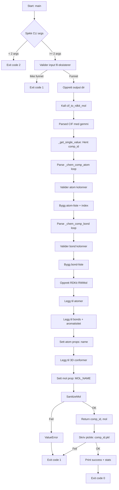
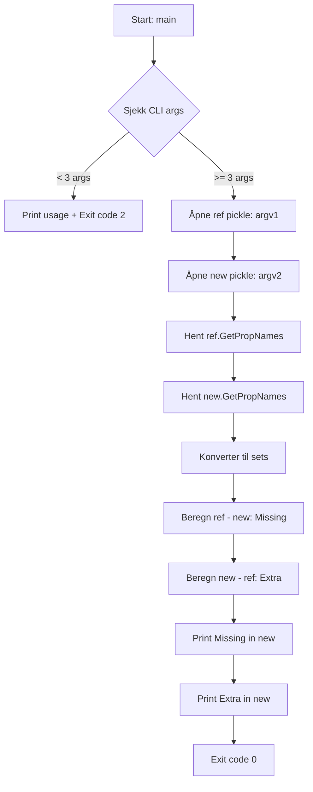
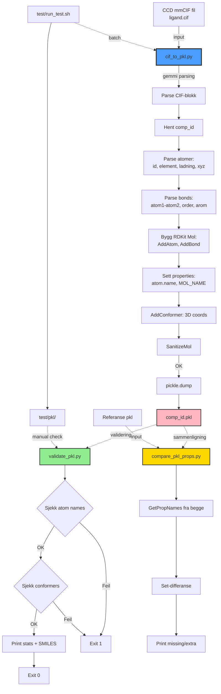

# CODE_WALKTHROUGH — Boltz CCD Lib

> **Dokumentert av:** GitHub Copilot  
> **Opprettet:** 2026-02-23  
> **Status:** In Progress

---

## File Index

Denne seksjonen lister alle Python-scripts i prosjektet og deres dokumentasjonsstatus.

| Status   | Fil                      | Path                      |
|----------|--------------------------|---------------------------|
| [DONE]   | cif_to_pkl.py            | `cif_to_pkl.py`           |
| [DONE]   | compare_pkl_props.py     | `compare_pkl_props.py`    |
| [DONE]   | validate_pkl.py          | `validate_pkl.py`         |

**Forklaring:**
- `[TODO]` = Ikke dokumentert ennå
- `[DONE]` = Fullstendig dokumentert

---

## Dokumentasjon per fil

---

### 1. `cif_to_pkl.py`

**Path:** `cif_to_pkl.py`  
**Rolle:** Hovedkonverter som leser CCD mmCIF-filer (Chemical Component Dictionary) og transformerer dem til Boltz-kompatible RDKit Mol-objekter lagret som pickle-filer.

**Viktige imports/avhengigheter:**
- `gemmi`: Brukes for parsing av mmCIF-format
- `rdkit` (Chem, rdchem): RDKit-bibliotek for molekylrepresentasjon
- `pickle`: Serialisering av RDKit Mol-objekter
- `pathlib.Path`: Filbehandling

---

#### Funksjoner

##### `_get_single_value(block: gemmi.cif.Block, tag: str) -> str | None`

**Hva den gjør:**  
Helper-funksjon som henter én enkelt verdi fra en mmCIF-blokk basert på tag-navn.

**Input:**
- `block`: gemmi CIF-blokk
- `tag`: CIF tag-navn (f.eks. `"_chem_comp.id"`)

**Output:**
- Returnerer verdien som string, eller `None` hvis den ikke finnes eller er tom

**Implementasjonsdetaljer:**
- Normaliserer tomme strenger fra gemmi til `None`
- Try-catch håndterer exceptions fra gemmi
- Stripper whitespace fra verdier

---

##### `cif_to_rdkit_mol(cif_path: Path) -> tuple[str, Chem.Mol]`

**Hva den gjør:**  
Kjernefunksjonen som parser en CCD mmCIF-fil og bygger et RDKit Mol-objekt med 3D-koordinater og metadata.

**Input:**
- `cif_path`: Path-objekt til input CIF-fil

**Output:**
- Tuple: `(comp_id: str, mol: Chem.Mol)` der `comp_id` er komponentens ID og `mol` er det konverterte molekylet

**Flyt:**
1. **Parsing av CIF:** Leser CIF-filen med gemmi og velger første ikke-tom data-blokk
2. **Hent comp_id:** Leser `_chem_comp.id` (obligatorisk)
3. **Parse atomer:**
   - Henter loop `_chem_comp_atom.*`
   - Validerer tilstedeværelse av nødvendige kolonner: `atom_id`, `type_symbol`, `charge`, `pdbx_model_Cartn_x/y/z_ideal`
   - Bygger intern liste av atomer med ID, element, ladning og 3D-koordinater
   - Håndterer CIF missing values (`?`, `.`)
   - Bygger index: `atom_id -> CIF-posisjon`
4. **Parse bonds:**
   - Henter loop `_chem_comp_bond.*`
   - Validerer kolonner: `atom_id_1`, `atom_id_2`, `value_order`, `pdbx_aromatic_flag`
   - Mapper bond-ordener (SING/DOUB/TRIP/AROM) til RDKit BondType via `BOND_ORDER_MAP`
   - Validerer at binding viser til eksisterende atomer
5. **Bygg RDKit Mol:**
   - Oppretter `RWMol` (editable mol)
   - Legger til alle atomer med korrekt element og ladning
   - Legger til alle bonds med riktig bond-type
   - Setter aromatisk flagg basert på `pdbx_aromatic_flag` eller bond-order
6. **Sett metadata:**
   - Setter atom-prop `"name"` til CIF `atom_id` for hvert atom
   - Oppretter 3D-conformer basert på ideal koordinater (`pdbx_model_Cartn_*_ideal`)
   - Setter mol-prop `"MOL_NAME"` til `comp_id`
7. **Sanitering:** Kjører `Chem.SanitizeMol()` for å validere kjemi
8. **Pickle-konfigurasjon:** Setter `AllProps` for å sikre at properties blir picklet

**Sideeffekter:**
- Ingen direkte sideeffekter (return-verdi)
- Konfigurerer global RDKit pickle-setting

**Feilhåndtering:**
- Kaster `ValueError` ved manglende/ugyldige data i CIF
- Kaster `ValueError` hvis RDKit sanitization feiler

**Avhengigheter:**
- `_get_single_value()` for å hente comp_id
- `BOND_ORDER_MAP` (modul-konstant) for bond-mapping

---

##### `main()`

**Hva den gjør:**  
CLI entry-point. Parser argumenter, kaller `cif_to_rdkit_mol()`, og skriver resultat til pickle-fil.

**Input (via sys.argv):**
- `argv[1]`: Path til input `.cif` fil (påkrevd)
- `argv[2]`: Output-directory (valgfri, default: nåværende directory)

**Output:**
- Skriver `<comp_id>.pkl` til output-directory
- Printer bekreftelse med stats til stdout

**Flyt:**
1. Validerer antall argumenter (minst 2)
2. Sjekker at input-fil eksisterer
3. Oppretter output-directory hvis den ikke finnes
4. Kaller `cif_to_rdkit_mol()` og fanger exceptions
5. Skriver pickle-fil med `pickle.dump()`
6. Printer success-melding med molekyl-statistikk

**Feilhåndtering:**
- Exit-kode 2: Feil bruk (manglende argumenter)
- Exit-kode 1: Input-fil finnes ikke, konvertering feiler, eller skriving feiler
- Alle feil blir printet til stdout (ikke stderr)

**Avhengigheter:**
- `cif_to_rdkit_mol()`

---

#### TODO / Uklarheter

- **Logging:** Ingen strukturert logging (kun print til stdout). Feilmeldinger går ikke til stderr.
- **Usikkerhet:** Hva betyr "Boltz-compatible"? Ingen dokumentasjon av hvilke spesifikke props Boltz forventer.
- **Manglende validering:** Ingen sjekk på om molekylet er kjemisk fornuftig utover RDKit sanitization (f.eks. valens-regler kan være brutt i CCD-data)
- **Aromatisitet:** Logikken setter aromatiske flagg manuelt basert på CIF-data, men RDKit sanitization kan overskrive dette. Usikkert om dette er intensjonelt.
- **Konformere:** Bruker `assignId=True` i `AddConformer()`, men det er uklart om conformer-ID brukes senere.

---

#### Mermaid Flowchart: `cif_to_pkl.py`



---

### 2. `compare_pkl_props.py`

**Path:** `compare_pkl_props.py`  
**Rolle:** Verktøy for debugging/validering. Sammenligner RDKit Mol properties mellom to pickle-filer (referanse vs ny).

**Viktige imports/avhengigheter:**
- `pickle`: Deserialisering av RDKit Mol-objekter
- `sys`: CLI argument-håndtering

---

#### Funksjoner

##### `main()`

**Hva den gjør:**  
Laster to pickle-filer, sammenligner property-nøkler, og printer forskjeller.

**Input (via sys.argv):**
- `argv[1]`: Path til referanse pickle-fil
- `argv[2]`: Path til ny pickle-fil

**Output:**
- Printer til stdout:
  - Properties som mangler i ny fil (finnes i referanse)
  - Properties som er ekstra i ny fil (ikke i referanse)

**Flyt:**
1. Validerer antall argumenter (minst 3)
2. Laster begge pickle-filer med `pickle.load()`
3. Henter property-navn fra begge mol-objekter med `GetPropNames()`
4. Konverterer til sets og sammenligner
5. Printer sorterte lister av forskjeller

**Feilhåndtering:**
- Exit-kode 2: Feil bruk (< 3 argumenter)
- Ingen try-catch: Vil krasje hvis fil ikke finnes eller ikke er gyldig pickle

**Avhengigheter:**
- Ingen interne avhengigheter

---

#### TODO / Uklarheter

- **Feilhåndtering:** Ingen håndtering av file-not-found eller ugyldig pickle-format
- **Begrenset funksjonalitet:** Sammenligner kun property-nøkler, ikke verdier. Ingen atom-property sammenlikning.
- **Logging:** Ingen strukturert logging, kun print
- **Bruksområde:** Uklart når dette skriptet skal brukes i pipelinen (ad-hoc debugging? del av test-suite?)

---

#### Mermaid Flowchart: `compare_pkl_props.py`



---

### 3. `validate_pkl.py`

**Path:** `validate_pkl.py`  
**Rolle:** Enkel CLI-validering av en RDKit Mol i pickle-format. Skriver grunnleggende stats og kjører et sett sanity-checks.

**Viktige imports/avhengigheter:**
- `pickle`: Deserialisering av RDKit Mol-objekt
- `rdkit.Chem`: Molekyloperasjoner (SMILES, H-fjerning)
- `sys`: CLI argument-håndtering

---

#### Funksjoner

##### `main()`

**Hva den gjør:**  
Laster en pickle-fil med RDKit Mol, skriver ut stats og properties, og kjører enkle valideringer på atomnavn og conformere.

**Input (via sys.argv):**
- `argv[1]`: Path til `.pkl` fil (påkrevd)

**Output:**
- Printer til stdout:
   - Antall atomer, bindinger, conformere
   - Liste over mol-props (keys)
   - SMILES uten H-atomer
   - De 10 første atomene (idx, symbol, name, charge, arom)
- Avslutter med feilkode 1/2 ved feil

**Flyt:**
1. Validerer antall argumenter (minst 2)
2. Leser pickle-fil og laster RDKit Mol
3. Printer stats og mol properties
4. Validerer at alle atomer har `name`-prop
5. Validerer at atomnavn er unike
6. Validerer at minst én conformer finnes
7. Printer SMILES (fjerner H-atomer først)
8. Printer info for de 10 første atomene

**Feilhåndtering:**
- Exit-kode 2: Feil bruk (mangler input-argument)
- Exit-kode 1: File-not-found eller pickle-load feiler
- `SystemExit` brukes direkte ved valideringsfeil

**Avhengigheter:**
- RDKit Mol API: `GetNumAtoms()`, `GetNumBonds()`, `GetNumConformers()`, `GetPropNames()`, `GetAtoms()`, `HasProp()`, `GetProp()`, `GetFormalCharge()`, `GetIsAromatic()`
- RDKit funksjoner: `Chem.RemoveHs()`, `Chem.MolToSmiles()`

---

#### TODO / Uklarheter

- **Usikkert formalkrav:** Det er uklart om `name`-prop og unike atomnavn er et hardt krav for downstream (Boltz) eller kun en lokal konvensjon. Trenger bekreftelse fra prosjektets bruk.
- **Valideringsdekning:** Ingen sjekk av koordinatstørrelser, valensregler eller bond-konsistens utover RDKit-parsing.
- **Feilkanaler:** Feil printes til stdout (ikke stderr) bortsett fra `SystemExit`-melding.

---

#### Mermaid Flowchart: `validate_pkl.py`

```mermaid
flowchart TD
      A[Start: main] --> B{Sjekk CLI args}
      B -->|< 2 args| C[Print usage + Exit code 2]
      B -->|>= 2 args| D[Last pickle]
      D -->|FileNotFoundError| E[Print error + Exit code 1]
      D -->|Load error| F[Print error + Exit code 1]
      D --> G[Print stats + mol props]
      G --> H[Check: atom name prop]
      H -->|Missing| I[SystemExit: missing name]
      H -->|OK| J[Check: unique atom names]
      J -->|Duplicates| K[SystemExit: duplicate names]
      J -->|OK| L[Check: conformers > 0]
      L -->|0| M[SystemExit: no conformers]
      L -->|OK| N[Print SMILES (no H)]
      N --> O[Print first 10 atoms]
      O --> P[Exit code 0]
```

---

## Overordnet arkitektur

### Prosjektets formål og dataflyt

Dette prosjektet konverterer ligand-strukturer fra Chemical Component Dictionary (CCD) mmCIF-format til RDKit Mol-objekter lagret som pickle-filer, tilpasset for bruk i Boltz (antakelig et ML-system for strukturbiologi). Kjernen er **`cif_to_pkl.py`**, som parser mmCIF-filer med gemmi-biblioteket, bygger RDKit Mol-objekter med 3D-koordinater, og skriver dem til disk. To hjelpeverktøy støtter validering: **`validate_pkl.py`** sjekker at output-filene inneholder nødvendige metadata (atomnavn, conformere), mens **`compare_pkl_props.py`** sammenligner properties mellom to pickle-filer (nyttig for debugging ved endringer i konverteringskoden).

Dataflyen er enkel og lineær: CIF → Parser → RDKit Mol → PKL. Konverteringen er "offline" (ingen nettverkstilkobling), og hvert script er et standalone CLI-verktøy uten gjensidig avhengighet. Dette gjør systemet modulært, men også Fragile: det finnes ingen sentralisert orkestrering, logging eller feilgjenoppretting.

### Tekniske valg og avhengigheter

Prosjektet bruker tre hovedbiblioteker:
- **gemmi** for CIF-parsing (robust og rask C++-bibliotek med Python-bindings)
- **RDKit** for kjemirepresentasjon (industri-standard for kjemoinformatikk)
- **pickle** for serialisering (enkelt, men Python-spesifikt format)

Konverteringen mapper CCD mmCIF-felt direkte til RDKit:
- `_chem_comp_atom` → RDKit atomer (element, ladning, koordinater)
- `_chem_comp_bond` → RDKit bonds (SING/DOUB/TRIP/AROM)
- CIF `atom_id` → RDKit atom property `"name"`
- `pdbx_model_Cartn_*_ideal` → RDKit conformer (3D-koordinater)

Aromatisitet håndteres eksplisitt basert på CIF-flagg (`pdbx_aromatic_flag`), men RDKit sanitization kan overskrive dette. Dette er potensielt problematisk hvis downstream-systemer forventer spesifikk aromatisitetsmarkering.

### Testing og validering

En bash-script (`test/run_test.sh`) kjører konvertering på tre testligander (CEL6, NAG6, STA6) via SLURM. Dette er en enkel "smoke test" uten automatisk pass/fail-kriterium. Validering gjøres manuelt ved å kjøre `validate_pkl.py` på output, men det finnes ingen formell test-suite med assertions eller referanse-verdier.

### Integrasjon med Boltz

Dokumentasjonen nevner "Boltz-compatible", men det er ingen eksplisitt spesifikasjon av:
- Hvilke RDKit properties Boltz forventer
- Om aromatisitet må være konsistent med en bestemt kjemi-modell
- Om conformer-koordinater må være i en bestemt enhet eller rom
- Om pickle-protokoll-versjon eller RDKit-versjon er kritisk

Dette er den største usikkerheten i prosjektet: uten downstream-dokumentasjon er det umulig å verifisere at konverteringen faktisk produserer "Boltz-compatible" output.

### Begrensninger og antagelser

Konverteringen antar at:
1. CIF-filer følger CCD-standarden (ikke generisk mmCIF)
2. Ideal-koordinater (`pdbx_model_Cartn_*_ideal`) alltid finnes
3. Bond-ordener i CCD er korrekte (ingen validering av kjemisk konsistens utover RDKit sanitization)
4. Atomnavn i CIF er unike (håndkontroll i `validate_pkl.py`, ikke i konverteren)

---

### Mermaid Flowchart: Overordnet arkitektur



**Forklaring:**
- **Blå boks** (`cif_to_pkl.py`): Kjerne-konverter
- **Grønn boks** (`validate_pkl.py`): Post-konvertering validering
- **Gul boks** (`compare_pkl_props.py`): Debugging-verktøy
- **Rosa boks**: Output pickle-fil
- **Stiplet linje**: Manuell/valgfri flyt (ikke automatisk pipeline)

---

## Oppsummering: Hva fungerer vs hva fungerer ikke

### ✅ Hva som fungerer

1. **Grunnleggende konvertering**: `cif_to_pkl.py` parser CCD mmCIF korrekt og bygger RDKit Mol med 3D-koordinater
2. **Property-mapping**: Atomnavn fra CIF blir bevart som `"name"`-property på RDKit-atomer
3. **Bond-typing**: Mapper CCD bond-ordener (SING/DOUB/TRIP/AROM) til RDKit BondType korrekt
4. **Conformer-støtte**: Ideal-koordinater blir lagt til som RDKit conformer
5. **Sanitization**: RDKit validerer kjemisk konsistens (valens, aromatisitet) ved konvertering
6. **Pickle-serialization**: Output-filer er lesbare med standard Python pickle + RDKit
7. **CLI-grensesnitt**: Alle scripts har enkel og funksjonell CLI med argument-parsing
8. **Test-infrastruktur**: `test/run_test.sh` kjører konvertering på testdata via SLURM

### ❌ Hva som ikke fungerer eller mangler

1. **Feilhåndtering i helper-scripts**:
   - `compare_pkl_props.py` krasjer ved file-not-found (ingen try-catch)
   - `validate_pkl.py` printer feil til stdout i stedet for stderr
2. **Ingen automatisk test-assertions**: `run_test.sh` kjører konvertering, men verifiserer ikke output (ingen pass/fail)
3. **Pickle-kompatibilitet**:
   - Pickle-filer er Python-spesifikke (ikke lesbare fra andre språk)
   - RDKit-versjon-avhengighet er ikke dokumentert/håndtert
4. **Manglende spec for "Boltz-compatible"**:
   - Ingen dokumentasjon av hvilke properties/format Boltz faktisk forventer
   - Usikkert om aromatisitet, ladninger eller conformer-ID-er er kritiske
5. **Aromatisitet-håndtering**:
   - Setter aromatiske flagg manuelt basert på CIF, men RDKit sanitization kan overskrive
   - Usikkert om dette er intensjonelt eller en bug
6. **Ingen logging**: Kun print-statements til stdout; ingen strukturert logging (timestamps, severity, context)
7. **Ingen batch-mode**: `cif_to_pkl.py` håndterer én fil om gangen; ingen støtte for bulk-konvertering
8. **Ingen rollback/retry**: Hvis konvertering feiler, blir ingen cleanup gjort (potensielt half-written pickle-filer)

---

## Kritikk og forbedringsforslag

### 1. Logging og observabilitet

**Problem:**  
Alle feil og progress printes til stdout med enkle `print()`-statements. Ingen timestamps, severity-nivåer, eller strukturert formatting. Dette gjør debugging vanskelig, spesielt i batch-kjøringer via SLURM der output blandes i samme logfil.

**Forslag:**
- Bruk Python `logging`-modul med konfigurerbart nivå (INFO/DEBUG/ERROR)
- Send errors til stderr (`sys.stderr`), ikke stdout
- Legg til timestamps og kontekstuell info (f.eks. hvilken fil som prosesseres)

**Eksempel:**
```python
import logging
logging.basicConfig(level=logging.INFO, format='%(asctime)s [%(levelname)s] %(message)s')
logger = logging.getLogger(__name__)
logger.error(f"Failed to parse CIF: {cif_path}", exc_info=True)
```

---

### 2. Testing og validering

**Problem:**  
`test/run_test.sh` kjører konvertering, men har ingen automatisk pass/fail-kriterium. Validering gjøres manuelt ved å kjøre `validate_pkl.py`, som ikke returnerer strukturert output (kun exit-kode og print-statements).

**Forslag:**
- Legg til en test-suite (f.eks. `pytest`) med konkrete assertions:
  - Verifiser antall atomer mot kjent verdi for hver test-ligand
  - Sammenlign SMILES-output mot referanse
  - Sjekk at alle properties finnes
- Integrer `validate_pkl.py` i test-scriptet og sjekk exit-kode
- Legg til referanse-pickle-filer og bruk `compare_pkl_props.py` i automatisk test

**Eksempel:**
```python
# test_conversion.py (pytest)
def test_CEL6_conversion():
    mol = pickle.load(open("test/pkl/CEL6.pkl", "rb"))
    assert mol.GetNumAtoms() == 23  # kjent verdi
    assert mol.GetProp("MOL_NAME") == "CEL6"
    assert mol.GetNumConformers() == 1
```

---

### 3. Dokumentasjon av format-krav

**Problem:**  
Prosjektet påstår å lage "Boltz-compatible" pickle-filer, men det finnes ingen dokumentasjon av hva dette betyr. Hvilke RDKit properties må være satt? Hvilke kjemi-regler må være oppfylt? Hvilken RDKit-versjon er støttet?

**Forslag:**
- Lag en `SPEC.md` som dokumenterer:
  - Påkrevde atom-properties (`"name"`, etc.)
  - Påkrevde mol-properties (`"MOL_NAME"`, etc.)
  - Conformer-krav (antall, koordinat-type)
  - RDKit-versjon og pickle-protokoll
  - Eksempel på minimalt gyldig output
- Legg til en `validate_boltz_spec.py` som sjekker at en pickle-fil oppfyller spec
- Dokumenter aromatisitet-håndtering: skal CIF-flagg bevares, eller skal RDKit bestemme?

---

### 4. Feilhåndtering og robusthet

**Problem:**
- `compare_pkl_props.py` krasjer uten nyttig feilmelding ved file-not-found
- `cif_to_pkl.py` kan potensielt skrive half-written pickle-filer ved crash
- Ingen validering av input før konvertering (f.eks. om CIF faktisk inneholder `_chem_comp_atom`)

**Forslag:**
- Legg til try-catch i alle helper-scripts med nyttige feilmeldinger
- Bruk atomiske skriveoperasjoner: skriv til temp-fil, deretter `os.rename()` (atomisk på POSIX)
- Pre-validér CIF-struktur før konvertering (sjekk at nødvendige loops finnes)
- Legg til `--strict` flag for å feile ved advarsler (f.eks. manglende aromatisitet)

**Eksempel:**
```python
# Atomisk skriving
temp_path = out_path.with_suffix(".tmp")
with open(temp_path, "wb") as f:
    pickle.dump(mol, f)
temp_path.rename(out_path)  # atomisk på POSIX
```

---

### 5. Kodestruktur og modularisering

**Problem:**
- All logikk i `cif_to_pkl.py` er i én monolit-funksjon `cif_to_rdkit_mol()` (ca. 200 linjer)
- Ingen gjenbrukbare bibliotek-funksjoner (kun scripts)
- Ingen CLI-framework (manuell `sys.argv` parsing)

**Forslag:**
- Splitt `cif_to_rdkit_mol()` i mindre funksjoner:
  - `parse_cif_atoms(block) -> list[AtomData]`
  - `parse_cif_bonds(block) -> list[BondData]`
  - `build_rdkit_mol(atoms, bonds) -> Mol`
  - `add_conformer(mol, atoms) -> None`
- Lag en `boltz_ccd_lib/` Python-pakke med:
  - `converter.py` (logikk),
  - `validators.py` (validering),
  - `cli.py` (entry-points)
- Bruk `argparse` eller `click` for CLI (bedre hjelp-tekst, type-validering, subcommands)

**Eksempel:**
```python
# cli.py (med click)
import click
@click.command()
@click.argument("cif_path", type=click.Path(exists=True))
@click.option("--out-dir", default=".", help="Output directory")
def convert(cif_path, out_dir):
    """Convert CCD mmCIF to Boltz-compatible RDKit pickle."""
    ...
```

---

### 6. Dependencies og environment

**Problem:**
- Ingen `requirements.txt` eller `environment.yml` (conda)
- Ukjent hvilke versjoner av gemmi/RDKit som er testet
- Hardkodet path i `test/run_test.sh` (`/cluster/work/projects/nn1003k/...`)

**Forslag:**
- Legg til `requirements.txt`:
  ```
  gemmi>=0.6.0
  rdkit>=2023.9.1
  ```
- Legg til `environment.yml` for conda:
  ```yaml
  name: boltz_ccd_lib
  channels:
    - conda-forge
  dependencies:
    - python=3.11
    - gemmi
    - rdkit
    - pytest
  ```
- Gjør `test/run_test.sh` path-agnostisk (bruk `$SLURM_SUBMIT_DIR` eller relative paths)

---

### 7. Output-format og interoperabilitet

**Problem:**
- Pickle er Python-spesifikt format (ikke lesbart fra C++, Julia, etc.)
- Ingen alternativ output-format (SDF, MOL2, JSON)
- Usikkert om downstream (Boltz) faktisk trenger pickle, eller om en tekstbasert format ville vært bedre

**Forslag:**
- Vurder å støtte flere output-formater:
  - **SDF** (standard i kjemoinformatikk, tekstbasert, lesbart av alle toolkits)
  - **JSON** med SMILES + koordinater (enklere for ikke-Python systemer)
  - **MessagePack/Protobuf** (binært, men språk-agnostisk)
- Legg til `--format` flag i CLI:
  ```bash
  cif_to_pkl.py ligand.cif --format sdf --out ligand.sdf
  ```

---

### 8. Performance og skalerbarhet

**Problem:**
- Ingen batch-mode: må kjøre `cif_to_pkl.py` én gang per ligand
- Ingen parallellisering: `test/run_test.sh` kjører sekvensielt
- Ingen progress-indikator ved bulk-konvertering

**Forslag:**
- Legg til batch-mode i `cif_to_pkl.py`:
  ```bash
  cif_to_pkl.py --batch input_dir/ --out-dir pkl/
  ```
- Bruk `multiprocessing` eller GNU Parallel for å parallellisere:
  ```bash
  find cif/ -name "*.cif" | parallel -j 8 cif_to_pkl.py {} pkl/
  ```
- Legg til progress bar (f.eks. `tqdm`) for bulk-konvertering

---

## Konklusjon

Prosjektet er **funksjonelt for småskala testing**, men **ikke production-ready**. Konverteringskoden (`cif_to_pkl.py`) er solid for enkeltfiler, men mangler robusthet, observabilitet og dokumentasjon for downstream-integrasjon. De største svakhetene er:

1. **Manglende spec for "Boltz-compatible" format** (høyeste prioritet å fikse)
2. **Ingen automatisert test-suite med assertions**
3. **Manglende logging og feilkanaler** (vanskelig å debugge feil)
4. **Ingen dokumentasjon av dependencies** (environment.yml, requirements.txt)

Med fikser på disse punktene kan prosjektet bli et solid produksjonsverktøy for CCD→Boltz-konvertering.

---

<!-- FINAL-modus fullført -->
