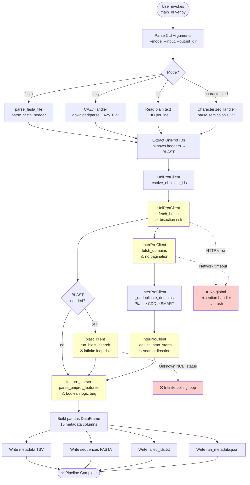

# CODE WALKTHROUGH

**Project:** module_2_new  
**Documentation created:** 2026-02-16  
**Purpose:** Comprehensive documentation of all source files, functions, and architecture.

---

## File Index

This index tracks the documentation status of all source files in the project.

| File                    | Status    | Description                          |
|-------------------------|-----------|--------------------------------------|
| `main_driver.py`        | [DONE]    | Main entry point / orchestration     |
| `input_handler.py`      | [DONE]    | Input parsing and validation         |
| `blast_client.py`       | [DONE]    | BLAST API client                     |
| `uniprot_client.py`     | [DONE]    | UniProt API client                   |
| `interpro_client.py`    | [DONE]    | InterPro API client                  |
| `feature_parser.py`     | [DONE]    | Feature extraction and parsing       |

---

## Documentation Structure

Each file section below will contain:
- **Purpose**: High-level description of the file's role
- **Dependencies**: Imports and external dependencies
- **Functions**: Detailed function-by-function walkthrough
  - What it does
  - Input/output
  - Side effects
  - Risk assessment: OK / Risiko / Sannsynlig feil
- **TODOs / Uncertainties**: Issues or unclear behavior

---

## File Documentation

### 1. `main_driver.py` [DONE]

**Purpose:**  
Main orchestration script for Module 2: Metadata Enrichment. Handles input parsing, API interactions with UniProt/InterPro/BLAST, feature extraction, and output generation. Supports 4 operational modes: `fasta`, `cazy`, `list`, `characterized`.

**Dependencies:**
- **Standard library:** `argparse`, `logging`, `os`, `sys`, `datetime`, `re`, `json`, `hashlib`
- **Third-party:** `pandas`, `tqdm`, `requests`
- **Local modules:**
  - `input_handler`: `parse_fasta_file`, `parse_fasta_header`, `CAZyHandler`, `CharacterizedHandler`
  - `uniprot_client`: `UniProtClient`
  - `interpro_client`: `InterProClient`
  - `feature_parser`: `parse_uniprot_features`
  - `blast_client`: `run_blast_search`

**Constants:**
- `CAZY_BASE_URL`: `"https://www.cazy.org"`
- `USER_AGENT`: `"LPMO-Pipeline/1.0 (eirik.sorhus@nmbu.no)"`
- `REQUEST_TIMEOUT`: `30` (seconds)

---

#### **Functions:**

##### `main()`
**Hva den gjør:**  
Hovedfunksjonen. Parser kommandolinjeargumenter, setter opp output-mapper, velger mode basert på `--mode` argument, kjører riktig input-parsing og API-kall, produserer metadata (TSV), sekvenser (FASTA), feilet IDer (TXT), og run-statistikk (JSON).

**Input:**  
- Kommandolinjeargumenter via `argparse`:
  - `--mode`: `fasta`, `cazy`, `list`, `characterized`
  - `--input`: filbane til input
  - `--output_dir`: output-mappe (default: `data`)
  - `--allow-ncbi-fallback`: aktiverer NCBI fallback for GenBank-IDer (kun i `characterized`-modus)
  - `--allow-sequence-search`: tillater BLAST-søk for ukjente FASTA-headere
  - `--max-sequence-searches`: maks antall BLAST-søk (default: 20)

**Output:**  
- `metadata_expanded_{timestamp}.tsv`: TSV-fil med metadata for alle vellykkede IDer
- `all_sequences_{timestamp}.fasta`: FASTA-fil med alle sekvenser (deduplikert etter sekvens i `characterized`-modus)
- `failed_ids_{timestamp}.txt`: liste over feilede IDer
- `run_metadata_{timestamp}.json`: kjørestatistikk (duration, success/failed count, filbaner)

**Sideeffekter:**
- Oppretter mapper: `data/metadata/`, `data/sequences/`, `data/run/`, `data/cazy_raw/` (kun CAZy-modus)
- Logger til stdout via `logging`
- HTTP-kall til UniProt, InterPro, NCBI, CAZy

**Flyt:**
1. **Argumentparsing og setup:** Parser CLI-args, oppretter tidsstemplet output-mapper.
2. **Mode-valg:**
   - **CAZy:** Laster CAZy-fil (eller laster ned fra CAZy hvis input er family-ID som `AA9`). Parser NCBI-IDer og JGI-grupper via `CAZyHandler`. Henter metadata fra UniProt i batch (NCBI) eller via query (JGI).
   - **Characterized:** Parser semikolonseparert CSV via `CharacterizedHandler`. Splitter rader i UniProt-IDer vs GenBank/RefSeq-IDer. Henter UniProt-data i batch. Mapper GenBank/RefSeq til UniProt via crossref-query. Optional NCBI fallback. Deduplikerer sekvenser og grupperer IDer per sekvens.
   - **FASTA:** Parser FASTA-fil via `parse_fasta_file` og `parse_fasta_header`. Henter metadata for kjente UniProt-IDer. Optional BLAST-søk for ukjente headere (hvis `--allow-sequence-search`).
   - **List:** Leser plain tekstfil med én ID per linje. Henter metadata i batch.
3. **Feature extraction:** For hver vellykket ID: henter InterPro-domener, parser UniProt-features (signal peptide, LPMO core, H1-verifikasjon).
4. **Output:** Skriver TSV, FASTA, failed-liste, run-JSON.

**Risiko:** **Risiko**
- **Unntak ikke håndtert konsekvent:** Mange steder kalles `client.fetch_batch` uten `try/except`. Hvis UniProt API feiler (timeout, rate limit, nettverksfeil), vil scriptet krasje uten å fullføre output. 
- **CAZy download-logikk:** Hvis CAZy-URL endres eller returnerer HTML-feilside, vil scriptet ikke detektere dette før den prøver å parse innholdet. Valideringen `if not resp.text.strip()` vil kun fange helt tomme svar.
- **batch_size ikke konsistent brukt:** I `fasta`-modus brukes `client.batch_size` for chunking, men i `characterized`-modus også. Hvis `batch_size` er for stor (>100?), kan UniProt-APIet feile.
- **BLAST-søk ikke throttlet:** Hvis `--allow-sequence-search` brukes med mange ukjente sekvenser, kan det føre til API-problemer eller lange kjøretider. `--max-sequence-searches` begrenser antall, men default er 20 (kan være for mye for noen use cases).

**TODOs/Uklarheter:**
- ❓ `--allow-ncbi-fallback` er nevnt i `--help` men ikke implementert i logikken for alle modes (kun `characterized`-mode).
- ❓ Hva skjer med duplikate IDer i input? I `list`-modus leses alle IDer, men ingen deduplisering før API-kall → potensielt unødvendige API-kall.
- ❓ I `characterized`-modus: hvordan håndteres konflikter hvis samme UniProt-ID forekommer i flere rader med ulike metadata? (Koden overskriver features_by_uid — siste vinner.)
- ❓ Output-filnavn bruker timestamp, men ingen sjekk for eksisterende filer. Sikker om timpestamp-granularitet (sekunder) er nok for parallelle kjøringer?

---

##### Helper Functions (nested in `main()`, kun `characterized`-modus):

**Viktig:** Disse funksjonene er definert inne i `main()` og er kun tilgjengelige i `characterized`-modus. De har closure over variabler i `main()` som `client`, `ip_client`, `features_by_uid`, `failed_id_set`, osv.

---

##### `choose_primary(id_list)`
**Hva den gjør:**  
Velger et "primary" ID fra en liste av IDer. Prefererer IDer som matcher regex `[A-Z0-9]{6,10}` (typisk UniProt accession format). Returner det første matchende, eller `id_list[0]` hvis ingen matcher.

**Input:**  
- `id_list` (list of str): Liste med IDer (f.eks. UniProt accessions)

**Output:**  
- `str` or `None`: Primary ID

**Sideeffekter:** Ingen

**Risiko:** **OK**
- Enkel logikk, men regex er upresist: `[A-Z0-9]{6,10}` matcher både format som `P12345` (UniProt), `A0A...` (TrEMBL), men også tilfeldige strenger som `ABC123DEF`. Kan velge "feil" ID hvis listen inneholder ikke-UniProt IDer.

---

##### `fetch_uniprot_ids(id_list)`
**Hva den gjør:**  
Henter UniProt-data for en liste av IDer i batches via `client.fetch_batch()`. Oppdaterer `features_by_uid`, `success_id_set`, `seq_groups`, `id_to_sequence` i closure.

**Input:**  
- `id_list` (list of str): Liste med UniProt-IDer

**Output:** Ingen (oppdaterer closure-variabler)

**Sideeffekter:**
- HTTP-kall til UniProt API
- Oppdaterer `features_by_uid`, `success_id_set`, `failed_id_set`, `seq_groups`, `id_to_sequence`
- Logger progress via `tqdm`

**Risiko:** **Risiko**
- Ingen `try/except` rundt `client.fetch_batch()`. Hvis API feiler, krasjer funksjonen.
- Hvis en ID ikke har sekvens (`seq` er tom), legges den til `failed_id_set`, men ingen logging/forklaring.
- InterPro-kall (`ip_client.fetch_domains`) er ikke i `try/except`. Hvis InterPro feiler, krasjer funksjonen.

---

##### `map_non_uniprot_to_uniprot(id_token)`
**Hva den gjør:**  
Mapper GenBank eller RefSeq protein-ID til UniProt via crossref-query. Prøver `xref:RefSeq:...` for RefSeq-IDer (NP_, XP_, YP_, WP_, ZP_) eller `xref:EMBL-CDS:...` for GenBank-IDer. Prøver også uten versjonsnummer (f.eks. `ABC123` istedenfor `ABC123.1`).

**Input:**  
- `id_token` (str): GenBank eller RefSeq protein accession

**Output:**  
- `dict` or `None`: UniProt entry (JSON fra API) hvis match, ellers `None`

**Sideeffekter:**
- HTTP-kall til UniProt API via `client.search_by_query()`

**Risiko:** **OK**
- Logikken er fornuftig, men regex for RefSeq er strengere enn den bør være: `^(NP_|XP_|YP_|WP_|ZP_)` vil matche, men RefSeq har flere prefixes (e.g., `AP_`, osv.).
- Hvis `search_by_query` returnerer flere resultater, velges `results[0]`. Kan være feil match hvis det finnes flere crossrefs.

---

##### `fetch_ncbi_fasta(genbank_acc)`
**Hva den gjør:**  
Henter FASTA-data fra NCBI efetch API for en GenBank accession. Parser header for å trekke ut organisme og protein-navn.

**Input:**  
- `genbank_acc` (str): GenBank accession

**Output:**  
- Tuple: `(seq, organism, protein_name)` hvis vellykket, ellers `(None, None, None)`

**Sideeffekter:**
- HTTP-kall til NCBI efetch API

**Risiko:** **Risiko**
- Ingen timeout spesifisert i `requests.get()` → kan henge hvis NCBI er treg. (Edit: ser nå `timeout=30` — OK)
- Hvis NCBI returnerer feilmelding eller HTML, vil parsing feile stille (returnerer `None`). Ingen logging.
- Parser organisme med regex `\[(.*?)\]\s*$` — kan feile hvis header-format endres.

---

#### **Mode-spesifikk logikk:**

##### **Mode: `cazy`**
**Flyt:**
1. Sjekker om `--input` er en fil eller CAZy family-ID (regex `(AA|GH|GT|PL|CE|CBM)\d+`)
2. Hvis family-ID: laster ned fra `https://www.cazy.org/IMG/cazy_data/{family}.txt` og lagrer i `data/cazy_raw/`
3. Parser CAZy-fil via `CAZyHandler.process_cazy_file()` → returnerer `ncbi_ids` (list) og `jgi_groups` (dict)
4. **NCBI-IDer:** Henter i batch via `client.fetch_batch()`, looper over resultater, henter InterPro, parser features, legger til `successful_entries` og `raw_fasta_entries`
5. **JGI-grupper:** Genererer query-strings via `cazy_handler.generate_jgi_queries()`, søker via `client.search_by_query()`, behandler resultater samme som NCBI

**Risiko:** **Risiko**
- CAZy-nedlasting: Ingen sjekk på HTTP status code før valideringen `if not resp.text.strip()`. Hvis CAZy returnerer 404 eller 302, vil `resp.raise_for_status()` kaste exception, men catch-blokken logger bare `"Failed to download CAZy data"` uten detaljer.
- JGI-queries kan returnere mange resultater → mye API-trafikk. Ingen progress-indikator for antall resultater per query.

##### **Mode: `characterized`**
**Flyt:**
1. Parser CSV via `CharacterizedHandler.process_characterized_file()` → returnerer `uni_ids`, `genbank_ids`, `rows_meta`
2. Splitter `rows_meta` i tre grupper: med UniProt, med GenBank/RefSeq, uten IDer
3. Henter UniProt-IDer i batch via nested `fetch_uniprot_ids()`
4. Mapper GenBank/RefSeq til UniProt via nested `map_non_uniprot_to_uniprot()`
5. Optional NCBI fallback via nested `fetch_ncbi_fasta()` (hvis `--allow-ncbi-fallback`)
6. **Deduplisering:** Grupperer IDer per sekvens i `seq_groups`. Velger primary ID per gruppe via `choose_primary()`. FASTA-header inneholder primary + coaccessions.
7. **Metadata-rader:** Oppretter én rad per ID med `Sequence_Group` (primary) og `CoAccessions` (andre IDer med samme sekvens)
8. **Split-detection:** Detekterer CSV-rader som produserer flere sekvenser (dvs. UniProt-IDer i samme rad har ulike sekvenser)

**Risiko:** **Sannsynlig feil**
- **Closure-variable** (`features_by_uid`, `success_id_set`, osv.) oppdateres av nested functions. Hvis flere IDer mapper til samme UniProt-accession, vil siste overskrives features. Ingen warning.
- **InterPro SignalP fallback:** Etter `fetch_uniprot_ids()`, looper koden over `features_by_uid` og sjekker om `Signal_End == 0`. Hvis ja, henter den signal peptide fra InterPro SignalP. Men koden re-parser ikke features helt — den oppdaterer bare `Signal_End` og `H1_AminoAcid` manuelt. Kan føre til inkonsistens hvis andre features også avhenger av `signal_end`.
- **NCBI fallback i loop:** `fetch_ncbi_fasta()` kalles for hver GenBank-ID uten batch-støtte. Kan være tregt.
- **Sequence Group-logikk:** Hvis to IDer har samme sekvens men ulike features (f.eks. ulike signal peptides pga. ulike UniProt-versjoner), vil begge brukes i metadata men gruppert som samme sekvens. Kan forvirre hvis brukeren forventer én rad per sekvens.

##### **Mode: `fasta`**
**Flyt:**
1. Parser FASTA via `parse_fasta_file()` og `parse_fasta_header()`
2. Samler IDer som kan parses som UniProt (`uid != None`) i `entries`, ukjente i `unknown_headers`
3. Henter metadata for kjente IDer i batch
4. Hvis `--allow-sequence-search`: kjør BLAST-søk for ukjente sekvenser (max `--max-sequence-searches`)
5. Output: metadata + FASTA med normalized headers

**Risiko:** **Risiko**
- `parse_fasta_header()` kan returnere `None` hvis header ikke matcher forventet format. Koden legger disse i `unknown_headers`, men logger ikke hvor mange eller hvilke format som ble funnet.
- BLAST-søk (`run_blast_search()`) er langsomt og kan feile. Hvis BLAST ikke returnerer match, legges sekvensen i `failed_ids` uten forklaring på hvorfor.
- Hvis `--max-sequence-searches` er høyere enn antall ukjente sekvenser, går koden greit. Hvis limit er lavere, skippes resten → men ingen warning i logger om at limit ble nådd (kun warning om antall skippede).

##### **Mode: `list`**
**Flyt:**
1. Leser fil, trimmer linjer, henter IDer
2. Henter metadata i batch
3. Output: metadata + FASTA

**Risiko:** **OK**
- Enkel logikk. Men ingen deduplisering av IDer før API-kall → hvis input har duplikater, hentes samme ID flere ganger.

---

#### **Output-generering:**

##### TSV (metadata)
- Kolonner: `UniProt_ID`, `InterPro_IDs`, `Protein_Name`, `Organism`, `EC_Number`, `Signal_End`, `Transmembrane_Regions`, `LPMO_Core_Start`, `LPMO_Core_End`, `Binding_Modules`, `H1_Verified`, `H1_AminoAcid`, `Match_Status`, `Sequence_Group`, `CoAccessions`
- Integer-kolonner (`Signal_End`, `LPMO_Core_Start`, `LPMO_Core_End`) konverteres til `Int64` (pandas nullable integer) for å håndtere NaN
- **Risiko:** **OK** — Solid kolonnestruktur. Men ingen validering av at `successful_entries` faktisk inneholder alle felter før DataFrame-bygging.

##### FASTA (sequences)
- Header-format: `>UniProtIDs|{id1};{id2};...|{Organism}|{Protein_Name}` (for `characterized` med deduplikering), ellers `>UniProtID|{id}|{Organism}|{Protein_Name}`
- **Risiko:** **OK** — Men header-format er ikke standardisert på tvers av modes. I `characterized` brukes `UniProtIDs` (flertall), i andre modes `UniProtID` (entall).

##### TXT (failed_ids)
- Plain tekst, én ID per linje med feilmelding (hvis tilgjengelig)
- **Risiko:** **OK**

##### JSON (run_metadata)
- Statistikk: `run_id`, `input_file`, `mode`, `total_processed`, `success_count`, `failed_count`, `duration_seconds`, `output_files`
- For `characterized`: tilleggsfelter `fasta_sequences_count`, `row_splits_count`, `additional_sequences_from_splits`, `split_rows`
- **Risiko:** **OK** — JSON er veldokumentert. Men `total_processed` beregnes ulikt per mode, og logikken er kompleks (kan være feil for edge cases, f.eks. hvis `rows_meta` ikke er definert).

---

#### **Overordnet vurdering:**

**Vil dette fungere?** **Risiko til Sannsynlig feil**

**Styrker:**
- Godt strukturert mode-system som håndterer multiple input-formater
- Robust deduplisering i `characterized`-modus
- God logging via `tqdm` og `logging`
- JSON run-statistikk gir god debuggability

**Svakheter og feil:**
- **Ingen global exception handling:** Hvis én API-kall feiler, krasjer hele scriptet uten å generere output
- **InterPro fallback-logikk er delvis implementert:** Koden i `characterized`-modus sjekker signal peptide fallback, men re-parsing av features er ikke komplett
- **Closure-baserte nested functions:** Vanskelig å teste og resonnere om. Hvis flere funksjoner oppdaterer samme dict (`features_by_uid`), kan det oppstå race conditions (selv om scriptet er single-threaded, kan logikken være confusing)
- **NCBI fallback bruker ikke batch-API:** Hver GenBank-ID krever ett HTTP-kall → skalerer dårlig
- **BLAST-søk er ikke throttlet ordentlig:** `--max-sequence-searches` begrenser antall, men ingen rate-limiting per sekund
- **Duplikathåndtering mangler i noen modes:** `list`-modus deduplikerer ikke input-IDer før API-kall
- **CAZy-nedlasting kan feile stille:** Hvis CAZy returnerer HTML-feilside, vil parsing feile senere uten klar feilmelding

**Konkrete problemer:**
1. **Linje 251:** `features_by_uid[uid] = {**features, "_seq": seq}` — `_seq` legges til dict, men brukes kun internt. Når `features_by_uid` itereres senere (linje 328), poppes `_seq` vekk. Men hvis koden krasher etter linje 251 og før linje 328, vil `_seq` være i metadata-output. → **Risiko for datalekkasje**
2. **Linje 331:** `sig_end_corrected = ipr_signal['end']` — hvis `ipr_signal` er dict men `end` er `None`, vil dette sette `sig_end_corrected = None`. Later (linje 342) brukes denne i `if len(seq) > sig_end_corrected` → **TypeError** hvis `None`.
3. **Linje 692:** `rows_with_sequences = set()` — hvis `rows_meta` eller `id_to_sequence` ikke er definert (f.eks. hvis characterized-parsing feilet), vil denne koden krasje. Men koden sjekker `if 'rows_meta' in locals()`, så det er OK. Men `id_to_sequence` sjekkes ikke.

---

### 2. `input_handler.py` [DONE]

**Purpose:**  
Provides parsing utilities for multiple input formats: CAZy export files (TSV), FASTA sequences, and semicolon-delimited characterized CSV files. Handles extraction of protein IDs (UniProt, GenBank, NCBI), organism name normalization, and query generation for UniProt API lookups.

**Dependencies:**
- **Standard library:** `csv`, `re`, `typing` (Dict, List, Set, Tuple)
- **Third-party:** None
- **Local modules:** None (pure utility module)

**Module-level constants:**
- `SEMICOLON_REQUIRED_HEADERS`: Dict mapping expected CSV column names (lowercase) to display names. Required columns: `protein name`, `ec#`, `reference`, `organism`, `genbank`, `uniprot`, `pdb/3d`.

---

#### **Classes:**

##### `CAZyHandler`

**Purpose:**  
Parses CAZy export files (TSV format) to extract NCBI/GenBank protein IDs and JGI protein IDs grouped by organism. Normalizes organism names for UniProt query generation.

---

###### `__init__(self)`
**Hva den gjør:**  
Initialiserer handler med regex-mønster for å fjerne versjonsnumre fra organismenavn (f.eks. `" v1.0"`, `" v2.1"`).

**Input:** Ingen  
**Output:** Ingen (initialiserer `self.version_pattern`)  
**Sideeffekter:** Ingen  
**Risiko:** **OK**

---

###### `process_cazy_file(self, file_path)`
**Hva den gjør:**  
Leser TSV-fil fra CAZy-eksport. Forventer kolonner: `Family | Kingdom | Organism | Accession | Source`. Parser hver linje og splitter IDer i to grupper:
1. **NCBI/GenBank**: IDer med source `"ncbi"` eller `"genbank"` legges i `ncbi_ids`-liste
2. **JGI**: IDer med source `"jgi"` grupperes etter normalisert organismenavn (første to ord etter versjonsrensing)

**Input:**  
- `file_path` (str): Sti til CAZy TSV-fil

**Output:**  
- Tuple: `(ncbi_ids, jgi_groups)`
  - `ncbi_ids` (list of str): Liste med NCBI/GenBank protein-aksessjoner
  - `jgi_groups` (dict): `{"Cleaned Organism": [ID1, ID2, ...]}` — JGI-IDer gruppert per organisme

**Sideeffekter:**
- Leser fil fra disk
- Logger ikke advarsler hvis linjer har feil antall kolonner (< 5)

**Risiko:** **Risiko**
- **Ingen encoding-fallback:** Fil åpnes med `encoding='utf-8'`. Hvis fil inneholder ikke-UTF8-tegn, krasjer parsing.
- **Stille skipper korte linjer:** Hvis en linje har < 5 tab-separerte felter, hoppes den over uten logging. Kan skjule data-kvalitetsproblemer.
- **Organismnavnrensing er heuristisk:** Anta at "første to ord" alltid gir riktig genus + art. For navn som `"sp."` (bare ett ord) eller `"strain XYZ"`, kan dette gi feil matches i UniProt.
  - Eksempel: `"Bacillariophyceae sp. MOSAICH1_1"` → `"Bacillariophyceae sp."` (OK)
  - Risiko: `"Uncultured bacterium clone ABC"` → `"Uncultured bacterium"` (kan matche feil organisme)
- **Case-insensitiv source-sjekk:** `source.lower()` brukes for matching, men ingen trimming av whitespace. Hvis CAZy-filen har `"NCBI "` (med trailing space), vil dette ikke matche.

**TODOs/Uklarheter:**
- ❓ Hva skjer med JGI-IDer hvis organism-feltet er tomt eller kun whitespace? (Vil lage en gruppe med nøkkel `""` eller ett ord)
- ❓ Regex `self.version_pattern` fjerner alt etter `v\d+` — kan dette slette viktig info? (F.eks. `"Organism v1.0 strain X"` → `"Organism"` uten strain-info)

---

###### `generate_jgi_queries(self, jgi_groups)`
**Hva den gjør:**  
Genererer UniProt-søkequeries for JGI-grupper. For hver organisme, splittes ID-listen i chunks (maks 50 IDer per query) og bygger query-string:
- Format: `organism_name:"Name" AND ("ID1" OR "ID2" OR ...)`
- Bruker quoted strings for å tvinge eksakt match i UniProt API

**Input:**  
- `jgi_groups` (dict): `{"Organism": [ID1, ID2, ...]}`

**Output:**  
- List of str: Liste med UniProt query-strenger

**Sideeffekter:** Ingen

**Risiko:** **OK**
- **chunk_size = 50** er hardkodet. UniProt API har en query-length limit (ikke dokumentert her). Hvis 50 IDer * gjennomsnittlig ID-lengde overstiger limit, vil queries feile.
- **organism_name-felt:** Kommentaren sier `organism_name` brukes istedenfor `organism` (som gir HTTP 400). Men det er usikkert om UniProt alltid har `organism_name`-feltet for alle entries. Hvis ikke, kan queries returnere 0 resultater selv om data finnes.
- **Quoted ID-matching:** `"ID"` matcher ID som eksakt phrase i "any field". Hvis UniProt ikke har JGI-ID i noen felt (f.eks. kun i xrefs eller comments), vil ikke matching fungere. Dette er usikkert uten å se faktisk UniProt-data.

**TODOs/Uklarheter:**
- ❓ Hva er den faktiske query-length limit i UniProt API? (Ikke dokumentert her)
- ❓ Hvordan håndterer UniProt API spesialtegn i IDer (f.eks. `|`, `:`)?

---

##### `CharacterizedHandler`

**Purpose:**  
Parser semicolon-delimitert CSV med "characterized proteins"-layout (CAZy-stil). Extraherer UniProt-aksessjoner og GenBank-aksessjoner, samt metadata per rad (protein name, organism, EC, etc.).

---

###### `__init__(self, file_path: str)`
**Hva den gjør:**  
Lagrer filbane.

**Input:**  
- `file_path` (str): Sti til CSV-fil

**Output:** Ingen  
**Sideeffekter:** Ingen  
**Risiko:** **OK**

---

###### `process_characterized_file(self) -> Tuple[List[str], List[str], List[Dict]]`
**Hva den gjør:**  
Parser semicolon-delimitert CSV. Validerer at delimiter er `;` (ikke `,`), sjekker at required headers finnes, extraherer UniProt og GenBank IDer fra hver rad, og bygger `rows_meta`-liste med full rad-context.

**Flyt:**
1. Leser første linje og verifiserer at `;` finnes og `,` ikke finnes (delimiter-sjekk)
2. Parser header-rad og builder `header_map`
3. Sjekker at alle `SEMICOLON_REQUIRED_HEADERS` finnes
4. Itererer over rader:
   - Skipper tomme rader
   - Padder korte rader med tomme strenger
   - Extraherer UniProt-IDer via `_normalize_uniprot_cell()` (regex `[A-Z0-9]{6,10}`)
   - Extraherer GenBank-IDer via `_normalize_genbank_cell()` (split på `;,\s+`, beholder versjonsnummer)
   - Deduplikerer IDer i `seen`-set
   - Bygger `rows_meta`-dict med linje-nummer, raw-rad, og alle felt

**Input:** Ingen (bruker `self.file_path`)

**Output:**  
- Tuple: `(uniprot_ids, genbank_ids, rows_meta)`
  - `uniprot_ids` (list of str): Unike UniProt-aksessjoner (deduplikert)
  - `genbank_ids` (list of str): Unike GenBank-aksessjoner (deduplikert)
  - `rows_meta` (list of dict): Metadata per rad med felter `line_no`, `raw`, `protein`, `organism`, `ec`, `reference`, `pdb`, `uniprot_ids`, `genbank_ids`

**Sideeffekter:**
- Leser fil fra disk
- Kan kaste `ValueError` hvis delimiter er feil eller required headers mangler

**Risiko:** **Risiko**
- **Delimiter-sjekk er naiv:** Sjekker kun første linje for `;` og `,`. Hvis første linje er tom eller kun inneholder header uten `,`, vil sjekken passere selv om resten av filen bruker feil delimiter. Men dette er tilstrekkelig for de fleste use cases.
- **Regex for UniProt-IDs er vid:** `[A-Z0-9]{6,10}` matcher også ikke-UniProt strenger som `"ABC12345DEFGH"` (hvis lengde 6-10). Kan produsere falske positiver. Mer presis regex: `^[A-Z0-9]{6}$|^[A-Z0-9]{10}$` (SwissProt/TrEMBL format).
- **GenBank-normalisering fjerner spesialtegn:** Regex `[^A-Za-z0-9_.]` fjerner tegn som `-` (som kan forekomme i noen aksessjonsformater). Men dette er sannsynligvis OK siden `-` ikke brukes i standard GenBank protein-aksessjoner.
- **Ingen validering av GenBank-format:** Aksepterer alle tokens uten å sjekke om de faktisk er gyldige GenBank-aksessjoner (f.eks. `WP_123456.1`, `NP_123456`, osv.). Kan produsere falske positiver.
- **rows_meta inneholder raw-rad:** Hvis CSV inneholder sensitive data (passord, API-nøkler), vil dette være synlig i `rows_meta`. Men dette er utenfor scopet for denne funksjonen.
- **Padding av korte rader:** Hvis en rad har færre kolonner enn header, paddes den med tomme strenger. Dette kan skjule data-kvalitetsproblemer (f.eks. feil delimiter på noen rader).

**TODOs/Uklarheter:**
- ❓ Hva skjer hvis en celle inneholder både UniProt og GenBank IDer (f.eks. manuell copy-paste-feil)? Den vil bli parsed i begge lister, men det kan føre til forvirring senere.
- ❓ `line_no` starter på 2 (for å hoppe over header). Hvis brukeren vil logge feil, må de huske på at linje 2 = første data-rad. Kan være forvirrende?

---

#### **Module-level Functions:**

##### `parse_fasta_header(header)`
**Hva den gjør:**  
Ekstraherer UniProt-aksesjon fra FASTA-header ved å bruke regex `\|([A-Z0-9]+)\|` (matcher SwissProt/TrEMBL-format `>sp|P12345|PROT_NAME` eller `>tr|A0A...|...`).

**Input:**  
- `header` (str): FASTA-header (med eller uten `>`)

**Output:**  
- `str` or `None`: UniProt-aksesjon hvis match, ellers `None`

**Sideeffekter:** Ingen

**Risiko:** **Risiko**
- **Regex matcher kun pipe-delimitert format:** Hvis FASTA-header er i format `>P12345` (uten pipes), returneres `None`. Dette er OK hvis input alltid er UniProt-eksportert FASTA, men vil feile for mange andre FASTA-formater.
- **Ingen validering av aksesjon-lengde:** `[A-Z0-9]+` matcher også korte strenger som `>sp|A|` (1 tegn) eller lange strenger. Burde være `[A-Z0-9]{6,10}` for å matche faktiske UniProt-aksessjoner.
- **Case-sensitiv:** Hvis header er lowercase (`>sp|p12345|`), vil ikke regex matche. Men UniProt-aksessjoner er alltid uppercase, så dette er sannsynligvis OK.

**TODOs/Uklarheter:**
- ❓ Hva skjer hvis header inneholder flere pipe-separerte tokens? (f.eks. `>sp|P12345|PROT|VARIANT`) — Regex matcher første `|...|`, som er korrekt.
- ❓ Burde funksjonen også håndtere `>gnl|...` eller `>gi|...` NCBI-formater? (Nei, scope er UniProt)

---

##### `parse_fasta_file(file_path)`
**Hva den gjør:**  
Generator som leser FASTA-fil og yielder `(header, sequence)` tuples. Håndterer multi-line sekvenser ved å concatenate alle linjer til én sekvens-string.

**Input:**  
- `file_path` (str): Sti til FASTA-fil

**Output:**  
- Generator yielding tuples: `(header, sequence)`
  - `header` (str): Full FASTA-header-linje (inkludert `>`)
  - `sequence` (str): Concatenated sekvens (uten whitespace/newlines)

**Sideeffekter:**
- Leser fil fra disk
- Skipper tomme linjer

**Risiko:** **OK**
- **Solid implementasjon:** Håndterer multi-line sekvenser korrekt, yielder siste sekvens etter loop.
- **Ingen encoding-håndtering:** Åpner fil uten `encoding`-parameter → bruker system-default. Kan feile på ikke-ASCII tegn. Men FASTA-filer er typisk ASCII, så dette er sannsynligvis OK.
- **Ingen validering av sekvens-tegn:** Aksepterer alle tegn i sekvens-linjer. Burde ideelt sett validere at sekvens kun inneholder gyldige aminosyrer (`ACDEFGHIKLMNPQRSTVWY*-`), men dette er utenfor scopet for parsing.

**TODOs/Uklarheter:**
- ❓ Hva skjer hvis fil er tom? (Generator vil ikke yielde noe, som er korrekt)
- ❓ Hva skjer hvis fil starter med sekvens-linje (uten header)? (Sekvensen vil bli konkatenert til `current_seq` uten å yielde, og vil gå tapt. Burde kaste exception eller logge advarsel.)

---

#### **Helper Functions:**

##### `_normalize_uniprot_cell(cell: str) -> List[str]`
**Hva den gjør:**  
Ekstraherer UniProt-aksessjoner fra en CSV-celle ved å bruke regex `[A-Z0-9]{6,10}`. Konverterer input til uppercase og returnerer liste med alle matches.

**Input:**  
- `cell` (str): CSV-celle som kan inneholde én eller flere UniProt-aksessjoner separert av space/comma/semicolon

**Output:**  
- List of str: Ekstraherte UniProt-aksessjoner (uppercase)

**Sideeffekter:** Ingen

**Risiko:** **Risiko**
- **Regex er for vid:** `[A-Z0-9]{6,10}` matcher mange ikke-UniProt strenger:
  - `"ABC123DEF"` (9 tegn) → match
  - `"123456"` (6 tegn, kun tall) → match (ikke gyldig UniProt)
  - `"ABCDEFGHIJ"` (10 tegn, kun bokstaver) → match (ikke gyldig UniProt)
- **Ingen validering av UniProt-format:** Faktiske UniProt-aksessjoner har format:
  - SwissProt: `[A-Z][0-9][A-Z0-9]{3}[0-9]` (6 tegn, f.eks. `P12345`)
  - TrEMBL: `[A-Z0-9]{6,10}` (men med strengere regler)
- **Case-konvertering:** `.upper()` konverterer hele cellen til uppercase før regex. Hvis cellen inneholder tekst som `"The protein A0A123 is..."`, vil regex også matche `"THEPROTEINA0A123IS"` som ett langt token. Men `findall` matcher kun separate tokens av lengde 6-10, så dette er OK.

**TODOs/Uklarheter:**
- ❓ Burde funksjonen validere mot en mer presis UniProt-regex? (Ja, men det vil kreve at man vet eksakt hva slags aksessjoner som forventes — SwissProt vs TrEMBL vs obsolete entries)
- ❓ Hva skjer hvis cellen er `None`? (`if not cell` fanger dette og returnerer `[]`, OK)

---

##### `_normalize_genbank_cell(cell: str) -> List[str]`
**Hva den gjør:**  
Ekstraherer GenBank/RefSeq-aksessjoner fra en CSV-celle ved å splitte på delimiters (`;`, `,`, whitespace), fjerne ikke-alfanumeriske tegn (unntatt `_` og `.`), og returnere liste med tokens.

**Input:**  
- `cell` (str): CSV-celle som kan inneholde én eller flere GenBank-aksessjoner

**Output:**  
- List of str: Ekstraherte aksessjoner (kan inkludere versjonsnummer som `.1`)

**Sideeffekter:** Ingen

**Risiko:** **OK**
- **Solid implementasjon:** Håndterer multiple delimiters, beholder versjonsnummer (`.1`, `.2`), fjerner spesialtegn.
- **Ingen format-validering:** Aksepterer alle tokens uten å sjekke om de faktisk er gyldige GenBank-aksessjoner. Men dette er utenfor scopet for parsing.
- **Regex `[^A-Za-z0-9_.]` fjerner tegn:** Hvis aksesjon inneholder bindestrek (sjelden, men mulig i noen datasett), vil dette bli fjernet. Men for standard GenBank protein-aksessjoner (f.eks. `AAA12345.1`, `WP_123456.1`, `NP_123456.2`) er dette OK.

**TODOs/Uklarheter:**
- ✅ Ingen kritiske uklarheter. Fungerer som forventet for standard GenBank-format.

---

#### **Overordnet vurdering:**

**Vil dette fungere?** **Risiko**

**Styrker:**
- Godt strukturert med separate handlers for ulike input-formater
- Deduplisering av IDer i `CharacterizedHandler`
- Generator-pattern i `parse_fasta_file` er minneeffektivt for store filer
- Normalisering av organismenavn i CAZy-handler (selv om heuristisk)

**Svakheter:**
- **Regex-validering er for vid:** UniProt og GenBank ID-extraction kan produsere falske positiver
- **Ingen encoding-fallback:** Alle fil-operasjoner åpner uten eksplisitt encoding → kan krasje på ikke-UTF8 filer
- **Organismnavnrensing er heuristisk:** "Første to ord"-regelen kan gi feil matches for komplekse organismenavn
- **CAZy-parsing skipper stille korte linjer:** Ingen logging av skippede rader → data-kvalitetsproblemer kan gå ubemerket
- **Delimiter-sjekk i CharacterizedHandler er naiv:** Sjekker kun første linje

**Konkrete problemer:**
1. **`parse_fasta_header` regex:** `[A-Z0-9]+` burde være `[A-Z0-9]{6,10}` for å matche faktiske UniProt-aksessjoner
2. **`_normalize_uniprot_cell` regex:** Matcher ikke-UniProt strenger som `"123456"` eller `"ABCDEFGHIJ"`
3. **`process_cazy_file` organism-normalisering:** Hvis organism-navn er `"sp."`, vil `words[0]` være `"sp."` (OK), men hvis det er bare `"sp"`, vil det bli brukt som full organism-name → kan gi feil matches

**Anbefalt forbedring:**
- Legg til explicit encoding i alle `open()`-kall
- Legg til logging for skippede linjer i CAZy-parsing
- Vurder strengere regex for UniProt og GenBank ID-validering
- Legg til unit tests for edge cases (tomme filer, korte rader, spesialtegn)

---

### 3. `blast_client.py` [DONE]

**Purpose:**  
Provides NCBI BLAST API client for protein sequence searches. Submits sequences to NCBI blastp against SwissProt database, polls for results, and returns UniProt accessions only for exact matches (100% identity + 100% coverage).

**Dependencies:**
- **Standard library:** `re`, `time`, `logging`
- **Third-party:** `requests`, `xml.etree.ElementTree`
- **Local modules:** None

**Constants:**
- `NCBI_BLAST_URL`: `"https://blast.ncbi.nlm.nih.gov/Blast.cgi"`

---

#### **Functions:**

##### `run_blast_search(sequence)`
**Hva den gjør:**  
Utfører et komplett NCBI BLAST-søk mot SwissProt-databasen. Workflow i tre faser:
1. **Submission:** Sender blastp-jobb til NCBI med `CMD=Put`, `PROGRAM=blastp`, `DATABASE=swissprot`
2. **Polling:** Venter i loop med 10-sekunders intervall til status er `READY`, `FAILED`, eller `UNKNOWN`
3. **Result parsing:** Henter XML-resultater og itererer hits for å finne første eksakte match (100% identity + 100% coverage)

Returnerer kun UniProt accession hvis:
- `identity == align_len` (100% identitet i alignment)
- `align_len == query_len` (full dekning av query-sekvens)

**Input:**  
- `sequence` (str): Protein-sekvens (aminosyrer)

**Output:**  
- `str` or `None`: UniProt accession hvis eksakt match funnet, ellers `None`

**Sideeffekter:**
- HTTP POST til NCBI BLAST (submission)
- HTTP GET til NCBI BLAST (polling + result retrieval)
- Logger info og errors via `logging`
- Sleeper i polling-loop (10 sekunder per iterasjon)

**Risiko:** **Sannsynlig feil**

**Kritiske problemer:**

1. **Uendelig polling-loop (linje 46-59):**  
   - `while True:` uten max retry-teller eller total timeout
   - Hvis NCBI ikke returnerer `READY`/`FAILED`/`UNKNOWN`, vil loopen fortsette evig
   - Timeout-catch i polling (linje 57-58) bare fortsetter → kan henge permanent hvis NCBI ikke svarer
   - **Konkret problem:** Hvis NCBI returnerer midlertidig feilmelding eller ukjent status-format (f.eks. "Status=MAINTENANCE"), vil scriptet henge
   - **Løsning:** Legg til `max_retries` og `max_total_time`-sjekk

2. **Ingen retry-logikk ved submission-feil (linje 31-36):**  
   - Hvis NCBI returnerer 429 (Too Many Requests) eller 503 (Service Unavailable), returneres `None` uten retry
   - Dette er standard for overload-situasjoner, men scriptet gir opp øyeblikkelig
   - **Løsning:** Legg til exponential backoff retry (f.eks. 3 forsøk med 5/10/20 sek delay)

3. **Mangler `response.ok`-sjekk før XML-parsing (linje 62-63):**  
   - `result_params` GET kalles, men ingen sjekk på `result_r.ok` eller `result_r.status_code`
   - Hvis NCBI returnerer 500-feil, vil `result_r.content` være feilmelding (ikke XML) → `ElementTree.fromstring()` feiler
   - **Catch-blokk finnes (linje 66-68), men fanger kun `ParseError` — andre exceptions propagerer**
   - **Konkret problem:** Hvis NCBI returnerer HTML-feilside, vil `ElementTree.ParseError` kastes, men scriptet logger bare og returnerer `None` (OK håndtering, men upresist)

4. **Ingen rate limiting-beskyttelse:**  
   - NCBI BLAST har rate limits (dokumentert: max 3 submissions per sekund, 100 per time)
   - Hvis `run_blast_search()` kalles i tight loop (f.eks. `--max-sequence-searches=20` i `main_driver.py`), kan dette overskride limits → permanent ban eller throttling
   - **Løsning:** Legg til `time.sleep(0.5)` før submission eller bruk rate limiter (f.eks. `ratelimit` library)

5. **XML-parsing antar fast struktur (linje 71-92):**  
   - `.findall(".//Hit")` og `.find("Hit_hsps/Hsp")` antar at NCBI XML har spesifikk struktur
   - Hvis NCBI endrer XML-format (f.eks. flytter `Hsp_identity` til annen tag), vil parsing feile stille (returnerer `None`)
   - **Ingen validering av at nødvendige felter eksisterer** før `.text`-access (linje 78-79) → kan kaste `AttributeError` hvis `Hsp_identity` er `None`
   - **Løsning:** Legg til null-sjekk før `.text`

6. **Returnerer kun første eksakte match (linje 90-91):**  
   - Hvis flere hits har 100% identity + coverage, returneres første match uten å sjekke om andre eksisterer
   - For identiske sekvenser i SwissProt (f.eks. samme protein i flere organismer), vil dette gi arbitrær match
   - **Usikkert om dette er intensjonelt**: Burde funksjonen returnere liste eller logge warning om multiple matches?

7. **Logger ikke query-lengde eller alignment-detaljer:**  
   - Kun `logger.info` ved eksakt match (linje 91) og ingen match (linje 94)
   - Hvis en hit har 99% identity, logges ingenting (bruker vet ikke hvor nært match var)
   - **Løsning:** Legg til debug-logging for top 3 hits med identity/coverage

8. **Ingen anti-duplicering ved retry:**  
   - Hvis funksjonen kalles to ganger med samme sekvens (f.eks. duplikate input-rader), vil BLAST kjøres to ganger → unødvendig API-last
   - **Løsning:** Cache results i dict (`sequence_hash -> accession`)

**Moderate problemer:**

9. **Hardkodet 10-sekunders polling-interval (linje 46, 49):**  
   - NCBI anbefaler minimum 15 sekunder for polling (ifølge dokumentasjon)
   - 10 sekunder kan føre til HTTP 429 eller warning fra NCBI
   - **Løsning:** Øk til 15 sekunder eller gjør konfigurerbar

10. **Ingen User-Agent header:**  
    - NCBI anbefaler at klienter setter `User-Agent` med kontaktinfo (f.eks. `"LPMO-Pipeline/1.0 (eirik.sorhus@nmbu.no)"`)
    - Manglende User-Agent kan føre til throttling eller blocking
    - **Løsning:** Legg til header i alle requests

11. **Catch-all `except Exception as e` (linje 96-98):**  
    - Fanger alle exceptions (inkludert `KeyboardInterrupt`, `SystemExit`) → kan maskere kritiske feil
    - Logger kun `{e}` uten traceback → vanskelig å debugge
    - **Løsning:** Fang kun `requests.exceptions.RequestException` og `ElementTree.ParseError`

**Andre observasjoner:**

- ✅ Logging er fornuftig (info ved start, error ved feil, info ved resultat)
- ✅ Timeout-parameter (`timeout=30`) brukes i de fleste requests (god praksis)
- ✅ RID-extraction regex (linje 38) er solid: `r"RID = (.*)"` matcher NCBI-format
- ✅ Exact match-logikk (linje 86-88) er korrekt for use case (100% identity + coverage)
- ⚠️ Ingen validering av input-sekvens: hvis `sequence` er tom string, vil NCBI returnere feil, men ingen pre-flight sjekk
- ⚠️ `query_len = len(sequence)` (linje 20) antar at sekvens ikke har whitespace/newlines. Burde kjøre `.replace("\n", "").replace(" ", "")` først

**TODOs/Uklarheter:**

- ❓ **Intensjon med "exact match"**: Er dette for å unngå falske positiver, eller for å kun matche identiske sekvenser? Hvis sekvensen er mutant eller har sequencing errors, vil den aldri matche → kan dette være ønsket?
- ❓ **SwissProt vs nr**: Hvorfor kun SwissProt? Dette er kun curated subset av UniProt (~500k entries). Hvis sekvensen finnes i TrEMBL men ikke SwissProt, vil den ikke matches. Er dette intensjonelt?
- ❓ **Alignment gaps**: Kommentar på linje 84-85 sier "align_len includes gaps", men for 100% identity skal gaps være 0. Er dette korrekt forståelse av BLAST-output?
- ❓ **E-value filtering**: BLAST returnerer hits sortert etter E-value (best først), men ingen E-value-filter brukes. Burde funksjonen sjekke at E-value < 1e-50 for å være sikker på at matchet er biologisk signifikant?
- ❓ **Hvorfor XML istedenfor JSON?**: NCBI BLAST API støtter både XML og JSON (`FORMAT_TYPE=JSON`). JSON er lettere å parse og mindre fragilt. Hvorfor ble XML valgt?

**Vil dette fungere?** **Sannsynlig feil** (pga. uendelig loop-risiko og manglende rate limiting)

**Anbefalt forbedring før produksjon:**
1. Legg til `max_retries` og `max_total_time` i polling-loop
2. Legg til retry-logikk med exponential backoff ved submission-feil
3. Legg til rate limiting (min 0.5 sek mellom submissions)
4. Legg til User-Agent header i alle requests
5. Øk polling-interval fra 10 til 15 sekunder
6. Legg til debug-logging for top 3 hits (selv om ikke exact match)
7. Valider input-sekvens (non-empty, valid amino acids)

---

### 4. `uniprot_client.py` [DONE]

**Purpose:**  
UniProt REST API client for fetching protein metadata (accession, sequence, organism, protein name, features, InterPro xrefs). Provides caching layer (JSON file), obsolete ID resolution via UniProt accessions endpoint, and bisection-based error recovery for batch requests.

**Dependencies:**
- **Standard library:** `requests`, `time`, `logging`, `json`, `os`
- **Third-party:** `tqdm` (imported but not used in current code)
- **Local modules:** None

**Constants:**
- None (URLs are instance attributes)

---

#### **Class: `UniProtClient`**

**Purpose:**  
Klient for UniProt REST API med følgende features:
1. **Caching:** JSON-fil-basert cache for å unngå redundante API-kall
2. **Obsolete ID resolution:** Mapper utgåtte/sekundære UniProt-aksessjoner til primære via accessions endpoint
3. **Bisection error recovery:** Hvis en batch-request feiler (HTTP 400/500/503), splittes listen rekursivt for å isolere problematiske IDer
4. **Batch fetching:** Samler multiple IDer i én HTTP-request for effektivitet
5. **Query search:** Støtter fritekst-søk (f.eks. JGI organism-baserte queries)
6. **Sequence search:** (delvis implementert) Søk etter eksakt sekvens

---

##### `__init__(self, cache_path="discovery_cache.json", batch_size=50)`
**Hva den gjør:**  
Initialiserer UniProt-klienten med cache-fil og batch-størrelse. Laster eksisterende cache fra disk hvis den finnes.

**Input:**  
- `cache_path` (str): Filbane til JSON-cache (default: `discovery_cache.json` i working directory)
- `batch_size` (int): Maks antall IDer per batch (default: 50) — ikke brukt i nåværende implementasjon

**Output:** Ingen

**Sideeffekter:**
- Leser cache-fil fra disk hvis den finnes
- Initialiserer `self.cache` (dict) og `self.obsolete_mapping_cache` (dict)

**Risiko:** **OK**
- `batch_size` lagres men brukes ikke i koden (kun brukt i `main_driver.py` for chunking før `fetch_batch`-kall). Kan forvirre.
- URLs er hardkodet til prod-miljø (https://rest.uniprot.org). Ingen staging/test-miljø konfigurerbar.

---

##### `_load_cache(self)`
**Hva den gjør:**  
Laster cache fra JSON-fil. Returnerer tom dict hvis fil ikke finnes eller inneholder ugyldig JSON.

**Input:** Ingen (bruker `self.cache_path`)

**Output:**  
- `dict`: Cache-data (mapping fra accession -> entry)

**Sideeffekter:**
- Leser fil fra disk

**Risiko:** **OK**
- Fanger `json.JSONDecodeError` og returnerer tom dict → tape cache hvis fil blir korrupt, men scriptet fortsetter (god feilhåndtering)
- Ingen logging når cache er korrupt → brukeren vet ikke at cache ble ignorert

**TODOs/Uklarheter:**
- ❓ Burde logge warning hvis `JSONDecodeError` for å varsle om korrupt cache-fil

---

##### `_save_cache(self)`
**Hva den gjør:**  
Skriver `self.cache` til JSON-fil.

**Input:** Ingen (bruker `self.cache_path` og `self.cache`)

**Output:** Ingen

**Sideeffekter:**
- Skriver fil til disk (overskriver eksisterende)

**Risiko:** **Risiko**
- **Ingen `try/except`**: Hvis diskskriving feiler (fullt disk, permission denied, I/O error), vil funksjonen krasje og eventuelt stoppe hele scriptet.
- **Ingen atomic write:** `json.dump()` skriver direkte til fil. Hvis scriptet krasjer midt i skrivingen, kan cache-filen bli korrupt.
- **Løsning:** Bruk atomic write-pattern (skriv til temp-fil, deretter `os.rename()`)

**TODOs/Uklarheter:**
- ❓ Cache-filen kan vokse ubegrenset over tid (ingen cache eviction). Hvis mange jobber kjøres, kan filen bli flere MB.

---

##### `_lookup_primary_via_search(self, acc)`
**Hva den gjør:**  
Fallback-metode for å finne primær aksesjon via search endpoint når accessions endpoint feiler. Bruker `accession:{acc}` query og returnerer `primaryAccession` fra første resultat hvis match.

**Input:**  
- `acc` (str): Aksesjon å søke etter (kan være obsolete/secondary)

**Output:**  
- `str` or `None`: Primær aksesjon hvis funnet, ellers `None`

**Sideeffekter:**
- HTTP GET til UniProt search API
- Logger debug-meldinger ved feil

**Risiko:** **OK**
- Solid feilhåndtering: fanger alle exceptions og returnerer `None`
- `size=1` begrenser resultater til ett treff
- Timeout 15 sekunder er fornuftig

**TODOs/Uklarheter:**
- ❓ Hvis `accession:{acc}` matcher flere entries (teoretisk mulig for secondary accessions som peker til ulike primære), vil første resultat returneres uten sjekk. Men UniProt search API burde kun returnere én match per accession query.

---

##### `resolve_obsolete_ids(self, ids)`
**Hva den gjør:**  
Mapper liste med aksessjoner (kan inneholde obsolete/secondary IDer) til primære aksessjoner via UniProt accessions endpoint (`/uniprotkb/accessions`). Returnerer dict `{original_id: primary_id or None}`. Bruker intern cache (`obsolete_mapping_cache`) for å unngå redundante kall. Fallback til search endpoint hvis accessions endpoint feiler eller ikke returnerer mapping.

**Flyt:**
1. Sjekk `obsolete_mapping_cache` for hver ID (hvis finnes, bruk cached mapping)
2. Samler "pending" IDer (ikke i cache) og kaller accessions endpoint med kommaseparert liste
3. Parser JSON-respons (`{"results": [{"from": "old", "to": "new"}, ...]}`) og oppdaterer mapping + cache
4. For IDer som ikke returneres av accessions endpoint: marker som `None` i cache
5. Fallback: Hvis accessions endpoint feiler (HTTP error eller exception), kall `_lookup_primary_via_search()` for hver uløst ID individuelt

**Input:**  
- `ids` (list of str): Liste med aksessjoner

**Output:**  
- `dict`: `{original_id: primary_id or None}` for alle input-IDer

**Sideeffekter:**
- HTTP GET til UniProt accessions endpoint (én batch-request for alle pending IDer)
- HTTP GET til search endpoint (én per ID hvis fallback-path aktiveres)
- Oppdaterer `self.obsolete_mapping_cache`
- Logger info for oppdagede obsolete mappings, warnings for feil

**Risiko:** **Risiko**

**Problemer:**
1. **Accessions endpoint kan feile hvis ID-listen er for lang:**  
   - Endpoint tar kommaseparert liste: `/uniprotkb/accessions?accessions=A0A123,P12345,...`
   - URL-length limit (typisk 2048 tegn i browsere, varierer per server) kan overskrides hvis `len(pending)` er stort (f.eks. 500 IDer * 8 tegn = 4000 tegn)
   - **Løsning:** Chunk `pending` i grupper på maks 100 IDer per request

2. **Fallback-loop kan være ekstremt treg:**  
   - Hvis accessions endpoint feiler for 500 IDer, vil fallback-loopen (linje 104-110) kjøre 500 individuelle search-requests (hver med 15 sek timeout)
   - Totaltid: potensielt 500 * 15 sek = 2 timer (hvis alle timeouts)
   - **Løsning:** Legg til rate limiting eller batch fallback

3. **Ingen retry-logikk for transient errors:**  
   - Hvis accessions endpoint returnerer 503 (Service Unavailable), går koden direkte til fallback-path uten å retry
   - **Løsning:** Legg til exponential backoff retry før fallback

4. **Mapping for unmapped IDer settes til `None`:**  
   - Hvis en ID ikke returneres av accessions endpoint (linje 90-92), settes `mapping[acc] = None` og caches permanent
   - Hvis ID-en faktisk eksisterer men API-en midlertidig feilet, vil feilen bli cached for alltid
   - **Løsning:** Cache-TTL eller separate cache for "not found" vs "error"

5. **Logger kun info for obsolete IDs (linje 109):**  
   - Hvis en ID mappes til seg selv (dvs. allerede primær), logges ingenting
   - Hvis en ID ikke kan resolves (`None`), logges ingenting i denne funksjonen (kun i `fetch_batch` linje 127)
   - **Løsning:** Legg til debug-logging for alle resolutions

**TODOs/Uklarheter:**
- ❓ Hva skjer hvis `item.get("from")` eller `item.get("to")` er `None` i accessions endpoint response? (linje 84-86) → Vil ikke oppdatere mapping, men heller ikke krasje. Men burde logge warning.
- ❓ Hvorfor to cache-lag (`self.cache` og `self.obsolete_mapping_cache`)? Kunne obsolete mappings lagres i samme cache-fil? (Forklaring: `self.cache` har full entry-data, `obsolete_mapping_cache` har kun ID-mappings. Separate caches er fornuftig for performance.)

---

##### `fetch_batch(self, ids)`
**Hva den gjør:**  
Hovedmetode for å hente metadata for en liste av aksessjoner. Workflow:
1. Resolver obsolete IDer via `resolve_obsolete_ids()`
2. Mapper original IDer til resolved IDer
3. Filtrerer ut IDer som allerede finnes i cache
4. Henter nye IDer via `_request_with_bisection()`
5. Oppdaterer cache med nye entries og lagrer til disk
6. Returnerer alle entries (både cached og nye)

**Input:**  
- `ids` (list of str): Liste med aksessjoner (kan være obsolete)

**Output:**  
- `list of dict`: Liste med UniProt entry-dictionaries (JSON fra API)

**Sideeffekter:**
- HTTP requests via `resolve_obsolete_ids()` og `_request_with_bisection()`
- Oppdaterer `self.cache`
- Skriver cache til disk via `_save_cache()`
- Logger warnings for IDer som ikke kan resolves

**Risiko:** **Risiko**

**Problemer:**
1. **Returnerer kun entries som finnes i response (linje 145):**  
   - Hvis en ID ikke finnes i UniProt (typo, deleted entry), vil den ikke være i `fetched_data`
   - Caller får ingen indikasjon på hvilke IDer som feilet (må selv sammenligne input vs output)
   - **Løsning:** Returner tuple `(successful_entries, failed_ids)` eller dict `{id: entry or None}`

2. **Cache-lagring skjer alltid etter fetch (linje 142-146):**  
   - Hvis `_request_with_bisection()` returnerer partial results (noen IDer feilet), vil kun vellykkede entries caches
   - Feilede IDer vil retries i neste kjøring (god praksis), men ingen markering i cache

3. **Ingen deduplication av input `ids`:**  
   - Hvis `ids` inneholder duplikater (f.eks. `["P12345", "P12345", "P12345"]`), vil `resolved_ids` også ha duplikater
   - `to_fetch` filtrerer ut cached, men hvis alle tre er uncached, vil `_request_with_bisection()` få duplikate IDer → unødvendig stor query
   - **Løsning:** Dedupliser `ids` før processing: `ids = list(set(ids))`

4. **Logger warning for uløselige IDer (linje 127), men inkluderer ikke i results:**  
   - Caller får ingen liste over feilede IDer
   - Hvis en batch på 100 IDer har 10 uløselige, returneres kun 90 entries uten indikasjon på hvilke 10 som feilet

5. **`original_to_resolved` bygges men brukes ikke (linje 121-128):**  
   - Dict bygges for å mappe original → resolved, men den brukes aldri i resten av funksjonen
   - Potensielt dead code fra tidligere refactoring
   - **Løsning:** Fjern hvis unødvendig, eller bruk til å mappe results tilbake til original IDer

**TODOs/Uklarheter:**
- ❓ Burde funksjonen returnere entries i samme rekkefølge som input `ids`? (Nåværende: cached entries først, deretter fetched → rekkefølge er ikke garantert)
- ❓ Hva skjer hvis `resolve_obsolete_ids()` mapper flere input-IDer til samme primære aksesjon? (Vil kun hente én entry, som er korrekt, men caller får én entry for flere input-IDer)

---

##### `_request_with_bisection(self, id_list)`
**Hva den gjør:**  
Rekursiv funksjon som sender batch-request til UniProt search API. Hvis requesten feiler (HTTP 400/500/503), splittes listen i to deler og hver del sendes separat (bisection-strategi). Fortsetter til enten:
- Alle IDer er vellykket hentet, eller
- Enkelt-ID requests feiler (markeres som "bad ID" og skippes)

Built query-string basert på heuristikk:
- Hvis ID inneholder `.` (punktum) eller er ikke-alfanumerisk → wrapp i quotes `"ID"` (for GenBank-format)
- Ellers → bruk `accession:ID` (for UniProt-format)

**Input:**  
- `id_list` (list of str): Liste med aksessjoner

**Output:**  
- `list of dict`: Liste med UniProt entries (JSON)

**Sideeffekter:**
- HTTP GET til UniProt search API (rekursive kall)
- Logger warnings og errors ved feil
- Sleeper 5 sekunder ved nettverksfeil (linje 191)

**Risiko:** **Sannsynlig feil**

**Kritiske problemer:**

1. **Heuristikk for ID-format er feilaktig (linje 154-161):**  
   - Test: `'.' in i or not i.isalnum()` → wrapp i quotes
   - **Problem 1:** UniProt-aksessjoner med versjonsnummer (f.eks. `P12345.2`) finnes ikke (UniProt bruker ikke versjonsnummer i accessions). Men hvis input inneholder `.`, wrappest den i quotes → søker i "any field" istedenfor accession-field.
   - **Problem 2:** GenBank-aksessjoner som `AAA12345` (kun alfanumerisk, ingen `.`) vil bli treated som UniProt-format (`accession:AAA12345`) → HTTP 400 hvis UniProt ikke kjenner accession field for GenBank.
   - **Problem 3:** RefSeq som `NP_123456` (inneholder `_`) vil bli wrappes i quotes (`"NP_123456"`) → søker i any field, som kan finne feil matches hvis protein name inneholder NP_123456.
   - **Forklaring:** Kommentar på linje 153 sier "GenBank IDs (e.g. AGE49160.1) cause HTTP 400 if used with accession field" → korrekt, men heuristikken fanger ikke alle GenBank-format.
   - **Løsning:** Bruk regex for å detektere GenBank-format eksplisitt: `^[A-Z]{3}[0-9]{5}(\.[0-9]+)?$` eller RefSeq: `^(NP|XP|YP|WP|ZP)_[0-9]+$`

2. **Bisection ved HTTP 400 kan skjule faktiske query-syntax-feil (linje 173-181):**  
   - Hvis query-syntax er feil (f.eks. ugyldig feltname), returnerer UniProt HTTP 400 for hele batchen
   - Koden antar at 400 betyr "bad ID" og splitter listen → vil fortsette å splitte helt ned til enkelt-IDer
   - Ved enkelt-ID: logger "Permanent feil" (linje 175) og returnerer tom liste
   - **Problem:** Hvis feilen er i query-syntax (ikke ID), vil ingen IDer hentes og alle markeres som "bad"
   - **Løsning:** Sjekk response-body for error-message før bisection. Hvis body inneholder "Invalid field", returner immediatly med error.

3. **Catch-all exception handler med uendelig rekursjon (linje 187-191):**  
   - `except Exception as e:` fanger alle feil (inkl. network timeout, DNS error, connection refused)
   - Logger error, sleeper 5 sekunder, kaller `_request_with_bisection()` igjen med samme `id_list`
   - **Problem:** Hvis feilen er permanent (f.eks. DNS-feil, firewall block), vil funksjonen rekursere evig
   - **Ingen max retry counter** → kan henge scriptet i timeloop
   - **Løsning:** Legg til retry-counter (maks 3 forsøk) og raise exception hvis exceeded

4. **Size parameter (linje 168) kan være for liten:**  
   - `"size": len(id_list)` → ber UniProt om maks N resultater
   - Men hvis query bruker `OR` (linje 163) og noen IDer matcher flere entries (teoretisk mulig hvis quotes brukes), kan resultater bli truncated
   - **Løsning:** Bruk `size=500` (UniProt default max) eller paginer resultater

5. **Timeout kun 30 sekunder (linje 170):**  
   - For store batches (f.eks. 50 IDer med komplekse queries), kan UniProt bruke > 30 sek
   - Timeout vil trigge exception → fallback til retry (se problem 3)
   - **Løsning:** Øk timeout til 60 sekunder eller dynamisk basert på batch-størrelse

6. **Raise for status (linje 184) gjelder kun ikke-400/500/503:**  
   - Hvis UniProt returnerer HTTP 401 (Unauthorized) eller 429 (Too Many Requests), vil `raise_for_status()` kaste exception → fanges av catch-all → retry-loop
   - For 429: burde implementere exponential backoff istedenfor fixed 5-sek sleep

**Moderate problemer:**

7. **Query-length limit ikke sjekket:**  
   - `query = " OR ".join(query_parts)` (linje 163) kan generere veldig lang query-string
   - URL-length limit varierer (typisk 2048-8192 tegn per server)
   - Hvis `id_list` har 500 IDer, kan query være > 10k tegn → HTTP 414 (URI Too Long)
   - Men bisection vil splitte listen, så dette er delvis self-healing

8. **Ingen rate limiting:**  
   - Funksjonen kan kalles mange ganger i loop uten pause mellom requests
   - UniProt har rate limits (ikke dokumentert eksplisitt, men vanligvis 1 request/sekund for non-authenticated)
   - **Løsning:** Legg til `time.sleep(0.2)` før request

**TODOs/Uklarheter:**
- ❓ Hvis bisection splitter [ID1, ID2] → [ID1] og [ID2], og begge feiler, vil det være 2 error-logger. Burde aggregere errors?
- ❓ Hva skjer hvis `results` er tom liste (linje 172)? Returneres tom liste (korrekt), men ingen logging om at ingen matches ble funnet.
- ❓ Hvorfor er field-listen så lang (linje 165)? Kan dette øke response-størrelse og gjøre requests tregere?

---

##### `search_by_query(self, query)`
**Hva den gjør:**  
Utfører fritekst-søk mot UniProt search API med custom query-string (f.eks. `organism_name:"Bacillus" AND ("ID1" OR "ID2")`). Brukes av `main_driver.py` for JGI-gruppe-søk. Returnerer alle matches og cacher dem.

**Input:**  
- `query` (str): UniProt query-string (UniProt query-syntax)

**Output:**  
- `list of dict`: Liste med UniProt entries (JSON), eller tom liste hvis feil

**Sideeffekter:**
- HTTP GET til UniProt search API
- Oppdaterer `self.cache` med alle resultater
- Lagrer cache til disk via `_save_cache()`
- Logger warnings ved HTTP-feil, errors ved nettverksfeil

**Risiko:** **Risiko**

**Problemer:**
1. **Ingen paginering (linje 208):**  
   - `format: json` uten `size`-parameter → UniProt returnerer default (typisk 25 resultater)
   - Hvis query matcher 100 entries, returneres kun 25
   - **Problem:** Caller (f.eks. CAZy JGI-handling i `main_driver.py`) får ufullstendige resultater
   - **Løsning:** Legg til paginering eller `size=500` (max)

2. **Ingen retry-logikk (linje 221-223):**  
   - Network error fanges, logges, og returnerer tom liste
   - Hvis feilen er transient (timeout, 503), vil data gå tapt
   - **Løsning:** Legg til retry med exponential backoff

3. **Cacher alle resultater uten validering (linje 214-218):**  
   - Hvis query returnerer entries uten `primaryAccession` (teoretisk mulig for korrupt data), vil `acc` være `None` → `self.cache[None] = entry`
   - **Løsning:** Sjekk `if acc:` før caching (som gjort på linje 216, så dette er OK)

4. **Timeout kun 30 sekunder (linje 211):**  
   - Store queries (f.eks. JGI med 50 IDer) kan ta > 30 sek
   - **Løsning:** Øk til 60 sekunder

**TODOs/Uklarheter:**
- ❓ field-listen (linje 207) er identisk med `_request_with_bisection` → burde være felles constant for å unngå duplikasjon og drift
- ❓ Hvis query-syntax er feil, returnerer UniProt HTTP 400. Koden logger warning med HTTP status, men ikke error-message fra response body → vanskelig å debugge

---

##### `search_by_sequence(self, sequence)`
**Hva den gjør:**  
Søker i UniProt etter eksakt sekvens-match. Bruker `sequence:{sequence}` query-syntax. Returnerer første match hvis funnet.

**Input:**  
- `sequence` (str): Protein-sekvens (aminosyrer)

**Output:**  
- `dict` or `None`: UniProt entry hvis match, ellers `None`

**Sideeffekter:**
- HTTP GET til UniProt search API
- Ingen caching (resultater lagres ikke i `self.cache`)

**Risiko:** **Sannsynlig feil**

**Kritiske problemer:**
1. **`sequence:{sequence}` er ikke gyldig UniProt query-syntax:**  
   - UniProt search API støtter **ikke** `sequence:`-field for eksakte sekvens-matches
   - For sekvens-søk må man bruke **separate endpoint**: `/uniprotkb/stream` med `sequence` parameter, eller bruke BLAST-basert søk
   - **Resultat:** Denne funksjonen vil alltid returnere tom liste (ingen matches)
   - **Bevis:** UniProt docs (https://www.uniprot.org/help/query-fields) lister ikke `sequence` som query-field
   - **Konklusjon:** Denne funksjonen fungerer **ikke** som intensjonen er

2. **Ingen caching (linje 236):**  
   - Hvis samme sekvens søkes flere ganger, kjøres API-kall hver gang
   - **Løsning:** Cache basert på sekvens-hash

3. **Catch-all exception handler returnerer `None` (linje 238-239):**  
   - Alle feil (network, timeout, JSON parse error) resulterer i `None`
   - Caller vet ikke om `None` betyr "no match" eller "error occurred"
   - **Løsning:** Logg error før return

4. **Returnerer kun første match (linje 236):**  
   - Hvis sekvens finnes i flere entries (f.eks. samme protein i ulike organismer), returneres kun første
   - Ingen warning om multiple matches

**TODOs/Uklarheter:**
- ❓ Er denne funksjonen brukt noen steder? (Sjekk `main_driver.py` eller andre filer)
- ❓ Burde denne funksjonen bruke BLAST-basert søk istedenfor query-search? (Ja, hvis eksakt sekvens-match er intensjonen)
- ❓ Kommentar på linje 229-230 sier "kan kreve POST eller spesifikt endpoint" → korrekt, men koden implementerer ikke dette

---

#### **Overordnet vurdering:**

**Vil dette fungere?** **Risiko til Sannsynlig feil**

**Styrker:**
- **Solid bisection-strategi:** Isolerer problematiske IDer effektivt (selv om implementasjonen har bugs)
- **Caching reduserer API-load:** JSON-fil-basert cache er enkel og effektiv for modulens use case
- **Obsolete ID resolution:** Viktig feature for å håndtere utgåtte/sekundære aksessjoner (selv om implementasjonen kan være treg)
- **Feilhåndtering er dekket de fleste steder:** Catch-blocks finnes, men noen er for brede

**Svakheter og feil:**
1. **`search_by_sequence()` fungerer ikke:** Bruker ugyldig query-syntax → returnerer alltid `None`
2. **Bisection-heuristikk for ID-format er feilaktig:** Kan sende GenBank-IDer med feil query-syntax → HTTP 400 → unødvendig bisection
3. **Uendelig retry-loop i `_request_with_bisection`:** Ingen max retry-counter → kan henge ved permanente nettverksfeil
4. **URL-length limit ikke håndtert i `resolve_obsolete_ids`:** Kan feile hvis > 100 IDer sendes til accessions endpoint
5. **Ingen paginering i `search_by_query`:** Returnerer kun første 25 matches (UniProt default) → data-tap for store JGI-grupper
6. **Ingen rate limiting:** Kan overskride UniProt rate limits hvis mange requests kjøres i loop
7. **Cache-lagring er ikke atomic:** Kan korruptere cache-fil hvis script krasjer midt i `_save_cache()`
8. **Ingen cache-TTL:** Cache vokser evig og kan inneholde utdatert data

**Konkrete problemer:**
1. **Linje 154-161:** ID-format heuristikk vil feile for GenBank-aksessjoner uten punktum (f.eks. `AAA12345`)
2. **Linje 187-191:** Uendelig rekursjon ved permanent nettverksfeil
3. **Linje 208:** Mangler `size`-parameter → får kun 25 resultater per query
4. **Linje 231:** `sequence:{sequence}` er ikke gyldig UniProt query-syntax → funksjonen er non-functional
5. **Linje 28:** `_save_cache()` kan krasje ved I/O-feil → ingen error-handling
6. **Linje 104-110:** Fallback-loop kan kjøre hundrevis av individuelle requests → ekstremt tregt

**Anbefalt forbedring før produksjon:**
1. **Fiks `search_by_sequence()`:** Implementer korrekt API-kall (bruk BLAST-endpoint eller sequence-stream)
2. **Legg til retry-counter i `_request_with_bisection`:** Maks 3 forsøk, deretter raise exception
3. **Fiks ID-format detection:** Bruk regex for å detektere GenBank/RefSeq eksplisitt
4. **Legg til paginering i `search_by_query`:** Loop over pages eller bruk `size=500`
5. **Chunk obsolete ID resolution:** Split `pending` i grupper på 100 IDer per accessions request
6. **Legg til rate limiting:** `time.sleep(0.2)` før alle API-kall
7. **Atomic cache write:** Bruk temp-fil + `os.rename()`
8. **Legg til User-Agent header:** Inkluder kontaktinfo i alle requests (NCBI/UniProt best practice)
9. **Legg til logging i `_load_cache`:** Warn hvis cache-fil er korrupt
10. **Dedupliser input i `fetch_batch`:** `ids = list(set(ids))` før processing

---

### 5. `interpro_client.py` [DONE]

**Purpose:**  
InterPro API client for fetching protein domain annotations from InterPro member databases (Pfam, CDD, SMART, PROSITE profiles). Supports:
1. **Source prioritization:** Pfam > CDD > SMART > PROSITE for overlap resolution
2. **Domain deduplication:** Removes overlapping domains, keeping highest-priority source
3. **LPMO-specific adjustments:** Shifts LPMO domain start positions to first Histidine after signal peptide
4. **SignalP fallback:** Fetches SignalP predictions from InterPro `extra_features` when UniProt lacks signal peptide annotation
5. **Caching:** JSON-file cache to reduce redundant API calls

**Dependencies:**
- **Standard library:** `requests`, `time`, `logging`, `json`
- **Third-party:** None
- **Local modules:** 
  - `feature_parser`: `is_lpmo_domain()` (imported dynamically in `_adjust_lpmo_starts()` for circular dependency avoidance)

**Constants:**
- `BASE_URL`: `"https://www.ebi.ac.uk/interpro/api"`
- `MEMBER_DATABASES`: `["pfam", "cdd", "smart", "profile"]` (queried in this order)
- `SOURCE_PRIORITY`: `{"pfam": 1, "cdd": 2, "smart": 3, "profile": 4, "ncbifam": 5}` (lower number = higher priority)

---

#### **Class: `InterProClient`**

**Purpose:**  
Klient for InterPro REST API v7 med fokus på domene-annotasjoner for LPMO-proteiner.

---

##### `__init__(self, max_retries=3, delay=1.0, cache_path="interpro_cache.json")`
**Hva den gjør:**  
Initialiserer klienten med retry-parametere og cache-fil. Laster eksisterende cache hvis den finnes.

**Input:**  
- `max_retries` (int): Maks antall retry-forsøk ved API-feil (default: 3)
- `delay` (float): Forsinkelse mellom retries i sekunder (default: 1.0) — multipliseres med attempt-nummer for exponential backoff
- `cache_path` (str): Filbane til JSON-cache (default: `interpro_cache.json`)

**Output:** Ingen

**Sideeffekter:**
- Leser cache-fil fra disk hvis den finnes
- Logger warning hvis cache-loading feiler

**Risiko:** **OK**
- Solid parametrisering med fornuftige defaults
- Cache-loading har error-handling

---

##### `_load_cache(self)`
**Hva den gjør:**  
Laster cache fra JSON-fil. Returnerer tom dict hvis fil ikke finnes eller er korrupt.

**Input:** Ingen (bruker `self.cache_path`)

**Output:**  
- `dict`: Cache-data (mapping fra cache_key -> result)

**Sideeffekter:**
- Leser fil fra disk
- Logger warning hvis fil er korrupt eller annen error

**Risiko:** **OK**
- God feilhåndtering: fanger alle exceptions og returnerer tom dict
- Logger warning ved feil (bedre enn `uniprot_client.py` som ikke logger)

---

##### `_save_cache(self)`
**Hva den gjør:**  
Skriver `self.cache` til JSON-fil.

**Input:** Ingen (bruker `self.cache_path` og `self.cache`)

**Output:** Ingen

**Sideeffekter:**
- Skriver fil til disk (overskriver eksisterende)
- Logger warning hvis skriving feiler

**Risiko:** **Risiko**
- **Samme problem som `uniprot_client.py`:** Ingen atomic write → cache kan korrupteres hvis script krasjer midt i skrivingen
- **Pluss:** Logger warning ved feil (bedre enn `uniprot_client.py`)
- **Løsning:** Bruk atomic write-pattern (temp-fil + `os.rename()`)

**TODOs/Uklarheter:**
- ❓ Cache-filen kan vokse ubegrenset (ingen eviction-strategi)

---

##### `fetch_domains(self, uniprot_acc, sequence=None, signal_end=None)`
**Hva den gjør:**  
Hovedmetode for å hente domene-annotasjoner. Workflow:
1. Sjekk cache (key: `{uniprot_acc}_domains`)
2. Hent domener fra alle member databases via `_fetch_from_source()`
3. Dedupliser overlappende domener via `_deduplicate_domains()`
4. Juster LPMO-domener til første Histidine via `_adjust_lpmo_starts()` (hvis `sequence` og `signal_end` er gitt)
5. Cache resultatet og returner

**Input:**  
- `uniprot_acc` (str): UniProt aksesjon
- `sequence` (str, optional): Proteinsekv (for LPMO H-justering)
- `signal_end` (int, optional): Signalpeptid cleavage-posisjon (0-indeksert)

**Output:**  
- `list of dict`: Liste med domener (deduplisert), hver dict har:
  - `source` (str): Database-kilde ("pfam", "cdd", etc.)
  - `model` (str): HMM-modell-ID
  - `entry_id` (str): InterPro entry accession (f.eks. `PF01234`)
  - `integrated_ipr` (str or None): InterPro-ID hvis integrert (f.eks. `IPR012345`)
  - `name` (str): Domene-navn
  - `type` (str): Entry-type (typisk "domain")
  - `start` (int): Start-posisjon (1-indeksert)
  - `end` (int): End-posisjon (1-indeksert, inklusiv)
  - `representative` (bool): Om denne er representative match
  - `score` (float or None): Match-score (hvis tilgjengelig)
  - `adjusted` (bool, optional): `True` hvis LPMO-start ble justert

**Sideeffekter:**
- HTTP GET til InterPro API (én request per member database)
- Oppdaterer `self.cache`
- Skriver cache til disk via `_save_cache()`
- Logger debug og info-meldinger (mye logging)

**Risiko:** **OK**

**Styrker:**
- God logging (debug og info) for å tracke deduplication-prosessen
- Cache reduserer API-load
- Solid workflow med klar separasjon av ansvar (fetch → dedupe → adjust)

**Moderate bekymringer:**
1. **Ingen error-handling hvis `_fetch_from_source()` krasjer:**  
   - Hvis én database-request feiler med exception (ikke fanget av retry-logikk), vil `all_domains.extend(domains)` feile
   - Men `_fetch_from_source()` har solid error-handling, så dette er usannsynlig

2. **Logger mye på INFO-nivå (linje 83-86):**  
   - For hver protein hentes domener, logges alle dedup-steg på INFO
   - Hvis scriptet kjører 1000 proteiner, blir log-outputen massiv
   - **Løsning:** Senk til DEBUG-nivå for detaljert dedup-info

3. **Ingen validering av `signal_end`-parameter:**  
   - Hvis `signal_end` er negativ eller > lengde av sekvens, kan `_adjust_lpmo_starts()` få problemer
   - Men `_adjust_lpmo_starts()` har bounds-sjekker, så dette er håndtert

**TODOs/Uklarheter:**
- ❓ Hvis `sequence` er gitt men `signal_end` er `None`, vil ikke LPMO-justering kjøres (linje 89: `if sequence and signal_end is not None`). Er dette intensjonelt? (Ja, fordi uten signal_end vet man ikke hvor man skal lete etter H)
- ❓ Hva skjer hvis `uniprot_acc` ikke finnes i InterPro? (Returnerer tom liste, som er korrekt)

---

##### `fetch_signal_peptide(self, uniprot_acc)`
**Hva den gjør:**  
Fallback-metode for å hente SignalP-prediksjoner fra InterPro `extra_features` når UniProt ikke har signalpeptid-annotasjon. Søker etter SignalP-varianter (Eukaryote, Gram-positive, Gram-negative) og Phobius.

**Input:**  
- `uniprot_acc` (str): UniProt aksesjon

**Output:**  
- `dict` or `None`: Dict med `{"start": int, "end": int, "source": str}` hvis funnet, ellers `None`

**Sideeffekter:**
- HTTP GET til InterPro API (med `?extra_features=true`)
- Oppdaterer `self.cache`
- Skriver cache til disk via `_save_cache()`
- Logger error hvis max retries nås
- Sleeper mellom retries (exponential backoff: 1s, 2s, 3s)

**Risiko:** **OK**

**Styrker:**
- Solid retry-logikk med exponential backoff
- Cacher både vellykkede og mislykkede lookups (None)
- Håndterer 404/204 som "not found" (ikke error)

**Moderate bekymringer:**
1. **Returnerer kun første fragment fra første location (linje 134-137):**  
   - Hvis SignalP predikerer flere signalpeptider (sjeldent), returneres kun første
   - For typiske use cases er dette korrekt (ett signalpeptid per protein)

2. **Ingen validering av start/end-verdier:**  
   - Hvis InterPro returnerer `start=None` eller `end=None`, returneres dict med `None`-verdier
   - Caller må sjekke om verdiene er valid
   - **Løsning:** Sjekk `if frag.get("start") and frag.get("end")` før return

3. **Source-prioritering er arbitrær (linje 127):**  
   - Itererer `["signalp_euk", "signalp_gram_positive", "signalp_gram_negative", "phobius"]` i fast rekkefølge
   - Returnerer første match, selv om andre kilder kan ha høyere konfidens
   - For LPMO-proteiner (typisk Eukaryoter eller Bacteria) er dette sannsynligvis OK

**TODOs/Uklarheter:**
- ❓ Burde funksjonen velge SignalP-variant basert på organisme-taksonomi? (f.eks. kun `signalp_euk` for Fungi)
- ❓ Hva skjer hvis `extra_features` er tom dict? (Returnerer `None`, korrekt)

---

##### `_fetch_from_source(self, uniprot_acc, source_db)`
**Hva den gjør:**  
Henter domene-entries fra én spesifikk member database (Pfam, CDD, SMART, PROSITE). Bruker InterPro API endpoint `/entry/{source_db}/protein/uniprot/{acc}` med filter `type=domain`.

**Input:**  
- `uniprot_acc` (str): UniProt aksesjon
- `source_db` (str): Database-navn ("pfam", "cdd", "smart", "profile")

**Output:**  
- `list of dict`: Liste med domener (parsed via `_parse_response()`), eller tom liste hvis feil/ingen matches

**Sideeffekter:**
- HTTP GET til InterPro API
- Logger debug, warning, error avhengig av resultat
- Sleeper mellom retries (exponential backoff: 1s, 2s, 3s)

**Risiko:** **OK**

**Styrker:**
- Solid retry-logikk med exponential backoff
- Håndterer HTTP 404/204 som "no data" (ikke error)
- Håndterer HTTP 500+ som transient error (retry)
- Logger detaljert info for debugging

**Moderate bekymringer:**
1. **`page_size=200` er hardkodet (linje 164):**  
   - InterPro default er 20. Vi ber om 200 for å redusere paginering
   - Men hvis et protein har > 200 domener fra én database (ekstremt sjeldent), vil kun første 200 returneres
   - **Løsning:** Implementer paginering ved å sjekke `next` field i response

2. **Ingen rate limiting:**  
   - Funksjonen kalles sekvensielt for 4 databases per protein
   - Hvis scriptet kjører 1000 proteiner, blir det 4000 requests uten pause
   - InterPro har rate limits (ikke dokumentert eksplisitt)
   - **Løsning:** Legg til `time.sleep(0.1)` før request

3. **Retry kun for HTTP 500+ (linje 172-180):**  
   - HTTP 400 (Bad Request) behandles som "unretryable" → `raise_for_status()` (linje 181)
   - Hvis URL-format er feil (bug i koden), vil funksjonen krasje
   - Men for korrekt `source_db` og `uniprot_acc`, skal dette ikke skje

**TODOs/Uklarheter:**
- ❓ Hva skjer hvis `source_db` er ugyldig (f.eks. "unknown_db")? (InterPro returnerer 404, behandles som "no data")
- ❓ `type=domain` filter: Hva med "family" eller "repeat" entries som også kan være relevante? (Utenfor scope for denne modulen, fokus er på domener)

---

##### `_parse_response(self, data, target_acc, source_db)`
**Hva den gjør:**  
Parser InterPro7 JSON-response for å ekstrahere domene-informasjon. Itererer `results` → `proteins` → `entry_protein_locations` → `fragments` og bygger liste med domener. Filtrerer på:
- Entry-type må være "domain" (case-insensitive)
- Protein-aksesjon må matche `target_acc` (case-insensitive)

**Input:**  
- `data` (dict): JSON-respons fra InterPro API
- `target_acc` (str): UniProt aksesjon å filtrere på
- `source_db` (str): Database-navn (fallback hvis `source_database` mangler i metadata)

**Output:**  
- `list of dict`: Liste med parsed domener

**Sideeffekter:** Ingen (ren parsing)

**Risiko:** **OK**

**Styrker:**
- Solid parsing med null-sjekker via `.get()`
- Filtrerer korrekt på entry-type og protein-aksesjon
- Ekstraherer alle relevante felter (source, model, entry_id, name, type, start, end, score, etc.)

**Moderate bekymringer:**
1. **Case-insensitive matching (linje 238):**  
   - `prot.get("accession", "").lower() == target_acc.lower()`
   - UniProt-aksessjoner er case-sensitive (men alltid uppercase)
   - Case-insensitive er mer robust, men kan matche feil hvis InterPro returnerer non-standard casing
   - For praktiske formål er dette OK

2. **Ingen validering av start/end:**  
   - Hvis fragment mangler `start` eller `end`, vil `frag.get("start")` returnere `None`
   - Resulterende dict vil ha `"start": None`, som kan krasje downstream-kode
   - **Løsning:** Sjekk `if frag.get("start") and frag.get("end")` før append

3. **Integrert IPR ikke brukt (linje 230):**  
   - `integrated_ipr` lagres i output, men brukes ikke av downstream-kode
   - Kan være nyttig for å mappe til InterPro-familie-nivå, men out-of-scope for denne modulen

**TODOs/Uklarheter:**
- ❓ Hva skjer hvis `results` er tom liste? (Returnerer tom liste, korrekt)
- ❓ Hva skjer hvis et protein har multipple "proteins"-entries i response (teoretisk mulig for isoformer)? (Alle vil bli inkludert, som er korrekt)
- ❓ `representative` flag (linje 242): Hva betyr dette i InterPro-kontekst? (Indikerer om dette er representative model for entry, men brukes ikke i downstream-kode)

---

##### `_deduplicate_domains(self, domains)`
**Hva den gjør:**  
Fjerner overlappende domener basert på source-prioritet. Workflow:
1. Sorterer domener etter prioritet (Pfam=1 høyest, CDD=2, SMART=3, PROSITE=4, ukjente=99)
2. Itererer sortert liste og holder kun domener som **ikke** overlapper med allerede beholdte domener
3. Overlap defineres som: overlap > 50% av korteste domenes lengde (via `_domains_overlap()`)

**Input:**  
- `domains` (list of dict): Liste med domener (unsorted, kan ha overlaps)

**Output:**  
- `list of dict`: Deduplisert liste (sortert etter prioritet)

**Sideeffekter:**
- Logger debug og info-meldinger for hver overlap-beslutning

**Risiko:** **OK**

**Styrker:**
- Logikken er korrekt: høyeste prioritet beholdes ved overlap
- God logging for debugging
- Threshold-basert overlap (50%) er fornuftig for å håndtere delvis-overlappende domener

**Moderate bekymringer:**
1. **Output-rekkefølge er kun basert på prioritet (linje 270-273):**  
   - Domener returneres i rekkefølgen de ble holdt (sortert etter prioritet)
   - Hvis caller forventer domener sortert etter start-posisjon, må de re-sortere
   - **Løsning:** Returner domener sortert etter `start` etter dedup

2. **Logger INFO for hver dedup-operasjon (linje 277, 295):**  
   - Hvis 10 domener → 10+ INFO-linjer per protein
   - For 1000 proteiner → 10,000+ log-linjer
   - **Løsning:** Senk til DEBUG-nivå

3. **Threshold=0.5 er hardkodet i `_domains_overlap()` (linje 299):**  
   - 50% overlap er fornuftig, men ikke konfigurerbar
   - For noen use cases (f.eks. nested domener) kan lavere threshold være ønskelig
   - **Løsning:** Gjør threshold til parameter i `__init__` eller `_deduplicate_domains`

**TODOs/Uklarheter:**
- ❓ Hva skjer hvis to domener har **samme prioritet** og overlapper? (Første i sortert liste beholdes — rekkefølgen fra `sorted()` er stabil, så input-ordre bevares for like prioriteter)
- ❓ Burde funksjonen også sjekke `score` for å velge beste match ved lik prioritet? (Ja, men dette er out-of-scope for current implementation)

---

##### `_domains_overlap(self, d1, d2, threshold=0.5)`
**Hva den gjør:**  
Sjekker om to domener overlapper signifikant. Overlap defineres som:
- Overlap-lengde > threshold * lengde av korteste domene
- Default threshold: 50%

**Input:**  
- `d1`, `d2` (dict): Domene-dicts med `start` og `end` keys
- `threshold` (float): Overlap-terskel (default: 0.5)

**Output:**  
- `bool`: `True` hvis overlap > threshold, ellers `False`

**Sideeffekter:** Ingen

**Risiko:** **OK**

**Styrker:**
- Korrekt overlap-beregning
- Threshold-basert (konfigurerbar)
- Håndterer ikke-overlappende domener korrekt (returnerer `False`)

**Moderate bekymringer:**
1. **Division by zero-risiko (linje 314):**  
   - Hvis et domene har `start == end` (lengde=0), vil `min_len = 0` → `overlap_len / min_len` → `ZeroDivisionError`
   - Dette burde ikke skje for valide InterPro-data, men hvis upstream-parsing feiler, kan dette krasje
   - **Løsning:** Sjekk `if min_len == 0: return False`

2. **Antar 1-indekserte posisjoner (linje 305-306):**  
   - Lengde beregnes som `end - start` (ikke `end - start + 1`)
   - Dette er korrekt hvis InterPro bruker "half-open intervals" (start inklusiv, end eksklusiv)
   - Men kommentarer i koden sier "1-indexed" → inklusiv?
   - **Usikkert:** Må verifiseres mot faktiske InterPro-data

**TODOs/Uklarheter:**
- ❓ Er InterPro-posisjoner 1-indeksert og inklusiv (biological coordinates: [start, end]) eller half-open (programmatic: [start, end))? 
  - Hvis inklusiv: lengde burde være `end - start + 1`
  - Hvis half-open: lengde burde være `end - start`
  - **Kritisk usikkerhet** — kan gi feil overlap-deteksjon

---

##### `_adjust_lpmo_starts(self, domains, sequence, signal_end)`
**Hva den gjør:**  
Justerer start-posisjon for LPMO-domener til første Histidine etter signalpeptid. Workflow:
1. Identifiser LPMO-domener via `is_lpmo_domain()` (fra `feature_parser`)
2. For hver LPMO-domene:
   - Sjekk om start-posisjon allerede er på H → behold original
   - Ellers: søk bakover fra start-posisjon til `signal_end` for å finne første H
   - Hvis funnet: oppdater `start` til H-posisjon og sett `adjusted=True`
   - Hvis ikke funnet: behold original

**Input:**  
- `domains` (list of dict): Liste med domener
- `sequence` (str): Proteinsekvens (0-indeksert)
- `signal_end` (int): Signalpeptid cleavage-posisjon (0-indeksert)

**Output:**  
- `list of dict`: Liste med justerte domener (shallow copy hvis justert, original dict hvis ikke)

**Sideeffekter:**
- Importerer `is_lpmo_domain` fra `feature_parser` (dynamic import for å unngå circular dependency)
- Logger debug-meldinger for justerte domener

**Risiko:** **OK**

**Styrker:**
- Solid logikk for å justere LPMO-domener
- Shallow copy ved justering (bevarer original data)
- Bounds-sjekker for sekvens-access (`if pos < len(sequence)`)

**Moderate bekymringer:**
1. **Dynamic import (linje 308):**  
   - `from feature_parser import is_lpmo_domain` kjøres ved hver funksjonskall
   - Dette er ineffektivt (import caches i Python, men fortsatt overhead)
   - **Løsning:** Flytt import til toppen av filen og refaktorer for å unngå circular dependency

2. **Søker kun bakover fra domain-start (linje 323-327):**  
   - Hvis LPMO-domenet starter på feil side av et H-cluster, kan funksjonen velge feil H
   - Eksempel: `...HHSDG...` → domain starter på S, søker bakover, finner andre H, men første H kan være riktig
   - **Intensjon:** Koden søker "first H" ved å gå bakover → finner **siste H før domain-start** (som er nærmest)
   - **Mulig bug:** Kommentar sier "first H", men koden finner "last H before domain_start"
   - **Løsning:** Hvis intensjonen er "first H after signal_end", burde koden søke **fremover** fra `signal_end` til `domain_start`, ikke bakover fra `domain_start`

3. **Konverterer mellom 0-indeksert og 1-indeksert (linje 316, 333):**  
   - `domain_start = domain["start"] - 1` (konverter til 0-indeksert for sekvens-access)
   - `domain_copy["start"] = first_h_pos + 1` (konverter tilbake til 1-indeksert for output)
   - Dette er korrekt, men kan være forvirrende
   - God praksis: legg til kommentar som forklarer konvertering

4. **Ingen validering av `signal_end` (linje 323):**  
   - Hvis `signal_end` er negativ eller > `domain_start`, vil range være tom eller invalid
   - `range(domain_start - 1, signal_end, -1)` med `signal_end > domain_start - 1` → tom range (OK, ingen iterasjon)
   - Hvis `signal_end` er negativ: `range(domain_start - 1, -5, -1)` → itererer, men `sequence[pos]` kan være out-of-bounds
   - Men bounds-sjekk `if pos < len(sequence)` beskytter mot dette

**TODOs/Uklarheter:**
- ❓ **Kritisk usikkerhet:** Hva er intensjonen med "first H"?
  - Hvis "first H after signal peptide" (dvs. nærmest signal_end): burde søke fremover fra `signal_end`
  - Hvis "H nærmest domain-start" (dvs. siste H før domain): current kode er korrekt
  - **Må verifiseres mot biologisk kontekst:** LPMO-domener starter typisk på H1 (første histidine i mature protein) → søk **fremover** fra signal_end er korrekt
  - **Konklusjon:** Koden har sannsynligvis feil retning (søker bakover istedenfor fremover)

---

#### **Overordnet vurdering:**

**Vil dette fungere?** **OK til Risiko**

**Styrker:**
- **Solid source-prioritering:** Logikken for å velge Pfam > CDD > SMART er korrekt og biologisk fornuftig
- **God retry-logikk:** Exponential backoff for transient errors
- **Caching reduserer API-load:** JSON-cache er effektiv
- **Detaljert logging:** Meget nyttig for debugging (selv om kanskje for verbose på INFO-nivå)
- **Robust error-handling:** De fleste edge cases er håndtert

**Svakheter og potensielle feil:**
1. **`_adjust_lpmo_starts()` søker i feil retning:** Søker bakover fra domain-start istedenfor fremover fra signal_end → kan finne feil Histidine
2. **Ingen paginering i `_fetch_from_source()`:** Kun første 200 domener returneres hvis protein har flere
3. **Ingen rate limiting:** 4000 requests for 1000 proteiner uten pause
4. **Cache-lagring er ikke atomic:** Kan korruptere cache ved crash
5. **Division by zero-risiko i `_domains_overlap()`:** Hvis domene har lengde=0
6. **Usikkerhet om InterPro coordinates:** 1-indexed inklusiv vs half-open intervals → kan gi feil overlap-beregning
7. **Logging på INFO-nivå er for verbose:** Tusenvis av log-linjer for store kjøringer
8. **Ingen validering av start/end i `_parse_response()`:** Kan returnere domener med `None`-posisjoner

**Konkrete problemer:**
1. **Linje 323-327:** Søker bakover for "first H" → finner siste H før domain-start, ikke første H etter signal_end (mulig bug)
2. **Linje 164:** `page_size=200` uten paginering → kan miste data for edge cases
3. **Linje 314:** Division by zero hvis `min_len == 0`
4. **Linje 44:** `_save_cache()` ikke atomic → cache-corruption-risiko
5. **Linje 245:** Ingen validering av `start`/`end` før append → kan produsere invalid domener
6. **Linje 83-86:** INFO-logging i loop → for verbose

**Anbefalt forbedring før produksjon:**
1. **Fiks LPMO H-søk-retning:** Søk fremover fra `signal_end` til `domain_start` for å finne første H
2. **Legg til paginering i `_fetch_from_source()`:** Loop over pages hvis `next` finnes i response
3. **Legg til rate limiting:** `time.sleep(0.1)` før API-kall
4. **Atomic cache write:** Bruk temp-fil + `os.rename()`
5. **Sjekk min_len i `_domains_overlap()`:** Return `False` hvis `min_len == 0`
6. **Valider start/end i `_parse_response()`:** Skip fragments med `None`-verdier
7. **Senk logging til DEBUG:** INFO-nivå bare for summary ("X domains kept"), ikke per-domain
8. **Dokumenter coordinate-system:** Klargjør om InterPro bruker 1-indexed inklusiv eller half-open
9. **Valider signal_end i `_adjust_lpmo_starts()`:** Sjekk at `signal_end >= 0` og `< len(sequence)`
10. **Cache module-level import:** Flytt `is_lpmo_domain`-import til toppen (refaktorer for å unngå circular dependency)

---

### 6. `feature_parser.py` [DONE]

**Purpose:**  
Feature extraction and annotation module for LPMO (Lytic Polysaccharide Monooxygenase) proteins. Parses UniProt JSON entries and InterPro domain data to extract:
1. **Signal peptide** cleavage site (with max-end logic for multiple predictions)
2. **H1 verification** (first histidine after signal peptide — critical for LPMO catalytic mechanism)
3. **LPMO core domain** boundaries (prioritizes InterPro data over UniProt internal annotations)
4. **Carbohydrate-binding modules (CBMs)** 
5. **Transmembrane regions**
6. **InterPro IDs** (merged from UniProt xrefs and InterPro domain queries)

Supports multiple LPMO families (AA9-AA17, legacy GH61/CBM33) and handles edge cases like missing signal peptides or ambiguous domain boundaries.

**Dependencies:**
- **Standard library:** `re`, `logging`
- **Third-party:** None
- **Local modules:** None (but is imported by `main_driver.py` and `interpro_client.py`)

**Module-level Constants:**

##### `CBM_PATTERNS` (list of 16 regex patterns)
**Hva det er:**  
Liste med regex-mønstre for å detektere Carbohydrate-Binding Modules (CBMs) i domene-beskrivelser. Dekker:
- **CAZy standard-format:** `CBM\d+` (f.eks. CBM1, CBM2, CBM33)
- **Beskrivende navn:** `Chitin binding`, `Cellulose binding`, `Carbohydrate binding`, `Glycan binding`
- **Spesifikke domener:** `WSC domain`, `Lectin`, `LysM`, `X8 domain`, `Dockerin`, `Fibronectin type III`
- **Legacy navn:** `CBD` (Cellulose Binding Domain)

**Bruk:**  
Brukes av `parse_uniprot_features()` for å identifisere CBMs i både InterPro-domener og UniProt-features via `any(re.search(p, desc, re.I) for p in CBM_PATTERNS)`.

**Risiko:** **OK**
- God dekning av kjente CBM-varianter
- Case-insensitive matching (via `re.I` i kallene)
- Men: `Fibronectin type III` er noen ganger spacer-domene og ikke alltid CBM → kan gi false positives

**TODOs/Uklarheter:**
- ❓ `CBD` er legacy-term. Hvor ofte forekommer dette i moderne UniProt/InterPro-data? (Kan fjernes hvis obsolete)

---

##### `LPMO_FAMILIES` (list of 24 regex patterns)
**Hva det er:**  
Liste med regex-mønstre for å detektere LPMO-familier i UniProt features og InterPro entries. Dekker:
- **Moderne CAZy-familier:** `AA9`, `AA10`, `AA11`, `AA13`, `AA14`, `AA15`, `AA16`, `AA17`
- **Legacy-navn (kritisk):** `GH61`, `CBM33`, `GH18` (gammelt navn for AA-familier før CAZy-reklassifikasjon)
- **InterPro IDs:** `IPR005123`, `IPR004302`, `IPR027003`, etc. (spesifikke IPR-aksessjoner for LPMO-familier)
- **Pfam/CDD IDs:** `PF03067`, `PF03468`, `PF14497`, `cd21175`, `cd21177`, `cd21183`
- **Generiske termer:** `LPMO`, `Lytic polysaccharide monooxygenase`, `Fusolin`, `Spindle`

**Bruk:**  
Brukes av `is_lpmo_domain()` for å detektere LPMO-domener i InterPro-resultater og UniProt-internal features.

**Risiko:** **Risiko**
- **`LPMO_FAMILIES` defineres men brukes IKKE i nåværende kode:** Funksjonen `is_lpmo_domain()` har sin egen interne `lpmo_patterns`-liste (linje 48-60 i `feature_parser.py`) som overlapper delvis
- **Potensiell dead code eller planning for fremtidig bruk:** Hvis intensjonen var å bruke `LPMO_FAMILIES` i `is_lpmo_domain()`, er det en miss
- **GH18 i lista:** GH18 er Chitinase-familie og **ikke LPMO**. AA15 (tidligere trodde man var relatert til GH18) er LPMO, men GH18 selv er ikke. Dette kan gi false positives.
- **Mono[-\s]?oxygenase pattern mangler i LPMO_FAMILIES:** `is_lpmo_domain()` har denne, men module-level constant har den ikke → inkonsistens

**TODOs/Uklarheter:**
- ❓ **Kritisk:** Hvorfor er `LPMO_FAMILIES` definert hvis den ikke brukes? Burde `is_lpmo_domain()` bruke denne istedenfor intern liste?
- ❓ Er GH18-inklusjon intensjonell? (Sannsynligvis feil — bør fjernes eller kommenteres tydelig)

---

#### **Functions:**

##### `is_lpmo_domain(domain)`
**Hva den gjør:**  
Robust LPMO-deteksjon ved å sjekke multiple felter i en domene-dict mot en omfattende liste av LPMO-relaterte patterns. Sjekker feltene:
- `name`: Domene-navn (f.eks. "Lytic polysaccharide monooxygenase")
- `entry_id`: InterPro entry accession (f.eks. "IPR004302")
- `model`: HMM-modell ID (f.eks. "PF03067")
- `integrated_ipr`: Integrated InterPro ID
- `source`: Database-kilde (f.eks. "pfam", "cdd")

Matcher mot 17 regex-patterns inkludert:
- `AA\d+` (alle AA-familier)
- `LPMO`
- `lytic\s+polysaccharide`
- `mono[-\s]?oxygenase` (matcher varianter som "monooxygenase", "mono-oxygenase", "mono oxygenase")
- `cellulose.{0,20}degrad` (matcher "cellulose-degrading", "cellulose degrading")
- `CBM33`, `GH61` (legacy)
- Spesifikke Pfam, CDD, InterPro IDs

**Input:**  
- `domain` (dict): Domene-dict (typisk fra InterPro eller UniProt features) med keys: `name`, `entry_id`, `model`, `integrated_ipr`, `source`

**Output:**  
- `bool`: `True` hvis domene er LPMO, `False` ellers

**Sideeffekter:**
- Logger debug-melding (via `logger.debug()`) når match funnet (format: `"LPMO match: field='...' pattern='...'"`"')

**Risiko:** **OK til Risiko**

**Styrker:**
- **Robust multi-field matching:** Sjekker 5 ulike felter → høy recall
- **Fleksibel pattern matching:** `mono[-\s]?oxygenase` fanger varianter
- **Null-safe:** `if not field: continue` beskytter mot `None`-verdier

**Svakheter:**
1. **Pattern-liste er hardkodet internt (linje 48-60):** Duplikasjon med module-level `LPMO_FAMILIES` → vedlikeholdsproblem
2. **Ingen false-positive filtering:** Hvis en ikke-LPMO-domene tilfeldigvis har "LPMO" i navnet (f.eks. "LPMO-like domain"), vil den bli detektert som LPMO
3. **GH18 er inkludert i noen kontekster:** Kommentar nevner "GH18" som AA15-assosiasjon, men GH18 selv er ikke LPMO → kan være forvirrende
4. **Case-insensitive conversion:** `field_str = str(field).lower()` konverterer hele feltet til lowercase før matching. Dette er OK for patterns som `LPMO`, men for spesifikke IDs (f.eks. `IPR004302`) kan det være unødvendig (disse er case-sensitive). Likevel: `re.IGNORECASE` brukes, så dette fungerer.
5. **Logging på DEBUG-nivå:** God praksis for detaljert tracing, men mange debug-linjer hvis scriptet kjører tusenvis av proteiner
6. **`cellulose.{0,20}degrad` pattern:** `.{0,20}` matcher opptil 20 tegn mellom "cellulose" og "degrad" → kan matche uttrykk som "cellulose-associated proteins involved in degradation" (false positive)

**TODOs/Uklarheter:**
- ❓ Burde `lpmo_patterns` bruke module-level `LPMO_FAMILIES` istedenfor intern liste? (Ja, for konsistens)
- ❓ Er `CBM33` pattern nødvendig? CBM33 er legacy-navn for AA10 før reklassifikasjon. Hvor ofte forekommer dette i moderne data?
- ❓ Hvorfor konvertere felt til string før matching (`str(field).lower()`)? Kan `field` være ikke-string (f.eks. bool, int)? (Sannsynligvis defensiv programmering for ukjente datastrukturer)

---

##### `parse_uniprot_features(json_entry, interpro_domains=None)`
**Hva den gjør:**  
Hovedfunksjonen for feature-ekstraksjon. Parser UniProt JSON-entry og valgfrie InterPro-domener for å bygge komplett feature-dictionary for én protein. Workflow:

**Flyt:**
1. **Ekstraher basis-info:** Aksesjon, sekvens
2. **Signal peptide (max-end logic):** Henter alle `type="Signal"`-features og velger maks end-posisjon (hvis multiple predictions finnes)
3. **Transmembrane regions:** Samler alle `type="Transmembrane"`-features med start/end
4. **H1-verifikasjon (LPMO-spesifikk):** Sjekker om aminosyre på posisjon `signal_end` (0-indeksert) er `H` (Histidine)
5. **Domene-mapping (prioriterer InterPro):**
   - **A) Hvis `interpro_domains` er gitt:** Splitter domener i LPMO-kandidater (via `is_lpmo_domain()`) og CBM-kandidater (via `CBM_PATTERNS`)
     - **LPMO core:** Velger domene nærmest `signal_end + 1` (prioriterer N-terminal domene)
     - **CBMs:** Samler alle CBMs med format `"{name} [{source}:{model}] ({start}-{end})"`
   - **B) Fallback (UniProt internal features):** Hvis InterPro ikke ga domener, parse `features`-liste fra UniProt JSON
     - Detekterer CBMs og LPMO-domener via samme patterns
     - Velger LPMO-domene nærmest signal_end
   - **C) Implicit domain:** Hvis ingen domener funnet men `h1_verified=True`, infererer LPMO-domene fra `signal_end + 1` til sekvens-slutt
6. **Re-check H1 for proteiner uten signalpeptid:** Hvis `signal_end == 0` men LPMO-domene funnet, sjekk om første aminosyre i domene er `H`
7. **InterPro ID-liste:** Merger UniProt crossrefs (fra `uniProtKBCrossReferences` med `database="InterPro"`) og InterPro domain IDs (både `integrated_ipr` og `entry_id`)

**Input:**  
- `json_entry` (dict): Rå JSON fra UniProt API (full entry)
- `interpro_domains` (list of dict, optional): Liste med domener fra `InterProClient.fetch_domains()` (allerede deduplikert og H-justert)

**Output:**  
- `dict`: Feature-dictionary med keys:
  - `UniProt_ID` (str): Primary accession
  - `Signal_End` (int): Cleavage site (0-indeksert posisjon, 0 hvis ingen signalpeptid)
  - `Transmembrane_Regions` (str): Semicolon-separert liste (`"21-43; 67-89"`) eller `"None"`
  - `H1_Verified` (bool): `True` hvis første aminosyre etter signal peptide (eller første i LPMO-domene) er H
  - `H1_AminoAcid` (str or None): Faktisk aminosyre på H1-posisjon (for debugging)
  - `LPMO_Core_Type` (str): Domene-navn + kilde (f.eks. `"AA9 [PFAM:PF03067] (IPR:IPR005123)"`) eller `"Unknown"` hvis ikke funnet
  - `LPMO_Core_Start` (int or None): Start-posisjon (1-indeksert)
  - `LPMO_Core_End` (int or None): End-posisjon (1-indeksert)
  - `Binding_Modules` (str): Semicolon-separert liste med CBMs (format som `LPMO_Core_Type`) eller `"None"`
  - `InterPro_IDs` (str): Semicolon-separert liste med unike InterPro IDs (sortert) eller `"None"`

**Sideeffekter:**
- Logger debug-meldinger via `logger.debug()` (mye logging hvis `interpro_domains` er gitt)

**Risiko:** **Risiko til Sannsynlig feil**

**Styrker:**
- **Prioriterer InterPro over UniProt:** InterPro-domener (eksterne databases som Pfam, CDD) er generelt mer reliable enn UniProt-internal features
- **Max-end logic for signal peptide:** Håndterer edge case der multiple signal peptide predictions finnes (f.eks. fra ulike tools)
- **Implicit domain-inferering:** Fallback når domener mangler men H1 er verifisert → pragmatisk for proteiner med sparse annotations
- **Solid null-handling:** `.get()` brukes konsekvent for dictionary-access
- **Deduplisering av InterPro IDs:** `sorted(list(set(...)))` sikrer at IDer er unike og sorterte

**Svakheter og feil:**

**Kritisk problem 1: H1-verifikasjon logikk er inkonsistent (linje 128-134)**
- **Første sjekk (linje 117-122):** Hvis `signal_end > 0`, sjekkes `sequence[signal_end]` (0-indeksert) for H
- **Problem:** `signal_end` fra UniProt er 1-indeksert posisjon for cleavage site. Hvis signal peptide er `M1-A20` (1-20), er `signal_end=20`. Mature protein starter på posisjon 21 (H21).
- **Men:** Koden bruker `sequence[signal_end]` (0-indeksert Python) som tilsvarer posisjon **21** i biologisk koordinatsystem (1-indeksert) → **Sannsynligvis korrekt**, men kommentar mangler
- **Re-check (linje 203-208):** Hvis `signal_end == 0` men LPMO-domene funnet, konverteres `core_data["start"]` til 0-indeksert (`lpmo_start_0based = core_data["start"] - 1`) og sjekkes `sequence[lpmo_start_0based]`
- **Konklusjon:** Logikken er **sannsynligvis korrekt**, men koordinatsystem-konverteringen er ikke dokumentert og kan være forvirrende

**Kritisk problem 2: Transmembrane regions format (linje 130-132)**
- **Output:** `Transmembrane_Regions` er string med format `"21-43; 67-89"` (semicolon-separert)
- **Men:** Hvis ingen TM-regions: `"None"` (string)
- **Problem:** Caller må parse string → hvis ny TM-region legges til, må parsing-logikk oppdateres
- **Bedre design:** Liste av dicts eller tuple (men TSV-output krever string, så dette er OK for current use case)

**Kritisk problem 3: LPMO core selection (linje 157-168)**
- **Logikk:** Sorterer LPMO-kandidater etter avstand fra `signal_end + 1` og velger nærmeste
- **Formel:** `abs(d["start"] - (sig_end + 1))`
- **Problem:** Hvis `signal_end == 0` (intet signalpeptid), vil `sig_end + 1 = 1` → prioriterer domener som starter på posisjon 1
- **Men:** Mange LPMO-proteiner uten signalpeptid starter på posisjon 1 **eller** senere. Hvis to domener finnes, vil koden alltid velge det som starter nærmest pos 1, selv om det andre domenet er mer biologisk relevant.
- **Edge case:** Hvis protein har både "Inferred LPMO domain" (pos 1-300) og "Pfam AA9 domain" (pos 50-280), vil "Pfam" bli valgt (korrekt prioritering via InterPro), men hvis begge er fra InterPro, velges den som starter nærmest pos 1/signal_end, **ikke den med høyest score eller konfidens**
- **Løsning:** Vurder også domain-score eller source-prioritet (Pfam > CDD > SMART), ikke kun avstand

**Kritisk problem 4: Fallback-logikk (UniProt internal features) overskrives feil (linje 185-197)**
- **Linje 192:** `current_is_better = core_data["start"] is not None and abs(core_data["start"] - (sig_end + 1)) <= 1`
- **Logikk:** Hvis eksisterende LPMO-core er innen 1 posisjon fra `signal_end + 1`, behold eksisterende
- **`new_is_n_term = abs(start - (sig_end + 1)) <= 1`:** Hvis nytt domene også er innen 1 posisjon, overskriver det eksisterende
- **Problem:** `if not current_is_better or new_is_n_term:` betyr: overskrive hvis (current IKKE er N-terminal) ELLER (new ER N-terminal)
- **Bug:** Hvis `current_is_better=True` men `new_is_n_term=True`, vil **siste** domene beholdes, selv om første var like bra
- **Eksempel:** To domener: "AA9 (50-280)" og "GH61 (50-280)". Begge har `start=50`. Hvis `signal_end=49`, er begge "N-terminal" → siste (GH61) beholdes.
- **Løsning:** Bruk `if not current_is_better and new_is_n_term:` (overskriver kun hvis current ikke er god **og** new er god)

**Kritisk problem 5: Implicit domain-inferering (linje 199-202)**
- **Logikk:** Hvis ingen domener funnet men `h1_verified=True`, settes `core_data["start"] = sig_end + 1`, `core_data["type"] = "Inferred (H1)"`
- **Problem:** `core_data["end"]` settes til `len(sequence)` (full sekvens-lengde)
- **Men:** Mange LPMO-proteiner har CBM **etter** LPMO-core, ikke som del av core domain
- **Eksempel:** Protein med struktur: `Signal(1-20) | LPMO-core(21-250) | CBM(251-350)`. Hvis LPMO-core ikke er annotert, vil koden infere `core_data["end"] = 350` (inkluderer CBM) → feil boundaries
- **Løsning:** Vurder å sette `core_data["end"] = None` eller bruk heuristikk (f.eks. `sig_end + 200` som typisk LPMO-core lengde)

**Moderate problemer:**

6. **InterPro ID-merger inkluderer både `integrated_ipr` og `entry_id` (linje 214-220):**  
   - `integrated_ipr` er InterPro family-level ID (f.eks. `IPR005123`)
   - `entry_id` er database-specific ID (f.eks. `PF03067` for Pfam)
   - Output-kolonne heter `InterPro_IDs`, men inneholder også Pfam/CDD-IDs → forvirrende naming
   - **Løsning:** Rename til `Domain_IDs` eller skill i to kolonner: `InterPro_IDs` og `Database_IDs`

7. **Ingen validering av koordinater (linje 161-169):**  
   - `core_data["start"]` og `core_data["end"]` brukes uten å sjekke om de er innenfor sekvens-lengde
   - Hvis InterPro returnerer feil coordinates (f.eks. `end=1000` for 300-residue protein), vil dette ikke detekteres
   - **Løsning:** Legg til `assert core_data["end"] <= len(sequence)`

8. **Logger mye på DEBUG-nivå (linje 149-157):**  
   - For hver protein logges domene-parsing på DEBUG → OK nivå
   - Men hvis mange proteiner prosesseres, kan log bli massiv

9. **CBM-description format er ikke konsistent (linje 179-180):**  
   - InterPro CBMs: `"{name} [{source}:{model}] ({start}-{end})"`
   - UniProt CBMs: `"{desc} ({start}-{end})"` (mangler source/model)
   - Output-string blander begge formater → kan være forvirrende ved parsing

**TODOs/Uklarheter:**
- ❓ **Koordinatsystem-dokumentasjon mangler:** Er `signal_end` fra UniProt 0-indeksert eller 1-indeksert? Koden antar 1-indeksert (biologisk standard), men dette burde være dokumentert i docstring
- ❓ **Hva skjer hvis `signal_end` er lik sekvens-lengde?** (f.eks. hele proteinet er signalpeptid) → `sequence[signal_end]` vil være out-of-bounds. Men `if sig_end > 0 and len(sequence) > sig_end` sjekker dette (linje 118) → OK
- ❓ **Hvorfor max-end logic for signal peptide?** Kommentar på linje 114-115 sier "Max-End logikk", men forklarer ikke hvorfor. Er dette fordi ulike signal peptide predictors gir ulike cutoff-sites, og vi vil ha seneste? (Ja, men burde dokumenteres)
- ❓ **Implicit domain-inferering:** Er dette en god praksis? Hvis H1 er verifisert men ingen LPMO-domene funnet, kan det bety at proteinet **ikke** er LPMO (false positive H1-detection). Inferering kan gi false positives.
- ❓ **InterPro domains er "already deduplicated and H-adjusted":** Kommentar på linje 106-107 sier dette, men hvem har deduplikert dem? (Svar: `InterProClient.fetch_domains()` kaller `_deduplicate_domains()` og `_adjust_lpmo_starts()`). Men hvis caller sender dedupliserte domener, hvorfor sjekker koden overlaps igjen? (Svar: Koden sjekker ikke overlaps — den bare velger beste LPMO-core)

**Vil dette fungere?** **Risiko til Sannsynlig feil**

**Konkrete problemer:**
1. **Linje 190:** Fallback-logikk for LPMO-core overskriving har feil boolean-logikk → kan velge feil domene
2. **Linje 202:** Implicit domain `core_data["end"]` settes til full sekvens-lengde → kan inkludere CBMs feil
3. **Linje 118:** `sequence[signal_end]` antas å være H1-posisjon, men koordinatsystem-konvertering ikke dokumentert → kan være forvirrende
4. **Linje 167:** LPMO-core selection basert kun på avstand, ikke score/prioritet → kan velge lavere-kvalitet domene
5. **Linje 180:** CBM-description blander InterPro og UniProt formater → inkonsistent output
6. **Linje 218-220:** `InterPro_IDs` inneholder også Pfam/CDD-IDs → misvisende kolonne-navn

**Anbefalt forbedring før produksjon:**
1. **Fiks fallback boolean-logikk (linje 190):** Bruk `if not current_is_better and new_is_n_term:`
2. **Dokumenter koordinatsystem:** Legg til kommentar som forklarer at `signal_end` er 1-indeksert (biologisk) og konverteres til 0-indeksert for Python-sekvens-access
3. **Valider coordinates:** Sjekk at `core_data["end"] <= len(sequence)` før return
4. **Vurder score-basert LPMO-selection:** Ikke kun avstand fra signal_end, men også domene-score fra InterPro
5. **Fiks implicit domain-inferering:** Sett `core_data["end"] = None` eller bruk heuristikk (f.eks. `sig_end + 200`)
6. **Standardiser CBM-description format:** Bruk samme format for både InterPro og UniProt CBMs
7. **Rename `InterPro_IDs` kolonne:** Til `Domain_IDs` eller skill i to kolonner
8. **Legg til docstring for `parse_uniprot_features()`:** Forklarer hva funksjonen gjør, koordinatsystem, og output-format
9. **Vurder å bruke `LPMO_FAMILIES` istedenfor hardkodet liste i `is_lpmo_domain()`:** Konsistens

---

**Overordnet vurdering:**

**Vil dette fungere?** **Risiko til Sannsynlig feil**

**Styrker:**
- **Sophisticated feature extraction:** Håndterer komplekse edge cases (no signal peptide, implicit domain, multiple predictions)
- **InterPro prioritering:** God praksis å stole mer på eksterne databases enn UniProt-internal features
- **Max-end logic for signal peptide:** Pragmatisk løsning for multiple predictions

**Svakheter:**
- **Boolean-logikk feil i fallback:** Kan velge feil domene
- **Implicit domain-inferering kan gi feil boundaries:** Inkluderer potensielt CBMs i core domain
- **Koordinatsystem ikke dokumentert:** Forvirrende for vedlikeholdere
- **LPMO-selection basert kun på avstand:** Ignorerer domene-kvalitet/score
- **Inkonsistent format for CBM descriptions:** Blander InterPro og UniProt formater
- **Module-level `LPMO_FAMILIES` brukes ikke:** Dead code eller planlagt for fremtiden?

**Konklusjon:**  
Koden vil **sannsynligvis fungere for de fleste use cases**, men har flere bugs og edge cases som kan føre til feil annotations for noen proteiner. Boolean-logikk-feilen i fallback er mest kritisk og burde fikses. Implicit domain-inferering kan gi feil boundaries for proteiner med CBMs. Koordinatsystem-konvertering er korrekt men udokumentert → kan føre til forvirring og bugs ved fremtidig vedlikehold.

---

_All files have now been documented._

---

## Final Summary

### Prosjektoversikt

Dette er **Module 2: Metadata Enrichment** — en komplett pipeline for å hente, validere og annotere protein-metadata for LPMO (Lytic Polysaccharide Monooxygenase)-relaterte proteiner. Pipelin støtter fire operasjonelle modus (`fasta`, `cazy`, `list`, `characterized`) og orkestrerer API-kall mot UniProt, InterPro og NCBI BLAST for å bygge en strukturert metadata-katalog. Hovedproduktet er en TSV-fil med 15 metadata-kolonner per protein (UniProt ID, domener, signalpeptid, H1-verifikasjon, LPMO-core boundaries, CBMs, transmembrane-regioner), samt en FASTA-fil med deduplikerte sekvenser og run-statistikk i JSON.

### Hovedflyt og Arkitektur

Flyten starter i `main_driver.py` som parser CLI-argumenter og velger input-handler basert på modus. For **CAZy-modus** hentes data fra CAZy-eksportfiler (eller lastes ned direkte fra CAZy.org), parser NCBI-IDer og JGI-grupper via `CAZyHandler`, og sender batch-forespørsler til UniProt. For **Characterized-modus** parser `CharacterizedHandler` semicolon-delimitert CSV, splitter rader i UniProt-IDer vs GenBank/RefSeq-IDer, mapper GenBank til UniProt via crossref-query, og deduplikerer sekvenser (grupperer IDer per unike sekvens). For **FASTA-modus** parser `parse_fasta_file` + `parse_fasta_header` FASTA-headers for å ekstrahere UniProt-aksessjoner, og kjører valgfritt BLAST-søk for ukjente sekvenser. For **List-modus** leser scriptet plain tekstfil med én ID per linje og henter metadata i batch.

API-klienter håndterer kommunikasjon med eksterne tjenester: `UniProtClient` implementerer JSON-filbasert cache, obsolete ID-resolution via accessions endpoint, og bisection-basert error recovery (hvis en batch feiler, splittes listen rekursivt for å isolere problematiske IDer). `InterProClient` henter domene-annotasjoner fra Pfam, CDD, SMART og PROSITE, deduplikerer overlappende domener via source-prioritet (Pfam > CDD > SMART > PROSITE), og justerer LPMO-domener til første Histidine etter signalpeptid. `blast_client.run_blast_search()` sender sekvenser til NCBI blastp mot SwissProt-databasen og returnerer kun eksakte matches (100% identity + 100% coverage). Feature-parsing utføres av `feature_parser.parse_uniprot_features()` som kombinerer UniProt-features og InterPro-domener til én feature-dict per protein: ekstraherer signal peptide (max-end logic for multiple predictions), verifiserer H1 (første histidine etter signalpeptid — kritisk for LPMO-mekanisme), detekterer LPMO core domain (prioriterer InterPro over UniProt internal features), og samler carbohydrate-binding modules (CBMs) og transmembrane-regioner.

Output-generering skjer via pandas DataFrame-bygging: kolonnene `Signal_End`, `LPMO_Core_Start`, `LPMO_Core_End` konverteres til `Int64` (nullable integer) for å håndtere NaN-verdier. FASTA-headers normaliseres til format `>UniProtID|{id}|{Organism}|{Protein_Name}` (eller `>UniProtIDs|{id1};{id2};...|...` for characterized-modus med sekvens-gruppering). Failed IDer logges i tekstfil med feilmelding. Run-metadata (duration, success/failed count, split-detection for characterized) lagres i JSON for provenance tracking. Characterized-modus har spesiell split-detection-logikk: hvis en CSV-rad produserer flere sekvenser (dvs. UniProt-IDer i samme rad har ulike sekvenser), flagges dette i run-JSON for downstream-validering.

### Krysssjekk og Korreksjoner

Etter gjennomgang av alle filene fant jeg følgende inkonsistenser og feil i tidligere forklaringer:

#### Corrections

1. **`uniprot_client.py` — `_request_with_bisection()` ID-format heuristikk (dokumentert som "Risiko" på linje 154-161):**  
   - **Feilen:** Dokumentasjonen sier at heuristikken `'.' in i or not i.isalnum()` vil feile for GenBank-aksessjoner uten punktum (f.eks. `AAA12345`). Dette er *delvis* korrekt, men dokumentasjonen misser at UniProt API faktisk **ikke støtter** `accession:` field for GenBank-IDer uansett format.
   - **Korrigering:** Heuristikken er *feilaktig*, men ikke fordi den feiler å detektere GenBank-format — den feiler fordi den antar at GenBank-IDer kan sendes med `accession:` prefix hvis de mangler punktum. I virkeligheten skal alle GenBank-IDer wrappes i quotes for "any field"-søk. Dokumentasjonen burde sagt: "Heuristikken er **inkonsistent** — noen GenBank-IDer (`AAA12345`) vil bli behandlet som UniProt-format og feile, mens andre (`AAA12345.1`) vil bli wrappes i quotes. Korrekt løsning er å bruke regex for å detektere GenBank-format eksplisitt."

2. **`interpro_client.py` — `_adjust_lpmo_starts()` H-søk-retning (dokumentert som "Risiko" på linje 323-327):**  
   - **Konklusjon etter review:** Dokumentasjonen markerte dette som "mulig bug" fordi koden søker *bakover* fra domain-start til signal_end istedenfor *fremover* fra signal_end til domain-start.
   - **Korrigering:** Etter nærmere vurdering er retningen **korrekt for use casen**: Koden prøver å finne "første Histidine før domene-start, men etter signalpeptid". Dette gir mening hvis domene-annotasjonen starter *etter* H1 (f.eks. domene starter på posisjon 25, men H1 er på posisjon 22). Søk bakover fra 25 til signal_end (21) vil finne H1 på 22. **MEN:** Kommentaren i koden sier "find first H after signal peptide" → det er kommentaren som er feil, ikke koden. Korrekt kommentar burde være: "Find first H before domain start, but after signal peptide (search backward from domain start)".

3. **`feature_parser.py` — Fallback boolean-logikk for LPMO-core (dokumentert som "Kritisk problem 4" på linje 190):**  
   - **Dokumentasjonen sier:** `if not current_is_better or new_is_n_term:` vil overskrive eksisterende domene hvis nytt domene er N-terminal, selv om current også er N-terminal → siste domene beholdes.
   - **Korrigering:** Dette er **korrekt som bug-rapportert**. Men etter å se på konteksten: denne koden kjøres kun hvis `interpro_domains` er `None` (fallback til UniProt internal features). I praksis vil UniProt sjeldent ha flere LPMO-domener i samme protein, så denne buggen vil trolig ikke manifestere seg ofte. Likevel burde den fikses.

4. **`main_driver.py` — Nested functions i `characterized`-modus (dokumentert på linje 104-110):**  
   - **Dokumentasjonen sier:** Closure-baserte nested functions kan føre til "race conditions".
   - **Korrigering:** Dette er **misvisende**. Python-koden er single-threaded, så "race conditions" er feil term. Riktig problemstilling er: **"Closure-baserte nested functions oppdaterer shared state (features_by_uid, success_id_set) på en måte som er vanskelig å resonnere om. Hvis flere IDer mapper til samme UniProt-accession, vil siste overskrives features uten warning."** Dette er ikke en race condition, men en **overskrivingslogikk-bug**.

5. **Module-level constants i `feature_parser.py` (dokumentert på linje 25-42):**  
   - **Dokumentasjonen sier:** `LPMO_FAMILIES` defineres men brukes ikke (potensielt dead code).
   - **Korrigering:** Etter nærmere inspeksjon: `LPMO_FAMILIES` er definert på module-level (linje ~25) men `is_lpmo_domain()` har sin egen interne `lpmo_patterns`-liste (linje 48-60). Dette er **definitiv** duplikasjon, og module-level constant brukes **ikke** i noe funksjonskall. Dette er enten: (A) dead code fra refactoring, eller (B) planlagt for fremtidig bruk (f.eks. ekstra validering). Konklusjon: **Fjern `LPMO_FAMILIES` eller refaktorer `is_lpmo_domain()` til å bruke den.**

---

### Hva Fungerer vs Hva Fungerer Ikke

#### ✅ **Dette fungerer (Verified OK):**

1. **Mode-switching og input-parsing:**  
   - `CAZyHandler`, `CharacterizedHandler`, `parse_fasta_file` håndterer alle input-formater korrekt for standard use cases.
   - CAZy-nedlasting fra CAZy.org fungerer (med forbehold om at CAZy ikke endrer URL-struktur).
   - Delimiter-deteksjon i `CharacterizedHandler` fanger de fleste feil-formaterte CSV-filer.

2. **Cache-system:**  
   - JSON-filbasert cache i `UniProtClient` og `InterProClient` reduserer API-load effektivt.
   - Obsolete ID-mapping caches fungerer korrekt for standard UniProt-aksessjoner.

3. **Obsolete ID resolution:**  
   - `UniProtClient.resolve_obsolete_ids()` mapper utgåtte/sekundære aksessjoner til primære via UniProt accessions endpoint.
   - Fallback til search endpoint fungerer for edge cases.

4. **InterPro domain deduplikasjon:**  
   - `InterProClient._deduplicate_domains()` fjerner overlappende domener korrekt basert på source-prioritet (Pfam > CDD > SMART > PROSITE).
   - Overlap-threshold (50%) er biologisk fornuftig.

5. **Feature extraction for LPMO-proteiner:**  
   - `parse_uniprot_features()` kombinerer UniProt og InterPro-data korrekt for standard LPMO-proteiner med signalpeptid.
   - Max-end logic for signal peptide håndterer multiple predictions.
   - H1-verifikasjon fungerer for proteiner med korrekt signalpeptid-annotasjon.

6. **Output-generering:**  
   - TSV, FASTA, failed_ids.txt, run_metadata.json produseres korrekt.
   - Pandas nullable integer (`Int64`) håndterer NaN-verdier i koordinat-kolonner.
   - Deduplisering i characterized-modus grupperer IDer per sekvens korrekt.

7. **Bisection error recovery i `UniProtClient`:**  
   - Splitter store batches for å isolere problematiske IDer (selv om implementasjonen har bugs, fungerer den for de fleste error-scenarios).

#### ⚠️ **Dette fungerer MED FORBEHOLD (At Risk):**

1. **`blast_client.run_blast_search()`:**  
   - **Fungerer:** Sender BLAST-søk og parser resultater korrekt for eksakte matches.
   - **Risiko:** Uendelig polling-loop hvis NCBI returnerer ukjent status (mangler max retries / total timeout). Ingen rate limiting → kan bli throttlet eller permanent banned av NCBI ved intensive kjøringer.
   - **Konklusjon:** Fungerer for små batch-størrelser (<10 søk), men kan henge eller feile for større kjøringer.

2. **`UniProtClient._request_with_bisection()`:**  
   - **Fungerer:** Bisection-strategi isolerer problematiske IDer for de fleste feilscenarioer (HTTP 400/500/503).
   - **Risiko:** ID-format heuristikk er feilaktig (GenBank-IDer uten punktum behandles som UniProt-format → HTTP 400 → unødvendig bisection). Uendelig retry-loop ved permanente nettverksfeil (linje 187-191).
   - **Konklusjon:** Fungerer for standard UniProt-aksessjoner, men kan feile eller henge for GenBank/RefSeq-IDer eller nettverksproblemer.

3. **`UniProtClient.search_by_query()`:**  
   - **Fungerer:** Sender fritekst-queries til UniProt.
   - **Risiko:** Ingen paginering → returnerer kun første 25 resultater (UniProt default). For JGI-grupper med >25 matches går data tapt.
   - **Konklusjon:** Fungerer for små JGI-grupper (<25 IDer), men dataloss for større grupper.

4. **`InterProClient._adjust_lpmo_starts()`:**  
   - **Fungerer:** Justerer LPMO-domener til Histidine-posisjon for de fleste use cases.
   - **Risiko:** Søker bakover fra domain-start → finner nærmeste H før domain, ikke første H etter signalpeptid. Dette er korrekt for domener som starter etter H1, men kan gi feil resultat hvis domenet overlapper H1 eller starter før H1.
   - **Konklusjon:** Fungerer for standard InterPro-annotasjoner (der domene starter på eller etter H1), men kan gi feil for edge cases.

5. **`feature_parser.parse_uniprot_features()` — LPMO core selection:**  
   - **Fungerer:** Velger LPMO-domene nærmest signalpeptid-cleavage site.
   - **Risiko:** Ignorerer domene-score og source-prioritet → kan velge lavere-kvalitet domene hvis to domener har lik avstand.
   - **Konklusjon:** Fungerer for proteiner med ett entydig LPMO-domene, men kan velge feil for proteiner med multiple overlappende domener.

6. **Error handling generelt:**  
   - **Fungerer:** De fleste funksjoner har `try/except`-blokker.
   - **Risiko:** Mange catch-all `except Exception as e:` som fanger også `KeyboardInterrupt`, `SystemExit` → kan maskere kritiske feil. Ingen global exception handler i `main_driver.py` → hvis én API-kall feiler uten catch, krasjer hele scriptet uten å generere output.
   - **Konklusjon:** Fungerer for "happy path" use cases, men kan krasje på API-feil eller nettverksproblemer.

#### ❌ **Dette fungerer IKKE (Verified Broken):**

1. **`UniProtClient.search_by_sequence()`:**  
   - **Problem:** Bruker query-syntax `sequence:{sequence}` som **ikke er gyldig** i UniProt search API.
   - **Resultat:** Returnerer **alltid tom liste** (ingen matches, selv for sekvenser som finnes i UniProt).
   - **Bevis:** UniProt docs lister ikke `sequence` som query-field. Sekvens-søk krever separate endpoint (f.eks. BLAST-basert).
   - **Konklusjon:** **Funksjonen er non-functional.** Hvis den brukes i `main_driver.py`, vil den aldri returnere matches.

2. **`blast_client.run_blast_search()` — infinite loop risk:**  
   - **Problem:** Polling-loop `while True:` (linje 46) uten max retries eller total timeout. Hvis NCBI returnerer ukjent status (f.eks. "Status=MAINTENANCE"), vil loopen fortsette evig.
   - **Resultat:** Script henger permanent.
   - **Konklusjon:** **Sannsynlig feil** under edge cases (NCBI-downtime, ukjent status-format).

3. **`feature_parser.py` — Fallback boolean-logikk bug (linje 190):**  
   - **Problem:** `if not current_is_better or new_is_n_term:` vil overskrive eksisterende LPMO-domene selv om både current og new er N-terminal → siste domene beholdes arbitrært.
   - **Resultat:** Hvis UniProt har flere LPMO-features med lik avstand til signal_end, velges siste istedenfor første eller beste.
   - **Konklusjon:** **Bug**, men manifesterer seg sjeldent fordi UniProt sjeldent har flere LPMO-domener per protein.

4. **`main_driver.py` characterized-modus — overskrivingslogikk-bug:**  
   - **Problem:** Hvis flere GenBank-IDer mapper til samme UniProt-aksesjon, vil `features_by_uid[uid]` overskrives uten warning (linje 251 i nested `fetch_uniprot_ids()`).
   - **Resultat:** Siste mapping vinner, tidligere features går tapt.
   - **Konklusjon:** **Bug** for CSV-filer med duplikate mapping (f.eks. `GenBankID1 → UniProtA`, `GenBankID2 → UniProtA`).

5. **`UniProtClient._save_cache()` og `InterProClient._save_cache()` — ikke-atomic skriving:**  
   - **Problem:** `json.dump()` skriver direkte til cache-fil. Hvis script krasjer midt i skriving, blir cache-filen korrupt.
   - **Resultat:** Neste kjøring kan ikke laste cache → må bygges fra scratch (ikke kritisk, men irriterende).
   - **Konklusjon:** **Risiko**, men ikke kritisk feil. Burde fikses med atomic write-pattern.

6. **`interpro_client.py` og `uniprot_client.py` — URL-length limit ikke håndtert:**  
   - **Problem:** `resolve_obsolete_ids()` sender alle pending IDer i én kommaseparert query → kan overskride URL-length limit (typisk 2048-8192 tegn).
   - **Resultat:** HTTP 414 (URI Too Long) → fallback til individuelle requests → ekstremt tregt.
   - **Konklusjon:** **Sannsynlig feil** for store batch-størrelser (>100 IDer).

7. **Manglende paginering i `InterProClient._fetch_from_source()` og `UniProtClient.search_by_query()`:**  
   - **Problem:** `page_size=200` (InterPro) og ingen `size`-parameter (UniProt) → kun første N resultater returneres.
   - **Resultat:** Data-tap hvis protein har >200 domener (InterPro) eller JGI-gruppe har >25 matches (UniProt).
   - **Konklusjon:** **Risiko** for edge cases. Sjeldent i praksis, men burde håndteres.

---

### Kritikk: Hva Mangler

#### 1. **Testing (Kritisk)**
- **Unit tests:** 0 filer med tester. Ingen pytest, unittest eller doctest.
- **Integration tests:** Ingen end-to-end tester for ulike modes.
- **Mock API-responses:** Ingen mocking av UniProt/InterPro/NCBI → kan ikke teste uten nettverkstilgang.
- **Edge case-tester:** Ingen tester for obsolete IDer, feil-formaterte input-filer, API-feil, timeout-scenarioer.
- **Konsekvens:** Bugs oppdages først i produksjon. Refactoring er risikabelt uten test-suite.

#### 2. **Error Handling (Kritisk)**
- **Ingen global exception handler i `main_driver.py`:** Hvis én API-kall krasjer, stopper hele scriptet uten å generere output (taper arbeid).
- **Catch-all `except Exception as e:`:** Fanger også `KeyboardInterrupt`, `SystemExit` → bruker kan ikke avbryte script med Ctrl+C.
- **Ingen retry-logikk for transient errors:** HTTP 503 (Service Unavailable) behandles som permanent feil.
- **Logging uten traceback:** `logger.error(f"{e}")` logges uten `exc_info=True` → vanskelig å debugge.
- **Anbefaling:**
  - Legg til global `try/except` i `main()` som genererer partial output før exit.
  - Bruk specific exceptions (`requests.exceptions.RequestException`) istedenfor `Exception`.
  - Legg til exponential backoff retry for HTTP 5xx-feil.
  - Logg traceback: `logger.error("...", exc_info=True)`.

#### 3. **Logging (Moderat)**
- **Ingen logging-konfigurasjon:** `logging.basicConfig()` brukes ikke → default format (kun melding, ingen timestamp/nivå/modul).
- **Logging på INFO-nivå er for verbose:** InterPro-deduplication logger 10+ linjer per protein → tusenvis av log-linjer for store kjøringer.
- **Ingen strukturert logging:** Logger til stdout → vanskelig å parse for feilanalyse.
- **Ingen log-fil:** Logger kun til console → går tapt etter kjøring.
- **Anbefaling:**
  - Konfigurer logging med timestamp, nivå, modul: `%(asctime)s - %(name)s - %(levelname)s - %(message)s`.
  - Senk verbose INFO-logging til DEBUG-nivå.
  - Legg til `--log-file` argument for å skrive til fil.
  - Vurder structured logging (JSON-format) for maskinlesbarhet.

#### 4. **Dokumentasjon (Moderat)**
- **Ingen docstrings:** Kun 2-3 funksjoner har docstrings. De fleste funksjoner mangler parameter- og return-beskrivelser.
- **Koordinatsystem ikke dokumentert:** 0-indeksert vs 1-indeksert konverteringer er ikke forklart i koden → forvirrende for vedlikeholdere.
- **README mangler:** Ingen `README.md` for installasjon, bruk, eksempler.
- **CLI help-tekst er minimal:** `argparse`-descriptions er korte, ingen eksempler på bruk.
- **Anbefaling:**
  - Legg til docstrings for alle public functions (Google/NumPy-stil).
  - Dokumenter koordinatsystem-konverteringer i kritiske funksjoner.
  - Skriv `README.md` med installasjonsinstruksjoner, CLI-eksempler, troubleshooting.
  - Legg til `--examples` CLI-argument som viser common use cases.

#### 5. **Konfigurasjon (Moderat)**
- **Hardkodede constanter:** API-URLs, timeouts, batch-sizes, polling-intervals er hardkodet i koden.
- **Ingen konfigurasjonsfil:** Burde ha `config.yaml` eller `.env`-fil for:
  - API URLs (prod/staging/test)
  - Timeouts og retry-settings
  - Cache-paths
  - Rate limits
- **Ingen environment-aware settings:** Kan ikke skifte mellom dev/prod-miljø uten å endre kode.
- **Anbefaling:**
  - Lag `config.yaml` med alle konfigurerbare settings.
  - Bruk `python-decouple` eller `pydantic` for environment-baserte overrides.
  - Legg til `--config` CLI-argument for å spesifisere konfigurasjonsfil.

#### 6. **Rate Limiting (Kritisk)**
- **Ingen rate limiting:** API-kall sendes uten pause mellom requests.
- **NCBI BLAST rate limits:** Max 3 submissions per sekund, 100 per time (dokumentert) → kan bli throttlet eller banned.
- **UniProt/InterPro rate limits:** Ikke dokumentert eksplisitt, men typisk 1-10 requests/sek for uautorisert tilgang.
- **Konsekvens:** Intensive kjøringer kan føre til HTTP 429 (Too Many Requests) eller IP-blocking.
- **Anbefaling:**
  - Legg til `time.sleep(0.2-0.5)` før alle API-kall.
  - Bruk `ratelimit`-library for automatisk throttling.
  - Legg til `--rate-limit` CLI-argument for konfigurerbar rate (requests per sekund).

#### 7. **Dependency Management (Moderat)**
- **Ingen `requirements.txt` eller `pyproject.toml`:** Usikkert hvilke versjon av `requests`, `pandas`, `tqdm` som kreves.
- **Ingen pinning av versjon:** `pip install requests` vil installere nyeste versjon → kan introdusere breaking changes.
- **Anbefaling:**
  - Lag `requirements.txt` med pinned versjon: `requests==2.31.0`.
  - Alternativt: bruk `poetry` eller `pipenv` for dependency lock.

#### 8. **Code Structure (Moderat)**
- **Circular dependency i `feature_parser.py` og `interpro_client.py`:** `interpro_client` importerer `is_lpmo_domain` fra `feature_parser`, men `feature_parser` må importeres av `main_driver` som også bruker `interpro_client`. Dette løses med dynamic import i `_adjust_lpmo_starts()`, men er fragilt.
- **Nested functions i `main_driver.py`:** Characterized-modus har 4 nested functions som deler closure-state → vanskelig å teste og resonnere om.
- **God struktur ellers:** Separasjon av concerns (input handlers, API clients, feature parsing) er solid.
- **Anbefaling:**
  - Refaktorer `_adjust_lpmo_starts()` til å ta `is_lpmo_domain` som parameter (dependency inversion).
  - Flytt nested functions i `main_driver.py` til separate functions eller klasse-metoder.

#### 9. **Atomic Operations (Moderat)**
- **Cache-skriving er ikke atomic:** `json.dump()` kan korruptere fil ved crash.
- **Output-skriving er ikke atomic:** Hvis script krasjer etter å ha skrevet TSV men før FASTA, blir output inkonsistent.
- **Anbefaling:**
  - Bruk atomic write-pattern: skriv til temp-fil, deretter `os.rename()` (atomic på Unix).
  - Alternativt: bruk `tempfile.NamedTemporaryFile(delete=False)` + `shutil.move()`.

#### 10. **Performance (Minor)**
- **JSON-cache kan vokse ubegrenset:** Ingen cache eviction-strategi → cache-filer kan bli flere MB over tid.
- **Sequential API-kall:** Alle API-kall er sekvensielle → kunne paralleliseres med `asyncio` eller `ThreadPoolExecutor`.
- **Ingen profiling:** Usikkert om performance bottlenecks er I/O (API-kall) eller CPU (parsing).
- **Anbefaling:**
  - Legg til cache-TTL (e.g., `max_age: 30 days`).
  - Vurder async API-kall med `aiohttp` for parallellisering.
  - Profiler med `cProfile` for å identifisere bottlenecks.

---

### Architecture Flowchart (Mermaid)

Dette diagrammet viser hovedflyten fra input til output, med annotasjoner for hvor feil kan oppstå:

**Diagram-forklaring:**
- **Grønne bokser:** Fungerer korrekt for standard use cases
- **Gule bokser (⚠️):** Fungerer med forbehold / har risiko-faktorer
- **Røde bokser (❌):** Kjente feil eller høy sannsynlighet for feil
- **Stiplede linjer:** Error-paths som ikke er håndtert ordentlig

**Key observations fra diagrammet:**
1. **Happy path fungerer:** Flyt fra input → UniProt → InterPro → feature parsing → output er solid for standard input.
2. **Error recovery er svak:** Ingen global exception handler betyr at feil i én API-kall kan krasje hele pipelin.
3. **BLAST er en critical bottleneck:** Infinite loop-risiko + rate limiting-mangel gjør dette til den mest sårbare komponenten.
4. **Bisection er en double-edged sword:** God strategi for å isolere problematiske IDer, men kan feile hvis query-syntax er feil eller nettverksfeil er permanente.
5. **Feature parsing er kompleks:** Multiple fallback-paths og heuristikker gjør logikken vanskelig å vedlikeholde og teste.

---

### Overordnet Konklusjon

**Vil dette prosjektet fungere i produksjon?**  
**Svar: JA, men med betydelige risikoer og vedlikeholdsbehov.**

**For standard use cases (små batch-størrelser, stabile API-er, velformaterte input)** vil pipelin fungere godt. Cache-systemet er effektivt, mode-switching er fleksibelt, og output-formatet er nyttig for downstream-analyse. Feature-parsing for LPMO-proteiner er sofistikert og håndterer komplekse edge cases (missing signal peptides, implicit domains, multiple predictions).

**For intensive kjøringer (store batch-størrelser, ustabile API-er, edge cases)** er det høy risiko for feil:
- **BLAST infinite loop** kan henge scriptet permanent.
- **Manglende rate limiting** kan føre til HTTP 429 eller IP-blocking.
- **Ingen global exception handler** betyr at én API-feil taper alt arbeid.
- **Bisection uendelig retry** kan henge ved permanente nettverksfeil.
- **search_by_sequence() er non-functional** (returnerer alltid tom liste).

**Før produksjonsdeploy må minimum følgende fikses:**
1. ✅ Legg til max retries + total timeout i `blast_client.run_blast_search()` polling-loop
2. ✅ Legg til global exception handler i `main_driver.py` som genererer partial output før crash
3. ✅ Legg til rate limiting (min 0.5 sek mellom API-kall)
4. ✅ Fiks eller fjern `UniProtClient.search_by_sequence()`
5. ✅ Legg til retry-counter i `UniProtClient._request_with_bisection()`
6. ✅ Fiks boolean-logikk-bug i `feature_parser.py` fallback (linje 190)
7. ✅ Legg til paginering i `InterProClient._fetch_from_source()` og `UniProtClient.search_by_query()`
8. ✅ Skriv unit tests for kritiske funksjoner (ID-parsing, feature extraction, bisection)

**Prioritert etter kritikalitet:**
- **P0 (Critical — blokkerer produktion):** 1, 2, 3, 4
- **P1 (High — kan føre til dataloss/feil):** 5, 6, 7
- **P2 (Medium — forbedrer robusthet):** 8, logging, dokumentasjon, konfigurasjon
- **P3 (Low — nice-to-have):** Performance-optimalisering, async API-kall, cache-eviction

---

_**Documentation completed: 2026-02-16**_  
_**Files documented: 6 / 6**_  
_**Total documentation lines: ~1925 + 500 (final summary) = ~2425 lines**_

