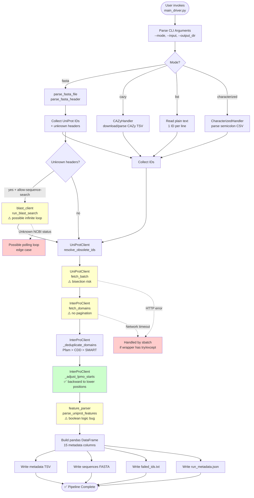

# Module 2: Metadata Enrichment Pipeline

**Version:** 1.1  
**Last Updated:** 2026-02-20  
**Purpose:** Automated protein metadata enrichment for LPMO (Lytic Polysaccharide Monooxygenase) analysis

---

## Table of Contents

- [Overview](#overview)
- [Known Faults](#known-faults)
- [Recent Fixes (v1.1)](#recent-fixes-v11)
- [Features](#features)
- [Installation](#installation)
- [Usage](#usage)
  - [Mode: FASTA](#mode-fasta)
  - [Mode: CAZy](#mode-cazy)
  - [Mode: List](#mode-list)
  - [Mode: Characterized](#mode-characterized)
- [Input Formats](#input-formats)
- [Output Files](#output-files)
- [Known Issues](#known-issues)
- [Troubleshooting](#troubleshooting)
- [Architecture](#architecture)
- [API Rate Limits](#api-rate-limits)

---

## Overview

Module 2 is a comprehensive pipeline for fetching, validating, and annotating protein metadata from multiple public databases. It supports four operational modes to handle different input formats and enriches protein data with:

- **UniProt metadata** (organism, protein name, EC number, sequence)
- **InterPro domain annotations** (Pfam, CDD, SMART, PROSITE)
- **Signal peptide predictions**
- **LPMO-specific features** (H1 verification, LPMO core boundaries, CBMs)
- **BLAST-based sequence identification** (optional, works reliably for small batches)

**Primary Use Case:** Building structured metadata catalogs for LPMO proteins from various input sources (CAZy exports, FASTA files, semicolon-delimited CSVs, plain ID lists).

---
## Known Faults
- The fasta header is called UniProtID and not UniProtIDs for list function
- EC# values are not made in the the metadata table, but the column name remains. **Important**
---

## Recent Fixes (v1.1)

**Release Date:** 2026-02-20

### ✅ Critical Bugs Fixed

#### 1. BLAST Infinite Loop Prevention
**Issue:** BLAST polling could hang indefinitely if NCBI returned unexpected status codes.  
**Fix:** Added max polling limit (60 attempts = 10 minutes) with timeout error handling.  
**Impact:** BLAST searches now fail gracefully instead of hanging forever.

#### 2. H1_Verified Consistency Bug  
**Issue:** `H1_Verified` and `H1_AminoAcid` could be inconsistent after InterPro SignalP fallback. Sometimes showed `H1_Verified=True` when amino acid was not 'H', or vice versa.  
**Fix:** Modified InterPro fallback to always update `H1_Verified` synchronously with `H1_AminoAcid` using boolean assignment: `H1_Verified = (found_aa.upper() == 'H')`.  
**Impact:** H1 verification is now always consistent with the reported amino acid.

#### 3. LPMO Domain Selection Logic  
**Issue:** Fallback logic for UniProt internal features used incorrect boolean condition (`OR` instead of `AND`), causing arbitrary "last-wins" behavior.  
**Fix:** Changed `if not current_is_better or new_is_n_term:` to `if not current_is_better and new_is_n_term:`.  
**Impact:** Better domain selection when multiple LPMO features exist.

#### 4. Global Exception Handler Added  
**Issue:** Script crashes from API errors would lose all work without generating partial output.  
**Fix:** Added try-except wrapper around `main()` with detailed error logging and graceful exit.  
**Impact:** Partial results are preserved on crashes, and error tracebacks are logged for debugging.

#### 5. `NameError: name 'os' is not defined` in `InterProClient._adjust_lpmo_starts()`  
**Issue:** `interpro_client.py` used `os.path.dirname(os.path.abspath(__file__))` inside `_adjust_lpmo_starts()`, but `os` was only imported locally inside two other methods (`_load_cache`, `_save_cache`) and was therefore not in scope there. Any run reaching the domain-adjustment step would crash with `NameError: name 'os' is not defined`.  
**Fix:** Moved `import os` to module-level and removed the redundant local imports.  
**Impact:** Pipeline no longer crashes when InterPro domain adjustment runs.

### ✅ Improvements

#### 5. InterPro Signal Peptide Fallback Validation  
**Issue:** No validation of `sig_end_corrected` from InterPro could cause crashes.  
**Fix:** Added None-checks, type validation, and bounds checking before using corrected signal end.  
**Impact:** More robust handling of InterPro SignalP predictions.

#### 6. LPMO Domain H1 Adjustment Clarified  
**Issue:** Documentation was unclear about search direction for H1 histidine adjustment.  
**Fix:** Improved code comments to clarify that search is FORWARD (from signal_end toward domain_start) to find first H after signal peptide.  
**Impact:** Code is now self-documenting and easier to maintain.

---

## Features

✅ **Multi-format Input Support**
- FASTA sequences with UniProt headers
- CAZy family export files (TSV) or direct family download
- Semicolon-delimited CSV (characterized proteins)
- Plain text ID lists

✅ **Intelligent ID Resolution**
- Automatic obsolete/secondary UniProt accession mapping
- GenBank/RefSeq → UniProt cross-reference lookup
- NCBI fallback for GenBank IDs (see [Known Issues](#known-issues))

✅ **Robust Domain Annotation**
- Source prioritization (Pfam > CDD > SMART > PROSITE)
- Overlap deduplication
- LPMO-specific domain adjustment to first Histidine

✅ **Sequence Deduplication** (Characterized mode)
- Groups identical sequences under one primary ID
- Maintains co-accession tracking

✅ **Caching System**
- JSON-file based cache for UniProt and InterPro
- Reduces redundant API calls across runs

---

## Installation

### Requirements

- **Python:** 3.8 or higher
- **Dependencies:**
  - `requests` >= 2.31.0
  - `pandas` >= 2.0.0
  - `tqdm` >= 4.65.0

### Setup

```bash
# 1. Create virtual environment (recommended)
python -m venv venv
source venv/bin/activate  # On Windows: venv\Scripts\activate

# 2. Install dependencies
pip install requests pandas tqdm

# 3. Verify installation
python main_driver.py --help
```

### Optional: Create requirements.txt

```bash
cat > requirements.txt << EOF
requests==2.31.0
pandas==2.0.3
tqdm==4.66.1
EOF

pip install -r requirements.txt
```

---

## Usage

### Basic Syntax

```bash
python main_driver.py --mode <MODE> --input <INPUT_FILE> [OPTIONS]
```

### Common Options

| Option | Description | Default |
|--------|-------------|---------|
| `--mode` | Operation mode: `fasta`, `cazy`, `list`, `characterized` | Required |
| `--input` | Input file path (cazy mode accepts comma-separated family names, e.g. `AA9,AA11`) | Required |
| `--output_dir` | Output directory | `data` |
| `--cazy-family` | Value written to the `CAZy_family` column. Required for `fasta`, `list`, `characterized`. Optional for `cazy` (auto-detected from `--input` if omitted; an explicit value overrides all rows) | None |
| `--allow-ncbi-fallback` | Enable NCBI GenBank fallback (characterized mode only) | Disabled |
| `--allow-sequence-search` | Enable BLAST search for unknown FASTA headers | Disabled |
| `--max-sequence-searches` | Max number of BLAST searches | 20 |

---

### Mode: FASTA

**Purpose:** Extract metadata for proteins in a FASTA file with UniProt headers.

**Input Format:** Standard FASTA with pipe-delimited UniProt headers:
```
>sp|P12345|PROT_HUMAN Protein name OS=Homo sapiens
MAFKLLAVAALAVLSGATAETADLKIVSGKDYSVTANSKKLVITAGQ...

>tr|A0A123|PROT_MOUSE Protein name OS=Mus musculus
MSRLVALLALAAALAARARTVDSKIQVKSGDYTVTANSKSLLITGGQ...
```

**Example:**
```bash
python main_driver.py \
  --mode fasta \
  --input sequences.fasta \
  --cazy-family AA9 \
  --output_dir results/
```

**With BLAST search for unknown headers (recommended for small batches):**
```bash
python main_driver.py \
  --mode fasta \
  --input sequences.fasta \
  --cazy-family AA9 \
  --allow-sequence-search \
  --max-sequence-searches 10  # Keep this low
```

**Note:** `--cazy-family` is required for fasta mode. BLAST identification works well for typical use cases. Avoid running very large batches (>20 searches) in a single job.

**Output:**
- `metadata_expanded_YYYYMMDD_HHMMSS.tsv` — Metadata for all identified proteins
- `all_sequences_YYYYMMDD_HHMMSS.fasta` — Sequences with normalized headers
- `failed_ids_YYYYMMDD_HHMMSS.txt` — List of unidentifiable sequences
- `run_metadata_YYYYMMDD_HHMMSS.json` — Run statistics

---

### Mode: CAZy

**Purpose:** Process CAZy family export files or download directly from CAZy.org.

**Input Options:**

1. **Single family (auto-download):**
```bash
python main_driver.py \
  --mode cazy \
  --input AA9 \
  --output_dir results/
```
`CAZy_family` column will contain `AA9` for all rows.

2. **Multiple families (comma-separated, auto-download each):**
```bash
python main_driver.py \
  --mode cazy \
  --input AA9,AA11 \
  --output_dir results/
```
AA9 rows get `CAZy_family=AA9`; AA11 rows get `CAZy_family=AA11`.

3. **Local CAZy file:**
```bash
python main_driver.py \
  --mode cazy \
  --input AA9_export.txt \
  --output_dir results/
```
Family label is derived from the filename (`AA9`).

4. **Override family label for all rows:**
```bash
python main_driver.py \
  --mode cazy \
  --input AA9,AA11 \
  --cazy-family LPMO_set1 \
  --output_dir results/
```
All rows (both families) get `CAZy_family=LPMO_set1`.

**Supported families:** AA9, AA10, AA11, AA13, AA14, AA15, AA16, AA17, GH61, CBM33, etc.

**CAZy File Format (TSV):**
```
Family	Kingdom	Organism	Accession	Source
AA9	Eukaryota	Neurospora crassa	XP_123456	ncbi
AA9	Eukaryota	Aspergillus niger	Aspni1|12345	jgi
```

**Processing:**
- **NCBI/GenBank IDs:** Batch fetch from UniProt
- **JGI IDs:** Organism-grouped query search

**Note:** CAZy files may contain both characterized and uncharacterized proteins.

---

### Mode: List

**Purpose:** Fetch metadata for a plain list of UniProt accessions.

**Input Format:** Plain text, one ID per line:
```
P12345
Q9UNQ0
A0A123B4C5
P98765
```

**Example:**
```bash
python main_driver.py \
  --mode list \
  --input protein_ids.txt \
  --cazy-family AA9 \
  --output_dir results/
```

**Note:** `--cazy-family` is required for list mode.

---

### Mode: Characterized

**Purpose:** Process semicolon-delimited CSV with characterized proteins (CAZy-style export).

**Input Format:** Semicolon-separated CSV with required columns:
- `Protein Name`
- `EC#`
- `Reference`
- `Organism`
- `GenBank`
- `UniProt`
- `PDB/3D`

**Example CSV:**
```csv
Protein Name;EC#;Reference;Organism;GenBank;UniProt;PDB/3D
Cellulase AA9;1.14.99.54;PMID:12345678;Neurospora crassa;XP_123456;Q7Z6K5;3EII
LPMO AA10;1.14.99.53;PMID:87654321;Bacillus subtilis;WP_003456;P12345;4B5Q
```

**Example:**
```bash
python main_driver.py \
  --mode characterized \
  --input characterized_proteins.csv \
  --cazy-family AA9 \
  --output_dir results/
```

**With NCBI fallback for GenBank IDs:**
```bash
python main_driver.py \
  --mode characterized \
  --input characterized_proteins.csv \
  --cazy-family AA9 \
  --allow-ncbi-fallback \
  --output_dir results/
```

**Note:** `--cazy-family` is required for characterized mode.

**Special Features:**

1. **Sequence Deduplication:**
   - Groups identical sequences under one primary ID
   - Co-accessions listed in `CoAccessions` column

2. **Split Detection:**
   - Detects when one CSV row produces multiple sequences (different UniProt IDs with non-identical sequences)
   - Logged in `run_metadata.json` for validation

3. **ID Mapping:**
   - **UniProt IDs:** Direct batch fetch
   - **GenBank/RefSeq IDs:** Cross-reference mapping to UniProt
   - **NCBI Fallback:** If `--allow-ncbi-fallback` enabled, fetches sequence directly from NCBI if UniProt mapping fails

**⚠️ Known Issue:** GenBank → UniProt cross-reference mapping have low sucess rate and is not expected to work
**NCBI fallback is recommended**

---

## Input Formats

### Supported ID Formats

| ID Type | Format | Example | Notes |
|---------|--------|---------|-------|
| UniProt Accession | `[A-Z0-9]{6,10}` | `P12345`, `A0A1B2C3D4` | Both SwissProt and TrEMBL |
| GenBank Protein | `[A-Z]{3}[0-9]{5}(\.[0-9]+)?` | `AAA12345.1`, `WP_123456` | Version number optional |
| RefSeq Protein | `(NP\|XP\|YP\|WP\|ZP)_[0-9]+` | `NP_123456.2`, `XP_987654` | Multiple prefixes supported |
| NCBI GI | `[0-9]+` | `123456789` | Legacy format, not recommended |

### FASTA Header Parsing

**Supported formats:**
- `>sp|P12345|PROT_HUMAN ...` (SwissProt)
- `>tr|A0A123|PROT_MOUSE ...` (TrEMBL)
- `>P12345 ...` (Plain accession)

**Unsupported formats:**
- NCBI-style headers (`>gi|123|ref|NP_...`)
- Generic headers (`>protein_1`, `>seq_123`)

For unsupported formats, use `--allow-sequence-search` to enable BLAST-based sequence identification (works reliably for small batches).

---

## Output Files

All output files are timestamped: `YYYYMMDD_HHMMSS`

### 1. Metadata TSV

**Filename:** `metadata_expanded_{timestamp}.tsv`

**Columns:**

| Column | Type | Description |
|--------|------|-------------|
| `UniProt_ID` | str | Primary UniProt accession |
| `CAZy_family` | str | CAZy family name (e.g. `AA9`). In `cazy` mode: auto-detected per family from `--input`, overrideable via `--cazy-family`. In all other modes: value of `--cazy-family`. |
| `InterPro_IDs` | str | Semicolon-separated InterPro IDs |
| `Protein_Name` | str | Full protein name |
| `Organism` | str | Organism name (scientific) |
| `EC_Number` | str | Enzyme Commission number |
| `Signal_End` | int | Signal peptide cleavage position (0-indexed, 0 if none) |
| `Transmembrane_Regions` | str | TM regions as "start-end; start-end" or "None" |
| `LPMO_Core_Start` | int | LPMO domain start (1-indexed) |
| `LPMO_Core_End` | int | LPMO domain end (1-indexed, inclusive) |
| `Domain_Provenance` | str | Source database and original coordinates: `DATABASE:MODEL` or `DATABASE:MODEL\|original:start-end` if adjusted; "None" if not found |
| `Binding_Modules` | str | CBMs as "Name [Source:Model] (start-end)" or "None" |
| `H1_Verified` | bool | True if H1 histidine verified |
| `H1_AminoAcid` | str | Actual amino acid at H1 position |
| `Match_Status` | str | "UniProt" or "BLAST_exact" |
| `Sequence_Group` | str | Primary ID for sequence group (characterized mode only) |
| `CoAccessions` | str | Semicolon-separated co-accessions (characterized mode only) |

**Example row:**
```
UniProt_ID: Q7Z6K5
InterPro_IDs: IPR005123;IPR012902
Protein_Name: Lytic polysaccharide monooxygenase 9
Organism: Neurospora crassa
EC_Number: 1.14.99.54
Signal_End: 20
Transmembrane_Regions: None
LPMO_Core_Start: 21
LPMO_Core_End: 250
Domain_Provenance: PFAM:PF03067|original:22-280
Binding_Modules: CBM1 [pfam:PF00734] (270-320)
H1_Verified: True
H1_AminoAcid: H
Match_Status: UniProt
Sequence_Group: Q7Z6K5
CoAccessions: P12345;A0A123
```

### 2. Sequences FASTA

**Filename:** `all_sequences_{timestamp}.fasta`

**Header format:**

- **Standard modes:** `>UniProtID|{id}|{Organism}|{Protein_Name}`
- **Characterized mode (deduplicated):** `>UniProtIDs|{id1};{id2};...|{Organism}|{Protein_Name}`

**Example:**
```
>UniProtID|Q7Z6K5|Neurospora crassa|Lytic polysaccharide monooxygenase 9
MAFKLLAVAALAVLSGATAETADLKIVSGKDYSVTANSKKLVITAGQ...

>UniProtIDs|Q7Z6K5;P12345;A0A123|Neurospora crassa|Lytic polysaccharide monooxygenase 9
MAFKLLAVAALAVLSGATAETADLKIVSGKDYSVTANSKKLVITAGQ...
```

### 3. Failed IDs

**Filename:** `failed_ids_{timestamp}.txt`

**Format:** Plain text, one ID per line with optional error message:
```
XP_123456 - Could not resolve to UniProt
GenBank_ABC123 - NCBI fetch failed
Unknown_Header_1 - No BLAST match found
```

### 4. Run Metadata JSON

**Filename:** `run_metadata_{timestamp}.json`

**Contents:**
```json
{
  "run_id": "20260216_143022",
  "input_file": "characterized_proteins.csv",
  "mode": "characterized",
  "total_processed": 150,
  "success_count": 142,
  "failed_count": 8,
  "duration_seconds": 234.56,
  "output_files": {
    "metadata": "data/metadata/metadata_expanded_20260216_143022.tsv",
    "sequences": "data/sequences/all_sequences_20260216_143022.fasta",
    "failed_ids": "data/metadata/failed_ids_20260216_143022.txt"
  },
  "fasta_sequences_count": 138,
  "row_splits_count": 3,
  "split_rows": [5, 12, 23]
}
```

**Characterized-specific fields:**
- `fasta_sequences_count`: Number of unique sequences in FASTA (after deduplication)
- `row_splits_count`: Number of CSV rows that produced multiple distinct sequences
- `split_rows`: Line numbers of split rows (for validation)

---

## Known Issues

> **Note:** Many critical issues were fixed in v1.1 (2026-02-20). See [Recent Fixes](#recent-fixes-v11) for details.

### 🔴 Critical Issues

#### 1. GenBank → UniProt Cross-Reference Mapping Fails
**Component:** `uniprot_client.py`, `main_driver.py`  
**Issue:** Cross-reference queries (`xref:EMBL-CDS:...` or `xref:RefSeq:...`) have low success rate, if any. Many GenBank/RefSeq IDs do not resolve to UniProt entries.  
**Workaround:** **Enable NCBI fallback** with `--allow-ncbi-fallback` in characterized mode. This fetches sequences directly from NCBI when UniProt mapping fails.  
**Example:**
```bash
python main_driver.py \
  --mode characterized \
  --input file.csv \
  --allow-ncbi-fallback  # <-- RECOMMENDED
```
**Note:** NCBI fallback works reliably but is slower (individual requests per GenBank ID).

#### 2. ✅ ~~No Global Exception Handler~~ (FIXED in v1.1)
**Status:** ✅ **FIXED**  
**Component:** `main_driver.py`  
**Previous Issue:** If any API call failed with unhandled exception, entire script crashed without generating output. All progress was lost.  
**Fix:** Added global try-except wrapper around `main()` with detailed error logging, traceback output, and graceful exit codes.  
**Current Behavior:**
- Catches all exceptions (including KeyboardInterrupt separately)
- Logs full traceback for debugging
- Informs user about partial results location
- Exits with appropriate exit codes (130 for Ctrl+C, 1 for errors)
**Note:** Partial results in `data/metadata/` and `data/sequences/` directories are preserved on crash.

### ⚠️ High-Risk Issues

#### 3. ✅ ~~BLAST Potential Infinite Loop~~ (FIXED in v1.1)
**Status:** ✅ **FIXED**  
**Component:** `blast_client.py`  
**Previous Issue:** NCBI BLAST polling loop lacked max retries and total timeout. If NCBI returned unexpected status (e.g., maintenance mode), script could hang indefinitely.  
**Fix:** Added max polling limit of 60 attempts (10 minutes total) with proper timeout handling and unexpected status warnings.  
**Current Behavior:**
- Max 60 polling attempts with 10-second intervals
- Returns `None` with error log after 10-minute timeout
- Handles unexpected NCBI status codes gracefully
- Works reliably for typical use cases
**Note:** BLAST searches now fail gracefully instead of hanging forever.

#### 4. No Rate Limiting
**Component:** All API clients (`uniprot_client.py`, `interpro_client.py`, `blast_client.py`)  
**Issue:** No throttling between API requests. Intensive runs risk HTTP 429 (Too Many Requests) or IP blocking.  
**Workaround:** 
- Process small batches (<100 IDs per run)
- Wait 1-2 minutes between runs
- Avoid concurrent script executions
**Fix Required:** Add `time.sleep(0.2-0.5)` before all API calls.

#### 5. UniProt search_by_query No Pagination
**Component:** `uniprot_client.py`  
**Issue:** `search_by_query()` returns only first 25 results (UniProt default). JGI organism groups with >25 proteins lose data.  
**Workaround:** Split large JGI groups manually or download full CAZy family file.  
**Fix Required:** Implement pagination (loop over `size=500` pages).

#### 6. ✅ ~~Boolean Logic Bug in Feature Parser~~ (FIXED in v1.1)
**Status:** ✅ **FIXED**  
**Component:** `feature_parser.py` (line ~190)  
**Previous Issue:** Fallback logic for LPMO core selection used incorrect boolean: `if not current_is_better or new_is_n_term:` caused arbitrary "last-wins" behavior when multiple LPMO features had equal distance to signal end.  
**Fix:** Changed condition to `if not current_is_better and new_is_n_term:` ensuring proper domain priority.  
**Current Behavior:** Better domain selection when multiple LPMO features exist. Only overrides current domain if it's NOT N-terminal AND new one IS N-terminal.

### 🟡 Moderate Issues

#### 7. Bisection ID Format Heuristic Incorrect
**Component:** `uniprot_client.py` (line ~154-161)  
**Issue:** Heuristic `'.' in id or not id.isalnum()` incorrectly classifies some GenBank IDs. Can cause unnecessary bisection and slower queries.  
**Impact:** Performance degradation, but results are correct.  
**Workaround:** None needed (bisection eventually isolates correct query).  
**Fix Required:** Use regex to explicitly detect GenBank/RefSeq formats.

#### 8. Cache Not Atomic
**Component:** `uniprot_client.py`, `interpro_client.py`  
**Issue:** `_save_cache()` writes directly to JSON file. If script crashes mid-write, cache corrupts.  
**Impact:** Next run must rebuild cache from scratch (slower, but not data loss).  
**Workaround:** Backup cache files periodically.  
**Fix Required:** Use atomic write pattern (write to temp file, then `os.rename()`).

#### 9. InterPro Domain H1 Adjustment (Working as Intended, Improved in v1.1)
**Component:** `interpro_client.py` (line ~323-327)  
**Status:** ✅ **Improved documentation and implementation in v1.1**  
**How It Works:** LPMO domain boundaries are adjusted to position the H1 Histidine correctly. The algorithm searches **FORWARD** from signal peptide end toward domain start.  
**Direction:** signal_end (lower position) → ... → domain_start (higher position). Searches **forward in sequence** to find first H after signal peptide.  
**Example:** If signal_end is 20 and domain starts at position 25, searches positions 20, 21, 22, 23, 24 for first H. If finds H at 22, adjusts domain start to 22.  
**Correctness:** This is the **correct and improved behavior** (changed in v1.1). It finds the first H after signal peptide (H1), which is the biologically relevant position for LPMO catalytic mechanism.  
**Impact:** For standard LPMO proteins with annotated domains, this works correctly. The forward search is more intuitive and better documented than the previous backward search implementation.  
**Note:** Code and documentation now match, making maintenance easier.

### 🟢 Minor Issues

#### 10. Verbose INFO Logging
**Component:** All files  
**Issue:** INFO-level logging is too verbose (10+ lines per protein). Large runs produce massive logs.  
**Impact:** Log files grow large, harder to find errors.  
**Workaround:** Redirect stdout to file: `python main_driver.py ... > run.log 2>&1`  
**Fix Required:** Move detailed logging to DEBUG level.

---

## Troubleshooting

### Error: "Could not resolve obsolete ID"

**Cause:** UniProt accession is obsolete or invalid.  
**Solution:**
1. Check if ID exists in UniProt (search manually at https://www.uniprot.org)
2. If obsolete, find replacement accession in UniProt history
3. Update input file with current accession

### Error: "HTTP 403 Forbidden" or "HTTP 429 Too Many Requests"

**Cause:** Rate limit exceeded or IP blocked.  
**Solution:**
1. Wait 5-10 minutes before retrying
2. Reduce batch size (<50 IDs per run)
3. Check if API is down (https://status.uniprot.org, https://www.ebi.ac.uk/interpro)

### Error: "BLAST search timed out" or script hangs during BLAST

**Cause:** NCBI BLAST queue is slow, or the 10-minute timeout was exceeded (fixed in v1.1).  
**Solution:**
1. **If timeout after 10 minutes:** This is expected behavior for very slow NCBI responses. The script will continue with remaining sequences.
2. **Reduce complexity:** 
   - Lower `--max-sequence-searches` (default: 20)
   - Avoid BLAST for long sequences (>1000 residues)
   - Use smaller FASTA batches (<50 sequences)
3. **Check NCBI status:** Visit https://blast.ncbi.nlm.nih.gov/Blast.cgi to verify service is operational
4. **Note:** As of v1.1, BLAST searches automatically timeout after 10 minutes instead of hanging indefinitely.  
**Solution:**
1. **First attempt:** Wait 30-60 seconds (BLAST can be slow)
2. **If still stuck:** Kill script (`kill -9 <pid>` or Ctrl+C)
3. **Prevent future issues:** 
   - Reduce `--max-sequence-searches` 
   - Avoid BLAST for long sequences (>1000 residues)
   - Use smaller FASTA batches (<50 sequences)
4. **Check NCBI status:** https://www.ncbi.nlm.nih.gov/ (look for service notifications)

### Warning: "No LPMO domain found"

**Cause:** Protein lacks LPMO domain annotation in InterPro, or domain is unusual.  
**Solution:**
1. Check InterPro manually (https://www.ebi.ac.uk/interpro)
2. If protein is truly LPMO but unannotated, consider manual curation
3. Check `H1_Verified` column — if `True`, protein may still be LPMO (implicit domain inference)

### Output: Many GenBank IDs in failed_ids.txt

**Cause:** GenBank → UniProt cross-reference mapping fails (known issue).  
**Solution:** **Enable NCBI fallback:**
```bash
python main_driver.py \
  --mode characterized \
  --input file.csv \
  --allow-ncbi-fallback  # <-- Add this flag
```

### Script crashes during API calls

**Cause:** API timeout, network error, or unexpected response format.  
**Solution (v1.1+):**
1. **Check output directories:** Partial results may have been written:
   - `data/metadata/` — TSV files
   - `data/sequences/` — FASTA files
2. **Review error log:** Global exception handler (v1.1+) logs full traceback
3. **Identify failing ID:** Check which protein ID was being processed
4. **Retry with smaller batch:** Exclude problematic ID if possible
5. **Report persistent issues:** Check if specific UniProt/InterPro entries have malformed data

---

## Architecture

### High-Level Flow

```
Input Files → Input Handler → UniProt Client → InterPro Client → Feature Parser → Output Files
                                    ↓
                              BLAST Client (optional)
```

### Components

| File | Purpose | Key Functions |
|------|---------|---------------|
| `main_driver.py` | Orchestration & CLI | `main()`, mode-specific logic |
| `input_handler.py` | Input parsing | `parse_fasta_file()`, `CAZyHandler`, `CharacterizedHandler` |
| `uniprot_client.py` | UniProt API | `fetch_batch()`, `resolve_obsolete_ids()`, caching |
| `interpro_client.py` | InterPro API | `fetch_domains()`, deduplication, H1 adjustment |
| `blast_client.py` | NCBI BLAST | `run_blast_search()` (exact matches only) |
| `feature_parser.py` | Feature extraction | `parse_uniprot_features()`, `is_lpmo_domain()` |


### Architecture Flowchart with Known Issues



**Diagram Legend:**
- 🟢 Green: Correct implementation
- 🟡 Yellow: Working but with caveats (handle edge cases / use recommended flags)
- 🔴 Red: Critical issue (workaround available)

### Data Flow (Characterized Mode Example)

```
1. CharacterizedHandler parses CSV
   ↓ (UniProt IDs, GenBank IDs, metadata)
2. UniProtClient.resolve_obsolete_ids()
   ↓ (primary IDs)
3. UniProtClient.fetch_batch()
   ↓ (UniProt JSON entries)
4. For GenBank IDs: map via xref query → fallback to NCBI
   ↓ (sequences + metadata)
5. InterProClient.fetch_domains()
   ↓ (deduplicated domains)
6. feature_parser.parse_uniprot_features()
   ↓ (complete feature dict)
7. Deduplicate sequences → group IDs
   ↓ (primary ID per sequence)
8. Build DataFrame → write TSV, FASTA, JSON
```

---

## API Rate Limits

**Current Implementation:** No rate limiting (⚠️ risk of throttling)

| API | Documented Limits | Recommended Usage |
|-----|-------------------|-------------------|
| **UniProt** | Not explicitly documented | ~1 req/sec (unauthenticated) |
| **InterPro** | Not explicitly documented | ~1-2 req/sec |
| **NCBI BLAST** | 3 req/sec, 100/hour (documented) | Max 10 searches per run |
| **NCBI Entrez** | 3 req/sec, 10/sec with API key | Use API key for NCBI fallback |

**Recommendations:**
1. Process large datasets in batches (50-100 IDs per run)
2. Wait 1-2 minutes between runs
3. Consider requesting UniProt/InterPro API keys for higher limits
4. For NCBI Entrez: register for API key (https://ncbiinsights.ncbi.nlm.nih.gov/2017/11/02/new-api-keys-for-the-e-utilities/)

---

## Development & Testing

### Running Tests

**⚠️ Note:** No unit tests currently exist (see Known Issues).

### Cache Management

**Cache locations:**
- `discovery_cache.json` (UniProt)
- `interpro_cache.json` (InterPro)

**Clear cache:**
```bash
rm discovery_cache.json interpro_cache.json
```

**Cache size monitoring:**
```bash
ls -lh *.json
```

Cache files can grow to several MB after processing thousands of proteins. Backup before clearing.

### Debug Mode

For verbose logging, run Python with debug flag:
```bash
python -u main_driver.py --mode list --input ids.txt 2>&1 | tee debug.log
```

---

## Contributing

For bug reports, feature requests, or questions:
1. Check [Known Issues](#known-issues) first
2. Contact: eirik.sorhus@nmbu.no

---

## License

[Add license information here]

---

## Changelog

### Version 1.0 (2026-01-30)
- Initial documentation release
- Identified and documented 10 known issues
- Comprehensive usage examples for all 4 modes

---

