# CODE WALKTHROUGH - Structure Pipeline

**Project:** Structure Pipeline  
**Purpose:** A pipeline for running protein structure prediction workflows with AlphaFold3, Boltz, and RoseTTAFold3  
**Documentation Status:** Complete - Ready for Final Review  
**Last Updated:** 2026-02-23

---

## File Index

This index lists all Python source files in the project. Files marked [TODO] have not yet been documented. Files marked [DONE] have been analyzed and documented below.

### Main Application Files
- [DONE] `src/structure_pipeline/__init__.py`
- [DONE] `src/structure_pipeline/cli.py`
- [DONE] `src/structure_pipeline/config.py`
- [DONE] `src/structure_pipeline/cases.py`
- [DONE] `src/structure_pipeline/resume.py`

### Executors (Job Execution Layer)
- [DONE] `src/structure_pipeline/executors/__init__.py`
- [DONE] `src/structure_pipeline/executors/base.py`
- [DONE] `src/structure_pipeline/executors/local.py`
- [DONE] `src/structure_pipeline/executors/slurm.py`

### Manifest (Input Processing)
- [DONE] `src/structure_pipeline/manifest/__init__.py`
- [DONE] `src/structure_pipeline/manifest/ligands.py`
- [DONE] `src/structure_pipeline/manifest/msa.py`
- [DONE] `src/structure_pipeline/manifest/proteins.py`

### Runners (Workflow Implementations)
- [DONE] `src/structure_pipeline/runners/__init__.py`
- [DONE] `src/structure_pipeline/runners/af3.py`
- [DONE] `src/structure_pipeline/runners/base.py`
- [DONE] `src/structure_pipeline/runners/boltz.py`
- [DONE] `src/structure_pipeline/runners/ligand_utils.py`
- [DONE] `src/structure_pipeline/runners/mounts.py`
- [DONE] `src/structure_pipeline/runners/oligo.py`
- [DONE] `src/structure_pipeline/runners/rf3.py`

### Tests
- [DONE] `tests/__init__.py`
- [DONE] `tests/test_af3_runner.py`
- [DONE] `tests/test_boltz_runner.py`
- [DONE] `tests/test_cases.py`
- [DONE] `tests/test_ccd_list.py`
- [DONE] `tests/test_integration.py`
- [DONE] `tests/test_ligands.py`
- [DONE] `tests/test_mounts.py`
- [DONE] `tests/test_oligo.py`
- [DONE] `tests/test_proteins.py`
- [DONE] `tests/test_rf3_runner.py`

**Total Files:** 32  
**Documented:** 32  
**Remaining:** 0

---

## File Documentation

### `src/structure_pipeline/__init__.py`

**Role:** Package initialization  
**Size:** 3 lines  
**Imports:** None (only module docstring and version)

**Content:**
- Defines `__version__ = "0.1.0"`
- Module docstring: "Structure prediction pipeline for AF3, Boltz-2, and RF3."

**Purpose:** Minimal package initialization. No functions or classes.

**Notes:**
- This file serves only as a marker for the package namespace.
- Version is manually maintained (not auto-generated).

---

### `src/structure_pipeline/cli.py`

**Role:** Command-line interface entry point (main user-facing API)  
**Size:** 803 lines  
**Key Imports:**
- `typer` — CLI framework (Typer.Typer app)
- `rich` — formatted console output (Console, Table)
- Internal: `.cases`, `.config`, `.executors`, `.manifest.*`, `.runners`, `.resume`

**Functions:**

1. **`get_config(config_path: Path | None) -> PipelineConfig`**
   - **Purpose:** Load and validate configuration file.
   - **Input:** Optional path to config YAML (defaults to None)
   - **Output:** `PipelineConfig` object or raises `typer.Exit(1)`
   - **Side Effects:** Prints error messages to console on failure.
   - **Dependencies:** `load_config()` from `.config`

2. **`version()`**
   - **Purpose:** CLI command to display pipeline version.
   - **Input:** None (called from CLI)
   - **Output:** Prints "v{__version__}"
   - **Typer Decorator:** `@app.command()`

3. **`manifest(...)`**
   - **Purpose:** CLI command to generate manifest files (proteins, ligands, MSAs, cases).
   - **Input Parameters:**
     - `config`: Optional path to config file
     - `force`: Flag to overwrite existing manifests
     - `ligand_ccd_list`: Path to CCD code list (alternative to scanning CIF files)
   - **Workflow:**
     1. Load config via `get_config()`
     2. Parse proteins from FASTA (or skip if exists) → `proteins.csv`
     3. Scan ligands from directory or load from CCD list → `ligands.csv`
     4. Match MSAs from directory/squashfs files → `msa.csv`
     5. Generate cases (Cartesian product of proteins × ligands × models) → `cases.csv`
     6. Display summary table(model, pending count, skipped count)
   - **Side Effects:** Writes 4 CSV files to `cfg.outputs.manifest_dir`
   - **Dependencies:** Functions from `.manifest.*` modules and `.cases`
   - **Uncertainty:** The logic for "missing MSA proteins" is incomplete at line 195 in the partial read.

4. **`validate(...)`**
   - **Purpose:** CLI command to validate configuration and check all required file paths.
   - **Input:** Optional config path
   - **Validation Checks:**
     - Required input paths: proteins_fasta, ligands_dir
     - Optional: msa_dir
     - Squashfs MSA files
     - Model-specific paths (AF3, Boltz, RF3) via their `.validate_paths()` methods
   - **Output:** Success message or error message + `typer.Exit(1)`
   - **Side Effects:** Prints status for each path check.
   - **Dependencies:** `AF3Runner.validate_paths()`, `BoltzRunner.validate_paths()`, `RF3Runner.validate_paths()`

5. **`run(...)`**
   - **Purpose:** CLI command to submit structure prediction jobs (main entry point for execution).
   - **Input Parameters:**
     - `config`: Path to config
     - `dry_run`: Flag to show what would be submitted (no actual submission)
     - `resume`: Skip completed jobs (default True)
     - `model`: Filter to specific model (af3/boltz/rf3)
     - `protein`: Filter to specific protein ID
     - `local`: Run locally via `LocalExecutor` instead of `SlurmExecutor`
     - Model-specific overrides: `af3_seeds`, `af3_diffusion_samples`, `boltz_diffusion_samples`, `boltz_recycling_steps`, `rf3_seed`, `rf3_diffusion_batch_size`, `rf3_n_recycles`, `rf3_num_steps`
     - `ligand_ccd_list`: CCD list (must match manifest)
     - `oligo_definitions`: Path to YAML file for oligosaccharide definitions
   - **Workflow:**
     1. Load config and apply CLI overrides (e.g., `cfg.af3.seeds = af3_seeds`)
     2. Load manifests (cases, proteins, proteins, ligands, MSAs)
     3. Build `ligand_cif_paths` dict if in CIF file mode (not CCD-list mode)
     4. Filter cases by model/protein if specified
     5. Get pending cases via `StatusTracker.get_pending_cases()`
     6. Group pending cases by (ligand_ccd, model) via `group_cases_by_ligand_model()`
     7. **AF3 two-stage submission:**
        - For each protein in each ligand group: submit MSA job
        - For each ligand group: submit inference job with dependency on MSA jobs
     8. **RF3 and Boltz one-stage submission:**
        - For each (ligand, model) group: submit single job
     9. Track all submitted jobs and print summary
   - **Side Effects:**
     - Writes SLURM scripts to `cfg.outputs.work_dir / ligand / model` directories
     - Submits jobs via `executor.submit()`
     - Creates `.ok` files or job records for resume tracking
   - **Dependencies:** `Case`, `StatusTracker`, `AF3Runner`, `BoltzRunner`, `RF3Runner`, `LocalExecutor`, `SlurmExecutor`, `OligoRegistry`, `compute_bind_mounts()`
   - **Special AF3 Logic:** Uses dependency-based scheduling: each inference job depends on completion of all MSA jobs for its proteins.
   - **Dry-run Mode:** Computes and displays bind mounts without submitting jobs.

6. **`status(...)`**
   - **Purpose:** CLI command to display current job status.
   - **Input:** Optional config path
   - **Workflow:**
     1. Load config
     2. Create `StatusTracker` pointing to work directory
     3. Call `tracker.generate_summary()` to count completed/pending/failed jobs per model
     4. Display in tabular format (model, completed, pending, failed)
   - **Output:** Pretty-printed table
   - **Dependencies:** `StatusTracker.generate_summary()`

7. **`init_config(...)`**
   - **Purpose:** CLI command to generate a template configuration file.
   - **Input:** Output path (default: `config/pipeline.yaml`)
   - **Output:** Writes multi-line YAML string to file
   - **Side Effects:** Creates parent directories if needed, writes file.
   - **Template Content:** Includes all required sections (paths, slurm, af3, boltz, rf3, inputs, outputs, models_enabled)

8. **`main()`**
   - **Purpose:** Entry point for CLI.
   - **Calls:** `app()` which dispatches Typer commands.

**App-level Setup:**
- `app = typer.Typer(...)` — Typer CLI application
- `console = Console()` — Rich console for output

**Mermaid Flowchart: cli.py**

```
flowchart TD
    Start([User invokes CLI]) --> Cmd{which command?}
    Cmd -->|version| Version["version()"]
    Cmd -->|manifest| Manifest["manifest(config, force, ligand_ccd_list)"]
    Cmd -->|validate| Validate["validate(config)"]
    Cmd -->|run| Run["run(config, dry_run, resume, ...)"]
    Cmd -->|status| Status["status(config)"]
    Cmd -->|init-config| InitConfig["init_config(output)"]
    
    Version --> PrintVersion["console.print(version)"] --> End1([End])
    
    Manifest --> LoadCfg1["get_config(config)"]
    LoadCfg1 --> ParseProteins["parse_fasta() → proteins.csv"]
    ParseProteins --> ScanLigands{CCD list?}
    ScanLigands -->|Yes| LoadCCD["load_ccd_list()"]
    ScanLigands -->|No| ScanDir["scan_ligands()"]
    LoadCCD --> WriteLigands["write_ligands_manifest()"]
    ScanDir --> WriteLigands
    WriteLigands --> MatchMSA["match_msa() → msa.csv"]
    MatchMSA --> GenCases["generate_cases() → cases.csv"]
    GenCases --> PrintTable["print(summary table)"] --> End2([End])
    
    Validate --> LoadCfg2["get_config(config)"]
    LoadCfg2 --> CheckPaths["check: proteins_fasta, ligands_dir, msa_dir, squashfs"]
    CheckPaths --> CheckModels["AF3Runner.validate_paths(), BoltzRunner.validate_paths(), RF3Runner.validate_paths()"]
    CheckModels --> PrintResult{all valid?}
    PrintResult -->|Yes| SuccessMsg["print success"] --> End3([End])
    PrintResult -->|No| ErrorMsg["print errors, typer.Exit(1)"] --> End3
    
    Run --> LoadCfg3["get_config(config)"]
    LoadCfg3 --> ApplyOverrides["apply CLI overrides to config"]
    ApplyOverrides --> LoadManifests["load cases, proteins, ligands, MSA manifests"]
    LoadManifests --> LoadOligo["load OligoRegistry if provided"]
    LoadOligo --> FilterCases["filter by model/protein if specified"]
    FilterCases --> GetPending["StatusTracker.get_pending_cases(resume=True)"]
    GetPending --> Group["group_cases_by_ligand_model()"]
    Group --> DryRun{dry_run?}
    DryRun -->|Yes| ComputeMounts["compute_bind_mounts(), print, End"]
    DryRun -->|No| SubmitAF3["for each AF3 group: submit MSA jobs (one per protein)"]
    SubmitAF3 --> SubmitInf["submit AF3 inference with dependency on MSA"]
    SubmitInf --> SubmitOther["for each Boltz/RF3 group: submit single job"]
    SubmitOther --> End4([End])
    
    Status --> LoadCfg4["get_config(config)"]
    LoadCfg4 --> CreateTracker["StatusTracker(work_dir)"]
    CreateTracker --> GenSummary["tracker.generate_summary()"]
    GenSummary --> PrintStatus["print(table with model, completed, pending, failed)"] --> End5([End])
    
    InitConfig --> WriteYAML["write template config to output path"] --> End6([End])
```

**Uncertainty / TODO:**
- Line 195 (not shown in full): The logic for tracking `missing_msa` after loading existing msa.csv is incomplete in the read output. **Assumption:** It remains set to empty list if msa.csv exists, or is populated from proteins without MSA records.
- The `oligo_definitions` loading and `OligoRegistry.from_yaml()` call (around line 600) assumes the path is absolute; if relative, it calls `.resolve()`. This is correct but could fail if CWD is unexpected.
- In the AF3 two-stage submission, the code selects `msa_ligand = af3_msa_ligand.get(case.protein_id, ligand_ccd)` to handle cases where a protein is used with multiple ligands. **Assumption:** Only the first (or last) ligand per protein is used for the MSA job; this may not be ideal if ligands differ in their CIF files.

---

### `src/structure_pipeline/config.py`

**Role:** Configuration management with Pydantic validation  
**Size:** 276 lines  
**Key Imports:**
- `pydantic` — `BaseModel`, `Field`, `field_validator`, `model_validator`
- `yaml` — Configuration serialization
- `os`, `pathlib.Path` — Path handling and environment variable expansion

**Purpose:** Defines the entire configuration schema for the pipeline using Pydantic models. Supports YAML serialization/deserialization, environment variable expansion, path validation, and automatic directory creation.

**Classes:**

1. **`PathsConfig(BaseModel)`**
   - **Purpose:** Stores paths to model weights, container images, and databases for AF3, Boltz, and RF3.
   - **Fields:**
     - AF3: `af3_dir`, `af3_cpu_image`, `af3_gpu_image`, `af3_weights`, `af3_databases`
     - Boltz: `boltz_image`, `boltz_weights`
     - RF3: `rf3_foundry_root`, `rf3_image`, `rf3_checkpoint`
   - **Validators:**
     - `expand_env_vars()`: Expands environment variables in all path fields using `os.expandvars()`

2. **`SlurmConfig(BaseModel)`**
   - **Purpose:** SLURM job configuration (account, partitions, resource limits).
   - **Fields:**
     - `account`, `partition_cpu`, `partition_gpu`
     - `mem_per_gpu`, `mem_per_gpu_af3`, `mem_per_gpu_boltz`, `mem_per_gpu_rf3` (model-specific overrides)
     - `time_msa`, `time_inference`, `gpus`, `cpus_msa`, `mem_per_cpu_msa`
     - `tmp_base`: Base directory for temporary files on the cluster
   - **Methods:**
     - `get_mem_per_gpu(model: str) -> str`: Returns model-specific memory override or default `mem_per_gpu`.

3. **`AF3Config(BaseModel)`**
   - **Purpose:** AF3-specific parameters.
   - **Fields:**
     - `seeds`: Number of model seeds (≥1)
     - `num_diffusion_samples`: Diffusion samples per seed (≥1)
     - `jackhmmer_n_cpu`: CPUs for jackhmmer during MSA generation

4. **`BoltzConfig(BaseModel)`**
   - **Purpose:** Boltz-2 specific parameters.
   - **Fields:**
     - `seeds`: Number of seeds (≥1)
     - `diffusion_samples`: Diffusion samples (≥1)
     - `recycling_steps`: Recycling steps (≥1)
     - `use_affinity`: Enable affinity prediction (default True)
     - `use_msa_server`: Use MSA server vs pre-computed MSA (default False)

5. **`RF3Config(BaseModel)`**
   - **Purpose:** RoseTTAFold3-specific parameters.
   - **Fields:**
     - `seed`: Model seed
     - `diffusion_batch_size`: Structures per diffusion batch (≥1)
     - `n_recycles`: Number of recycles (≥1)
     - `num_steps`: Diffusion steps (≥1)
     - `early_stopping_plddt_threshold`: Early stopping threshold (0.0–1.0)
     - `skip_existing`: Skip existing outputs (default False)

6. **`InputsConfig(BaseModel)`**
   - **Purpose:** Defines input file locations (FASTA, ligands, MSAs).
   - **Fields:**
     - `proteins_fasta`: Path to proteins FASTA file
     - `ligands_dir`: Path to ligands directory (with subdirectories per ligand type)
     - `msa_dir`: Optional path to MSA directory with a3m files
     - `msa_sqsh_files`: List of squashfs files containing a3m MSAs
     - `msa_sqsh_mount_point`: Mount point for squashfs MSAs inside container (default `/msa`)
     - `oligo_definitions`: Optional path to YAML file defining oligosaccharide prefixes, monomer CCD codes, and bond atom pairs (for AF3 multi-monomer handling)
   - **Validators:**
     - `expand_sqsh_paths()`: Expands environment variables in squashfs file paths.
     - `resolve_relative_paths()`: Converts all relative paths to absolute paths using `.resolve()`.

7. **`OutputsConfig(BaseModel)`**
   - **Purpose:** Output directory configuration.
   - **Fields:**
     - `work_dir`: Working directory for outputs
     - `manifest_dir`: Directory for manifest CSVs
     - `results_dir`: Directory for aggregated results
   - **Validators:**
     - `resolve_relative_paths()`: Converts relative paths to absolute.

8. **`PipelineConfig(BaseModel)`**
   - **Purpose:** Root configuration class that combines all sub-configurations.
   - **Fields:**
     - `paths`: `PathsConfig`
     - `slurm`: `SlurmConfig` (defaults to `SlurmConfig()`)
     - `af3`, `boltz`, `rf3`: Model-specific configs (defaults to respective `*Config()`)
     - `inputs`: `InputsConfig`
     - `outputs`: `OutputsConfig`
     - `models_enabled`: List of models to run (default `["af3", "boltz", "rf3"]`)
     - `dry_run`: Dry run mode flag (default False)
     - `verbose`: Verbose logging flag (default False)
   - **Validators:**
     - `validate_models()`: Ensures model names are in `{"af3", "boltz", "rf3"}`.
     - `create_output_dirs()`: Creates `work_dir`, `manifest_dir`, `results_dir` if they don't exist.
   - **Methods:**
     - `from_yaml(path: Path) -> PipelineConfig`: Class method to load config from YAML file.
     - `to_yaml(path: Path) -> None`: Saves config to YAML file (with JSON-serialized paths).

**Functions:**

1. **`load_config(config_path: Path | None = None) -> PipelineConfig`**
   - **Purpose:** Load configuration from file or environment with fallback logic.
   - **Input:** Optional path to config file. If `None`, tries:
     1. `STRUCTURE_PIPELINE_CONFIG` environment variable
     2. `./config/pipeline.yaml`
     3. `~/structure_pipeline.yaml`
   - **Output:** Validated `PipelineConfig` object
   - **Side Effects:** Raises `FileNotFoundError` if no config found.
   - **Dependencies:** `PipelineConfig.from_yaml()`

**Mermaid Flowchart: config.py**

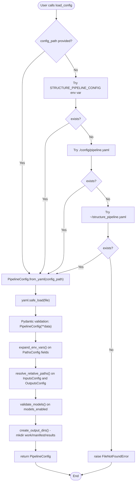

**Notes / Observations:**
- **Strength:** Clean separation of concerns with nested Pydantic models. Automatic validation and type checking.
- **Environment variable expansion:** Applied to `PathsConfig` and `InputsConfig.msa_sqsh_files` only, not to other fields. This is intentional but could be extended if needed.
- **Path resolution:** Relative paths are converted to absolute during validation. This assumes the config is loaded from the expected working directory (project root).
- **Directory creation:** Output directories are auto-created during config loading, which is convenient but means config loading has side effects.
- **GPU memory default:** `SlurmConfig.mem_per_gpu` defaults to `80G`, and per-model overrides are optional.
- **Missing validation:** No explicit checks that files/directories exist (only path resolution). Validation is deferred to `cli.py validate` command or runtime.

---

### `src/structure_pipeline/cases.py`

**Role:** Case generation - expand proteins × ligands × models into job cases  
**Size:** 258 lines  
**Key Imports:**
- `dataclasses` — `dataclass`, `asdict`
- `enum` — `Enum`
- `csv` — CSV I/O for manifest
- `hashlib` — Case ID generation
- Internal: `.manifest.proteins.ProteinRecord`, `.manifest.ligands.LigandRecord`, `.manifest.msa.MSARecord`

**Purpose:** Defines the core data model for prediction cases (Cartesian product of proteins × ligands × models), generates unique case IDs, handles case status tracking, and provides grouping utilities for batch job submission.

**Enums:**

1. **`ModelType(str, Enum)`**
   - **Purpose:** Enum for supported structure prediction models.
   - **Values:** `AF3 = "af3"`, `BOLTZ = "boltz"`, `RF3 = "rf3"`

2. **`CaseStatus(str, Enum)`**
   - **Purpose:** Enum for case execution status.
   - **Values:**
     - `PENDING`: Not yet started
     - `RUNNING`: In progress
     - `COMPLETED`: Successfully finished
     - `FAILED`: Error occurred
     - `SKIPPED`: Not executed (e.g., missing MSA for Boltz/RF3)

**Classes:**

1. **`Case` (dataclass)**
   - **Purpose:** Represents a single prediction case (one protein + one ligand + one model).
   - **Fields:**
     - `case_id`: Unique hash-based ID (12-character hex)
     - `protein_id`: Protein identifier
     - `ligand_id`: Ligand identifier
     - `ligand_ccd_code`: Ligand CCD code (3-letter code, e.g., `STA6`)
     - `model`: Model name (`af3`, `boltz`, `rf3`)
     - `msa_source`: MSA source (`native` for AF3, `mmseqs` for Boltz/RF3, or `none`)
     - `msa_path`: Path to MSA file (empty for AF3 native MSA)
     - `status`: Case status (default: `pending`)
     - `error_message`: Error message (default: empty)
   - **Methods:**
     - `to_dict() -> dict`: Converts case to dictionary for CSV export using `asdict()`.
   - **Properties:**
     - `output_dir_name -> str`: Generates output directory name in format `{protein_id}_{ligand_ccd_code}`, e.g., `B6EQJ6_STA6`.

**Functions:**

1. **`_generate_case_id(protein_id: str, ligand_id: str, model: str, msa_source: str) -> str`**
   - **Purpose:** Generate a deterministic hash-based case ID.
   - **Input:** Protein ID, ligand ID, model name, MSA source
   - **Output:** 12-character hexadecimal hash (SHA-256 truncated)
   - **Algorithm:** Combines inputs as `"{protein_id}:{ligand_id}:{model}:{msa_source}"`, computes SHA-256, takes first 12 characters.
   - **Determinism:** Same inputs always produce the same case ID.

2. **`generate_cases(proteins, ligands, msa_records, models, missing_msa_proteins=None) -> Iterator[Case]`**
   - **Purpose:** Generate prediction cases for all valid combinations (Cartesian product).
   - **Input:**
     - `proteins`: List of `ProteinRecord`
     - `ligands`: List of `LigandRecord`
     - `msa_records`: List of `MSARecord` (for Boltz/RF3)
     - `models`: List of model names to run (e.g., `["af3", "boltz", "rf3"]`)
     - `missing_msa_proteins`: Optional list of protein IDs without MSA (these will be skipped for Boltz/RF3)
   - **Output:** Yields `Case` objects
   - **Logic:**
     - For AF3: `msa_source = "native"`, `msa_path = ""` (AF3 generates MSA internally)
     - For Boltz/RF3: `msa_source = "mmseqs"`, looks up MSA path from `msa_records`. If protein is in `missing_msa_proteins`, yields a case with `status=SKIPPED` and `error_message="Missing MSA"`, then continues to next case.
   - **Side Effects:** None (generator function)

3. **`write_cases_manifest(cases: list[Case], output_path: Path) -> None`**
   - **Purpose:** Write cases to CSV manifest file.
   - **Input:** List of `Case` objects, output path
   - **Output:** CSV file with header and one row per case
   - **Side Effects:** Writes file to disk
   - **Error Handling:** Raises `ValueError` if `cases` is empty.

4. **`load_cases_manifest(manifest_path: Path) -> list[Case]`**
   - **Purpose:** Load cases from CSV manifest file.
   - **Input:** Path to manifest CSV
   - **Output:** List of `Case` objects
   - **Side Effects:** Reads file from disk
   - **Defaults:** If `status` or `error_message` columns are missing, defaults to `CaseStatus.PENDING.value` and `""`.

5. **`group_cases_by_protein_model(cases: list[Case]) -> dict[tuple[str, str], list[Case]]`**
   - **Purpose:** Group cases by `(protein_id, model)` for batch processing.
   - **Input:** List of `Case` objects
   - **Output:** Dictionary mapping `(protein_id, model)` tuples to lists of cases
   - **Logic:** Skips cases with `status=SKIPPED`.
   - **Use Case:** Used for organizing jobs that batch multiple ligands for the same protein-model combination.

6. **`group_cases_by_ligand_model(cases: list[Case]) -> dict[tuple[str, str], list[Case]]`**
   - **Purpose:** Group cases by `(ligand_ccd_code, model)` for batch processing.
   - **Input:** List of `Case` objects
   - **Output:** Dictionary mapping `(ligand_ccd_code, model)` tuples to lists of cases
   - **Logic:** Skips cases with `status=SKIPPED`.
   - **Use Case:** One SLURM job per `(ligand, model)` pair, batching all proteins together. This is the primary grouping strategy used in `cli.py run()`.

**Mermaid Flowchart: cases.py**

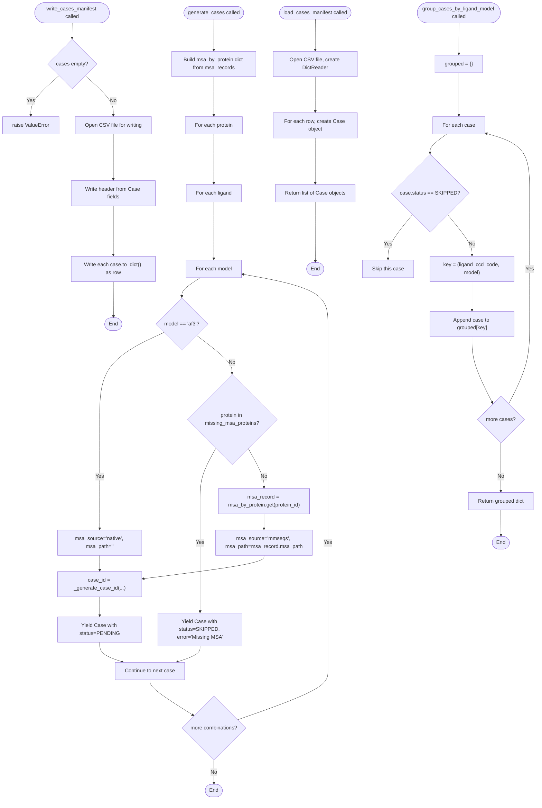

**Notes / Observations:**
- **Case ID determinism:** Using SHA-256 hash ensures reproducible case IDs across runs, which is useful for idempotency and resume logic.
- **MSA handling:** AF3 uses native MSA generation (via AlphaFold3's own workflow), while Boltz and RF3 require pre-computed MSAs (from ColabFold/MMseqs2). Missing MSA for Boltz/RF3 results in a `SKIPPED` case.
- **Grouping strategy:** The pipeline groups cases by `(ligand, model)` rather than `(protein, model)`. This means one SLURM job handles all proteins for a given ligand-model pair, which is efficient for parallel execution.
- **Status tracking:** The `status` field is used by `resume.py` and `cli.py` to determine which cases are pending, completed, or should be skipped. The exact logic for updating status is likely in `resume.py` or the runners.
- **Potential issue:** The `group_cases_by_protein_model()` function exists but is not used in `cli.py`. It may be leftover code or intended for future use (e.g., protein-centric job scheduling).

---

### `src/structure_pipeline/resume.py`

**Role:** Resume logic and job status tracking for pipeline runs  
**Size:** 162 lines  
**Key Imports:**
- `json` — JSONL serialization for status logs
- `dataclasses` — `dataclass`, `asdict` for `StatusEntry`
- `datetime` — Timestamp generation
- Internal: `.cases.Case`, `.cases.CaseStatus`

**Purpose:** Provides append-only status logging and resume logic. Each ligand/model combination has its own `status.jsonl` file and `DONE.ok` marker. Enables idempotent pipeline execution by tracking completed cases and skipping them on resume.

**Directory Convention:**
```
work/{ligand_ccd}/{model}/
  ├── status.jsonl       # Append-only event log (JSONL format)
  └── DONE.ok            # Completion marker for entire ligand/model group
```

**Classes:**

1. **`StatusEntry` (dataclass)**
   - **Purpose:** Represents a single event in the status log (started, completed, failed).
   - **Fields:**
     - `timestamp`: ISO 8601 timestamp string
     - `case_id`: Unique case ID
     - `protein_id`: Protein identifier
     - `ligand_id`: Ligand identifier
     - `ligand_ccd_code`: Ligand CCD code
     - `model`: Model name (`af3`, `boltz`, `rf3`)
     - `event`: Event type (`"started"`, `"completed"`, `"failed"`)
     - `message`: Optional error or info message (default: `""`)
     - `metadata`: Optional additional data (default: `None`)
   - **Methods:**
     - `to_json_line() -> str`: Serializes entry to JSON string (for JSONL file).
     - `from_json_line(line: str) -> StatusEntry`: Deserializes entry from JSON string.

2. **`StatusTracker`**
   - **Purpose:** Manages status logs and completion markers for ligand/model groups.
   - **Constructor:**
     - `__init__(work_dir: Path)`: Initializes tracker with work directory. Creates directory if it doesn't exist.
   - **Methods:**

     **`_get_status_file(ligand_ccd: str, model: str) -> Path`**
     - **Purpose:** Returns path to status.jsonl file for a ligand/model combination.
     - **Path format:** `work_dir/{ligand_ccd}/{model}/status.jsonl`

     **`_get_done_marker(ligand_ccd: str, model: str) -> Path`**
     - **Purpose:** Returns path to DONE.ok marker file.
     - **Path format:** `work_dir/{ligand_ccd}/{model}/DONE.ok`

     **`log_event(case: Case, event: str, message: str = "", metadata: dict[str, Any] | None = None) -> None`**
     - **Purpose:** Append a status event to the log file.
     - **Input:** `Case` object, event type string, optional message and metadata
     - **Side Effects:** 
       - Creates parent directories if needed
       - Appends JSON line to `status.jsonl`
     - **Event types:** Typically `"started"`, `"completed"`, `"failed"` (not enforced by the code)

     **`get_completed_cases(ligand_ccd: str, model: str) -> set[str]`**
     - **Purpose:** Parse status log and return set of completed case IDs.
     - **Logic:**
       - Reads `status.jsonl` line by line
       - Adds case ID to set when event is `"completed"`
       - Removes case ID from set when event is `"failed"` (allows retry)
       - Skips malformed lines (exception handling)
     - **Output:** Set of case IDs that are completed
     - **Note:** A case can transition from completed → failed in the log (e.g., manual reprocessing). The latest event wins.

     **`is_ligand_model_done(ligand_ccd: str, model: str) -> bool`**
     - **Purpose:** Check if entire ligand/model group is marked as done.
     - **Logic:** Returns `True` if `DONE.ok` file exists.

     **`mark_ligand_model_done(ligand_ccd: str, model: str) -> None`**
     - **Purpose:** Mark an entire ligand/model group as fully completed.
     - **Side Effects:** Creates `DONE.ok` marker file (empty file).

     **`get_pending_cases(cases: list[Case], resume: bool = True) -> list[Case]`**
     - **Purpose:** Filter a list of cases to only those that need to be run.
     - **Input:**
       - `cases`: Full list of cases
       - `resume`: If `True`, skip completed cases; if `False`, run all non-skipped cases
     - **Logic (when `resume=True`):**
       1. Skip cases with `status=SKIPPED`
       2. Skip entire ligand/model group if `DONE.ok` marker exists
       3. Skip individual cases if their `case_id` is in the completed set (from `get_completed_cases()`)
       4. Return remaining cases
     - **Logic (when `resume=False`):** Return all cases except those with `status=SKIPPED`
     - **Output:** List of `Case` objects that are pending execution

     **`generate_summary() -> dict[str, Any]`**
     - **Purpose:** Generate a summary of job statuses across all ligands and models.
     - **Logic:**
       - Scans `work_dir` for ligand directories
       - For each ligand, scans for model subdirectories
       - Checks for `DONE.ok` marker (counts as completed)
       - Checks for `status.jsonl` presence without `DONE.ok` (counts as pending)
     - **Output:** Dictionary with keys:
       - `"total_ligands"`: Number of unique ligands
       - `"by_model"`: Dict mapping model name to `{"completed": int, "failed": int, "pending": int}`
       - `"by_status"`: Currently unused (empty dict)
     - **Limitation:** Does not count failed jobs explicitly (marked in log but not in marker file). The "failed" count in `by_model` is always 0.

**Mermaid Flowchart: resume.py**

```mermaid
flowchart TD
    Start1([log_event called]) --> GetPath1["status_file = work_dir/ligand_ccd/model/status.jsonl"]
    GetPath1 --> CreateEntry["entry = StatusEntry(timestamp=now, case_id, ..., event, message, metadata)"]
    CreateEntry --> AppendLog["Append entry.to_json_line() to status.jsonl"]
    AppendLog --> End1([End])
    
    Start2([get_completed_cases called]) --> CheckExists{status.jsonl exists?}
    CheckExists -->|No| ReturnEmpty["return empty set"]
    CheckExists -->|Yes| InitSet["completed = set()"]
    InitSet --> ReadLines["Read status.jsonl line by line"]
    ReadLines --> ParseEntry["entry = StatusEntry.from_json_line(line)"]
    ParseEntry --> CheckEvent{entry.event?}
    CheckEvent -->|completed| AddToSet["completed.add(entry.case_id)"]
    CheckEvent -->|failed| RemoveFromSet["completed.discard(entry.case_id)"]
    CheckEvent -->|other| NextLine[Continue to next line]
    AddToSet --> NextLine
    RemoveFromSet --> NextLine
    NextLine --> MoreLines{more lines?}
    MoreLines -->|Yes| ParseEntry
    MoreLines -->|No| ReturnSet["return completed set"]
    ReturnSet --> End2([End])
    ReturnEmpty --> End2
    
    Start3([get_pending_cases called]) --> CheckResume{resume == True?}
    CheckResume -->|No| ReturnNonSkipped["return all cases except SKIPPED"]
    CheckResume -->|Yes| InitPending["pending = []"]
    InitPending --> LoopCases["For each case in cases"]
    LoopCases --> CheckSkipped{case.status == SKIPPED?}
    CheckSkipped -->|Yes| SkipCase[Continue to next case]
    CheckSkipped -->|No| CheckDoneMarker{is_ligand_model_done(case.ligand_ccd, case.model)?}
    CheckDoneMarker -->|Yes| SkipCase
    CheckDoneMarker -->|No| GetCompleted["completed = get_completed_cases(ligand_ccd, model)"]
    GetCompleted --> CheckCaseID{case.case_id in completed?}
    CheckCaseID -->|Yes| SkipCase
    CheckCaseID -->|No| AddPending["pending.append(case)"]
    AddPending --> MoreCases{more cases?}
    SkipCase --> MoreCases
    MoreCases -->|Yes| LoopCases
    MoreCases -->|No| ReturnPending["return pending"]
    ReturnPending --> End3([End])
    ReturnNonSkipped --> End3
    
    Start4([generate_summary called]) --> InitSummary["summary = {total_ligands: 0, by_model: {}, by_status: {}}"]
    InitSummary --> ScanLigands["Scan work_dir for ligand directories"]
    ScanLigands --> LoopLigands["For each ligand_dir"]
    LoopLigands --> ScanModels["Scan ligand_dir for model directories"]
    ScanModels --> LoopModels["For each model_dir"]
    LoopModels --> CheckMarker{DONE.ok exists?}
    CheckMarker -->|Yes| IncrCompleted["by_model[model]['completed'] += 1"]
    CheckMarker -->|No| CheckLog{status.jsonl exists?}
    CheckLog -->|Yes| IncrPending["by_model[model]['pending'] += 1"]
    CheckLog -->|No| NextModel[Continue]
    IncrCompleted --> NextModel
    IncrPending --> NextModel
    NextModel --> MoreModels{more models?}
    MoreModels -->|Yes| LoopModels
    MoreModels -->|No| NextLigand[Continue]
    NextLigand --> MoreLigands{more ligands?}
    MoreLigands -->|Yes| LoopLigands
    MoreLigands -->|No| SetTotal["summary['total_ligands'] = count of unique ligands"]
    SetTotal --> ReturnSummary["return summary"]
    ReturnSummary --> End4([End])
```

**Notes / Observations:**
- **Append-only log design:** Using JSONL (newline-delimited JSON) allows atomic appends without file locking. Each event is a separate line.
- **Resume idempotency:** The `get_pending_cases()` method enables safe re-runs. Completed cases are skipped, allowing jobs to resume after failures.
- **Event semantics:** Events are not strictly enforced. The code expects `"completed"` and `"failed"` but accepts any string. The runners are responsible for logging correct events.
- **Completion marker:** The `DONE.ok` marker is a simple empty file that indicates the entire ligand/model group is done. This is more efficient than parsing the log file on every check.
- **Retry logic:** A case marked as `"failed"` is removed from the completed set, allowing it to be retried. This is intentional but could lead to infinite retries if not handled carefully by the runners.
- **Limitation:** `generate_summary()` does not count failed jobs. The logic only checks for `DONE.ok` (completed) or `status.jsonl` presence (pending). Failed jobs are treated as pending unless marked done.
- **Uncertainty:** The `metadata` field in `StatusEntry` is never used in the current code. It may be intended for future debugging or audit trails (e.g., job IDs, timestamps, error details).

---

### `src/structure_pipeline/executors/__init__.py`

**Role:** Package initialization for job executors  
**Size:** 12 lines  
**Key Imports:**
- `.base` — `ExecutorInterface`, `JobStatus`, `SubmittedJob` (abstract base classes and enums)
- `.local` — `LocalExecutor` (concrete executor for local execution)
- `.slurm` — `SlurmExecutor` (concrete executor for SLURM cluster submission)

**Purpose:** Provides a clean namespace for job execution abstractions. Exposes the executor interface and concrete implementations (local and SLURM) to other modules.

**Exported Symbols:**
- **`ExecutorInterface`**: Abstract base class defining the executor interface (from `.base`).
  - Methods: `submit()`, `get_status()`, `cancel()`, `wait()` (abstract)
- **`JobStatus`**: Enum representing job states (from `.base`).
  - Values: `PENDING`, `RUNNING`, `COMPLETED`, `FAILED`, `CANCELLED`, `UNKNOWN`
- **`SubmittedJob`**: Dataclass representing a submitted job (from `.base`).
  - Fields: `job_id`, `job_name`, `work_dir`, `script_path`, `submitted_at`, `status`, `exit_code`, `error_message`, `metadata`
  - Properties: `done_marker` (path to DONE.ok), `is_done` (check if DONE.ok exists)
- **`LocalExecutor`**: Concrete executor for local (non-cluster) execution (from `.local`).
- **`SlurmExecutor`**: Concrete executor for SLURM cluster submission (from `.slurm`).

**Structure:**
```python
__all__ = [
    "ExecutorInterface",    # Base interface
    "JobStatus",            # Enum for job status
    "SubmittedJob",         # Job metadata dataclass
    "LocalExecutor",        # Local executor implementation
    "SlurmExecutor",        # SLURM executor implementation
]
```

**Usage in Pipeline:**
- `cli.py` imports `LocalExecutor` and `SlurmExecutor` to submit jobs based on user flags (`--local` vs SLURM).
- The `run()` command in `cli.py` instantiates one of these executors and calls `executor.submit()` to submit job scripts.
- The executor abstraction allows swapping between local and SLURM execution without changing the core pipeline logic.

**Mermaid Flowchart: executors/__init__.py**

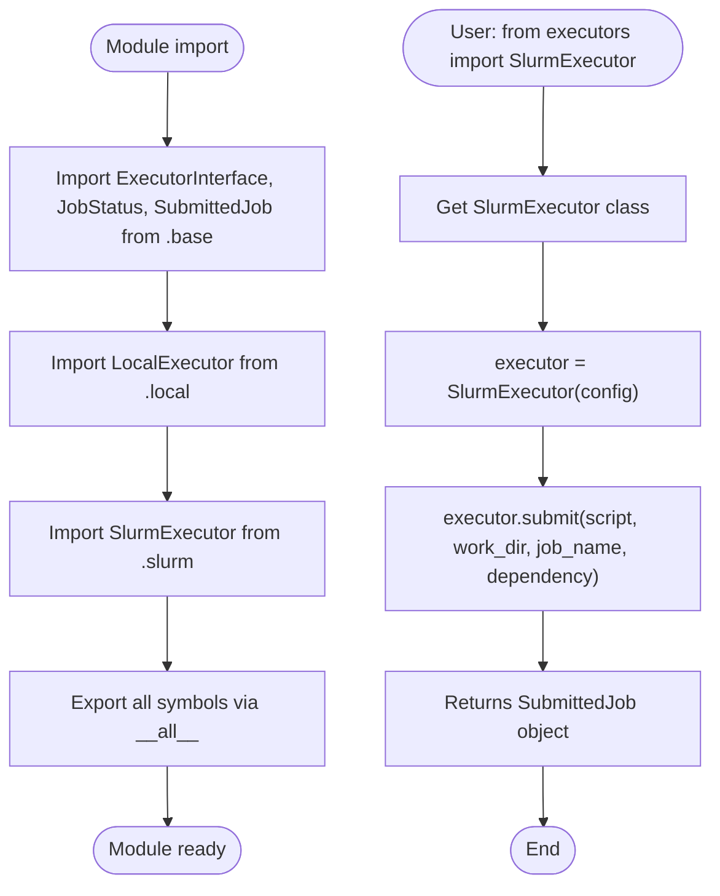

**Notes / Observations:**
- **Minimal init file:** This is a standard Python package `__init__.py` that simply re-exports symbols from submodules. No logic or side effects.
- **Abstraction layer:** The `ExecutorInterface` provides a clean abstraction for job submission. This makes it easy to add new executors (e.g., for other cluster systems like PBS, LSF, or cloud-based execution).
- **Dependency:** The actual implementation details are in `base.py`, `local.py`, and `slurm.py`. This file only serves as a namespace aggregator.
- **Design pattern:** This follows the Strategy pattern, where different executors implement the same interface but with different behaviors (local subprocess vs SLURM sbatch).

---

### `src/structure_pipeline/executors/base.py`

**Role:** Base abstractions for job execution  
**Size:** 127 lines  
**Key Imports:**
- `abc` — Abstract base class utilities (ABC, abstractmethod)
- `dataclasses` — dataclass, field
- `enum` — Enum
- `pathlib` — Path
- `typing` — Any

**Purpose:** Defines the core abstractions for the executor layer: job status enumeration, job metadata dataclass, and the executor interface that all concrete executors must implement.

---

#### **Classes and Enums:**

---

##### **`JobStatus(str, Enum)`**  
**Purpose:** Enumeration of possible job states.  

**Values:**
- `PENDING = "pending"` — Job submitted but not yet running
- `RUNNING = "running"` — Job is currently executing
- `COMPLETED = "completed"` — Job finished successfully
- `FAILED = "failed"` — Job terminated with error
- `CANCELLED = "cancelled"` — Job was cancelled by user
- `UNKNOWN = "unknown"` — Status cannot be determined

**Usage:** Used throughout the pipeline to track job state (e.g., in `SubmittedJob.status`, returned by `get_status()`).

---

##### **`SubmittedJob` (dataclass)**  
**Purpose:** Represents a submitted job with metadata and status tracking.  

**Fields:**
- `job_id: str` — Unique identifier (SLURM job ID or local process ID)
- `job_name: str` — Human-readable name for the job
- `work_dir: Path` — Working directory where job executes
- `script_path: Path` — Path to the script file that was submitted
- `submitted_at: datetime` — Timestamp of submission (auto-generated via `field(default_factory=datetime.now)`)
- `status: JobStatus` — Current job status (default: `JobStatus.PENDING`)
- `exit_code: int | None` — Exit code from the process (None if still running or unknown)
- `error_message: str` — Error message if job failed (default: empty string)
- `metadata: dict[str, Any]` — Additional arbitrary metadata (default: empty dict)

**Properties:**
1. **`done_marker: Path`**
   - **Returns:** Path to `work_dir / "DONE.ok"` marker file
   - **Purpose:** Provides standardized path to success marker file

2. **`is_done: bool`**
   - **Returns:** True if `DONE.ok` marker file exists
   - **Purpose:** Quick check for job completion (used for resume logic)
   - **Side Effects:** Filesystem call to check file existence

**Usage:** 
- Returned by `executor.submit()` to represent a submitted job
- Passed to `executor.get_status()` and `executor.cancel()` to interact with the job
- Used by `StatusTracker` for resume logic (checking `is_done` property)

---

##### **`ExecutorInterface(ABC)`**  
**Purpose:** Abstract base class defining the interface all job executors must implement.  

**Abstract Methods:**

1. **`submit(script_content: str, work_dir: Path, job_name: str, dependency: str | None = None) -> SubmittedJob`**
   - **Purpose:** Submit a job for execution.
   - **Input:**
     - `script_content`: Full script content to execute (bash script with or without SBATCH directives)
     - `work_dir`: Working directory for the job
     - `job_name`: Name for the job (used in logs, job tracking)
     - `dependency`: Optional dependency string (e.g., `"afterok:12345"` for SLURM)
   - **Output:** `SubmittedJob` object with job details
   - **Implementation Note:** Concrete executors must write the script to disk, execute it, and return a `SubmittedJob` object.

2. **`get_status(job: SubmittedJob) -> JobStatus`**
   - **Purpose:** Get current status of a submitted job.
   - **Input:** Previously submitted job
   - **Output:** Current job status
   - **Implementation Note:** Concrete executors must query the underlying execution system (e.g., `sacct` for SLURM, `process.poll()` for local)

3. **`cancel(job: SubmittedJob) -> bool`**
   - **Purpose:** Cancel a running job.
   - **Input:** Job to cancel
   - **Output:** True if cancellation was successful
   - **Implementation Note:** Concrete executors must send cancellation signal to the job (e.g., `scancel` for SLURM, `process.terminate()` for local)

**Concrete Methods:**

4. **`wait(job: SubmittedJob, timeout: float | None = None, poll_interval: float = 5.0) -> JobStatus`**
   - **Purpose:** Block until job completes or timeout expires.
   - **Input:**
     - `job`: Job to wait for
     - `timeout`: Maximum time to wait in seconds (None = infinite)
     - `poll_interval`: Seconds between status checks (default: 5.0)
   - **Output:** Final job status (COMPLETED, FAILED, CANCELLED, or UNKNOWN on timeout)
   - **Side Effects:** Blocks execution, makes repeated calls to `get_status()`
   - **Implementation:** 
     - Loops indefinitely (or until timeout)
     - Calls `get_status()` to check job status
     - Returns when job reaches terminal state (COMPLETED, FAILED, CANCELLED)
     - Sleeps for `poll_interval` seconds between checks
   - **Dependencies:** `time.sleep()`, `self.get_status()`
   - **Note:** This is a concrete method with default implementation that can be overridden if needed.

---

**Architecture Notes:**
- **Design Pattern:** Strategy pattern — `ExecutorInterface` defines the contract, concrete executors provide different implementations (local subprocess, SLURM sbatch, potentially others).
- **Extension Point:** To add support for a new execution backend (e.g., PBS, LSF, Kubernetes), create a new class inheriting from `ExecutorInterface` and implement the three abstract methods.
- **Marker File Convention:** The `SubmittedJob.is_done` property relies on a `DONE.ok` file being created by job scripts upon successful completion. This is a convention enforced by the pipeline (not by the executor itself).

---

**Mermaid Flowchart: base.py**

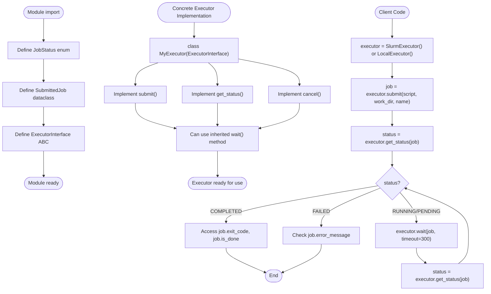

---

**TODO / Uncertainties:**
- **None identified.** The interface is clean and well-defined. All method signatures are clear with documented expected behavior.

---

### `src/structure_pipeline/executors/local.py`

**Role:** Local subprocess executor implementation  
**Size:** 136 lines  
**Key Imports:**
- `os` — Environment variable access
- `subprocess` — Process spawning (Popen)
- `pathlib` — Path
- `.base` — ExecutorInterface, JobStatus, SubmittedJob

**Purpose:** Provides a concrete implementation of `ExecutorInterface` that runs jobs as local subprocesses instead of submitting them to a cluster scheduler. Useful for testing, debugging, and running on systems without SLURM.

---

#### **Class:**

---

##### **`LocalExecutor(ExecutorInterface)`**  
**Purpose:** Execute jobs locally as bash subprocesses.

**Constructor:**
```python
def __init__(self, dry_run: bool = False)
```
- **Input:**
  - `dry_run: bool` — If True, don't actually run jobs (just write scripts and return mock SubmittedJob objects)
- **Side Effects:** Initializes internal state:
  - `self.dry_run: bool` — Stores dry_run flag
  - `self._processes: dict[str, subprocess.Popen]` — Maps job_id to active Popen objects
  - `self._job_counter: int = 0` — Counter for generating sequential job IDs

---

**Methods:**

---

1. **`submit(script_content: str, work_dir: Path, job_name: str, dependency: str | None = None) -> SubmittedJob`**
   - **Purpose:** Submit a job for local execution.
   - **Input:**
     - `script_content`: Full script content (bash script; may contain SBATCH directives which will be removed)
     - `work_dir`: Working directory for the job
     - `job_name`: Name for the job
     - `dependency`: **Ignored for local executor** (no dependency support)
   - **Output:** `SubmittedJob` object
   - **Workflow:**
     1. Create `work_dir` if it doesn't exist (`mkdir -p`)
     2. Write script to `work_dir / "{job_name}.sh"`
        - **Filter out SBATCH directives:** Removes all lines starting with `#SBATCH` (since they're SLURM-specific)
     3. Make script executable (`chmod 0o755`)
     4. Generate unique job_id: `f"local_{self._job_counter}"` (increment counter)
     5. Create `SubmittedJob` object with metadata
     6. **If dry_run:** Set `job.status = PENDING`, `job.metadata["dry_run"] = True`, return job
     7. **If not dry_run:**
        - Create log files: `{job_name}_stdout.log` and `{job_name}_stderr.log` in `work_dir`
        - Spawn subprocess: `subprocess.Popen(["bash", script_path], cwd=work_dir, ...)`
        - Set environment variable: `SLURM_JOB_ID = job_id` (for compatibility with scripts expecting SLURM)
        - Store process in `self._processes[job_id]`
        - Set `job.status = RUNNING`
        - Return job
   - **Side Effects:** 
     - Writes script file to disk
     - Spawns subprocess (unless dry_run)
     - Writes stdout/stderr to log files
   - **Dependencies:** `subprocess.Popen`, `pathlib.Path`
   - **Notes:**
     - **Dependency argument is ignored:** Local executor does not support job dependencies. This is a known limitation mentioned in the class docstring.
     - **SBATCH filtering:** This allows the same script to be used for both SLURM and local execution.
     - **SLURM_JOB_ID environment variable:** Set to maintain compatibility with scripts that expect this variable (e.g., for logging).

---

2. **`get_status(job: SubmittedJob) -> JobStatus`**
   - **Purpose:** Get current status of a local job.
   - **Input:** SubmittedJob object
   - **Output:** JobStatus enum value
   - **Workflow:**
     1. **If dry_run job:** Return `JobStatus.PENDING`
     2. **If process not tracked:** 
        - Check if `job.is_done` (DONE.ok marker exists) → return `JobStatus.COMPLETED`
        - Otherwise → return `JobStatus.UNKNOWN`
     3. **If process tracked:** Poll process with `process.poll()`
        - `poll() returns None` → still running → return `JobStatus.RUNNING`
        - `poll() returns exit_code`:
          - Set `job.exit_code = poll_result`
          - If exit_code == 0 → return `JobStatus.COMPLETED`
          - Else → return `JobStatus.FAILED`
   - **Side Effects:** Updates `job.exit_code` when process terminates
   - **Dependencies:** `subprocess.Popen.poll()`, `job.is_done`
   - **Note:** This method can detect completed jobs even if they weren't tracked in `self._processes` (by checking for DONE.ok marker).

---

3. **`cancel(job: SubmittedJob) -> bool`**
   - **Purpose:** Cancel a local job.
   - **Input:** SubmittedJob object
   - **Output:** True if cancellation was successful, False otherwise
   - **Workflow:**
     1. Retrieve process from `self._processes[job.job_id]`
     2. **If process not found:** Return False
     3. **Try to terminate gracefully:**
        - Call `process.terminate()` (sends SIGTERM)
        - Wait up to 5 seconds for termination: `process.wait(timeout=5)`
        - If successful → return True
     4. **If timeout expires:**
        - Call `process.kill()` (sends SIGKILL, forceful)
        - Return True
     5. **If exception occurs:** Return False
   - **Side Effects:** Terminates or kills the subprocess
   - **Dependencies:** `subprocess.Popen.terminate()`, `subprocess.Popen.kill()`, `subprocess.Popen.wait()`
   - **Error Handling:** Catches `subprocess.TimeoutExpired` (expected), and generic `Exception` (unexpected errors)
   - **Note:** Tries graceful termination first (SIGTERM), falls back to forceful kill (SIGKILL).

---

**Limitations:**
- **No dependency support:** The `dependency` argument in `submit()` is ignored. Jobs cannot wait for other jobs to complete.
- **No job history:** If the LocalExecutor object is destroyed, process tracking is lost (though `get_status()` can still detect completion via DONE.ok marker).
- **Single-machine only:** Jobs run on the local machine, no cluster/distributed execution.

**Use Cases:**
- **Testing:** Quick testing of pipeline logic without SLURM
- **Debugging:** Easier to debug locally than on a cluster
- **Single-machine runs:** Running on workstations or servers without SLURM

**Comparison to SlurmExecutor:**
| Feature | LocalExecutor | SlurmExecutor |
|---------|---------------|---------------|
| Job submission | subprocess.Popen | sbatch |
| Job status | process.poll() | sacct |
| Job cancellation | process.terminate/kill | scancel |
| Dependency support | No | Yes (afterok, etc.) |
| Distributed execution | No | Yes (cluster) |
| Resource limits | OS limits | SLURM limits (mem, cpus, time) |

---

**Mermaid Flowchart: local.py**

```mermaid
flowchart TD
    Start([LocalExecutor created]) --> Init["__init__(dry_run=False)"]
    Init --> InitState["self._processes = {}<br/>self._job_counter = 0<br/>self.dry_run = dry_run"]
    InitState --> Ready([Ready for job submission])
    
    Submit([submit() called]) --> CreateDir["Create work_dir"]
    CreateDir --> WriteScript["Write script to {job_name}.sh<br/>(filter out #SBATCH lines)"]
    WriteScript --> MakeExec["chmod 0o755 on script"]
    MakeExec --> GenID["job_id = f'local_{counter}'<br/>counter++"]
    GenID --> CreateJob["Create SubmittedJob object"]
    CreateJob --> CheckDryRun{dry_run?}
    CheckDryRun -->|Yes| SetPending["job.status = PENDING<br/>job.metadata['dry_run'] = True"]
    SetPending --> ReturnJob["Return job"]
    CheckDryRun -->|No| SpawnProcess["subprocess.Popen(['bash', script],<br/>stdout=log, stderr=log,<br/>env with SLURM_JOB_ID)"]
    SpawnProcess --> StoreProcess["self._processes[job_id] = process"]
    StoreProcess --> SetRunning["job.status = RUNNING"]
    SetRunning --> ReturnJob
    
    GetStatus([get_status() called]) --> CheckDryRunStatus{dry_run job?}
    CheckDryRunStatus -->|Yes| ReturnPending["Return PENDING"]
    CheckDryRunStatus -->|No| CheckTracked{process in<br/>_processes?}
    CheckTracked -->|No| CheckDone{DONE.ok<br/>exists?}
    CheckDone -->|Yes| ReturnCompleted["Return COMPLETED"]
    CheckDone -->|No| ReturnUnknown["Return UNKNOWN"]
    CheckTracked -->|Yes| Poll["poll_result = process.poll()"]
    Poll --> CheckPoll{poll_result?}
    CheckPoll -->|None| ReturnRunning["Return RUNNING"]
    CheckPoll -->|0| SetExitCode["job.exit_code = 0"]
    SetExitCode --> ReturnCompleted
    CheckPoll -->|non-zero| SetExitCodeFail["job.exit_code = poll_result"]
    SetExitCodeFail --> ReturnFailed["Return FAILED"]
    
    Cancel([cancel() called]) --> GetProcess["process = _processes.get(job_id)"]
    GetProcess --> CheckProcess{process<br/>found?}
    CheckProcess -->|No| ReturnFalse["Return False"]
    CheckProcess -->|Yes| TryTerminate["process.terminate()<br/>wait(timeout=5)"]
    TryTerminate --> CheckTimeout{timeout?}
    CheckTimeout -->|No| ReturnTrue["Return True"]
    CheckTimeout -->|Yes| Kill["process.kill()"]
    Kill --> ReturnTrue
    TryTerminate --> CheckException{exception?}
    CheckException -->|Yes| ReturnFalse
    CheckException -->|No| ReturnTrue
```

---

**TODO / Uncertainties:**
- **None identified.** The implementation is straightforward and well-contained. The limitations (no dependencies) are clearly documented in the class docstring.

---

### `src/structure_pipeline/executors/slurm.py`

**Role:** SLURM cluster executor implementation  
**Size:** 203 lines  
**Key Imports:**
- `re` — Regular expressions (for parsing sbatch output)
- `subprocess` — Command execution (sbatch, squeue, sacct, scancel)
- `pathlib` — Path
- `.base` — ExecutorInterface, JobStatus, SubmittedJob

**Purpose:** Provides a concrete implementation of `ExecutorInterface` that submits jobs to a SLURM HPC cluster via `sbatch`. Supports job dependencies for multi-stage workflows (e.g., AF3's two-stage MSA → inference pipeline). Uses `squeue` and `sacct` for status checking, and `scancel` for job cancellation.

---

#### **Class:**

---

##### **`SlurmExecutor(ExecutorInterface)`**  
**Purpose:** Execute jobs via SLURM cluster scheduler with dependency support.

**Constructor:**
```python
def __init__(self, dry_run: bool = False)
```
- **Input:**
  - `dry_run: bool` — If True, don't actually submit jobs (write scripts only, return mock SubmittedJob objects)
- **Side Effects:** Stores dry_run flag as `self.dry_run`

---

**Methods:**

---

1. **`submit(script_content: str, work_dir: Path, job_name: str, dependency: str | None = None) -> SubmittedJob`**
   - **Purpose:** Submit a job to SLURM via sbatch.
   - **Input:**
     - `script_content`: Full SLURM script content (including `#SBATCH` directives)
     - `work_dir`: Working directory for the job
     - `job_name`: Name for the job (used in script filename and job tracking)
     - `dependency`: Optional SLURM dependency string (e.g., `"afterok:12345"` or `"afterok:12345:67890"`)
   - **Output:** `SubmittedJob` object with SLURM job ID
   - **Workflow:**
     1. Create `work_dir` if it doesn't exist (`mkdir -p`)
     2. Write script to `work_dir / "{job_name}.sh"`
     3. Make script executable (`chmod 0o755`)
     4. Create `SubmittedJob` object (with empty job_id initially)
     5. **If dry_run:** Set `job_id = f"dry_run_{job_name}"`, `status = PENDING`, `metadata["dry_run"] = True`, return job
     6. **If not dry_run:**
        - Build sbatch command: `["sbatch"]`
        - Add dependency if provided: `["--dependency", dependency]`
        - Add script path
        - Run `subprocess.run(cmd, cwd=work_dir, capture_output=True, text=True, check=True)`
        - Parse job ID from stdout using regex: `r"Submitted batch job (\d+)"`
        - If match found: Set `job.job_id` and `job.status = PENDING`
        - If parsing fails: Set `job.status = FAILED` and `job.error_message`
     7. **On subprocess.CalledProcessError:** Set `job.status = FAILED` and `job.error_message = f"sbatch failed: {e.stderr}"`
     8. Return job
   - **Side Effects:** 
     - Writes script file to disk
     - Submits job to SLURM (unless dry_run)
   - **Dependencies:** `subprocess.run`, `re.search`
   - **Error Handling:** Catches `CalledProcessError` and sets job status to FAILED with error message
   - **Notes:**
     - Unlike `LocalExecutor`, this executor does NOT filter out `#SBATCH` directives (they're required for SLURM)
     - Dependency syntax follows SLURM conventions: `afterok:jobid1:jobid2` (run after jobid1 and jobid2 complete successfully)

---

2. **`get_status(job: SubmittedJob) -> JobStatus`**
   - **Purpose:** Get current status of a SLURM job.
   - **Input:** SubmittedJob object
   - **Output:** JobStatus enum value
   - **Workflow:**
     1. **If dry_run job:** Return `JobStatus.PENDING`
     2. **Check for DONE.ok marker:** If `job.is_done` → return `JobStatus.COMPLETED` (fast path, avoids SLURM commands)
     3. **Try squeue (for running/pending jobs):**
        - Run `squeue -j {job_id} -h -o "%T"` (query job state without header)
        - If job found in queue (returncode == 0 and stdout not empty):
          - Parse state string and map to `JobStatus`:
            - `PENDING` → `JobStatus.PENDING`
            - `RUNNING`, `COMPLETING` → `JobStatus.RUNNING`
            - `COMPLETED` → `JobStatus.COMPLETED`
            - `FAILED`, `TIMEOUT`, `NODE_FAIL` → `JobStatus.FAILED`
            - `CANCELLED` → `JobStatus.CANCELLED`
            - Unknown states → `JobStatus.UNKNOWN`
          - Return mapped status
        - If job not in queue or command fails: continue to sacct
     4. **Try sacct (for historical/completed jobs):**
        - Run `sacct -j {job_id} -n -o State -X` (query job state without header, no sub-jobs)
        - If job found in accounting (returncode == 0 and stdout not empty):
          - Parse state string (first word, uppercased)
          - If contains `COMPLETED` → return `JobStatus.COMPLETED`
          - If contains `FAILED` or `TIMEOUT` → return `JobStatus.FAILED`
          - If contains `CANCELLED` → return `JobStatus.CANCELLED`
        - If command fails or job not found: continue
     5. **Fallback:** Return `JobStatus.UNKNOWN`
   - **Side Effects:** None (read-only queries to SLURM)
   - **Dependencies:** `subprocess.run`, `squeue`, `sacct`, `job.is_done`
   - **Error Handling:** Catches all exceptions from subprocess calls (silent fallthrough to next method)
   - **Notes:**
     - **Two-tier strategy:** Try `squeue` first (fast, for active jobs), then `sacct` (slower, for completed jobs)
     - **DONE.ok optimization:** Checking the marker file first avoids expensive SLURM queries for known-completed jobs
     - **State parsing:** Uses string matching (e.g., `"COMPLETED" in state`) which is more robust than exact equality
     - **Uncertainty:** The state mapping may not cover all possible SLURM states (e.g., `PREEMPTED`, `SUSPENDED`, `REQUEUED`). These will map to `JobStatus.UNKNOWN`.

---

3. **`cancel(job: SubmittedJob) -> bool`**
   - **Purpose:** Cancel a SLURM job.
   - **Input:** SubmittedJob object
   - **Output:** True if cancellation was successful, False otherwise
   - **Workflow:**
     1. **If dry_run job:** Return True (no-op)
     2. Run `scancel {job_id}`
     3. If successful (no exception) → return True
     4. If exception occurs → return False
   - **Side Effects:** Cancels the SLURM job (sends cancellation signal)
   - **Dependencies:** `subprocess.run`, `scancel`
   - **Error Handling:** Catches all exceptions and returns False
   - **Notes:**
     - Does not check if job is actually running/pending before cancellation (SLURM handles this gracefully)
     - No distinction between "job doesn't exist" and "cancellation failed" errors

---

4. **`submit_with_dependency_chain(scripts: list[tuple[str, Path, str]]) -> list[SubmittedJob]`**
   - **Purpose:** Submit multiple jobs with sequential dependencies (each job waits for the previous one).
   - **Input:** List of `(script_content, work_dir, job_name)` tuples
   - **Output:** List of `SubmittedJob` objects in submission order
   - **Workflow:**
     1. Initialize empty `jobs` list and `prev_job_id = None`
     2. For each script tuple:
        - If `prev_job_id` exists: set `dependency = f"afterok:{prev_job_id}"`
        - Else: `dependency = None` (first job has no dependency)
        - Call `self.submit(script_content, work_dir, job_name, dependency)`
        - Append returned job to `jobs` list
        - Update `prev_job_id = job.job_id` for next iteration
     3. Return `jobs` list
   - **Side Effects:** Submits jobs to SLURM with sequential dependencies
   - **Dependencies:** `self.submit()`
   - **Use Case:** Used for pipelines where job B must wait for job A to complete successfully
   - **Example:** AF3 workflow could use this for multiple preprocessing steps before inference
   - **Note:** This method is NOT currently used in `cli.py` (which implements AF3 dependencies differently). It may be intended for future use or alternative workflows.

---

**Comparison to LocalExecutor:**

| Feature | SlurmExecutor | LocalExecutor |
|---------|---------------|---------------|
| Job submission | sbatch (SLURM) | subprocess.Popen (local bash) |
| Job status | squeue + sacct (cluster queries) | process.poll() (local process check) |
| Job cancellation | scancel (SLURM) | process.terminate/kill (OS signals) |
| Dependency support | **Yes** (afterok, afterany, etc.) | **No** |
| Distributed execution | **Yes** (cluster nodes) | **No** (single machine) |
| Resource limits | **SLURM limits** (mem, cpus, time, partition) | **OS limits** (ulimit, system resources) |
| Job persistence | **Yes** (jobs survive executor object destruction) | **No** (tracked in-memory only) |
| Script filtering | **Keeps #SBATCH directives** | **Removes #SBATCH directives** |

---

**Mermaid Flowchart: slurm.py**

```mermaid
flowchart TD
    Start([SlurmExecutor created]) --> Init["__init__(dry_run=False)"]
    Init --> InitState["self.dry_run = dry_run"]
    InitState --> Ready([Ready for job submission])
    
    Submit([submit() called]) --> CreateDir["Create work_dir"]
    CreateDir --> WriteScript["Write script to {job_name}.sh<br/>(keep #SBATCH directives)"]
    WriteScript --> MakeExec["chmod 0o755 on script"]
    MakeExec --> CreateJob["Create SubmittedJob object<br/>(job_id initially empty)"]
    CreateJob --> CheckDryRun{dry_run?}
    CheckDryRun -->|Yes| SetDryRun["job_id = f'dry_run_{job_name}'<br/>status = PENDING<br/>metadata['dry_run'] = True"]
    SetDryRun --> ReturnJob["Return job"]
    CheckDryRun -->|No| BuildCmd["cmd = ['sbatch']"]
    BuildCmd --> AddDep{dependency?}
    AddDep -->|Yes| AddDepFlag["cmd += ['--dependency', dependency]"]
    AddDep -->|No| AddScript["cmd.append(script_path)"]
    AddDepFlag --> AddScript
    AddScript --> RunSbatch["subprocess.run(cmd, capture_output=True, check=True)"]
    RunSbatch --> CheckSuccess{success?}
    CheckSuccess -->|Yes| ParseJobID["regex: 'Submitted batch job (\\d+)'"]
    ParseJobID --> CheckMatch{match?}
    CheckMatch -->|Yes| SetJobID["job.job_id = match.group(1)<br/>job.status = PENDING"]
    CheckMatch -->|No| SetParseFail["job.status = FAILED<br/>job.error_message = 'Could not parse job ID'"]
    CheckSuccess -->|No (CalledProcessError)| SetSubmitFail["job.status = FAILED<br/>job.error_message = f'sbatch failed: {stderr}'"]
    SetJobID --> ReturnJob
    SetParseFail --> ReturnJob
    SetSubmitFail --> ReturnJob
    
    GetStatus([get_status() called]) --> CheckDryRunStatus{dry_run job?}
    CheckDryRunStatus -->|Yes| ReturnPending["Return PENDING"]
    CheckDryRunStatus -->|No| CheckDone{DONE.ok<br/>exists?}
    CheckDone -->|Yes| ReturnCompleted["Return COMPLETED"]
    CheckDone -->|No| TrySqueue["Run: squeue -j {job_id} -h -o '%T'"]
    TrySqueue --> CheckSqueue{job in queue?}
    CheckSqueue -->|Yes| MapState["Map SLURM state to JobStatus:<br/>PENDING → PENDING<br/>RUNNING/COMPLETING → RUNNING<br/>COMPLETED → COMPLETED<br/>FAILED/TIMEOUT/NODE_FAIL → FAILED<br/>CANCELLED → CANCELLED"]
    MapState --> ReturnMapped["Return mapped status"]
    CheckSqueue -->|No or error| TrySacct["Run: sacct -j {job_id} -n -o State -X"]
    TrySacct --> CheckSacct{job in sacct?}
    CheckSacct -->|Yes| ParseSacct["Parse state (first word, uppercase)"]
    ParseSacct --> CheckSacctState{state contains?}
    CheckSacctState -->|COMPLETED| ReturnCompleted
    CheckSacctState -->|FAILED or TIMEOUT| ReturnFailed["Return FAILED"]
    CheckSacctState -->|CANCELLED| ReturnCancelled["Return CANCELLED"]
    CheckSacctState -->|other| ReturnUnknown["Return UNKNOWN"]
    CheckSacct -->|No or error| ReturnUnknown
    
    Cancel([cancel() called]) --> CheckDryRunCancel{dry_run job?}
    CheckDryRunCancel -->|Yes| ReturnTrue["Return True"]
    CheckDryRunCancel -->|No| RunScancel["Run: scancel {job_id}"]
    RunScancel --> CheckCancelSuccess{success?}
    CheckCancelSuccess -->|Yes| ReturnTrue
    CheckCancelSuccess -->|No (exception)| ReturnFalse["Return False"]
    
    Chain([submit_with_dependency_chain() called]) --> InitChain["jobs = []<br/>prev_job_id = None"]
    InitChain --> LoopScripts["For each (script, work_dir, job_name) in scripts"]
    LoopScripts --> CheckPrev{prev_job_id?}
    CheckPrev -->|Yes| SetDep["dependency = f'afterok:{prev_job_id}'"]
    CheckPrev -->|No| NoDep["dependency = None"]
    SetDep --> SubmitJob["job = self.submit(script, dir, name, dependency)"]
    NoDep --> SubmitJob
    SubmitJob --> AppendJob["jobs.append(job)"]
    AppendJob --> UpdatePrev["prev_job_id = job.job_id"]
    UpdatePrev --> MoreScripts{more scripts?}
    MoreScripts -->|Yes| LoopScripts
    MoreScripts -->|No| ReturnJobs["return jobs"]
```

---

**Notes / Observations:**
- **Strength:** Full SLURM integration with dependency support, enabling complex multi-stage workflows (like AF3's MSA → inference pipeline).
- **Status checking optimization:** Checks `DONE.ok` marker before querying SLURM, avoiding expensive cluster queries for known-completed jobs.
- **Two-tier status query:** Uses `squeue` (fast, for active jobs) and `sacct` (slower, for completed jobs). This is necessary because jobs disappear from `squeue` shortly after completion.
- **Limitations:**
  - State mapping may not cover all SLURM states (e.g., `PREEMPTED`, `SUSPENDED`, `REQUEUED`). These will be mapped to `UNKNOWN`.
  - Error messages from `sbatch` failures are captured but not parsed in detail.
  - No timeout handling for subprocess calls (could hang if SLURM commands are slow)
- **Unused method:** `submit_with_dependency_chain()` is implemented but not used in the current pipeline. The `cli.py` run command implements AF3 dependencies differently (using `afterok:job1:job2:...` syntax directly in `submit()` calls).

---

**TODO / Uncertainties:**
- **State coverage:** The state mapping in `get_status()` may not handle all possible SLURM job states. States like `PREEMPTED`, `SUSPENDED`, `REQUEUED`, `RESV_DEL_HOLD` are not explicitly mapped and will return `UNKNOWN`.
- **Error handling:** The `get_status()` method silently catches all exceptions from `squeue` and `sacct`. This could hide genuine errors (e.g., SLURM commands not in PATH, permission issues).
- **Race condition:** There's a small window where a job could complete between the `squeue` and `sacct` checks, potentially returning `UNKNOWN` even though the job is findable in accounting. The `DONE.ok` check mitigates this for jobs that successfully write the marker.

---

### `src/structure_pipeline/manifest/__init__.py`

**Role:** Package initialization for manifest generation modules  
**Size:** 14 lines  
**Key Imports:**
- `.proteins` — `parse_fasta`, `ProteinRecord`
- `.ligands` — `scan_ligands`, `LigandRecord`
- `.msa` — `match_msa`, `MSARecord`

**Purpose:** Provides a clean namespace for manifest generation functions. Re-exports the core functions and dataclasses from submodules for parsing proteins (FASTA), scanning ligands (CIF files), and matching MSA files.

---

**Exported Symbols:**

1. **`parse_fasta`** (function from `.proteins`)
   - Parses protein sequences from FASTA file
   - Returns list of `ProteinRecord` objects

2. **`ProteinRecord`** (dataclass from `.proteins`)
   - Represents a protein with fields: `protein_id`, `sequence`, `description`, etc.

3. **`scan_ligands`** (function from `.ligands`)
   - Scans ligand directory for CIF files
   - Returns list of `LigandRecord` objects

4. **`LigandRecord`** (dataclass from `.ligands`)
   - Represents a ligand with fields: `ligand_id`, `ccd_code`, `cif_path`, etc.

5. **`match_msa`** (function from `.msa`)
   - Matches MSA files (a3m format) to proteins
   - Returns list of `MSARecord` objects

6. **`MSARecord`** (dataclass from `.msa`)
   - Represents an MSA with fields: `protein_id`, `msa_path`, `source`, etc.

**Structure:**
```python
__all__ = [
    "parse_fasta",      # Protein parsing
    "ProteinRecord",    # Protein data model
    "scan_ligands",     # Ligand scanning
    "LigandRecord",     # Ligand data model
    "match_msa",        # MSA matching
    "MSARecord",        # MSA data model
]
```

**Usage in Pipeline:**
- `cli.py` imports these functions to generate manifest files in the `manifest` command:
  ```python
  from .manifest import parse_fasta, scan_ligands, match_msa
  ```
- Each function reads input files/directories and returns structured data (lists of dataclass records)
- The records are then written to CSV manifest files (`proteins.csv`, `ligands.csv`, `msa.csv`)

**Mermaid Flowchart: manifest/__init__.py**

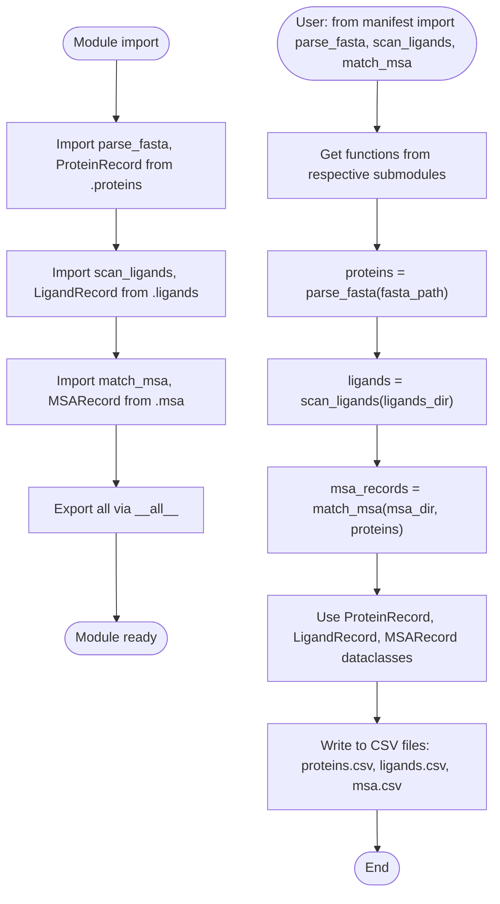

**Notes / Observations:**
- **Minimal init file:** This is a standard Python package `__init__.py` that simply re-exports symbols from submodules. No logic or side effects.
- **Abstraction layer:** Provides a unified interface for manifest generation, hiding the internal structure of the `manifest` package.
- **Dependency:** The actual implementation details are in `proteins.py`, `ligands.py`, and `msa.py`. This file only serves as a namespace aggregator.
- **Design pattern:** This follows a common Python packaging pattern where `__init__.py` serves as the public API surface, allowing users to import from the package directly rather than from submodules.
- **Next files to document:** The submodules `proteins.py`, `ligands.py`, and `msa.py` will need to be documented in future iterations to understand the actual manifest generation logic.

---

**TODO / Uncertainties:**
- **None identified.** This is a straightforward package initialization file with clear re-exports.

---

### `src/structure_pipeline/manifest/ligands.py`

**Role:** Ligand scanning and manifest generation  
**Size:** 240 lines  
**Key Imports:**
- `csv` — CSV reading/writing
- `hashlib` — SHA256 hashing for file integrity
- `re` — Regular expressions for parsing CCD codes from CIF files
- `dataclasses` — dataclass, asdict
- `pathlib` — Path
- `logging` — Logger for warnings

**Purpose:** Scans directories for ligand CIF (Chemical Component Dictionary) files, extracts CCD codes, computes file hashes, and generates manifest CSV files. Also supports loading ligands from plain-text CCD code lists (without CIF files).

---

#### **Dataclass:**

---

##### **`LigandRecord` (dataclass)**  
**Purpose:** Represents a single ligand with metadata.

**Fields:**
- `ligand_id: str` — Sequential identifier generated during scanning (L001, L002, L003, ...)
- `category: str` — Subdirectory name (e.g., "amylose", "cellulose", "chitin", "uncategorized", "ccd_list")
- `ccd_code: str` — CCD code extracted from CIF file or filename (e.g., "NAG6", "CEL6", "STA6")
- `filename: str` — Original CIF filename (empty for CCD-list mode)
- `cif_path: str` — Absolute path to CIF file (empty for CCD-list mode)
- `cif_sha256: str` — SHA256 hash of CIF file contents (empty for CCD-list mode)

**Methods:**
1. **`to_dict() -> dict`**
   - **Purpose:** Convert record to dictionary for CSV export
   - **Output:** Dictionary with field names as keys
   - **Dependencies:** `asdict()` from dataclasses module

---

#### **Functions:**

---

1. **`_extract_ccd_code(cif_path: Path) -> str`** (Private helper)
   - **Purpose:** Extract CCD code from CIF file content or filename.
   - **Input:** Path to CIF file
   - **Output:** CCD code string (uppercase)
   - **Strategy:**
     1. Try to parse `_chem_comp.id` field from CIF file content (first 4KB)
        - Regex: `r"_chem_comp\.id\s+(\S+)"`
        - Strips quotes if present
     2. If not found, try `data_XXX` line (CIF data block identifier)
        - Regex: `r"^data_(\S+)"` (multiline)
     3. If both fail, use filename stem (without extension) as fallback
     4. Return uppercase version
   - **Side Effects:** Reads up to 4KB from file
   - **Error Handling:** Catches all exceptions during file reading, falls back to filename
   - **Dependencies:** `re.search`, `open()`
   - **Notes:**
     - Reading only first 4KB is an optimization (CCD codes appear early in CIF files)
     - Uppercase conversion ensures consistency

---

2. **`_compute_file_hash(file_path: Path) -> str`** (Private helper)
   - **Purpose:** Compute SHA256 hash of file contents for integrity checking.
   - **Input:** Path to file
   - **Output:** Hexadecimal hash string (64 characters)
   - **Workflow:**
     1. Create SHA256 hasher object
     2. Read file in 8KB chunks
     3. Update hash with each chunk
     4. Return hexdigest
   - **Side Effects:** Reads entire file
   - **Dependencies:** `hashlib.sha256`, `open()`
   - **Use Case:** Detect if CIF files have changed between runs (to trigger re-processing)
   - **Performance:** Chunked reading prevents memory issues with large files

---

3. **`scan_ligands(ligands_dir: Path) -> Iterator[LigandRecord]`**
   - **Purpose:** Scan ligands directory for CIF files and generate ligand records.
   - **Input:** Path to ligands directory
   - **Output:** Iterator yielding `LigandRecord` objects
   - **Directory Structure Support:**
     1. `ligands/{category}/*.cif` — CIF files directly in category subdirectories
     2. `ligands/{category}/cif/*.cif` — CIF files in `cif` subdirectory (common pattern)
     3. `ligands/*.cif` — CIF files directly in ligands root (categorized as "uncategorized")
   - **Workflow:**
     1. Check if `ligands_dir` exists (raise `FileNotFoundError` if not)
     2. Collect all CIF files with their categories:
        - Iterate through subdirectories (skip hidden dirs and `boltz_ccd_lib`)
        - For each category dir: collect `*.cif` files directly + from `cif/` subdirectory
        - Also collect `*.cif` files directly in `ligands_dir` (categorized as "uncategorized")
        - Store tuples: `(category, cif_path)`
     3. Generate sequential IDs (L001, L002, ...) and yield records:
        - For each `(category, cif_path)`: extract CCD code, compute hash, create `LigandRecord`, yield
   - **Side Effects:** 
     - Reads CIF files to extract CCD codes
     - Reads entire file to compute hashes
   - **Dependencies:** `_extract_ccd_code()`, `_compute_file_hash()`, `Path.iterdir()`, `Path.glob()`
   - **Error Handling:** Raises `FileNotFoundError` if ligands_dir doesn't exist
   - **Notes:**
     - Returns iterator (not list) for memory efficiency with large numbers of ligands
     - Uses absolute paths (`resolve()`) for portability
     - Sorts files for deterministic ordering
     - Sequential ID assignment means order matters (controlled by sorting)

---

4. **`write_ligands_manifest(ligands: list[LigandRecord], output_path: Path) -> None`**
   - **Purpose:** Write ligands manifest to CSV file.
   - **Input:**
     - `ligands`: List of LigandRecord objects
     - `output_path`: Path to output CSV file
   - **Output:** None (side effect: creates CSV file)
   - **Workflow:**
     1. Check if ligands list is empty (raise `ValueError` if so)
     2. Extract field names from first record's `to_dict()` keys
     3. Open CSV file for writing
     4. Write header row
     5. Write each ligand record as a row
   - **Side Effects:** Creates or overwrites CSV file
   - **Dependencies:** `csv.DictWriter`, `LigandRecord.to_dict()`
   - **Error Handling:** Raises `ValueError` if no ligands provided
   - **CSV Format:** Standard CSV with headers matching `LigandRecord` field names

---

5. **`load_ligands_manifest(manifest_path: Path) -> list[LigandRecord]`**
   - **Purpose:** Load ligands from manifest CSV file.
   - **Input:** Path to manifest CSV file
   - **Output:** List of `LigandRecord` objects
   - **Workflow:**
     1. Open CSV file for reading
     2. Read header row (automatically handled by `DictReader`)
     3. For each row: create `LigandRecord` from row dictionary
     4. Return list of all records
   - **Side Effects:** Reads CSV file
   - **Dependencies:** `csv.DictReader`, `LigandRecord` constructor
   - **Error Handling:** No explicit error handling (will raise exceptions on file not found or invalid CSV)
   - **Notes:**
     - Assumes CSV format matches `LigandRecord` fields
     - All fields are read as strings (no type conversion needed, all fields are str in dataclass)

---

6. **`load_ccd_list(ccd_list_path: Path) -> list[LigandRecord]`**
   - **Purpose:** Load ligands from a plain-text CCD code list (without CIF files).
   - **Input:** Path to `.txt` file with one CCD code per line
   - **Output:** List of `LigandRecord` objects
   - **Workflow:**
     1. Check if file exists (raise `FileNotFoundError` if not)
     2. Read file line by line:
        - Strip whitespace
        - Skip empty lines and comments (lines starting with `#`)
        - Collect non-empty lines as CCD codes
     3. Check if any codes were found (raise `ValueError` if not)
     4. Deduplicate codes (using `set` to track seen codes; log warning for duplicates)
     5. For each unique code: create `LigandRecord` with:
        - Sequential ligand_id (L001, L002, ...)
        - `category = "ccd_list"`
        - `ccd_code = code`
        - Empty strings for `filename`, `cif_path`, `cif_sha256` (no CIF file)
     6. Log info message with count of loaded codes
     7. Return list of records
   - **Side Effects:** Reads text file, logs warnings and info messages
   - **Dependencies:** `logger.warning()`, `logger.info()`, `open()`
   - **Error Handling:**
     - `FileNotFoundError` if file doesn't exist
     - `ValueError` if no valid CCD codes found
   - **Use Case:** When ligands are standard CCD components (available in PDB Chemical Component Dictionary), no need to provide CIF files — runners will fetch from standard databases
   - **Notes:**
     - Duplicates are detected and skipped (with warning logged)
     - Empty `cif_path` signals to runners that they should use standard CCD lookup

---

**Mermaid Flowchart: ligands.py**

```mermaid
flowchart TD
    Start([Module import]) --> DefineDataclass["Define LigandRecord dataclass"]
    DefineDataclass --> DefineHelpers["Define _extract_ccd_code(),<br/>_compute_file_hash()"]
    DefineHelpers --> DefineFuncs["Define scan_ligands(),<br/>write/load manifest,<br/>load_ccd_list()"]
    DefineFuncs --> End([Module ready])
    
    ScanUsage([scan_ligands() called]) --> CheckDir{ligands_dir<br/>exists?}
    CheckDir -->|No| RaiseNotFound["Raise FileNotFoundError"]
    CheckDir -->|Yes| CollectFiles["Collect CIF files:<br/>1. {category}/*.cif<br/>2. {category}/cif/*.cif<br/>3. ligands/*.cif (uncategorized)<br/>Skip hidden dirs and boltz_ccd_lib"]
    CollectFiles --> SortFiles["Sort files for deterministic order"]
    SortFiles --> GenIDs["Generate sequential IDs (L001, L002, ...)"]
    GenIDs --> LoopFiles["For each (category, cif_path)"]
    LoopFiles --> ExtractCode["_extract_ccd_code(cif_path)<br/>(try _chem_comp.id, data_XXX, or filename)"]
    ExtractCode --> ComputeHash["_compute_file_hash(cif_path)<br/>(SHA256 of full file)"]
    ComputeHash --> YieldRecord["Yield LigandRecord"]
    YieldRecord --> MoreFiles{more files?}
    MoreFiles -->|Yes| LoopFiles
    MoreFiles -->|No| EndScan([End iteration])
    
    WriteUsage([write_ligands_manifest() called]) --> CheckEmpty{ligands list<br/>empty?}
    CheckEmpty -->|Yes| RaiseValueError["Raise ValueError"]
    CheckEmpty -->|No| GetFieldnames["fieldnames = ligands[0].to_dict().keys()"]
    GetFieldnames --> OpenCSV["Open CSV file for writing"]
    OpenCSV --> WriteHeader["Write header row"]
    WriteHeader --> WriteRows["Write each ligand as row"]
    WriteRows --> EndWrite([Close file])
    
    LoadUsage([load_ligands_manifest() called]) --> OpenCSVRead["Open CSV file for reading"]
    OpenCSVRead --> ReadHeader["DictReader reads header automatically"]
    ReadHeader --> ReadRows["For each row: create LigandRecord from dict"]
    ReadRows --> ReturnList["Return list of LigandRecords"]
    
    LoadCCD([load_ccd_list() called]) --> CheckFile{file exists?}
    CheckFile -->|No| RaiseFileNotFound["Raise FileNotFoundError"]
    CheckFile -->|Yes| ReadLines["Read lines, skip empty and comments (#)"]
    ReadLines --> CheckCodes{any codes?}
    CheckCodes -->|No| RaiseValueErrorCCD["Raise ValueError"]
    CheckCodes -->|Yes| Dedupe["Deduplicate codes (set; log warnings)"]
    Dedupe --> GenRecords["For each unique code:<br/>Create LigandRecord with<br/>category='ccd_list',<br/>empty cif_path/filename/hash"]
    GenRecords --> LogInfo["Log info: 'Loaded N CCD codes'"]
    LogInfo --> ReturnCCDList["Return list of LigandRecords"]
```

---

**Use Cases in Pipeline:**
1. **CIF file scanning:** `cli.py` calls `scan_ligands()` when `--ligands-dir` is provided, writes manifest to `ligands.csv`
2. **CCD code list:** `cli.py` calls `load_ccd_list()` when `--ccd-list` is provided, writes manifest to `ligands.csv`
3. **Manifest loading:** Runners load `ligands.csv` to get list of ligands for each structure prediction job

**Architecture Notes:**
- **Two input modes:** CIF files (with full metadata) vs CCD code lists (minimal metadata, rely on standard databases)
- **Separation of concerns:** Scanning logic is separate from I/O logic (scan → list → write)
- **Extensibility:** New ligand sources could be added by implementing new scanning functions that return `LigandRecord` lists

---

**TODO / Uncertainties:**
- **None identified.** The implementation is clear and well-documented. Both CIF-based and CCD-list-based workflows are supported.

---

### `src/structure_pipeline/manifest/msa.py`

**Role:** MSA file matching and manifest generation  
**Size:** 348 lines  
**Key Imports:**
- `csv` — CSV reading/writing
- `gzip` — Gzip file handling
- `os` — Path operations (basename)
- `re` — Regular expressions for ID extraction
- `subprocess` — External command execution (unsquashfs)
- `tempfile` — (imported but not used in visible code)
- `dataclasses` — dataclass, asdict
- `pathlib` — Path
- `logging` — Logger for warnings
- `.proteins` — ProteinRecord (for type hints and matching)

**Purpose:** Matches MSA (Multiple Sequence Alignment) files in a3m format to protein sequences. Supports both regular directories and squashfs images. Extracts UniProt IDs from MSA headers and filenames to match against protein records.

---

#### **Dataclass:**

---

##### **`MSARecord` (dataclass)**  
**Purpose:** Represents a matched MSA file for a specific protein.

**Fields:**
- `protein_id: str` — Protein ID this MSA belongs to (matches `ProteinRecord.protein_id`)
- `msa_path: str` — Full path to a3m file (or filename if inside squashfs)
- `msa_filename: str` — Just the filename (default: empty string)
- `msa_source: str` — Source of MSA (default: "mmseqs"; could be "colabfold", etc.)
- `matched_id: str` — Which UniProt ID was used to match (default: empty string)
- `match_method: str` — How the match was made (default: "header_parse"; could be "filename_in_sqsh", "header_and_filename")
- `sqsh_file: str` — Path to squashfs file if MSA is inside sqsh (default: empty string)
- `num_sequences: int` — Number of sequences in MSA (default: 0; optional metadata)

**Methods:**
1. **`to_dict() -> dict`**
   - **Purpose:** Convert record to dictionary for CSV export
   - **Output:** Dictionary with field names as keys
   - **Dependencies:** `asdict()` from dataclasses module

---

#### **Functions:**

---

1. **`list_squashfs_contents(sqsh_path: Path) -> list[str]`**
   - **Purpose:** List a3m files inside a squashfs image.
   - **Input:** Path to `.sqsh` or `.sqfs` file
   - **Output:** List of filenames ending in `.a3m` or `.a3m.gz` (just filename, not full path)
   - **Workflow:**
     1. Run `unsquashfs -l {sqsh_path}` to list contents
     2. Parse stdout line by line
     3. For each line ending in `.a3m` or `.a3m.gz`:
        - Extract basename (strip squashfs-root/ prefix)
        - Add to list
     4. Return list of filenames
   - **Side Effects:** Spawns subprocess, reads squashfs file
   - **Dependencies:** `subprocess.run`, `unsquashfs` command-line tool
   - **Error Handling:**
     - `FileNotFoundError` → raises `RuntimeError("unsquashfs not found - install squashfs-tools")`
     - Non-zero returncode → raises `RuntimeError(f"unsquashfs failed: {stderr}")`
     - Timeout (60s) → raises `RuntimeError(f"Timeout listing {sqsh_path}")`
   - **Use Case:** When MSAs are stored in compressed squashfs images (common for large MSA databases)
   - **Notes:**
     - Requires `squashfs-tools` to be installed on system
     - Does not actually mount the squashfs (just lists contents)
     - Returned filenames will be used to match against protein IDs

---

2. **`_parse_a3m_header(a3m_path: Path) -> set[str]`** (Private helper)
   - **Purpose:** Extract UniProt IDs from the first line (query sequence) of an a3m file.
   - **Input:** Path to a3m file (may be gzipped)
   - **Output:** Set of potential UniProt IDs found in header
   - **Workflow:**
     1. Open file (gzip.open if `.gz`, else regular open)
     2. Read first line
     3. Check if line starts with `>` (FASTA header)
     4. Extract header content (strip `>`)
     5. Use regex to find UniProt-like IDs: `r"\b([A-Z][A-Z0-9]{5,9})\b"`
        - Pattern: Starts with letter, 6-10 alphanumeric characters total
     6. Return set of matched IDs (uppercase)
   - **Side Effects:** Reads first line of file
   - **Dependencies:** `gzip.open`, `re.findall`
   - **Error Handling:** Catches all exceptions and returns empty set (silent failure)
   - **Notes:**
     - UniProt IDs have specific format: 1 letter + 5-9 alphanumeric (total 6-10 chars)
     - Examples: `A0A223GEC9`, `Q1K4Q1`, `P12345`
     - Regex is case-insensitive but results are uppercased
     - Only reads first line for performance

---

3. **`_extract_ids_from_filename(filename: str) -> set[str]`** (Private helper)
   - **Purpose:** Extract UniProt IDs from filename.
   - **Input:** Filename without path (e.g., `"UniProtIDs_Q1K4Q1_Q873G1_Organism_name.a3m"`)
   - **Output:** Set of potential UniProt IDs
   - **Workflow:**
     1. Strip extensions: `.a3m.gz` or `.a3m`
     2. Split filename by delimiters: `_`, `-`, space, `|`
     3. For each part: check if it matches UniProt ID pattern `^[A-Z][A-Z0-9]{5,9}$`
     4. Exclude common non-ID words: `UNIPROTIDS`, `UNKNOWN`, `STRAIN`
     5. Return set of matched IDs (uppercase)
   - **Side Effects:** None (pure string parsing)
   - **Dependencies:** `re.split`, `re.match`
   - **Examples:**
     - `"UniProtIDs_B6EQJ6_Aliivibrio_salmonicida.a3m"` → `{"B6EQJ6"}`
     - `"Q1K4Q1.a3m"` → `{"Q1K4Q1"}`
     - `"some_prefix_Q1K4Q1_suffix.a3m"` → `{"Q1K4Q1"}`
   - **Notes:**
     - Handles common filename patterns from MSA generation tools (MMseqs2, ColabFold)
     - Splitting by multiple delimiters handles various naming conventions

---

4. **`match_msa(proteins: list[ProteinRecord], msa_dir: Path | None = None, msa_sqsh_files: list[Path] | None = None, strict: bool = False) -> tuple[list[MSARecord], list[str]]`**
   - **Purpose:** Match MSA files to proteins based on UniProt IDs.
   - **Input:**
     - `proteins`: List of ProteinRecord objects to match
     - `msa_dir`: Directory containing a3m files (optional)
     - `msa_sqsh_files`: List of squashfs files containing a3m files (optional)
     - `strict`: If True, raise error on ambiguous matches (multiple MSAs for one protein)
   - **Output:** Tuple of:
     1. List of `MSARecord` objects (matched MSAs)
     2. List of protein IDs without MSA (missing)
   - **Workflow:**
     1. **Build MSA index:** `{uniprot_id: [(path_or_filename, sqsh_file)]}`
        - For each a3m file in `msa_dir`:
          - Extract IDs from header (`_parse_a3m_header()`)
          - Extract IDs from filename (`_extract_ids_from_filename()`)
          - Combine both sets
          - Add to index: for each ID, append `(full_path, None)` tuple
        - For each squashfs file in `msa_sqsh_files`:
          - List contents (`list_squashfs_contents()`)
          - For each filename: extract IDs from filename
          - Add to index: for each ID, append `(filename, sqsh_path)` tuple
     2. **Match proteins to MSAs:**
        - For each protein:
          - Build candidate IDs: `[protein_id] + uniprot_ids_all.split(";")`
          - Search index for any candidate ID
          - If found: collect all matching entries
          - Deduplicate entries (same path may be added multiple times)
          - **If no matches:** Add protein_id to `missing` list
          - **If multiple matches:**
            - If `strict=True`: raise `ValueError`
            - Else: log warning, sort matches deterministically, use first match
          - **If single match:** Create `MSARecord` with appropriate fields
            - If from squashfs: store filename in `msa_path` and sqsh path in `sqsh_file`
            - If regular file: store full path in `msa_path` and empty string in `sqsh_file`
     3. Return `(matched, missing)` tuple
   - **Side Effects:** 
     - Reads MSA files (headers)
     - Spawns subprocess for squashfs listing
     - Logs warnings for ambiguous matches
   - **Dependencies:** 
     - `_parse_a3m_header()`, `_extract_ids_from_filename()`, `list_squashfs_contents()`
     - `Path.glob()`, `logger.warning()`
   - **Error Handling:**
     - Catches `RuntimeError` from `list_squashfs_contents()` (logs warning but continues)
     - Raises `ValueError` if `strict=True` and multiple matches found
   - **Use Cases:**
     - **Regular MSA directory:** Scan for a3m files, match by header + filename IDs
     - **Squashfs images:** List contents, match by filename IDs only (can't read headers without mounting)
     - **Mixed sources:** Can use both regular directory and squashfs files simultaneously
   - **Notes:**
     - **ID matching strategy:** Uses both header parsing and filename parsing for regular files; only filename parsing for squashfs (since mounting is not done here)
     - **Multiple IDs per protein:** `ProteinRecord.uniprot_ids_all` can contain multiple IDs separated by semicolons
     - **Deterministic matching:** Sorts matches before selecting first (ensures consistent behavior)

---

5. **`write_msa_manifest(msa_records: list[MSARecord], output_path: Path) -> None`**
   - **Purpose:** Write MSA manifest to CSV file.
   - **Input:**
     - `msa_records`: List of MSARecord objects
     - `output_path`: Path to output CSV file
   - **Output:** None (side effect: creates CSV file)
   - **Workflow:**
     1. **If empty list:** Write CSV with headers only (using `MSARecord.__dataclass_fields__.keys()`)
     2. **If non-empty:**
        - Extract field names from first record's `to_dict()` keys
        - Open CSV file for writing
        - Write header row
        - Write each record as a row
   - **Side Effects:** Creates or overwrites CSV file
   - **Dependencies:** `csv.DictWriter`, `MSARecord.to_dict()`, `MSARecord.__dataclass_fields__`
   - **Notes:**
     - Handles empty list gracefully (writes headers, unlike `ligands.py` which raises error)
     - This is useful when no MSAs are found but manifest file is still expected

---

6. **`load_msa_manifest(manifest_path: Path) -> list[MSARecord]`**
   - **Purpose:** Load MSA records from manifest CSV file.
   - **Input:** Path to manifest CSV file
   - **Output:** List of `MSARecord` objects
   - **Workflow:**
     1. Open CSV file for reading
     2. Read header row (automatically handled by `DictReader`)
     3. For each row: create `MSARecord` from row dictionary
        - Use `row.get()` with defaults for optional fields
        - Convert `num_sequences` to int
     4. Return list of all records
   - **Side Effects:** Reads CSV file
   - **Dependencies:** `csv.DictReader`, `MSARecord` constructor
   - **Error Handling:** No explicit error handling (will raise exceptions on file not found or invalid CSV)
   - **Notes:**
     - Uses `row.get()` with defaults for backward compatibility (if CSV is missing optional fields)
     - Converts `num_sequences` to int (all other fields are strings)

---

**Mermaid Flowchart: msa.py**

```mermaid
flowchart TD
    Start([Module import]) --> DefineDataclass["Define MSARecord dataclass"]
    DefineDataclass --> DefineHelpers["Define helper functions:<br/>list_squashfs_contents(),<br/>_parse_a3m_header(),<br/>_extract_ids_from_filename()"]
    DefineHelpers --> DefineFuncs["Define match_msa(),<br/>write/load manifest"]
    DefineFuncs --> End([Module ready])
    
    MatchUsage([match_msa() called]) --> InitIndex["msa_index = {}<br/>(uniprot_id → list of (path, sqsh_file))"]
    InitIndex --> CheckMSADir{msa_dir<br/>provided?}
    CheckMSADir -->|Yes| GlobFiles["Glob **/*.a3m and **/*.a3m.gz"]
    GlobFiles --> LoopFiles["For each a3m file"]
    LoopFiles --> ParseHeader["ids_from_header = _parse_a3m_header(a3m_path)<br/>(extract UniProt IDs from first line)"]
    ParseHeader --> ParseFilename["ids_from_filename = _extract_ids_from_filename(filename)<br/>(extract IDs from filename)"]
    ParseFilename --> CombineIDs["all_ids = ids_from_header | ids_from_filename"]
    CombineIDs --> AddToIndex["For each ID: msa_index[ID].append((full_path, None))"]
    AddToIndex --> MoreFiles{more files?}
    MoreFiles -->|Yes| LoopFiles
    MoreFiles -->|No| CheckSqsh{msa_sqsh_files<br/>provided?}
    CheckMSADir -->|No| CheckSqsh
    
    CheckSqsh -->|Yes| LoopSqsh["For each sqsh_path"]
    LoopSqsh --> ListContents["filenames = list_squashfs_contents(sqsh_path)<br/>(run unsquashfs -l)"]
    ListContents --> LoopSqshFiles["For each filename in sqsh"]
    LoopSqshFiles --> ParseFilenameOnly["ids = _extract_ids_from_filename(filename)"]
    ParseFilenameOnly --> AddToIndexSqsh["For each ID: msa_index[ID].append((filename, sqsh_path))"]
    AddToIndexSqsh --> MoreSqshFiles{more files?}
    MoreSqshFiles -->|Yes| LoopSqshFiles
    MoreSqshFiles -->|No| MoreSqsh{more sqsh?}
    MoreSqsh -->|Yes| LoopSqsh
    MoreSqsh -->|No| MatchProteins["Match proteins to MSAs"]
    CheckSqsh -->|No| MatchProteins
    
    MatchProteins --> LoopProteins["For each protein"]
    LoopProteins --> BuildCandidates["candidates = [protein_id] + uniprot_ids_all.split(';')"]
    BuildCandidates --> SearchIndex["Search msa_index for any candidate ID"]
    SearchIndex --> CheckFound{found<br/>matches?}
    CheckFound -->|No| AddMissing["missing.append(protein_id)"]
    AddMissing --> NextProtein{more proteins?}
    CheckFound -->|Yes| Deduplicate["Deduplicate entries (same path may appear multiple times)"]
    Deduplicate --> CheckMultiple{multiple<br/>matches?}
    CheckMultiple -->|Yes and strict| RaiseError["Raise ValueError"]
    CheckMultiple -->|Yes and not strict| LogWarning["Log warning, sort matches, use first"]
    LogWarning --> CreateRecord["Create MSARecord:<br/>- If from sqsh: msa_path=filename, sqsh_file=sqsh_path<br/>- Else: msa_path=full_path, sqsh_file=''"]
    CheckMultiple -->|No (single match)| CreateRecord
    CreateRecord --> AppendMatched["matched.append(record)"]
    AppendMatched --> NextProtein
    NextProtein -->|Yes| LoopProteins
    NextProtein -->|No| ReturnTuple["Return (matched, missing)"]
    
    WriteUsage([write_msa_manifest() called]) --> CheckEmptyWrite{msa_records<br/>empty?}
    CheckEmptyWrite -->|Yes| WriteHeadersOnly["Write CSV with headers only<br/>(using __dataclass_fields__)"]
    WriteHeadersOnly --> EndWrite([Close file])
    CheckEmptyWrite -->|No| GetFieldnamesWrite["fieldnames = msa_records[0].to_dict().keys()"]
    GetFieldnamesWrite --> OpenCSVWrite["Open CSV file for writing"]
    OpenCSVWrite --> WriteHeaderRow["Write header row"]
    WriteHeaderRow --> WriteRowsWrite["Write each record as row"]
    WriteRowsWrite --> EndWrite
    
    LoadUsage([load_msa_manifest() called]) --> OpenCSVRead["Open CSV file for reading"]
    OpenCSVRead --> ReadHeaderRead["DictReader reads header automatically"]
    ReadHeaderRead --> ReadRowsRead["For each row: create MSARecord<br/>(use row.get() with defaults,<br/>convert num_sequences to int)"]
    ReadRowsRead --> ReturnListRead["Return list of MSARecords"]
    
    SquashfsUsage([list_squashfs_contents() called]) --> RunUnsquashfs["subprocess.run(['unsquashfs', '-l', sqsh_path],<br/>timeout=60)"]
    RunUnsquashfs --> CheckReturn{returncode<br/>== 0?}
    CheckReturn -->|No| RaiseRuntimeError["Raise RuntimeError (unsquashfs failed)"]
    CheckReturn -->|Yes| ParseStdout["Parse stdout line by line"]
    ParseStdout --> FilterA3M["For lines ending in .a3m or .a3m.gz:<br/>extract basename"]
    FilterA3M --> ReturnFilenames["Return list of filenames"]
    RunUnsquashfs --> CheckTimeout{timeout?}
    CheckTimeout -->|Yes| RaiseTimeout["Raise RuntimeError (timeout)"]
    CheckTimeout -->|No| CheckReturn
    RunUnsquashfs --> CheckCmd{command<br/>found?}
    CheckCmd -->|No| RaiseNotFound["Raise RuntimeError (unsquashfs not found)"]
    CheckCmd -->|Yes| CheckReturn
```

---

**Use Cases in Pipeline:**
1. **Regular MSA directory:** `cli.py` calls `match_msa()` with `msa_dir`, writes manifest to `msa.csv`
2. **Squashfs MSA database:** `cli.py` calls `match_msa()` with `msa_sqsh_files`, writes manifest to `msa.csv`
3. **Mixed sources:** Can combine both regular directory and squashfs files in single call
4. **Manifest loading:** Runners load `msa.csv` to get MSA paths for each protein

**Architecture Notes:**
- **Flexible matching:** Supports multiple ID sources (header, filename) and multiple storage formats (regular files, squashfs)
- **Deduplication:** Handles cases where same MSA file matches multiple IDs (uses first match)
- **Missing MSAs:** Returns list of proteins without MSAs (allows pipeline to fail gracefully or skip)
- **Strict mode:** Optional strict matching prevents ambiguous matches (useful for validation)
- **Squashfs optimization:** Listing squashfs contents (without mounting) is faster than mounting for matching purposes

**Comparison: Regular Files vs Squashfs:**

| Feature | Regular Files | Squashfs |
|---------|---------------|----------|
| Header parsing | **Yes** (reads first line of a3m) | **No** (would require mounting) |
| Filename parsing | **Yes** | **Yes** |
| Storage | Individual files | Compressed archive |
| Access speed | Fast for few files | Faster for many files (less FS overhead) |
| ID extraction | Header + filename | Filename only |
| Mounting required | No | Not for matching, yes for runtime access |

---

**TODO / Uncertainties:**
- **Squashfs header parsing:** Currently only filename-based matching is used for squashfs files. If filenames don't contain UniProt IDs, matching will fail. Could be improved by mounting squashfs temporarily during matching to read headers.
- **UniProt ID pattern:** The regex `r"\b([A-Z][A-Z0-9]{5,9})\b"` may match non-UniProt IDs (e.g., gene names, organism codes). This could lead to false matches. A more specific pattern or validation against known UniProt format rules could improve accuracy.
- **Match ambiguity handling:** In non-strict mode, when multiple MSAs match one protein, the first (after sorting) is chosen. The sorting is by `(path, sqsh_file)`, which may not be the most meaningful tiebreaker (e.g., could consider MSA quality metrics like number of sequences).
- **Error handling in list_squashfs_contents:** The function catches `FileNotFoundError` to detect missing `unsquashfs` command, but this could also be a missing squashfs file. More specific error messages would improve debugging.

---

### `src/structure_pipeline/manifest/proteins.py`

**Role:** FASTA file parsing and protein manifest generation  
**Size:** 201 lines  
**Key Imports:**
- `csv` — CSV reading/writing for manifest files
- `hashlib` — SHA256 hashing of protein sequences
- `re` — Regular expression parsing for UniProt headers
- `dataclasses` — `@dataclass` decorator for `ProteinRecord`
- `pathlib.Path` — File path handling
- `typing.Iterator` — Generator type hint

**Module Purpose:**  
This module handles parsing protein sequences from FASTA files and extracting metadata (UniProt IDs, organism, annotation) from headers. It supports multiple FASTA header formats and generates a manifest CSV for downstream processing.

**Data Structures:**

1. **`ProteinRecord` (dataclass)**
   - **Purpose:** Immutable record for a single protein entry
   - **Fields:**
     - `protein_id: str` — Primary UniProt ID (first ID before `;`)
     - `uniprot_ids_all: str` — All UniProt IDs (semicolon-separated)
     - `organism: str` — Organism name extracted from header
     - `annotation: str` — Protein annotation/description
     - `sequence: str` — Amino acid sequence (uppercase)
     - `sequence_sha256: str` — SHA256 hash of sequence (for integrity)
     - `sequence_length: int` — Length of sequence
     - `fasta_header_raw: str` — Original FASTA header (for debugging)
   - **Method:**
     - `to_dict() -> dict` — Converts record to dictionary using `asdict()` for CSV export

**Functions:**

1. **`_parse_header(header: str) -> dict`** (private)
   - **Purpose:** Parse FASTA header to extract protein metadata.
   - **Input:** FASTA header line (without `>`)
   - **Output:** Dictionary with keys: `protein_id`, `uniprot_ids_all`, `organism`, `annotation`
   - **Parsing Logic:** Supports three formats (tried in order):
     1. **Pipe-separated (preferred):**  
        `UniProtIDs|ID1;ID2|Organism name|Annotation text`  
        Example: `UniProtIDs|Q1K4Q1|Neurospora crassa|AA9 family LPMO`
     2. **Underscore-separated (legacy):**  
        `UniProtIDs_ID1;ID2_Organism_name_Annotation_text`  
        Example: `UniProtIDs_Q1K4Q1;Q873G1_Neurospora_crassa_AA9_family_LPMO`  
        (replaces underscores in organism and annotation with spaces)
     3. **Standard UniProt format (fallback):**  
        `sp|P12345|PROT_HUMAN Description OS=Homo sapiens`  
        (uses regex `r"^(?:sp|tr)\|([A-Z0-9]+)\|"` to extract ID)
     4. **Generic fallback:**  
        Uses first word as `protein_id`, full header as `annotation`
   - **Primary ID extraction:** Always takes first ID before semicolon from ID list
   - **Side Effects:** None (pure function)
   - **Dependencies:** `re.match()` for UniProt format detection

2. **`parse_fasta(fasta_path: Path) -> Iterator[ProteinRecord]`**
   - **Purpose:** Parse FASTA file and yield `ProteinRecord` objects.
   - **Input:** Path to FASTA file
   - **Output:** Generator yielding `ProteinRecord` for each sequence
   - **Workflow:**
     1. Open file and read line-by-line
     2. Accumulate sequence lines until next header (`>`) is encountered
     3. When new header is found, yield previous record (via `make_record()`)
     4. After file ends, yield final record
   - **Helper function (nested):** `make_record(header, seq_parts)`
     - Joins sequence parts, converts to uppercase
     - Calls `_parse_header()` to extract metadata
     - Computes SHA256 hash and sequence length
     - Returns `ProteinRecord`
   - **Sequence processing:** Strips whitespace, ignores empty lines, uppercases sequence
   - **Side Effects:** Reads file (I/O)
   - **Dependencies:** `_parse_header()`, `hashlib.sha256()`

3. **`write_proteins_manifest(proteins: list[ProteinRecord], output_path: Path) -> None`**
   - **Purpose:** Write list of `ProteinRecord` objects to CSV file.
   - **Input:**
     - `proteins` — List of at least one `ProteinRecord`
     - `output_path` — Path to output CSV file
   - **Output:** None (writes file)
   - **Workflow:**
     1. Validate list is non-empty (raises `ValueError` if empty)
     2. Extract field names from first record's dictionary keys
     3. Open CSV file in write mode with `csv.DictWriter`
     4. Write header row
     5. Write each protein as a row (via `.to_dict()`)
   - **Error Handling:** Raises `ValueError` if `proteins` is empty
   - **Side Effects:** Writes CSV file (I/O)
   - **File Format:** CSV with header row and one row per protein

4. **`load_proteins_manifest(manifest_path: Path) -> list[ProteinRecord]`**
   - **Purpose:** Load proteins from manifest CSV file.
   - **Input:** Path to manifest CSV file
   - **Output:** List of `ProteinRecord` objects
   - **Workflow:**
     1. Open CSV file with `csv.DictReader`
     2. For each row, create `ProteinRecord` from dictionary
     3. Convert `sequence_length` to `int` (CSV stores as string)
   - **Type Conversion:** `int(row["sequence_length"])` — assumes valid integer in CSV
   - **Side Effects:** Reads file (I/O)
   - **Error Handling:** None explicit (would raise `FileNotFoundError` or `KeyError` on invalid file)

---

#### Flowchart: `proteins.py` Workflow

```mermaid
flowchart TD
    Start([CLI calls parse_fasta]) --> OpenFasta[Open FASTA file]
    OpenFasta --> InitState[Initialize:<br/>current_header = None<br/>current_sequence_parts = []]
    InitState --> ReadLine[Read next line]
    ReadLine --> CheckLine{Line starts<br/>with '>'}
    CheckLine -->|No| AppendSeq[Append line to current_sequence_parts]
    AppendSeq --> ReadLine
    CheckLine -->|Yes (new header)| CheckPrevious{Previous header<br/>exists?}
    CheckPrevious -->|Yes| MakeRecord[Call make_record:<br/>join sequence, uppercase,<br/>parse header, compute SHA256]
    MakeRecord --> YieldRecord[Yield ProteinRecord]
    YieldRecord --> UpdateHeader[current_header = new header<br/>current_sequence_parts = []]
    CheckPrevious -->|No (first header)| UpdateHeader
    UpdateHeader --> ReadLine
    ReadLine --> CheckEOF{End of file?}
    CheckEOF -->|No| ReadLine
    CheckEOF -->|Yes| CheckFinal{Final header<br/>exists?}
    CheckFinal -->|Yes| MakeFinalRecord[Call make_record for final protein]
    MakeFinalRecord --> YieldFinal[Yield ProteinRecord]
    YieldFinal --> EndParse([Generator exhausted])
    CheckFinal -->|No| EndParse
    
    ParseHeaderStart([_parse_header called]) --> StripHeader[Strip leading '>' and whitespace]
    StripHeader --> CheckPipe{Header starts with<br/>'UniProtIDs|'?}
    CheckPipe -->|Yes| SplitPipe[Split by '|' into max 4 parts]
    SplitPipe --> ExtractPipe[Extract IDs, organism, annotation]
    ExtractPipe --> GetPrimary[Get primary ID:<br/>split IDs by ';', take first]
    GetPrimary --> ReturnDict[Return parsed dict]
    CheckPipe -->|No| CheckUnderscore{Header starts with<br/>'UniProtIDs_'?}
    CheckUnderscore -->|Yes| SplitUnderscore[Split by '_' into max 4 parts]
    SplitUnderscore --> ExtractUnderscore[Extract IDs, organism, annotation<br/>(replace '_' with ' ')]
    ExtractUnderscore --> GetPrimary
    CheckUnderscore -->|No| CheckUniprot{Header matches<br/>regex 'sp\|...\|' or 'tr\|...\|'?}
    CheckUniprot -->|Yes| ExtractUniprot[Extract ID from regex match]
    ExtractUniprot --> ReturnDict
    CheckUniprot -->|No| FallbackGeneric[Use first word as protein_id<br/>full header as annotation]
    FallbackGeneric --> ReturnDict
    
    WriteStart([write_proteins_manifest called]) --> CheckEmpty{proteins list<br/>empty?}
    CheckEmpty -->|Yes| RaiseError[Raise ValueError]
    CheckEmpty -->|No| GetFieldnames[fieldnames = proteins[0].to_dict().keys()]
    GetFieldnames --> OpenCSVWrite[Open CSV file for writing]
    OpenCSVWrite --> WriteHeader[Write header row]
    WriteHeader --> WriteLoop[For each protein: write row]
    WriteLoop --> EndWrite([Close file])
    
    LoadStart([load_proteins_manifest called]) --> OpenCSVRead[Open CSV file for reading]
    OpenCSVRead --> ReadRows[DictReader reads rows]
    ReadRows --> ConvertRows[For each row:<br/>create ProteinRecord<br/>convert sequence_length to int]
    ConvertRows --> ReturnList[Return list of ProteinRecords]
```

---

**Use Cases in Pipeline:**
1. **Initial manifest generation:** `cli.py manifest` calls `parse_fasta()` → writes to `manifest/proteins.csv`
2. **Job submission:** `cli.py run` calls `load_proteins_manifest()` to load protein IDs and sequences for case generation
3. **Validation:** Sequence SHA256 ensures integrity across pipeline stages

**Architecture Notes:**
- **Flexible header parsing:** Supports multiple FASTA formats (pipe-separated, underscore-separated, standard UniProt, generic)
- **Generator pattern:** `parse_fasta()` yields records incrementally (memory-efficient for large FASTA files)
- **Immutability:** `ProteinRecord` is a dataclass (no setters), ensuring records cannot be accidentally modified
- **Metadata extraction:** Primary ID, organism, and annotation are extracted for identification and grouping
- **Sequence hashing:** SHA256 provides integrity check and unique identifier (useful for caching, deduplication)

---

**TODO / Uncertainties:**
- **Error handling in parse_fasta:** No explicit error handling for malformed FASTA files (e.g., sequence before header, invalid characters). Could silently produce incorrect results or crash on unexpected input.
- **UniProt ID validation:** No validation that extracted protein_id is a valid UniProt ID format (6-10 alphanumeric characters). Could accept invalid IDs.
- **Underscore-separated format ambiguity:** If organism or annotation contains underscores, the split logic may misparse fields (e.g., `Organism_name_with_underscore` could be split incorrectly). This is a limitation of the format.
- **Sequence validation:** No validation of amino acid sequence (e.g., checking for valid IUPAC codes). Invalid characters would be included in the sequence.
- **Empty sequence handling:** No explicit check for empty sequences. An empty sequence would produce a valid ProteinRecord with `sequence_length=0`.
- **Duplicate ID handling:** If multiple proteins have the same `protein_id`, no deduplication or warning occurs. Downstream code may encounter unexpected behavior.
- **CSV field order:** `write_proteins_manifest()` uses `.to_dict().keys()` which may have non-deterministic order in some Python versions (though dataclasses preserve field order in Python 3.7+). Could be made explicit with a fixed fieldnames list.

---

### `src/structure_pipeline/runners/__init__.py`

**Role:** Package initialization and public interface for runner modules  
**Size:** 13 lines  
**Key Imports:**
- `.base` — `RunnerInterface` (abstract base class), `RunnerResult` (result dataclass)
- `.af3` — `AF3Runner` (AlphaFold3 implementation)
- `.boltz` — `BoltzRunner` (Boltz-2 implementation)
- `.rf3` — `RF3Runner` (RoseTTAFold3 implementation)

**Module Purpose:**  
This file serves as the public API for the `runners` subpackage. It re-exports key classes to allow clean imports like:
```python
from structure_pipeline.runners import AF3Runner, RunnerInterface
```
instead of:
```python
from structure_pipeline.runners.af3 import AF3Runner
from structure_pipeline.runners.base import RunnerInterface
```

**Exports (via `__all__`):**
1. **`RunnerInterface`** — Abstract base class defining common interface for all model runners
2. **`RunnerResult`** — Dataclass for standardized result format (likely contains job ID, status, paths)
3. **`AF3Runner`** — Runner for AlphaFold3 model
4. **`BoltzRunner`** — Runner for Boltz-2 model
5. **`RF3Runner`** — Runner for RoseTTAFold3 model

**Architecture Notes:**
- **Flat namespace:** Allows users to import all runner classes from a single namespace
- **Abstract interface:** `RunnerInterface` likely defines methods like `build_slurm_script()`, `validate_paths()`, etc. that all runners must implement
- **No logic:** This file contains no business logic, only imports and re-exports

**Use Cases in Pipeline:**
- `cli.py` imports `AF3Runner`, `BoltzRunner`, `RF3Runner` from this package
- Other modules can import `RunnerInterface` for type hints or abstract usage

---

#### Flowchart: `runners/__init__.py` Workflow

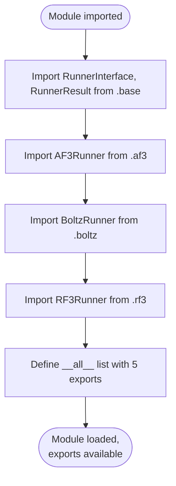

**Note:** This flowchart is trivial because the file only performs imports and exports. The actual workflow happens in the imported modules (`af3.py`, `boltz.py`, `rf3.py`, `base.py`), which will be documented separately.

---

**TODO / Uncertainties:**
- **No validation:** No validation that imported classes exist or have expected interfaces (would fail at import time if modules are missing)
- **Incomplete information:** Without reading `base.py`, `af3.py`, `boltz.py`, `rf3.py`, the exact interface and behavior of these classes is unclear. This documentation will be completed when those files are analyzed.

---

### `src/structure_pipeline/runners/base.py`

**Role:** Abstract base class defining the interface for all structure prediction model runners  
**Size:** 150 lines  
**Key Imports:**
- `abc.ABC`, `abc.abstractmethod` — Python abstract base class support
- `dataclasses.dataclass`, `dataclasses.field` — Dataclass decorators
- `pathlib.Path` — Path handling
- `..cases.Case` — Case dataclass representing a single prediction task
- `..config.PipelineConfig` — Configuration object

**Classes:**

#### 1. **`RunnerResult` (dataclass)**
   - **Purpose:** Encapsulates the result of a structure prediction job.
   - **Fields:**
     - `success: bool` — Whether the job completed successfully
     - `case_id: str` — Unique identifier for the case
     - `output_dir: Path | None` — Directory containing outputs
     - `output_files: list[str]` — List of output file paths (structure files)
     - `confidence_scores: dict[str, float]` — Confidence metrics (e.g., pLDDT, pTM, ipTM)
     - `error_message: str` — Error description if job failed
     - `runtime_seconds: float` — Job runtime
     - `metadata: dict[str, Any]` — Additional model-specific metadata
   - **Usage:** Returned by `parse_outputs()` to encapsulate job results.

#### 2. **`RunnerInterface` (ABC)**
   - **Purpose:** Abstract interface that all model runners must implement.
   - **Constructor:**
     - `__init__(config: PipelineConfig)` — Store configuration reference
   - **Abstract Property:**
     - `model_name() -> str` — Return model identifier (e.g., "af3", "boltz", "rf3")
   - **Abstract Methods:**
     
     1. **`build_input_file(cases, protein_sequences, output_dir) -> Path`**
        - Builds model-specific input file (JSON/YAML) for a batch of cases.
        - All cases must share the same ligand but can have different proteins.
        - Returns path to generated input file.
     
     2. **`build_command(input_file, output_dir, **kwargs) -> list[str]`**
        - Builds the command list to execute the model.
        - Returns command as list of strings (e.g., for `subprocess.run`).
     
     3. **`build_slurm_script(cases, protein_sequences, work_dir, job_name) -> str`**
        - Generates a complete SLURM batch script as a string.
        - Includes SBATCH directives, environment setup, and model execution.
        - Returns script content ready to be written to file and submitted.
     
     4. **`parse_outputs(output_dir, cases) -> list[RunnerResult]`**
        - Parses model outputs from the output directory.
        - Extracts structure files and confidence scores.
        - Returns one `RunnerResult` per case.
   
   - **Concrete Method:**
     - `validate_paths() -> list[str]` — Validates required paths (model weights, containers, etc.). Returns list of error messages (empty if all valid). Subclasses should override to check model-specific paths.

**Architecture Notes:**
- **Template method pattern:** Base class defines workflow structure; subclasses fill in model-specific details.
- **SLURM-centric:** Assumes jobs run via SLURM batch scripts. Alternative executors (local) must adapt.
- **Batch processing:** Designed to process multiple proteins with same ligand in one job (amortize overhead).

---

#### Flowchart: `RunnerInterface` Workflow

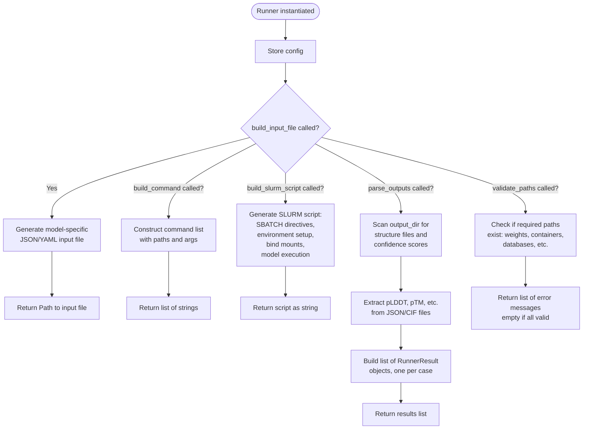

**Note:** This flowchart shows the abstract interface. Concrete implementations (AF3Runner, BoltzRunner, RF3Runner) override these methods with model-specific logic.

---

**TODO / Uncertainties:**
- **No retry logic:** Interface assumes jobs run once; no retry or checkpoint support built into base class.
- **No logging hooks:** Subclasses must handle logging independently; no centralized logging interface.
- **Batch size limits:** No enforcement of max batch size per job (could lead to memory issues if too many cases batched).
- **Error handling:** `parse_outputs()` returns success/failure per case, but no mechanism to abort or retry failed cases within a batch.

---

### `src/structure_pipeline/runners/af3.py`

**Role:** AlphaFold3 runner implementation using two-stage fan-in architecture  
**Size:** 754 lines  
**Key Imports:**
- `json` — JSON file I/O for AF3 input format
- `logging` — Logging support
- `textwrap` — Script generation utilities
- `pathlib.Path` — Path handling
- `..cases.Case` — Case dataclass
- `..config.PipelineConfig` — Configuration
- `.base.RunnerInterface`, `.base.RunnerResult` — Base classes
- `.ligand_utils.build_af3_ligand_entries` — Ligand entry builder
- `.oligo.OligoRegistry` — Oligosaccharide definition registry

**Key Concept — Two-Stage Fan-In:**

AlphaFold3 has expensive MSA (multiple sequence alignment) computation but can reuse MSA for inference across different seeds. The pipeline splits this into two stages:

1. **MSA Stage (CPU):** One job per (protein × ligand) pair. Runs `--run_inference=false` to generate `*_data.json` (preprocessed MSA).
2. **Inference Stage (GPU):** One job per ligand, batching all proteins. Each protein uses its pre-computed `_data.json` from stage 1. Jobs depend on MSA jobs via `--dependency=afterok:job1:job2:...`.

This architecture minimizes GPU time and allows parallel MSA computation.

---

**Class: `AF3Runner(RunnerInterface)`**

#### Constructor
- **`__init__(config: PipelineConfig, oligo_registry: OligoRegistry | None = None)`**
  - **Purpose:** Initialize AF3 runner with configuration and optional oligosaccharide registry.
  - **Side effects:** Stores config and oligo_registry (defaults to empty registry if None).

#### Properties
- **`model_name() -> str`** — Returns `"af3"`.

---

#### Methods

##### 1. **`build_input_file(cases, protein_sequences, output_dir, ligand_cif_path=None) -> Path`**
   - **Purpose:** Build AF3 JSON input file for a single (protein, ligand) pair.
   - **Input:**
     - `cases: list[Case]` — Cases for this batch (usually one for MSA stage)
     - `protein_sequences: dict[str, str]` — Mapping of protein_id → sequence
     - `output_dir: Path` — Directory to write input file
     - `ligand_cif_path: Path | None` — Optional custom CIF file for ligand
   - **Output:** `Path` to generated `af3_input.json`
   - **Side effects:** Creates `output_dir` if missing, writes JSON file.
   - **Logic:**
     - Takes first case (assumes batch has one case for MSA).
     - Generates seed list from config (`1..af3.seeds`).
     - Calls `build_af3_ligand_entries()` to get ligand entries and bonded atom pairs (for oligosaccharides).
     - Builds sequences list: one protein entry + ligand entries.
     - If oligosaccharide: includes `bondedAtomPairs` in JSON.
     - If custom CIF provided and NOT oligo: sets `userCCDPath` in JSON.
     - Writes JSON to `output_dir/af3_input.json`.
   - **Dependencies:** `build_af3_ligand_entries()` from `.ligand_utils`, `OligoRegistry`.

##### 2. **`build_msa_input_file(protein_id, protein_sequence, ligand_ccd_code, output_dir, ligand_cif_path=None) -> Path`**
   - **Purpose:** Build AF3 JSON for MSA-only stage with ligand included.
   - **Input:**
     - `protein_id: str`
     - `protein_sequence: str`
     - `ligand_ccd_code: str`
     - `output_dir: Path`
     - `ligand_cif_path: Path | None`
   - **Output:** `Path` to `af3_msa_input.json`
   - **Logic:** Similar to `build_input_file()` but simplified for single protein. Includes ligand so resulting `_data.json` is complete for inference.
   - **Side effects:** Writes JSON to `output_dir/af3_msa_input.json`.

##### 3. **`build_command(input_file, output_dir, msa_only=False, **kwargs) -> list[str]`**
   - **Purpose:** Build AF3 command for execution inside the container.
   - **Input:**
     - `input_file: Path` — Path to JSON input
     - `output_dir: Path` — Output directory
     - `msa_only: bool` — If True, adds `--run_inference=false` and MSA tool paths
   - **Output:** List of command strings.
   - **Logic:**
     - Base command: `/opt/af3-venv/bin/python /opt/alphafold3/run_alphafold.py`
     - Container paths: `/root/af_input/`, `/root/models`, `/root/public_databases`, `/root/af_output`
     - If `msa_only`: adds `--run_inference=false` + hmmer tool paths.
     - Else: adds `--num_diffusion_samples` for inference.
   - **Note:** Command assumes execution inside Apptainer/Singularity container.

##### 4. **`build_msa_slurm_script(protein_id, protein_sequence, ligand_ccd_code, work_dir, job_name, ligand_cif_path=None) -> str`**
   - **Purpose:** Generate SLURM batch script for AF3 MSA stage (CPU job).
   - **Input:**
     - `protein_id: str`
     - `protein_sequence: str`
     - `ligand_ccd_code: str`
     - `work_dir: Path` — Working directory (e.g., `work/af3_msa/{protein_id}/`)
     - `job_name: str`
     - `ligand_cif_path: Path | None`
   - **Output:** Complete SLURM script as string.
   - **Side effects:**
     - Calls `build_msa_input_file()` to write JSON.
     - If custom CIF provided (and not oligo): copies CIF to `input_dir` for bind-mounting.
   - **Logic:**
     - SBATCH directives: CPU partition, account, cpus, mem, time.
     - Unsets inherited Singularity/Apptainer environment variables (critical for NRIS/Tykky systems).
     - Sets up scratch space for MSA computation.
     - Copies input to `$SCRATCH/input/`.
     - Sets trap to copy `*_data.json` back to `work_dir/input/produced_msa.json` on exit.
     - Runs `apptainer exec` with bind mounts:
       - `input_dir` → `/root/af_input`
       - `scratch/result` → `/root/af_output`
       - AF3 weights → `/root/models`
       - AF3 databases squashfs → `/root/public_databases`
     - Command: MSA-only AF3 run with hmmer tools.
   - **Key Features:**
     - **Scratch usage:** MSA runs in `$SCRATCH` to avoid I/O bottlenecks on shared filesystem.
     - **Trap mechanism:** Ensures `_data.json` is copied back even if job is killed.
     - **Per-run isolation:** Uses `$SLURM_JOB_ID` for unique output directories.

##### 5. **`_write_patch_script(output_path, oligo_ccd_codes=None, oligo_bonded_atom_pairs=None) -> None`** (static)
   - **Purpose:** Write a standalone Python script for patching AF3 MSA `_data.json` for inference.
   - **Input:**
     - `output_path: Path` — Where to write the script
     - `oligo_ccd_codes: list[str] | None` — Oligosaccharide monomer codes
     - `oligo_bonded_atom_pairs: list[list[list]] | None` — Bond definitions
   - **Output:** None (writes script file).
   - **Side effects:** Creates executable Python script at `output_path` with `chmod 0o755`.
   - **Logic:**
     - Script accepts args: `src dst name ligand [user_ccd_path]`.
     - Reads MSA `_data.json`, patches:
       - `name` field
       - Removes old ligand entries from `sequences`
       - Adds CU (copper, always present), then ligand entry
       - For oligo: uses `ccdCodes` list + `bondedAtomPairs`; removes `userCCD`/`userCCDPath`.
       - For non-oligo: sets `userCCDPath` if provided, else removes it.
     - Writes patched JSON to `dst`.
   - **Why standalone script?** Avoids PATH-dependent Python resolution. Uses `/usr/bin/python3` (guaranteed native architecture) instead of a potentially wrong Python from `$PATH` on mixed-architecture clusters.

##### 6. **`build_slurm_script(cases, protein_sequences, work_dir, job_name, msa_work_dirs=None, ligand_cif_paths=None) -> str`**
   - **Purpose:** Generate SLURM batch script for AF3 inference stage (GPU job).
   - **Input:**
     - `cases: list[Case]` — All cases for one ligand (different proteins)
     - `protein_sequences: dict[str, str]`
     - `work_dir: Path` — e.g., `work/{ligand_ccd}/af3/`
     - `job_name: str`
     - `msa_work_dirs: dict[str, Path] | None` — protein_id → MSA work_dir (where `input/produced_msa.json` is)
     - `ligand_cif_paths: dict[str, Path] | None` — ligand_id → CIF file path
   - **Output:** Complete SLURM script as string.
   - **Side effects:**
     - Copies custom CIF files to `input_dir`.
     - Writes `_patch_json.py` helper script.
   - **Logic:**
     - SBATCH directives: GPU partition, gpus, mem-per-gpu, time.
     - Unsets inherited container environment variables.
     - Loads `NRIS/GPU` module.
     - Sets up work directories.
     - For each case/protein in batch:
       - Finds corresponding `_data.json` from MSA job (`msa_work_dirs[protein_id]/input/produced_msa.json`).
       - Invokes `/usr/bin/python3 _patch_json.py` to create inference JSON from MSA JSON.
       - Runs `apptainer exec --nv` (GPU) with bind mounts:
         - `input_dir` → `/root/af_input`
         - `output_dir` → `/root/af_output`
         - AF3 weights → `/root/models`
         - AF3 databases → `/root/public_databases`
       - Command: AF3 inference with `--num_diffusion_samples`.
     - On completion: creates `DONE.ok` marker and symlinks `latest`.
   - **Key Features:**
     - **Sequential protein processing:** Each protein runs in sequence (not parallelized within one job).
     - **MSA reuse:** Each protein uses its pre-computed `_data.json` instead of regenerating MSA.
     - **Oligo support:** For oligosaccharides, the patch script embeds monomer codes and bonded atom pairs.

##### 7. **`parse_outputs(output_dir, cases) -> list[RunnerResult]`**
   - **Purpose:** Parse AF3 outputs and extract structure files + confidence scores.
   - **Input:**
     - `output_dir: Path` — Directory containing AF3 outputs
     - `cases: list[Case]` — Cases that were processed
   - **Output:** List of `RunnerResult` objects (one per case).
   - **Logic:**
     - For each case:
       - Expected directory: `output_dir/{protein_id}_{ligand_ccd_code}/`
       - Looks for `*_summary_confidences_*.json` → extracts `ptm`, `iptm`, `ranking_score`.
       - Looks for `*_model.cif` → structure files.
       - Sets `success=True` if structure files found.
   - **Error handling:** Catches JSON parse errors silently (confidence scores remain empty).

##### 8. **`validate_paths() -> list[str]`**
   - **Purpose:** Validate required AF3 paths exist.
   - **Input:** None (uses `self.config`).
   - **Output:** List of error messages (empty if all valid).
   - **Logic:** Checks existence of:
     - `af3_cpu_image`
     - `af3_gpu_image`
     - `af3_weights`
     - `af3_databases` (squashfs)
   - **Error handling:** Silently ignores `PermissionError` (may not have read access).

---

#### Flowchart: AF3 Two-Stage Workflow

```mermaid
flowchart TD
    Start([CLI: run command]) --> LoadCases[Load cases.csv manifest]
    LoadCases --> GroupByLigand[Group cases by ligand_ccd]
    GroupByLigand --> SubmitMSA{For each protein in ligand group}
    
    SubmitMSA --> BuildMSAInput[build_msa_input_file:<br/>Create af3_msa_input.json<br/>with protein + ligand]
    BuildMSAInput --> CopyCIF{Custom CIF for ligand?}
    CopyCIF -->|Yes| CopyCIFToInput[Copy CIF to input_dir]
    CopyCIF -->|No, or is oligo| SkipCIF[Use CCD codes]
    CopyCIFToInput --> BuildMSAScript[build_msa_slurm_script:<br/>Generate SLURM script for MSA job]
    SkipCIF --> BuildMSAScript
    
    BuildMSAScript --> SubmitMSAJob[Submit MSA job to SLURM<br/>CPU partition]
    SubmitMSAJob --> MSARun[Apptainer exec with AF3 CPU image,<br/>--run_inference=false,<br/>bind-mount databases]
    MSARun --> MSAComplete[MSA completes:<br/>*_data.json saved to<br/>work_dir/input/produced_msa.json]
    
    MSAComplete --> AllMSADone{All MSA jobs for ligand done?}
    AllMSADone -->|Yes| BuildInfScript[build_slurm_script:<br/>Generate inference SLURM script<br/>with dependency on MSA jobs]
    
    BuildInfScript --> WritePatchScript[Write _patch_json.py helper<br/>to patch _data.json]
    WritePatchScript --> SubmitInfJob[Submit inference job to SLURM<br/>GPU partition, --dependency=afterok:msa_jobs]
    
    SubmitInfJob --> WaitMSA[SLURM waits for MSA dependencies]
    WaitMSA --> InfRun{For each protein in batch}
    InfRun --> PatchJSON[Run _patch_json.py:<br/>Copy _data.json,<br/>patch name/ligand/CIF path]
    PatchJSON --> RunInference[Apptainer exec --nv with AF3 GPU image,<br/>--num_diffusion_samples,<br/>bind-mount weights + databases]
    RunInference --> NextProtein{More proteins?}
    NextProtein -->|Yes| InfRun
    NextProtein -->|No| MarkDone[Create DONE.ok marker,<br/>symlink latest]
    
    MarkDone --> ParseOutput[parse_outputs:<br/>Scan for *_model.cif,<br/>extract confidence scores]
    ParseOutput --> End([Results available])
```

---

**Key Implementation Details:**

1. **Directory Structure:**
   ```
   work/af3_msa/{protein_id}/
       input/
           af3_msa_input.json          # Original MSA input
           produced_msa.json            # Copied _data.json from MSA run
       runs/{SLURM_JOB_ID}/             # Per-run outputs
       latest -> runs/12345             # Symlink to latest run
       DONE.ok                          # Completion marker
   
   work/{ligand_ccd}/af3/
       input/
           _patch_json.py               # JSON patching helper
           ligand.cif (if custom CIF)   # Copied CIF file
       runs/{SLURM_JOB_ID}/             # Per-run outputs
           {protein_id}_{ligand}/       # AF3 output subdirectory
               *_model.cif              # Structure files
               *_summary_confidences_*.json  # Confidence scores
       latest -> runs/67890
       DONE.ok
   ```

2. **AF3 JSON Format (v4):**
   ```json
   {
     "name": "B6EQJ6_STA6",
     "dialect": "alphafold3",
     "version": 4,
     "modelSeeds": [1, 2, 3, 4, 5, 6, 7, 8, 9, 10],
     "sequences": [
       {"protein": {"id": "A", "sequence": "MKLV..."}},
       {"ligand": {"id": "B", "ccdCodes": ["CU"]}},
       {"ligand": {"id": "C", "ccdCodes": ["STA6"]}}
     ],
     "userCCDPath": "/root/af_input/STA6.cif",  // optional
     "bondedAtomPairs": [...]  // for oligosaccharides
   }
   ```

3. **Oligosaccharide Handling:**
   - If `ligand_ccd_code` matches a prefix in `oligo_registry` (e.g., `STA6` → `STA` prefix, 6 monomers):
     - `ccdCodes` becomes `["GLC", "GLC", "GLC", "GLC", "GLC", "GLC"]` (monomer repeated).
     - `bondedAtomPairs` defines glycosidic bonds between monomers.
     - `userCCDPath` is NOT set (uses standard CCD monomers).
   - If not an oligo: uses single CCD code + optional custom CIF.

4. **Environment Cleanup:**
   - Critical for NRIS/Tykky systems where inherited environment can break container execution.
   - Unsets: `SINGULARITY_*`, `APPTAINER_*`, `SINGULARITYENV_*` variables.

5. **Scratch Space Usage:**
   - MSA jobs copy input to `$SCRATCH`, run there, then copy `_data.json` back.
   - Avoids I/O bottlenecks on shared filesystems during expensive MSA computation.

6. **Trap Mechanism:**
   - Bash `trap` ensures critical outputs are copied back even if job is killed or fails.
   - Set on `EXIT` signal.

---

**TODO / Uncertainties:**

- **Error handling:**
  - If an MSA job fails, inference job still runs but skips that protein with a warning.
  - No automatic retry for failed MSA or inference jobs.
  - Missing `_data.json` only logs a warning; doesn't abort the batch.

- **Concurrency:**
  - Inference processes proteins sequentially within a single GPU job.
  - Could be parallelized with `srun` + job steps, but current design prioritizes simplicity.

- **Resource limits:**
  - No enforcement of max batch size (too many proteins could OOM the GPU).
  - MSA jobs use fixed `cpus_msa` and `mem_per_cpu_msa` from config (may not scale for large proteins).

- **CIF file handling:**
  - Copies CIF files multiple times (once per MSA job, once per inference job).
  - Could use shared input directory to reduce duplication.

- **Logging:**
  - Uses Python `logging` module but logs are scattered across SLURM stdout/stderr.
  - No centralized logging aggregation.

- **Cleanup:**
  - No automatic cleanup of old `runs/{SLURM_JOB_ID}/` directories.
  - Could accumulate over time.

- **Hardcoded paths:**
  - Container paths like `/root/af_input`, `/opt/alphafold3/` are hardcoded.
  - Would break if AF3 container layout changes.

- **Oligo support incomplete:**
  - Only tested with specific polysaccharides (amylose, cellulose, chitin).
  - Bond atom names (`C1`, `O4`) may not generalize to all oligosaccharide types.

---

### `src/structure_pipeline/runners/boltz.py`

**Role:** Boltz-2 runner implementation with per-ligand batching strategy  
**Size:** 383 lines  
**Key Imports:**
- `yaml` — YAML serialization for Boltz input format
- `pathlib.Path` — Path handling
- `..cases.Case` — Case dataclass
- `..config.PipelineConfig` — Configuration
- `.base.RunnerInterface`, `.base.RunnerResult` — Base classes
- `.ligand_utils.build_boltz_ligand_entries` — Ligand entry builder for Boltz format

**Key Concept — Per-Ligand Batching:**

Unlike AF3's two-stage fan-in, Boltz uses a simpler batching strategy:
- **One SLURM job per ligand**
- Creates a **directory** of YAML input files (one per protein)
- `boltz predict <dir>` processes all YAMLs in the directory sequentially
- No separate MSA stage; Boltz handles MSA internally (optionally via MSA server)

---

**Class: `BoltzRunner(RunnerInterface)`**

#### Properties
- **`model_name() -> str`** — Returns `"boltz"`.

---

#### Methods

##### 1. **`build_input_file(cases, protein_sequences, output_dir, msa_paths=None) -> Path`**
   - **Purpose:** Build Boltz YAML input files (one YAML per protein, all in one directory).
   - **Input:**
     - `cases: list[Case]` — All cases for this ligand (different proteins)
     - `protein_sequences: dict[str, str]` — protein_id → amino acid sequence
     - `output_dir: Path` — Directory to write input files
     - `msa_paths: dict[str, str] | None` — Optional pre-computed MSA paths per protein
   - **Output:** `Path` to the **directory** containing all YAML files (not a single file).
   - **Side effects:** Creates `output_dir` if missing, writes one YAML per case.
   - **Logic:**
     - For each case:
       - Builds `sequences` list: one protein entry (with optional MSA path) + ligand entries.
       - Calls `build_boltz_ligand_entries()` to get ligand entries (always includes CU).
       - If `use_affinity` is enabled in config, adds `properties` field with affinity binder configuration.
       - Writes YAML to `{protein_id}_{ligand_ccd_code}.yaml`.
   - **Boltz YAML Format:**
     ```yaml
     version: 1
     sequences:
       - protein:
           id: A
           sequence: MVTPE...
           msa: /path/to/msa.a3m  # optional
       - ligand:
           id: B
           ccd: CU
       - ligand:
           id: C
           ccd: STA6
     properties:  # optional
       - affinity:
           binder: C  # ligand id
     ```
   - **Dependencies:** `build_boltz_ligand_entries()` from `.ligand_utils`.

##### 2. **`build_command(input_file, output_dir, **kwargs) -> list[str]`**
   - **Purpose:** Build Boltz command for execution inside container.
   - **Input:**
     - `input_file: Path` — Path to input directory (not file!)
     - `output_dir: Path` — Output directory
   - **Output:** List of command strings.
   - **Logic:**
     - Command: `boltz predict /work/input --out_dir /work/output --cache /weights/boltz`
     - Adds `--recycling_steps`, `--diffusion_samples` from config.
     - Adds `--override` to overwrite existing outputs.
     - If `use_msa_server` enabled, adds `--use_msa_server` flag.
   - **Note:** Paths are container paths; bind-mounts configured in SLURM script.

##### 3. **`build_slurm_script(cases, protein_sequences, work_dir, job_name, msa_paths=None, msa_sqsh_file=None) -> str`**
   - **Purpose:** Generate SLURM batch script for Boltz-2 inference.
   - **Input:**
     - `cases: list[Case]` — All cases for this ligand
     - `protein_sequences: dict[str, str]`
     - `work_dir: Path` — e.g., `work/{ligand_ccd}/boltz/`
     - `job_name: str`
     - `msa_paths: dict[str, str] | None` — Optional pre-computed MSA paths
     - `msa_sqsh_file: Path | None` — Optional squashfs overlay (not implemented)
   - **Output:** Complete SLURM script as string.
   - **Side effects:** Calls `build_input_file()` to create input YAML files.
   - **Logic:**
     - SBATCH directives: GPU partition, account, gpus, time, mem-per-gpu.
     - Unsets inherited Singularity/Apptainer environment variables.
     - Loads `NRIS/GPU` module.
     - Sets up work directories: `input/`, `runs/`, symlink `latest`.
     - Builds input YAMLs by calling `build_input_file()`.
     - Runs `apptainer exec --nv` with bind mounts:
       - `WORK_DIR` → `/work`
       - `WEIGHTS_HOST` → `/weights`
       - Absolute project paths (for MSA files)
     - Sets `HF_HOME=/weights/huggingface` for Hugging Face cache.
     - Command: `boltz predict /work/input --out_dir /work/result --cache /weights/boltz --override`
     - On completion: creates `DONE.ok` marker.
   - **Key Features:**
     - **Single-stage:** No separate MSA step (unlike AF3).
     - **Directory batching:** All proteins for a ligand processed in one job.
     - **Explicit bind-mounts:** Avoids relying on inherited environment.

##### 4. **`parse_outputs(output_dir, cases) -> list[RunnerResult]`**
   - **Purpose:** Parse Boltz outputs and extract structure files + confidence scores.
   - **Input:**
     - `output_dir: Path` — Directory containing Boltz outputs
     - `cases: list[Case]` — Cases that were processed
   - **Output:** List of `RunnerResult` objects (one per case).
   - **Logic:**
     - For each case:
       - Expected directory: `output_dir/predictions/{protein_id}_{ligand_ccd_code}/`
       - Looks for `*_model_*.cif` → structure files.
       - Looks for `confidence_*.json` → extracts `ptm`, `iptm`, `ligand_iptm`, `confidence_score`.
       - Looks for `affinity_*.json` → extracts `affinity_pred_value`.
       - Sets `success=True` if structure files found.
       - If exact name not found, tries to match any subdir containing `protein_id`.
   - **Error handling:** Catches JSON parse errors silently (confidence scores remain empty).

##### 5. **`validate_paths() -> list[str]`**
   - **Purpose:** Validate required Boltz paths exist.
   - **Input:** None (uses `self.config`).
   - **Output:** List of error messages (empty if all valid).
   - **Logic:** Checks existence of:
     - `boltz_image` (Apptainer/Singularity image)
     - `boltz_weights` (model weights directory)
   - **Error handling:** Silently ignores `PermissionError`.

---

#### Flowchart: Boltz Workflow

```mermaid
flowchart TD
    Start([CLI: run command]) --> LoadCases[Load cases.csv manifest]
    LoadCases --> GroupByLigand[Group cases by ligand_ccd]
    GroupByLigand --> ForEachLigand{For each ligand}
    
    ForEachLigand --> BuildInputDir[build_input_file:<br/>Create directory with one YAML<br/>per protein]
    BuildInputDir --> WriteYAMLs{For each protein}
    WriteYAMLs --> BuildYAML[Build YAML:<br/>protein + sequence + MSA path<br/>+ ligand entries CU + main<br/>+ optional affinity property]
    BuildYAML --> NextProtein{More proteins?}
    NextProtein -->|Yes| WriteYAMLs
    NextProtein -->|No| BuildScript[build_slurm_script:<br/>Generate SLURM script]
    
    BuildScript --> SubmitJob[Submit job to SLURM<br/>GPU partition]
    SubmitJob --> ApptainerRun[Apptainer exec --nv<br/>bind: work_dir, weights, project paths<br/>env: HF_HOME=/weights/huggingface]
    ApptainerRun --> BoltzCmd[boltz predict /work/input<br/>--out_dir /work/result<br/>--cache /weights/boltz<br/>--recycling_steps N<br/>--diffusion_samples M<br/>--override]
    
    BoltzCmd --> BoltzProcesses[Boltz processes all YAMLs<br/>in input directory sequentially]
    BoltzProcesses --> OutputStructures[For each protein:<br/>predictions/{name}/<br/>*_model_*.cif<br/>confidence_*.json<br/>affinity_*.json optional]
    
    OutputStructures --> MarkDone[Create DONE.ok marker]
    MarkDone --> ParseOutput[parse_outputs:<br/>Scan predictions/ subdirs<br/>extract CIF files and<br/>confidence/affinity scores]
    ParseOutput --> End([Results available])
```

---

**Key Implementation Details:**

1. **Directory Structure:**
   ```
   work/{ligand_ccd}/boltz/
       input/
           B6EQJ6_STA6.yaml          # One YAML per protein
           D0EW65_STA6.yaml
           ...
       result/
           predictions/
               B6EQJ6_STA6/
                   boltz_model_0.cif
                   confidence_0.json
                   affinity_0.json  # if use_affinity enabled
               D0EW65_STA6/
                   ...
       DONE.ok
       slurm_123456.out
       slurm_123456.err
   ```

2. **Affinity Prediction:**
   - Enabled via config: `boltz.use_affinity = true`
   - Set in YAML `properties` field (NOT via `--affinity` CLI flag, which doesn't exist).
   - Predicts binding affinity (ΔG) between protein and ligand.

3. **MSA Handling:**
   - If `use_msa_server=true`: Boltz queries remote MSA server.
   - If `msa_paths` provided: uses pre-computed `.a3m` files (e.g., from separate MSA jobs).
   - Otherwise: Boltz computes MSA from scratch (slow).

4. **CU (Copper) Handling:**
   - Always included as ligand `B` (before main ligand `C`).
   - Boltz format uses `ccd` field (single code), not `ccdCodes` array like AF3.

5. **Environment Cleanup:**
   - Same reason as AF3: inherited container env from Tykky/NRIS wrappers can break execution.

---

**Differences from AF3:**

| Feature | AF3 | Boltz |
|---------|-----|-------|
| Batching | Two-stage fan-in (MSA CPU + Inference GPU) | Single-stage per-ligand |
| Input Format | JSON (dialect: alphafold3, version 4) | YAML (version: 1) |
| Ligand CCD | `ccdCodes: [...]` (array) | `ccd: "..."` (string) |
| Oligosaccharides | Supported (via `ccdCodes` + `bondedAtomPairs`) | **Not supported** (no oligo logic in Boltz runner) |
| Affinity | Not supported | Optional via `properties` field |
| MSA Reuse | Explicit `_data.json` from MSA stage | Optional via `msa` field in YAML |

---

**TODO / Uncertainties:**

- **Oligosaccharide support:**
  - Boltz runner does NOT have oligosaccharide logic.
  - `build_boltz_ligand_entries()` only handles simple CCD codes + CU.
  - Would need to add multi-residue support if Boltz format allows it (unclear from code).

- **Squashfs overlay:**
  - `msa_sqsh_file` parameter exists but is **not used** in the script.
  - Code comment says "Squashfs not used in this version".
  - Unclear if this is planned or deprecated.

- **Error handling:**
  - If Boltz fails on one protein, the entire batch fails (no partial results).
  - No retry mechanism.

- **Output parsing:**
  - Falls back to substring matching if exact directory name not found.
  - Could match wrong subdirectory if protein IDs overlap (e.g., "ABC" and "ABCD").

- **Resource limits:**
  - No enforcement of max batch size.
  - All proteins processed sequentially in one GPU job (could be slow for large batches).

- **Logging:**
  - No Python logging calls in this file (unlike AF3 runner).
  - Only SLURM stdout/stderr.

---

### `src/structure_pipeline/runners/ligand_utils.py`

**Role:** Shared ligand entry builders for AF3, Boltz, and RF3 formats  
**Size:** 108 lines  
**Key Imports:**
- `logging` — Structured logging
- `.oligo.OligoRegistry`, `.OligoSpec`, `build_af3_bonded_atom_pairs`, `build_af3_oligo_ligand_entry` — Oligosaccharide support

**Purpose:**

This module centralizes ligand-related logic shared across model runners. Key responsibilities:
1. **Always include CU (copper)** as a mandatory co-factor ligand.
2. **Handle oligosaccharides** (AF3 only): multi-residue ligands with covalent bonds.
3. **Format ligand entries** according to each model's input schema (AF3 JSON, Boltz YAML, RF3 components).

---

**Constants:**

- **`MANDATORY_CU_CCD = "CU"`** — Copper CCD code (always included).
- **`AF3_CU_LIGAND_ID = "B"`** — Chain ID for CU in AF3.
- **`AF3_MAIN_LIGAND_ID = "C"`** — Chain ID for main ligand in AF3.
- **`BOLTZ_CU_LIGAND_ID = "B"`** — Chain ID for CU in Boltz.
- **`BOLTZ_MAIN_LIGAND_ID = "C"`** — Chain ID for main ligand in Boltz.

---

**Functions:**

##### 1. **`build_af3_ligand_entries(main_ccd, oligo_registry=None) -> tuple[list[dict], list[list[list]]]`**
   - **Purpose:** Build AF3 ligand entries with optional oligosaccharide expansion.
   - **Input:**
     - `main_ccd: str` — Main ligand CCD code (e.g., `"STA6"`, `"CEL6"`, or simple `"HEM"`).
     - `oligo_registry: OligoRegistry | None` — Optional registry for oligo definitions.
   - **Output:** Tuple of:
     1. `sequences_entries: list[dict]` — Ligand entries for AF3 JSON `sequences` field.
     2. `bonded_atom_pairs: list[list[list]]` — Bond definitions (empty for non-oligo ligands).
   - **Logic:**
     - **Special case:** If `main_ccd == "CU"`, return only CU entry (no duplicate).
     - **Oligosaccharide check:** If `oligo_registry` provided and `main_ccd` matches pattern (e.g., `NAG6`):
       - Parses into `(prefix, n, spec)` using `oligo_registry.parse()`.
       - Logs: `"Building AF3 oligo ligand: STA6 → 6× BGC (bond: C1–O4)"`.
       - Calls `build_af3_oligo_ligand_entry(AF3_MAIN_LIGAND_ID, spec, n)` to get ligand entry with `ccdCodes: ["BGC", "BGC", ..., "BGC"]` (n times).
       - Calls `build_af3_bonded_atom_pairs(AF3_MAIN_LIGAND_ID, spec, n)` to get bond pairs.
     - **Non-oligo (default):** Returns CU + main ligand as simple CCD codes.
   - **Returns:**
     - Oligosaccharide: `[{"ligand": {"id": "B", "ccdCodes": ["CU"]}}, {"ligand": {"id": "C", "ccdCodes": ["BGC", "BGC", ..., "BGC"]}}], [[bonded pairs]]`
     - Non-oligo: `[{"ligand": {"id": "B", "ccdCodes": ["CU"]}}, {"ligand": {"id": "C", "ccdCodes": ["STA6"]}}], []`
   - **Dependencies:** `OligoRegistry.parse()`, `build_af3_oligo_ligand_entry()`, `build_af3_bonded_atom_pairs()` from `.oligo`.

##### 2. **`build_boltz_ligand_entries(main_ccd) -> tuple[list[dict], str]`**
   - **Purpose:** Build Boltz ligand entries and return the main ligand chain ID.
   - **Input:**
     - `main_ccd: str` — Main ligand CCD code.
   - **Output:** Tuple of:
     1. `ligand_entries: list[dict]` — Ligand entries for Boltz YAML `sequences` field.
     2. `main_ligand_id: str` — Chain ID of the main ligand (for affinity binder reference).
   - **Logic:**
     - **Special case:** If `main_ccd == "CU"`, return only CU entry + `"B"` as main ligand ID.
     - **Default:** Returns CU (`id: "B"`) + main ligand (`id: "C"`).
   - **Boltz Format:** Uses `ccd` field (single string), not `ccdCodes` array.
   - **Note:** **No oligosaccharide support** for Boltz.
   - **Returns:**
     - CU-only: `([{"ligand": {"id": "B", "ccd": "CU"}}], "B")`
     - CU + main: `([{"ligand": {"id": "B", "ccd": "CU"}}, {"ligand": {"id": "C", "ccd": "STA6"}}], "C")`

##### 3. **`build_rf3_ligand_components(main_ccd, main_cif_path=None) -> list[dict]`**
   - **Purpose:** Build RF3 ligand components list (always includes CU).
   - **Input:**
     - `main_ccd: str` — Main ligand CCD code.
     - `main_cif_path: str | None` — Optional custom CIF file path for main ligand.
   - **Output:** List of RF3 ligand component dictionaries.
   - **Logic:**
     - Always includes CU first (unless `main_ccd` itself is `"CU"`).
     - If `main_cif_path` provided: adds `{"path": main_cif_path}`.
     - Otherwise: adds `{"ccd_code": main_ccd}`.
   - **RF3 Format:** Uses `ccd_code` field or `path` field for custom CIF.
   - **Returns:**
     - With CIF: `[{"ccd_code": "CU"}, {"path": "/path/to/STA6.cif"}]`
     - Without CIF: `[{"ccd_code": "CU"}, {"ccd_code": "STA6"}]`
   - **Note:** RF3 logic not yet fully documented (RF3 runner is [TODO]).

---

#### Flowchart: Ligand Entry Building

```mermaid
flowchart TD
    Start([build_af3_ligand_entries called]) --> CheckCU{main_ccd == "CU"?}
    CheckCU -->|Yes| ReturnCUOnly[Return: CU entry only<br/>bonded_atom_pairs = empty]
    
    CheckCU -->|No| CheckRegistry{oligo_registry provided?}
    CheckRegistry -->|No| BuildSimple[Build simple entries:<br/>CU + main_ccd<br/>bonded_atom_pairs = empty]
    BuildSimple --> ReturnSimple[Return: CU + main ligand, empty bonds]
    
    CheckRegistry -->|Yes| ParseCCD[oligo_registry.parse main_ccd]
    ParseCCD --> IsOligo{Matches oligo pattern?}
    
    IsOligo -->|No| BuildSimple
    IsOligo -->|Yes| ExtractOligoInfo[Extract: prefix, n, spec<br/>e.g. STA6 → STA, 6, BGC]
    
    ExtractOligoInfo --> LogOligo[Log: Building AF3 oligo ligand:<br/>STA6 → 6× BGC bond: C1–O4]
    LogOligo --> BuildOligoEntry[build_af3_oligo_ligand_entry:<br/>ccdCodes = monomer repeated n times]
    BuildOligoEntry --> BuildBonds[build_af3_bonded_atom_pairs:<br/>Generate bonds between consecutive residues]
    BuildBonds --> ReturnOligo[Return: CU + oligo entry, bonds]
    
    ReturnCUOnly --> End([Return to caller])
    ReturnSimple --> End
    ReturnOligo --> End
```

---

**Key Design Decisions:**

1. **Why always include CU?**
   - Appears to be a domain-specific requirement (possibly for enzyme structure prediction).
   - CU (copper ion) may be a catalytic co-factor for the proteins in this pipeline.
   - Code comment says "always include CU when needed" but doesn't explain the criterion.
   - **Assumption:** CU is mandatory for all predictions in this pipeline.

2. **Why different chain IDs for AF3 vs Boltz?**
   - Actually, chain IDs are the **same**: `B` for CU, `C` for main ligand.
   - Separate constants (`AF3_*` vs `BOLTZ_*`) may be for future flexibility or clarity.

3. **Why no oligosaccharide support in Boltz?**
   - Boltz input format uses `ccd: "..."` (single string), not `ccdCodes: [...]` (array).
   - Unclear if Boltz model supports multi-residue ligands internally.
   - AF3 format explicitly supports `ccdCodes` array + `bondedAtomPairs`.

4. **Why return `main_ligand_id` for Boltz?**
   - Used for affinity prediction: `properties: [{affinity: {binder: "C"}}]`.
   - Caller needs to know which ligand is the "binder" (the main one, not CU).

---

**TODO / Uncertainties:**

- **CU requirement:**
  - No explanation for why CU is mandatory.
  - What if a user wants to predict non-copper-binding proteins?
  - Should this be configurable?

- **Chain ID allocation:**
  - Hardcoded: protein=A, CU=B, main ligand=C.
  - What if user wants multiple proteins (A, B, C, ...) with ligands?
  - Current design assumes single protein per prediction.

- **Oligosaccharide bonds:**
  - Assumes linear chain (residue i bonds to i+1).
  - No support for branched oligosaccharides.
  - Bond atom names (`C1`, `O4`) are configurable in `OligoSpec` but not validated.

- **RF3 format:**
  - RF3 runner not yet documented.
  - Unclear how RF3 handles multiple ligands or custom CIF files.
  - `build_rf3_ligand_components()` looks incomplete (no chain IDs).

- **Error handling:**
  - No validation of `main_ccd` format (could be invalid CCD code).
  - No checks for missing monomer definitions in CCD database.

---

### `src/structure_pipeline/runners/mounts.py`

**Role:** Compute minimal bind-mount prefixes for Apptainer/Singularity containers  
**Size:** 130 lines  
**Key Imports:**
- `os` — `realpath()` for symlink resolution
- `pathlib.Path`, `pathlib.PurePosixPath` — Path manipulation

**Purpose:**

When running containerized jobs (Apptainer/Singularity), files and directories on the host must be explicitly bind-mounted into the container. This module computes the **minimal set of bind-mount prefixes** needed to make all required paths accessible, avoiding redundant or overlapping mounts.

**Problem:** Given 100 MSA files scattered across `/cluster/work/projects/nn1003k/eirik/data/msa/`, we don't want 100 separate `--bind` flags. Instead, compute the common parent and mount once: `--bind /cluster/work/projects/nn1003k:...`.

---

**Functions:**

##### 1. **`_common_prefix(a, b) -> PurePosixPath` (internal)**
   - **Purpose:** Return the longest common ancestor of two absolute paths.
   - **Input:**
     - `a: PurePosixPath`
     - `b: PurePosixPath`
   - **Output:** `PurePosixPath` of common prefix (at least `/`).
   - **Logic:**
     - Compares path components (parts) from left to right.
     - Stops at first mismatch.
     - Returns common prefix (e.g., `/a/b/c` ∩ `/a/b/d` → `/a/b`).
   - **Examples:**
     - `("/a/b/c", "/a/b/d")` → `"/a/b"`
     - `("/a/b", "/x/y")` → `"/"`

##### 2. **`compute_bind_mounts(paths, min_depth=3) -> list[str]`**
   - **Purpose:** Compute minimal bind-mount prefixes for a list of paths.
   - **Input:**
     - `paths: list[str | Path]` — Absolute file/directory paths that the job needs.
     - `min_depth: int` — Never collapse above this depth (default 3, prevents mounting `/` or `/cluster`).
   - **Output:** Sorted list of `"src:src"` bind-mount strings.
   - **Logic:**
     1. **Resolve paths:** Use `os.path.realpath()` to resolve symlinks, deduplicate.
     2. **Extract directories:** For each path, if it has a file suffix (e.g., `.a3m`), use parent directory; otherwise use the path itself.
     3. **Sort directories** by depth (shortest first).
     4. **Greedy merge:** For each directory:
        - Check if it shares a common prefix (at depth ≥ `min_depth`) with any existing prefix.
        - If yes: replace existing prefix with the common prefix (merge).
        - If no: add as new prefix.
     5. **Deduplicate:** Remove prefixes that are children of other prefixes.
     6. **Format:** Return as `["/path:/path", ...]` (symmetric bind-mount).
   - **Examples:**
     - Input: `["/a/b/c/file1.txt", "/a/b/d/file2.txt"]` with `min_depth=2`
       - Dirs: `["/a/b/c", "/a/b/d"]`
       - Common prefix: `"/a/b"` (depth 3 ≥ 2)
       - Output: `["/a/b:/a/b"]`
     - Input: `["/cluster/work/projects/nn1003k/eirik/data/msa/A.a3m", "/cluster/work/projects/nn1003k/eirik/data/msa/B.a3m"]` with `min_depth=3`
       - Dirs: both under `"/cluster/work/projects/nn1003k/eirik/data/msa"`
       - Common prefix: `"/cluster/work/projects"` (depth 4 ≥ 3)
       - Output: `["/cluster/work/projects:/cluster/work/projects"]`
   - **Why `min_depth`?**
     - Prevents mounting too high in the filesystem (e.g., `/` or `/cluster`) which could expose unintended files or cause permission issues.
     - Depth 3 means at least `/a/b/c` (3 components).
   - **Dependencies:** `_common_prefix()`, `_is_subpath()`.

##### 3. **`_is_subpath(child, parent) -> bool` (internal)**
   - **Purpose:** Check if `child` is under `parent` in the directory tree.
   - **Input:**
     - `child: PurePosixPath`
     - `parent: PurePosixPath`
   - **Output:** `True` if `child` is a descendant of `parent`, else `False`.
   - **Logic:** Uses `child.relative_to(parent)` and catches `ValueError` if not related.
   - **Examples:**
     - `("/a/b/c", "/a/b")` → `True`
     - `("/a/b", "/x/y")` → `False`

##### 4. **`format_bind_flags(mounts) -> str`**
   - **Purpose:** Format bind-mounts as Apptainer `--bind` flags.
   - **Input:**
     - `mounts: list[str]` — List of `"src:dst"` strings from `compute_bind_mounts()`.
   - **Output:** Multi-line string of `--bind` flags, ready for shell script.
   - **Format:** Each mount becomes `  --bind "src:dst" \\\n`.
   - **Example:**
     - Input: `["/a/b:/a/b", "/x/y:/x/y"]`
     - Output:
       ```bash
         --bind "/a/b:/a/b" \
         --bind "/x/y:/x/y"
       ```

##### 5. **`log_mount_plan(mounts, paths) -> str`**
   - **Purpose:** Generate human-readable mount plan for dry-run logging.
   - **Input:**
     - `mounts: list[str]` — Bind-mount strings.
     - `paths: list[str | Path]` — Original input paths.
   - **Output:** Multi-line description string.
   - **Usage:** For debugging/logging to show what will be mounted.
   - **Example Output:**
     ```
     Mount plan:
       Input paths (100):
         - /cluster/work/projects/nn1003k/eirik/data/msa/A.a3m
         - /cluster/work/projects/nn1003k/eirik/data/msa/B.a3m
         ...
       Bind mounts (1):
         --bind /cluster/work/projects:/cluster/work/projects
     ```

---

#### Flowchart: Bind-Mount Computation

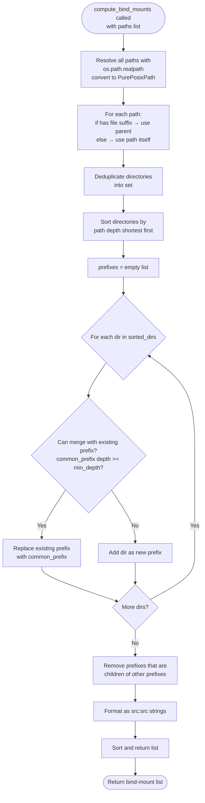

---

**Key Design Decisions:**

1. **Why symmetric bind-mounts (`src:src`)?**
   - Keeps host paths identical inside the container.
   - Simplifies path references in input files (no translation needed).
   - Alternative: map to shortened paths (e.g., `/data:/mnt/data`), but requires rewriting all path references.

2. **Why greedy merging?**
   - Minimizes number of `--bind` flags (faster container startup, less clutter).
   - Trade-off: may expose more directories than strictly necessary.
   - `min_depth` parameter provides safety net.

3. **Why resolve symlinks?**
   - Ensures real paths are mounted (container sees target, not symlink).
   - Avoids issues with broken symlinks or symlinks pointing outside mounted directories.

4. **Why separate files vs directories?**
   - Apptainer/Singularity bind-mounts are directory-based.
   - Mounting individual files is less efficient and more error-prone.
   - Extracting parent directories is more robust.

---

**TODO / Uncertainties:**

- **Performance:**
  - Greedy merging is O(n²) in worst case (n directories).
  - For very large path lists (1000s), could be slow.
  - Could optimize with prefix tree (trie) structure.

- **Edge cases:**
  - What if paths are on different filesystems (e.g., `/cluster` vs `/home`)?
  - Currently would mount both separately (correct behavior).
  - What if `min_depth` is too low and mounts `/`?
  - No explicit guard; caller must choose reasonable `min_depth`.

- **Collision handling:**
  - If two paths have same parent but one is a symlink to different location?
  - `realpath()` should handle this, but not explicitly tested.

- **Multi-architecture clusters:**
  - Code assumes POSIX paths (uses `PurePosixPath`).
  - Would break on Windows (but cluster context implies Linux/HPC).

- **Testing:**
  - No tests visible in the code (tests/ directory is [TODO]).
  - Need comprehensive test cases for edge cases (symlinks, deep nesting, etc.).

- **Usage context:**
  - This module is NOT currently used in any of the documented runners (AF3, Boltz).
  - Runners hardcode absolute bind-mount paths instead.
  - **Possible mismatch:** Module exists but isn't integrated?
  - May be for future use or for RF3 runner (not yet documented).

---

### `src/structure_pipeline/runners/oligo.py`

**Role:** Oligosaccharide definitions and AF3 builder helpers  
**Size:** 234 lines  
**Key Imports:**
- `logging` — Structured logging
- `re` — Regex for parsing oligo CCD codes
- `yaml` — Loading definitions from YAML file
- `dataclasses` — `@dataclass` decorator, `field` factory
- `pathlib.Path` — Path handling

**Purpose:**

This module implements **oligosaccharide support for AlphaFold3**. It maps high-level oligosaccharide identifiers (e.g., `"STA6"` = amylose with 6 glucose units) to low-level AF3 input format: multiple monomer CCD codes + covalent bond definitions between consecutive residues.

**Key Concept:**

Standard CCD (Chemical Component Dictionary) codes represent single molecules, not polymers. Oligosaccharides like cellulose (10 glucose units) or amylose (6 glucose units) would need custom CIF files for each chain length. Instead, this module:
1. Defines **prefixes** (e.g., `NAG`, `CEL`, `STA`) that map to monomer types and bond patterns.
2. Parses identifiers like `"CEL10"` → "10 copies of GLC monomer, linked via C1–O4 glycosidic bonds".
3. Generates AF3 input: `ccdCodes: ["GLC", "GLC", ..., "GLC"]` + `bondedAtomPairs: [["C", 1, "C1"], ["C", 2, "O4"]], ...]`.

---

**Constants:**

- **`_OLIGO_RE = re.compile(r"^([A-Za-z]+)(\d+)$")`**
  - Regex for parsing oligosaccharide CCD codes.
  - Group 1: alphabetical prefix (e.g., `NAG`, `CEL`, `STA`).
  - Group 2: numeric chain length (e.g., `6`, `10`).
  - Examples:
    - `"NAG6"` → `("NAG", "6")`
    - `"CEL12"` → `("CEL", "12")`
    - `"HEM"` → No match (not an oligo code).

---

**Classes:**

#### 1. **`OligoSpec` (frozen dataclass)**
   - **Purpose:** Definition of one oligosaccharide type.
   - **Fields:**
     - `prefix: str` — Oligosaccharide prefix (e.g., `"NAG"`, `"CEL"`).
     - `monomer: str` — CCD code of the repeating monomer (e.g., `"NAG"`, `"GLC"`, `"BGC"`).
     - `bond_atom_pair: tuple[str, str]` — Atom names for glycosidic bond (e.g., `("C1", "O4")`).
   - **Validation (`__post_init__`):**
     - `prefix` must be non-empty.
     - `monomer` must be non-empty.
     - `bond_atom_pair` must have exactly 2 elements, both non-empty strings.
   - **Example:**
     ```python
     OligoSpec(
         prefix="STA",
         monomer="BGC",  # Beta-D-glucose
         bond_atom_pair=("C1", "O4")  # Glycosidic bond
     )
     ```

#### 2. **`OligoRegistry` (frozen dataclass)**
   - **Purpose:** Registry of known oligosaccharide definitions.
   - **Fields:**
     - `specs: dict[str, OligoSpec]` — Mapping of prefix → spec.
   - **Default:** Empty dict (no-op registry).

---

**Methods:**

##### `OligoRegistry.parse(ccd_code) -> tuple[str, int, OligoSpec] | None`
   - **Purpose:** Try to interpret `ccd_code` as an oligosaccharide.
   - **Input:**
     - `ccd_code: str` — CCD code to parse (e.g., `"STA6"`, `"HEM"`).
   - **Output:**
     - If matches: `(prefix, n, spec)` where `prefix` is uppercase prefix, `n` is chain length, `spec` is `OligoSpec`.
     - If no match: `None`.
   - **Logic:**
     1. Apply `_OLIGO_RE` regex to `ccd_code`.
     2. If no match: return `None`.
     3. Extract `prefix` (uppercase) and `n` (integer).
     4. Look up `prefix` in `self.specs`.
     5. If not found: return `None`.
     6. If `n < 2`: log warning ("chain length < 2, treating as regular ligand"), return `None`.
     7. Return `(prefix, n, spec)`.
   - **Examples:**
     - `"STA6"` with `STA` registered → `("STA", 6, OligoSpec(...))`
     - `"HEM"` → `None` (no regex match)
     - `"NAG1"` → `None` (n < 2)
     - `"XYZ10"` → `None` (prefix not in registry)

##### `OligoRegistry.from_yaml(path) -> OligoRegistry` (classmethod)
   - **Purpose:** Load an `OligoRegistry` from a YAML file.
   - **Input:**
     - `path: Path` — Path to YAML file (e.g., `config/oligo_definitions.yaml`).
   - **Output:** `OligoRegistry` instance.
   - **YAML Format:**
     ```yaml
     oligo_definitions:
       NAG:
         monomer: NAG
         bond_atom_pair: ["C1", "O4"]
       CEL:
         monomer: GLC
         bond_atom_pair: ["C1", "O4"]
       STA:
         monomer: BGC
         bond_atom_pair: ["C1", "O4"]
     ```
   - **Logic:**
     1. Load YAML with `yaml.safe_load()`.
     2. Extract `oligo_definitions` key.
     3. For each prefix in definitions:
        - Validate `monomer` and `bond_atom_pair` fields exist.
        - `bond_atom_pair` must be a 2-element list.
        - Create `OligoSpec` instance.
        - Add to `specs` dict (prefix as uppercase key).
     4. Log: `"Loaded oligo registry with N definitions: NAG, CEL, STA"`.
     5. Return `OligoRegistry(specs=specs)`.
   - **Error handling:**
     - Raises `ValueError` if YAML is empty, missing `oligo_definitions` key, or invalid structure.
   - **Side effects:** Logs registry contents at INFO level.

##### `OligoRegistry.empty() -> OligoRegistry` (classmethod)
   - **Purpose:** Return an empty (no-op) registry.
   - **Output:** `OligoRegistry(specs={})` (no definitions).
   - **Usage:** When oligosaccharide support is not needed, or no config file provided.

---

**AF3 Builder Functions:**

##### `build_af3_oligo_ligand_entry(chain_id, spec, n) -> dict`
   - **Purpose:** Build a single AF3 `ligand` sequence entry for an oligosaccharide.
   - **Input:**
     - `chain_id: str` — Chain ID for the ligand (e.g., `"C"`).
     - `spec: OligoSpec` — Oligosaccharide definition.
     - `n: int` — Number of monomer units (chain length).
   - **Output:** AF3 ligand entry dict.
   - **Format:**
     ```python
     {
         "ligand": {
             "id": "C",
             "ccdCodes": ["GLC", "GLC", "GLC", "GLC", "GLC", "GLC"]  # n times
         }
     }
     ```
   - **Logic:** Repeats `spec.monomer` exactly `n` times in the `ccdCodes` array.

##### `build_af3_bonded_atom_pairs(chain_id, spec, n) -> list[list[list]]`
   - **Purpose:** Generate `bondedAtomPairs` for *n* residues linked end-to-end.
   - **Input:**
     - `chain_id: str` — Chain ID for the ligand.
     - `spec: OligoSpec` — Oligosaccharide definition.
     - `n: int` — Number of monomer units.
   - **Output:** List of bond entries for AF3 JSON.
   - **Format:**
     ```python
     [
         [["C", 1, "C1"], ["C", 2, "O4"]],  # Bond between residue 1 and 2
         [["C", 2, "C1"], ["C", 3, "O4"]],  # Bond between residue 2 and 3
         ...
         [["C", n-1, "C1"], ["C", n, "O4"]]  # Bond between residue n-1 and n
     ]
     ```
   - **Logic:**
     - For `i` from 1 to `n-1` (1-based indexing):
       - Create bond: `[[chain_id, i, atom_a], [chain_id, i+1, atom_b]]`
       - Where `atom_a, atom_b = spec.bond_atom_pair` (e.g., `"C1"`, `"O4"`).
     - Returns list of `n-1` bonds (for a chain of `n` residues).
   - **AF3 Requirements:**
     - Residue indices are **1-based** (not 0-based).
     - First residue is 1, second is 2, etc.

---

#### Flowchart: Oligosaccharide Processing

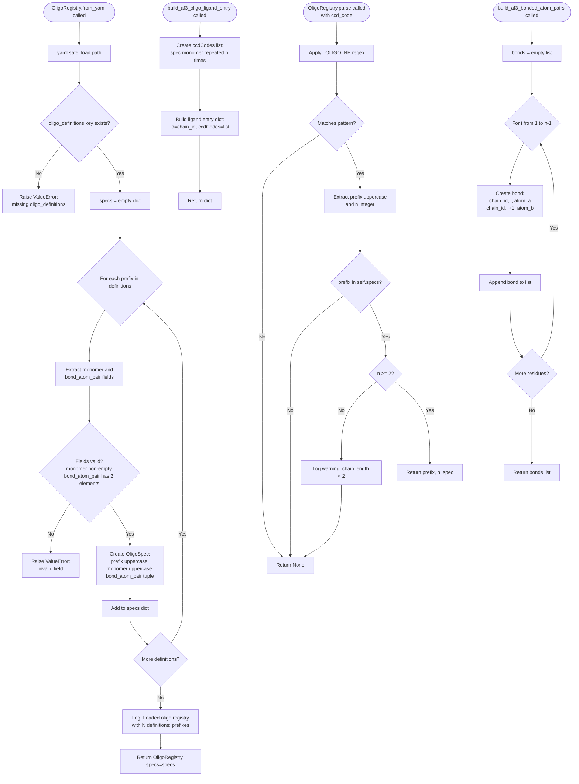

---

**Key Implementation Details:**

1. **Example YAML Config:**
   ```yaml
   oligo_definitions:
     NAG:  # N-acetylglucosamine (chitin)
       monomer: NAG
       bond_atom_pair: ["C1", "O4"]
     CEL:  # Cellulose
       monomer: GLC  # Beta-D-glucose
       bond_atom_pair: ["C1", "O4"]
     STA:  # Amylose (starch)
       monomer: BGC  # Beta-D-glucose
       bond_atom_pair: ["C1", "O4"]
   ```

2. **Example AF3 Input (STA6 = amylose with 6 glucose units):**
   ```json
   {
     "sequences": [
       {"protein": {"id": "A", "sequence": "MVT..."}},
       {"ligand": {"id": "B", "ccdCodes": ["CU"]}},
       {"ligand": {"id": "C", "ccdCodes": ["BGC", "BGC", "BGC", "BGC", "BGC", "BGC"]}}
     ],
     "bondedAtomPairs": [
       [["C", 1, "C1"], ["C", 2, "O4"]],
       [["C", 2, "C1"], ["C", 3, "O4"]],
       [["C", 3, "C1"], ["C", 4, "O4"]],
       [["C", 4, "C1"], ["C", 5, "O4"]],
       [["C", 5, "C1"], ["C", 6, "O4"]]
     ]
   }
   ```

3. **Bond Chemistry:**
   - Glycosidic bond: links monosaccharides in polysaccharides.
   - Typically between C1 (anomeric carbon) of one residue and O4 (hydroxyl oxygen) of the next.
   - Bond type (α or β) depends on stereochemistry (not modeled here; AF3 infers from monomer structure).

4. **Why 1-based Indexing?**
   - AF3 JSON format uses 1-based residue indices (common in structural biology, following PDB convention).
   - Python code is 0-based, but output JSON is 1-based.

5. **Linear Chains Only:**
   - Current implementation assumes **linear chains** (residue i bonds to i+1).
   - **No support for branched oligosaccharides** (e.g., amylopectin with α-1,6 branches).

---

**TODO / Uncertainties:**

- **Branched oligosaccharides:**
  - Current design cannot represent branches (e.g., glycogen, amylopectin).
  - Would need to extend `OligoSpec` with branch points and additional bond definitions.

- **Stereochemistry:**
  - Assumes monomer CCD code (e.g., `BGC`, `GLC`) encodes correct stereochemistry.
  - Does not explicitly specify α vs β linkages (AF3 must infer from monomer geometry).
  - **Unclear:** Does AF3 correctly infer linkage type from CCD codes alone?

- **Bond atom validation:**
  - No validation that atom names (`C1`, `O4`) exist in the monomer CCD definition.
  - Typos or incorrect atom names would cause AF3 errors (hard to debug).

- **Chain length limits:**
  - No maximum `n` enforced (could request 1000 residues).
  - Very long chains may exceed AF3 limits or be computationally infeasible.
  - Code warns if `n < 2` but doesn't check upper bound.

- **YAML error handling:**
  - Errors during YAML parsing (syntax, missing fields) raise `ValueError`.
  - Error messages could be more specific (e.g., "Missing 'monomer' field for prefix 'NAG' in line 5").

- **Usage context:**
  - Only used by AF3 runner (not Boltz or RF3).
  - Boltz format does not support multi-residue ligands (uses single `ccd` string).
  - RF3 support unclear (RF3 runner not yet documented).

- **Testing:**
  - `tests/test_oligo.py` is [TODO], so no tests visible yet.
  - Need comprehensive tests for: parsing, validation, bond generation, edge cases (n=2, large n, invalid YAML).

- **Alternative approaches:**
  - Could generate custom CIF files for each oligosaccharide (e.g., `STA6.cif` with 6 glucose units pre-bonded).
  - Current approach is more flexible (supports arbitrary chain lengths without pre-generating CIF files).
  - Trade-off: relies on AF3 correctly interpreting `bondedAtomPairs` (less tested than standard CCD codes).

---

### `src/structure_pipeline/runners/rf3.py`

**Role:** RoseTTAFold3 (RF3) runner implementation  
**Size:** 412 lines  
**Implements:** `RunnerInterface` from `.base`  
**Key Imports:**
- `json` — JSON input file generation
- `pathlib.Path` — path handling
- Internal: `.base.RunnerInterface`, `.base.RunnerResult`, `.cases.Case`, `.config.PipelineConfig`, `.ligand_utils.build_rf3_ligand_components`

**Purpose:** Implements the RF3 workflow following the proven batch-processing pattern from `rf3_B6EQJ6_direct_input.sh`. Key design: one SLURM job per ligand, with all proteins combined into a single JSON input array to share the model-load overhead.

---

#### Class: `RF3Runner(RunnerInterface)`

**Batching Strategy:**
- One SLURM job per ligand
- All proteins for that ligand are combined into a single JSON input array
- This allows the expensive RF3 model-load to happen only once per ligand

**Methods:**

1. **`model_name() -> str`** (property)
   - **Purpose:** Return model identifier.
   - **Output:** `"rf3"`
   - **Dependencies:** None

2. **`build_input_file(cases, protein_sequences, output_dir, msa_paths=None, ligand_cif_paths=None) -> Path`**
   - **Purpose:** Build RF3 JSON input file with one example per protein, all sharing the same ligand.
   - **Input:**
     - `cases`: List of `Case` objects (same ligand, different proteins)
     - `protein_sequences`: `dict[str, str]` mapping protein_id → amino acid sequence
     - `output_dir`: Directory to write input file
     - `msa_paths`: Optional `dict[str, str]` mapping protein_id → a3m file path
     - `ligand_cif_paths`: Optional `dict[str, Path]` mapping ligand_id → CIF file path
   - **Output:** Path to generated `rf3_input.json` file
   - **Logic:**
     - For each case, create a protein component with sequence and optional MSA path
     - Add ligand components via `build_rf3_ligand_components()` (prefers CIF path, falls back to CCD code)
     - Each example is named `{protein_id}_{ligand_ccd_code}`
     - All examples written to a single JSON file
   - **Side Effects:** Creates `output_dir`, writes JSON file
   - **Dependencies:** `build_rf3_ligand_components()` from `.ligand_utils`
   - **Errors:** Raises `ValueError` if no cases provided

3. **`build_command(input_file, output_dir, **kwargs) -> list[str]`**
   - **Purpose:** Build Hydra-style RF3 fold command (runs inside container).
   - **Input:**
     - `input_file`: Path to RF3 JSON input
     - `output_dir`: Output directory
     - `**kwargs`: Ignored
   - **Output:** Command as list of strings
   - **Logic:**
     - Constructs Python command calling RF3 CLI with Hydra-style arguments
     - Includes all config parameters: `n_recycles`, `diffusion_batch_size`, `num_steps`, `seed`, `early_stopping_plddt_threshold`, `skip_existing`
     - Sets `dump_predictions=True`, `dump_trajectories=False`
   - **Dependencies:** Config paths: `rf3_foundry_root`, `rf3_checkpoint`
   - **Note:** Command is formatted for execution inside Apptainer container

4. **`build_slurm_script(cases, protein_sequences, work_dir, job_name, msa_paths=None, msa_sqsh_file=None, ligand_cif_paths=None) -> str`**
   - **Purpose:** Build SLURM script for RF3, closely matching the proven `rf3_B6EQJ6_direct_input.sh` pattern.
   - **Input:**
     - `cases`: All cases for this ligand (different proteins)
     - `protein_sequences`: `dict[str, str]` mapping protein_id → sequence
     - `work_dir`: Work directory (e.g., `work/{ligand_ccd}/rf3/`)
     - `job_name`: SLURM job name
     - `msa_paths`: Optional protein_id → a3m file path mapping
     - `msa_sqsh_file`: Optional squashfs overlay for MSAs (not used)
     - `ligand_cif_paths`: Optional ligand_id → CIF file path mapping
   - **Output:** Complete SLURM bash script as string
   - **Logic:**
     - Sets up directories: `input_dir`, `outbase={work_dir}/runs`, `OUT={outbase}/$SLURM_JOB_ID` (per-run isolation)
     - Calls `build_input_file()` to generate JSON input
     - Builds SLURM header with GPU partition, memory, time limits
     - Cleans inherited container environment variables (Tykky/NRIS wrapper)
     - Loads NRIS/GPU module
     - Sources Foundry `.env` file if present
     - Sets Apptainer environment variables: `FOUNDRY_CHECKPOINT_DIRS`, `XDG_CACHE_HOME`, `TMPDIR`, `PYTHONPATH`, `PROJECT_ROOT`, `HYDRA_FULL_ERROR`
     - Creates Triton site directory for side-installation
     - Uses Apptainer with `--nv` flag and explicit bind-mounts
     - Inside container: checks for Triton 3.5.x, installs if missing, then runs RF3 fold command
     - Creates `latest` symlink and `DONE.ok` marker file on success
   - **Side Effects:** Creates input directory, writes JSON input file
   - **Dependencies:** Config paths, SLURM settings, `build_input_file()`
   - **Errors:** Raises `ValueError` if no cases provided
   - **Pattern Details:**
     - Per-run isolation: each SLURM job writes to `runs/$SLURM_JOB_ID`
     - Explicit bind-mounts for Foundry root, temp directory, and project workspace
     - Triton version check and conditional install to avoid conflicts
     - Bash `-lc` invocation to ensure login shell environment

5. **`parse_outputs(output_dir, cases) -> list[RunnerResult]`**
   - **Purpose:** Parse RF3 outputs for each case.
   - **Input:**
     - `output_dir`: Directory containing RF3 results
     - `cases`: List of cases to find results for
   - **Output:** List of `RunnerResult` objects
   - **Logic:**
     - For each case, construct pattern `{protein_id}_{ligand_ccd_code}`
     - Search for CIF files matching pattern (`**/{pattern}*_model_*.cif*`)
     - If found: mark success, record file paths
     - Search for metrics CSV (`**/{pattern}*_metrics.csv`)
     - If found: parse first row for pTM and pLDDT scores
     - Search for score files (`**/{pattern}*.score`)
     - If found and contains "early_stopped": record in metadata
   - **Side Effects:** None
   - **Dependencies:** CSV parsing (`csv` module)
   - **Error Handling:** Catches exceptions during metrics/score parsing, continues silently

6. **`validate_paths() -> list[str]`**
   - **Purpose:** Validate RF3 paths exist.
   - **Input:** None (uses `self.config`)
   - **Output:** List of error messages (empty list if all paths valid)
   - **Logic:**
     - Checks existence of: `rf3_foundry_root`, `rf3_image`, `rf3_checkpoint`
     - Ignores `PermissionError` (path may not be accessible but exists)
   - **Side Effects:** None
   - **Dependencies:** Config paths

---

**TODO / Uncertainties:**

- **Triton Installation:**
  - Script checks for Triton 3.5.x and installs to `$TRITON_SITE` if missing
  - **Unclear:** Why is Triton installed at runtime instead of baked into the container? (Possibly due to GPU architecture compatibility)
  - Risk: Installation could fail or timeout during job execution

- **Squashfs MSA Support:**
  - `msa_sqsh_file` parameter accepted but not used
  - Code comment: "Squashfs not used in this version"
  - **Inconsistency:** AF3 and Boltz runners use squashfs for MSAs, RF3 does not

- **Bind Mount Hardcoding:**
  - Script hardcodes bind-mount: `/cluster/work/projects/nn1003k:/cluster/work/projects/nn1003k`
  - **Non-portable:** Will fail outside this specific HPC environment
  - Should be computed from `work_dir` or made configurable

- **Foundry .env File:**
  - Sources `$FOUNDRY_ROOT/.env` if present but doesn't validate or document required variables
  - **Unclear:** What variables are expected in this file?

- **Error Handling:**
  - `build_input_file()` raises `ValueError` for empty cases, but no other validation
  - No checks for missing protein sequences or invalid ligand CCDs
  - `parse_outputs()` catches all exceptions and continues silently (could hide errors)

- **Output Structure:**
  - Expects files matching patterns like `{protein_id}_{ligand_ccd_code}_model_*.cif*`
  - **Unclear:** Does RF3 always produce this naming pattern? What if it changes across versions?

- **Early Stopping:**
  - Detects "early_stopped" in `.score` files but doesn't document the format
  - **Unclear:** What other information is in `.score` files?

- **Metrics Parsing:**
  - Reads only the first row of metrics CSV
  - **Assumption:** CSV has only one row per file
  - **Unclear:** What if RF3 outputs multiple models per case?

- **Skip Existing Logic:**
  - `skip_existing` parameter passed to RF3 but not tested or documented
  - **Unclear:** How does RF3 determine if output already exists? What if output is partial/corrupted?

- **Testing:**
  - `tests/test_rf3_runner.py` not yet documented (still [TODO])
  - No visible tests for this runner

---

**Mermaid Flowchart:**

```mermaid
flowchart TD
    A[RF3Runner.build_slurm_script] --> B[Create input_dir and outbase]
    B --> C[Call build_input_file]
    C --> C1[For each Case]
    C1 --> C2[Add protein component with sequence]
    C2 --> C3[Add MSA path if available]
    C3 --> C4[Call build_rf3_ligand_components]
    C4 --> C5[Write JSON with all examples]
    C5 --> D[Generate SLURM script]
    D --> D1[Set SLURM headers: GPU, mem, time]
    D1 --> D2[Clean container env vars]
    D2 --> D3[Load NRIS/GPU module]
    D3 --> D4[Source Foundry .env]
    D4 --> D5[Set Apptainer env vars]
    D5 --> D6[Create Triton site dir]
    D6 --> E[Apptainer exec --nv]
    E --> E1[Check Triton 3.5.x]
    E1 --> E2{Triton OK?}
    E2 --No--> E3[Install Triton]
    E2 --Yes--> E4[Run RF3 fold command]
    E3 --> E4
    E4 --> F[Create latest symlink]
    F --> G[Touch DONE.ok]
    G --> H[parse_outputs]
    H --> H1[For each Case]
    H1 --> H2[Find CIF files by pattern]
    H2 --> H3{Found?}
    H3 --Yes--> H4[Mark success, record paths]
    H3 --No--> H5[Mark failure]
    H4 --> H6[Search metrics CSV]
    H6 --> H7{Found?}
    H7 --Yes--> H8[Parse pTM, pLDDT]
    H7 --No--> H9[Skip metrics]
    H8 --> H10[Search .score file]
    H9 --> H10
    H10 --> H11{Early stopped?}
    H11 --Yes--> H12[Record in metadata]
    H11 --No--> H13[Continue]
    H12 --> H14[Return RunnerResult]
    H5 --> H14
    H13 --> H14
```

---

### `tests/__init__.py`

**Role:** Test package initialization  
**Size:** 3 lines  
**Content:** Only module docstring: "Tests for the structure pipeline."

**Purpose:** Marks the `tests/` directory as a Python package. No functions or classes.

---

### `tests/test_af3_runner.py`

**Role:** Unit tests for AF3 runner – specifically testing ligand CIF path and `userCCDPath` support  
**Size:** 267 lines  
**Key Imports:**
- `json`, `tempfile`, `pathlib.Path` — file handling
- `unittest.mock.MagicMock` — mocking config
- `pytest` — test framework
- `structure_pipeline.cases.Case`, `structure_pipeline.runners.af3.AF3Runner` — SUT (System Under Test)

**Purpose:** Verify that AF3Runner correctly handles ligand CIF files, specifically:
1. Ligand CIF path is copied to input directory
2. `userCCDPath` is set in JSON input when CIF provided
3. Mandatory CU ligand is added correctly
4. No duplicate CU when CU is the main ligand
5. Patch script correctly transforms JSON for multi-seed jobs

---

#### Helper Functions

1. **`_af3_ligand_entries(data) -> list`**
   - **Purpose:** Extract ligand entries from AF3 JSON data.
   - **Input:** `data` — parsed JSON dict
   - **Output:** List of ligand dicts from `sequences` array
   - **Logic:** Filters `sequences` for entries with `"ligand"` key

---

#### Fixtures

1. **`mock_config()`**
   - **Purpose:** Create minimal PipelineConfig mock for AF3Runner.
   - **Output:** `MagicMock` with AF3 config attributes
   - **Attributes Set:**
     - `af3.seeds`, `af3.num_diffusion_samples`, `af3.jackhmmer_n_cpu`
     - Paths: `af3_dir`, `af3_cpu_image`, `af3_gpu_image`, `af3_weights`, `af3_databases`
     - SLURM: `account`, partitions, CPU/GPU settings, memory, time limits
   - **Usage:** Injected into test methods via pytest fixture

2. **`runner(mock_config)`**
   - **Purpose:** Create AF3Runner instance with mock config.
   - **Output:** `AF3Runner` instance
   - **Dependencies:** `mock_config` fixture

---

#### Test Classes

##### **Class: `TestBuildMsaInputFile`**

Tests for `AF3Runner.build_msa_input_file()` method.

1. **`test_without_cif_path(runner)`**
   - **Purpose:** Verify that without ligand CIF, no `userCCDPath` appears in JSON.
   - **Setup:** Call `build_msa_input_file()` with protein, sequence, ligand CCD (no CIF path)
   - **Assertions:**
     - `userCCDPath` not in JSON
     - Ligands are `["CU", "CEL6"]` with IDs `["B", "C"]`
   - **Expected:** Mandatory CU ligand added, no CIF path

2. **`test_with_cif_path(runner)`**
   - **Purpose:** Verify that with ligand CIF, `userCCDPath` is set correctly.
   - **Setup:** Call `build_msa_input_file()` with CIF path
   - **Assertions:**
     - `userCCDPath` equals the CIF path
     - Ligands are `["CU", "CEL6"]` with IDs `["B", "C"]`
   - **Expected:** CIF path recorded in JSON

3. **`test_with_cu_ligand(runner)`**
   - **Purpose:** Verify CU is not duplicated when it is the main ligand.
   - **Setup:** Call `build_msa_input_file()` with `"CU"` as ligand CCD
   - **Assertions:**
     - Ligands are `["CU"]` (not duplicated)
     - ID is `["B"]`
   - **Expected:** No duplicate mandatory CU

##### **Class: `TestBuildInputFile`**

Tests for `AF3Runner.build_input_file()` method (multi-case inference input).

1. **`test_without_cif(runner)`**
   - **Purpose:** Verify inference JSON without CIF has no `userCCDPath`.
   - **Setup:** Create Case, call `build_input_file()` with no `ligand_cif_paths`
   - **Assertions:** `userCCDPath` not in JSON
   - **Expected:** Standard behavior without CIF

2. **`test_with_cif(runner)`**
   - **Purpose:** Verify inference JSON with CIF has `userCCDPath` set.
   - **Setup:** Create Case, call `build_input_file()` with `ligand_cif_paths`
   - **Assertions:** `userCCDPath` equals CIF path
   - **Expected:** CIF path propagated to JSON

##### **Class: `TestBuildMsaSlurmScript`**

Tests for `AF3Runner.build_msa_slurm_script()` method.

1. **`test_script_without_cif(runner)`**
   - **Purpose:** Verify MSA script without CIF is correct.
   - **Setup:** Call `build_msa_slurm_script()` with no `ligand_cif_path`
   - **Assertions:**
     - SLURM header includes job name
     - Script references `af3_msa_input.json`
     - Squashfs bind mount with `image-src=/public_databases` present
     - `AF3_DATABASES_SQUASHFS` variable present
     - No double-quotes around bind-mount paths (bash syntax check)
     - Generated JSON has no `userCCDPath`
     - Ligands are `["CU", "CEL6"]`
   - **Expected:** Correct script generation without CIF

2. **`test_script_with_cif(runner)`**
   - **Purpose:** Verify MSA script with CIF copies CIF and sets `userCCDPath`.
   - **Setup:** Create temporary CIF file, call `build_msa_slurm_script()` with `ligand_cif_path`
   - **Assertions:**
     - CIF copied to `work_dir/input/CEL6.cif`
     - JSON points to container path `/root/af_input/CEL6.cif`
     - No `userCCD` field (only `userCCDPath`)
     - Ligands are `["CU", "CEL6"]`
   - **Expected:** CIF file copied and referenced correctly

##### **Class: `TestBuildInferenceSlurmScript`**

Tests for `AF3Runner.build_slurm_script()` method (inference).

1. **`test_inference_script_with_cif(runner)`**
   - **Purpose:** Verify inference script with CIF uses patch script correctly.
   - **Setup:** Create temporary CIF file, call `build_slurm_script()` with `ligand_cif_paths`
   - **Assertions:**
     - CIF copied to `work_dir/input/CEL6.cif`
     - Standalone patch script `_patch_json.py` written to input dir
     - Script invokes patch script with container CIF path `/root/af_input/CEL6.cif`
   - **Expected:** Patch script used to transform JSON with CIF path

2. **`test_inference_script_without_cif(runner)`**
   - **Purpose:** Verify inference script without CIF calls patch script without CIF arg.
   - **Setup:** Call `build_slurm_script()` with no `ligand_cif_paths`
   - **Assertions:**
     - Patch script `_patch_json.py` written
     - Script does NOT contain `/root/af_input/` (no CIF path arg)
     - No inline Python heredoc `<<'PY'`
     - Squashfs bind mount with `image-src=/public_databases` present
     - `AF3_DATABASES_SQUASHFS` variable present
   - **Expected:** Patch script called without CIF path

##### **Class: `TestPatchJsonScript`**

Tests for the generated `_patch_json.py` script.

1. **`test_removes_userccd_and_sets_userccdpath(runner)`**
   - **Purpose:** Verify patch script removes `userCCD` and sets `userCCDPath`.
   - **Setup:**
     - Create temporary JSON with `userCCD` field
     - Write patch script via `runner._write_patch_script()`
     - Run patch script with Python: `src.json` → `dst.json` with CIF path arg
   - **Assertions:**
     - `userCCD` removed from patched JSON
     - `userCCDPath` set to CIF path
     - Ligands are `["CU", "CEL6"]` with IDs matching
   - **Expected:** Patch script correctly transforms JSON

---

**TODO / Uncertainties:**

- **Integration with AF3:**
  - Tests mock the runner but don't test actual AF3 execution
  - **Unclear:** Does AF3 actually accept and use `userCCDPath` as expected?

- **Container Path Assumptions:**
  - Tests assume container paths like `/root/af_input/` and `/public_databases`
  - **Unclear:** Are these paths consistent across AF3 versions/installations?

- **Patch Script Robustness:**
  - Only one test for patch script behavior
  - **Missing tests:** Error handling (invalid JSON, missing fields, wrong arguments)

- **Squashfs Testing:**
  - Tests verify squashfs references in script but don't test actual squashfs functionality
  - **Unclear:** How is squashfs mounted and used in practice?

- **Bind Mount Syntax:**
  - Test checks for absence of `"${` in script (except specific patterns)
  - **Unclear:** What was the original bug this is checking for?

- **File Paths:**
  - Tests use temporary directories, but actual pipeline uses specific workspace paths
  - **Unclear:** Do tests cover all path edge cases (spaces, special chars, symlinks)?

---

**Mermaid Flowchart:**

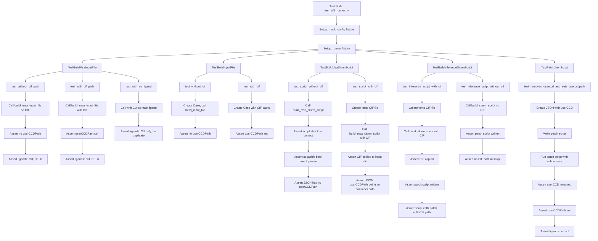

---

### `tests/test_boltz_runner.py`

**Role:** Unit tests for Boltz runner – specifically testing mandatory CU ligand logic  
**Size:** 66 lines  
**Key Imports:**
- `yaml`, `pathlib.Path` — file handling
- `unittest.mock.MagicMock` — mocking config
- `structure_pipeline.cases.Case`, `structure_pipeline.runners.boltz.BoltzRunner` — SUT

**Purpose:** Verify that BoltzRunner correctly:
1. Adds mandatory CU ligand to all inputs
2. Does not duplicate CU when it is the main ligand
3. Tracks main ligand in affinity binder when `use_affinity=True`

---

#### Helper Functions

1. **`_load_single_yaml(path: Path) -> dict`**
   - **Purpose:** Load and parse single YAML file.
   - **Input:** `path` — Path to YAML file
   - **Output:** Parsed YAML as dict
   - **Dependencies:** `yaml.safe_load()`

2. **`_make_case(ccd_code: str) -> Case`**
   - **Purpose:** Create test Case object with given ligand CCD.
   - **Input:** `ccd_code` — ligand CCD code
   - **Output:** `Case` instance with default values
   - **Fixed Attributes:** `case_id="abc123"`, `protein_id="P001"`, `ligand_id="L001"`, `model="boltz"`, `msa_source="mmseqs"`, `msa_path=""`

3. **`_make_runner(use_affinity: bool = False) -> BoltzRunner`**
   - **Purpose:** Create BoltzRunner instance with minimal mock config.
   - **Input:** `use_affinity` — whether to enable affinity mode
   - **Output:** `BoltzRunner` instance
   - **Config:** Only sets `cfg.boltz.use_affinity`

---

#### Test Class: `TestBoltzMandatoryCu`

Tests for mandatory CU ligand logic in BoltzRunner.

1. **`test_adds_cu_ligand(tmp_path)`**
   - **Purpose:** Verify CU ligand is added when main ligand is non-CU.
   - **Setup:**
     - Create Case with `"CEL6"` ligand
     - Call `build_input_file()` with one case
   - **Assertions:**
     - YAML output contains ligands `["CU", "CEL6"]`
     - Ligand IDs are `["B", "C"]`
   - **Expected:** Mandatory CU added before main ligand

2. **`test_no_duplicate_when_cu_is_main(tmp_path)`**
   - **Purpose:** Verify CU is not duplicated when it is the main ligand.
   - **Setup:**
     - Create Case with `"CU"` ligand
     - Call `build_input_file()`
   - **Assertions:**
     - YAML output contains ligands `["CU"]` (not duplicated)
     - Ligand ID is `["B"]`
   - **Expected:** No duplicate CU

3. **`test_affinity_binder_tracks_main_ligand(tmp_path)`**
   - **Purpose:** Verify affinity binder points to main ligand (not CU).
   - **Setup:**
     - Create runner with `use_affinity=True`
     - Create Case with `"CEL6"` ligand
     - Call `build_input_file()`
   - **Assertions:**
     - YAML `properties[0]["affinity"]["binder"]` equals `"C"` (CEL6's ID, not CU's "B")
   - **Expected:** Affinity tracks main ligand despite CU being added

---

**TODO / Uncertainties:**

- **Affinity Mode Logic:**
  - Only one test for affinity mode
  - **Missing tests:** What happens with affinity mode when CU is the main ligand? Does binder point to "B"?

- **Multi-Ligand Cases:**
  - Tests only cover single case per input file
  - **Unclear:** How does batching work? Are multiple cases written to one YAML or separate files?

- **CU Rationale:**
  - Tests verify behavior but don't document *why* CU is mandatory
  - **Unclear:** Is CU required by Boltz model, or is it a domain-specific requirement (e.g., metalloproteins)?

- **Ligand ID Assignment:**
  - Tests assume IDs start at "B" (protein is "A")
  - **Unclear:** What if protein has multiple chains? Would ligand IDs shift?

- **MSA Handling:**
  - Tests don't cover MSA paths or MSA generation
  - **Missing tests:** How are `msa_source="mmseqs"` cases handled differently from `msa_source="native"`?

- **Integration:**
  - Tests mock runner but don't test actual Boltz execution
  - **Unclear:** Does Boltz actually require CU, or is this a workaround?

- **Config Coverage:**
  - Tests only mock `boltz.use_affinity`
  - **Missing:** Tests for other Boltz config options (recycling, diffusion steps, etc.)

---

**Mermaid Flowchart:**

```mermaid
flowchart TD
    A[Test Suite: test_boltz_runner.py] --> B[Helper: _make_case]
    A --> C[Helper: _make_runner]
    A --> D[Helper: _load_single_yaml]
    
    A --> E[TestBoltzMandatoryCu]
    E --> E1[test_adds_cu_ligand]
    E --> E2[test_no_duplicate_when_cu_is_main]
    E --> E3[test_affinity_binder_tracks_main_ligand]
    
    E1 --> E1A[Create Case with CEL6]
    E1A --> E1B[Call build_input_file]
    E1B --> E1C[Load YAML output]
    E1C --> E1D{Ligands correct?}
    E1D --Yes--> E1E[Assert CU, CEL6 with IDs B, C]
    E1D --No--> E1F[Test fails]
    
    E2 --> E2A[Create Case with CU]
    E2A --> E2B[Call build_input_file]
    E2B --> E2C[Load YAML output]
    E2C --> E2D{No duplicate?}
    E2D --Yes--> E2E[Assert CU only with ID B]
    E2D --No--> E2F[Test fails]
    
    E3 --> E3A[Create runner with use_affinity=True]
    E3A --> E3B[Create Case with CEL6]
    E3B --> E3C[Call build_input_file]
    E3C --> E3D[Load YAML output]
    E3D --> E3E{Affinity binder correct?}
    E3E --Yes--> E3F[Assert binder=C, not B]
    E3E --No--> E3G[Test fails]
```

---

### `tests/test_cases.py`

**Role:** Unit tests for case generation and grouping logic  
**Size:** 240 lines  
**Key Imports:**
- `pytest` — test framework
- `.cases` — `Case`, `CaseStatus`, `generate_cases`, grouping functions, `_generate_case_id`
- `.manifest.proteins`, `.manifest.ligands`, `.manifest.msa` — record types for fixtures

**Purpose:**  
Validates the core business logic for generating case combinations (protein × ligand × model) and grouping cases for batch execution. Tests both successful case generation and edge cases (missing MSA, skipped cases).

**Test Classes:**

#### **1. `TestCaseIdGeneration`**

Tests the internal `_generate_case_id()` function:

- **`test_deterministic()`**
  - **Purpose:** Verify that identical inputs produce identical case IDs
  - **Assertion:** Same protein, ligand, model, MSA source → same ID
  - **Dependencies:** `_generate_case_id()`

- **`test_different_inputs_different_ids()`**
  - **Purpose:** Verify that different inputs produce unique IDs
  - **Assertion:** Changing model or MSA source → different ID
  - **Logic:** Critical for ensuring case uniqueness across combinations

#### **2. `TestGenerateCases`**

Tests the main `generate_cases()` function:

**Fixtures:**
- `proteins`: List of 2 ProteinRecords (P001, P002)
- `ligands`: List of 2 LigandRecords (L001/AMY, L002/CEL)
- `msa_records`: MSA for P001 only (P002 missing)

**Tests:**

- **`test_generate_all_combinations()`**
  - **Purpose:** Verify that all valid protein × ligand × model combinations are generated
  - **Assertions:**
    - Total cases: 2 proteins × 2 ligands × 3 models = 12
    - AF3 cases: 4 total, all `msa_source="native"`, all `status=PENDING`
    - Boltz P001 cases: 2 total, `status=PENDING`, MSA path set
    - Boltz P002 cases: 2 total, `status=SKIPPED` (no MSA)
  - **Logic:** AF3 uses native MSA (always available), Boltz requires external MSA
  - **Dependencies:** `generate_cases()`, status logic for missing MSA

- **`test_output_dir_name()`**
  - **Purpose:** Verify that `output_dir_name` follows `{protein_id}_{ccd_code}` format
  - **Assertion:** Case for P001 + AMY → `output_dir_name="P001_AMY"`
  - **Logic:** This naming convention is used for organizing outputs by ligand

#### **3. `TestGroupCases`**

Tests case grouping functions for batch execution:

**Fixture:**
- `sample_cases`: 4 cases covering different protein/ligand/model combinations

**Tests:**

- **`test_group_by_protein_model()`**
  - **Purpose:** Verify grouping by (protein_id, model) key
  - **Assertions:**
    - 3 groups: (P001, af3), (P002, af3), (P001, boltz)
    - (P001, af3) contains 2 cases (AMY + CEL)
    - Other groups contain 1 case each
  - **Use Case:** Batch cases that share a protein and model (e.g., for AF3 MSA job)
  - **Dependencies:** `group_cases_by_protein_model()`

- **`test_group_by_ligand_model()`**
  - **Purpose:** Verify grouping by (ligand_ccd_code, model) key
  - **Assertions:**
    - 3 groups: (AMY, af3), (AMY, boltz), (CEL, af3)
    - (AMY, af3) contains 2 cases (P001 + P002)
    - Other groups contain 1 case each
  - **Use Case:** Batch cases that share a ligand and model
  - **Dependencies:** `group_cases_by_ligand_model()`

- **`test_skip_skipped_cases()`**
  - **Purpose:** Verify that skipped cases are excluded from grouping
  - **Assertions:**
    - Skipped case → 0 groups in both grouping functions
  - **Logic:** Skipped cases should not be submitted for execution
  - **Dependencies:** Both grouping functions, `CaseStatus.SKIPPED`

**Test Coverage:**

✅ **Covered:**
- Case ID determinism and uniqueness
- All combination generation (protein × ligand × model)
- MSA source assignment (native for AF3, mmseqs for Boltz/RF3)
- Status logic (PENDING vs SKIPPED for missing MSA)
- Both grouping strategies (by protein-model and ligand-model)
- Skipped case filtering

❌ **Not Covered:**
- Case generation with oligomerization configs
- Resume logic (marking cases as DONE, FAILED, RUNNING)
- Output directory creation/validation
- Edge case: empty input lists (no proteins/ligands/models)

**Mermaid Flowchart:**

```mermaid
flowchart TD
    A[Test Suite: test_cases.py] --> B[TestCaseIdGeneration]
    A --> C[TestGenerateCases]
    A --> D[TestGroupCases]
    
    B --> B1[test_deterministic]
    B --> B2[test_different_inputs_different_ids]
    
    B1 --> B1A[Call _generate_case_id twice with same args]
    B1A --> B1B{IDs equal?}
    B1B --Yes--> B1C[Pass]
    B1B --No--> B1D[Fail]
    
    B2 --> B2A[Call _generate_case_id with different model]
    B2A --> B2B{IDs different?}
    B2B --Yes--> B2C[Pass]
    B2B --No--> B2D[Fail]
    
    C --> C1[Fixtures: proteins, ligands, msa_records]
    C1 --> C2[test_generate_all_combinations]
    C1 --> C3[test_output_dir_name]
    
    C2 --> C2A[Call generate_cases with 2×2×3]
    C2A --> C2B{12 cases total?}
    C2B --Yes--> C2C{AF3 cases correct?}
    C2C --Yes--> C2D{Boltz P001 PENDING?}
    C2D --Yes--> C2E{Boltz P002 SKIPPED?}
    C2E --Yes--> C2F[Pass]
    C2E --No--> C2G[Fail]
    
    C3 --> C3A[Generate cases for rf3]
    C3A --> C3B[Extract case for P001+AMY]
    C3B --> C3C{output_dir_name == P001_AMY?}
    C3C --Yes--> C3D[Pass]
    C3C --No--> C3E[Fail]
    
    D --> D1[Fixture: sample_cases]
    D1 --> D2[test_group_by_protein_model]
    D1 --> D3[test_group_by_ligand_model]
    D1 --> D4[test_skip_skipped_cases]
    
    D2 --> D2A[Call group_cases_by_protein_model]
    D2A --> D2B{3 groups?}
    D2B --Yes--> D2C{P001,af3 has 2 cases?}
    D2C --Yes--> D2D[Pass]
    D2C --No--> D2E[Fail]
    
    D3 --> D3A[Call group_cases_by_ligand_model]
    D3A --> D3B{3 groups?}
    D3B --Yes--> D3C{AMY,af3 has P001+P002?}
    D3C --Yes--> D3D[Pass]
    D3C --No--> D3E[Fail]
    
    D4 --> D4A[Create skipped case]
    D4A --> D4B[Group by protein_model]
    D4B --> D4C{0 groups?}
    D4C --Yes--> D4D[Group by ligand_model]
    D4D --> D4E{0 groups?}
    D4E --Yes--> D4F[Pass]
    D4E --No--> D4G[Fail]
```

---

### `tests/test_ccd_list.py`

**Role:** Unit tests for CCD-list ligand loading (alternative to CIF directory scanning)  
**Size:** 100 lines  
**Key Imports:**
- `pytest` — test framework
- `tempfile`, `pathlib.Path` — test file creation
- `.manifest.ligands` — `load_ccd_list()`, `LigandRecord`

**Purpose:**  
Validates the CCD-list loading feature, which allows specifying ligands by CCD code only (no CIF files required). Tests comment/blank handling, deduplication, ID assignment, and error cases.

**Test Class:**

#### **`TestLoadCCDList`**

Tests the `load_ccd_list()` function:

**Tests:**

- **`test_basic_list()`**
  - **Purpose:** Verify basic loading of CCD codes from a text file
  - **Input:** Text file with `"CEL6\nSTA6\nNAG6\n"`
  - **Assertions:**
    - 3 LigandRecords created
    - `ccd_code` values: "CEL6", "STA6", "NAG6"
    - `category` set to `"ccd_list"` for all
    - `cif_path`, `filename`, `cif_sha256` all empty strings (no CIF files)
  - **Logic:** CCD-list mode = no local CIF files, relies on external CCD database
  - **Dependencies:** `load_ccd_list()`

- **`test_skip_comments_and_blanks()`**
  - **Purpose:** Verify that comments (lines starting with `#`) and blank lines are ignored
  - **Input:** `"# This is a comment\nCEL6\n\n# Another comment\nCU\n\n"`
  - **Assertions:**
    - 2 LigandRecords created (CEL6, CU)
    - Comments and blank lines skipped
  - **Logic:** Allows annotated CCD-list files
  - **Dependencies:** `load_ccd_list()`

- **`test_skip_duplicates()`**
  - **Purpose:** Verify that duplicate CCD codes are deduplicated
  - **Input:** `"CEL6\nSTA6\nCEL6\n"`
  - **Assertions:**
    - 2 LigandRecords created (CEL6, STA6)
    - CEL6 appears only once
  - **Logic:** Prevents duplicate ligands in manifest
  - **Dependencies:** `load_ccd_list()`

- **`test_sequential_ids()`**
  - **Purpose:** Verify that ligand IDs are assigned sequentially as L001, L002, L003, ...
  - **Input:** `"A\nB\nC\n"`
  - **Assertions:**
    - `ligand_id` values: ["L001", "L002", "L003"]
  - **Logic:** Sequential IDs ensure consistency across manifest types
  - **Dependencies:** `load_ccd_list()`

- **`test_empty_file_raises()`**
  - **Purpose:** Verify that a file with no valid CCD codes raises ValueError
  - **Input:** `"# Only comments\n\n"`
  - **Assertions:**
    - Raises `ValueError` with message matching "No CCD codes"
  - **Logic:** Empty ligand list is invalid for pipeline execution
  - **Dependencies:** `load_ccd_list()`

- **`test_missing_file_raises()`**
  - **Purpose:** Verify that a non-existent file raises FileNotFoundError
  - **Input:** Path to `/nonexistent/ccd_list.txt`
  - **Assertions:**
    - Raises `FileNotFoundError`
  - **Logic:** Standard file error handling
  - **Dependencies:** `load_ccd_list()`

**Test Coverage:**

✅ **Covered:**
- Basic CCD code parsing
- Comment and blank line filtering
- Deduplication of CCD codes
- Sequential ligand ID assignment
- Empty file error handling
- Missing file error handling
- CCD-list mode metadata (empty CIF fields, category="ccd_list")

❌ **Not Covered:**
- Whitespace handling (leading/trailing spaces in CCD codes)
- Case sensitivity (should "cel6" be uppercased to "CEL6"?)
- Invalid CCD code format (e.g., too long, special characters)
- Integration with actual pipeline execution (are CCD codes resolved correctly?)

**Mermaid Flowchart:**

```mermaid
flowchart TD
    A[Test Suite: test_ccd_list.py] --> B[TestLoadCCDList]
    
    B --> B1[test_basic_list]
    B --> B2[test_skip_comments_and_blanks]
    B --> B3[test_skip_duplicates]
    B --> B4[test_sequential_ids]
    B --> B5[test_empty_file_raises]
    B --> B6[test_missing_file_raises]
    
    B1 --> B1A[Create temp file: CEL6, STA6, NAG6]
    B1A --> B1B[Call load_ccd_list]
    B1B --> B1C{3 records?}
    B1C --Yes--> B1D{CCD codes correct?}
    B1D --Yes--> B1E{category=ccd_list?}
    B1E --Yes--> B1F{CIF fields empty?}
    B1F --Yes--> B1G[Pass]
    B1F --No--> B1H[Fail]
    
    B2 --> B2A[Create file with comments/blanks]
    B2A --> B2B[Call load_ccd_list]
    B2B --> B2C{Only CEL6, CU loaded?}
    B2C --Yes--> B2D[Pass]
    B2C --No--> B2E[Fail]
    
    B3 --> B3A[Create file: CEL6, STA6, CEL6]
    B3A --> B3B[Call load_ccd_list]
    B3B --> B3C{Only 2 records?}
    B3C --Yes--> B3D{CEL6 appears once?}
    B3D --Yes--> B3E[Pass]
    B3D --No--> B3F[Fail]
    
    B4 --> B4A[Create file: A, B, C]
    B4A --> B4B[Call load_ccd_list]
    B4B --> B4C{IDs = L001, L002, L003?}
    B4C --Yes--> B4D[Pass]
    B4C --No--> B4E[Fail]
    
    B5 --> B5A[Create file with only comments]
    B5A --> B5B[Call load_ccd_list]
    B5B --> B5C{Raises ValueError?}
    B5C --Yes--> B5D{Match 'No CCD codes'?}
    B5D --Yes--> B5E[Pass]
    B5D --No--> B5F[Fail]
    
    B6 --> B6A[Call load_ccd_list with nonexistent path]
    B6A --> B6B{Raises FileNotFoundError?}
    B6B --Yes--> B6C[Pass]
    B6B --No--> B6D[Fail]
```

---

### `tests/test_integration.py`

**Role:** Integration test infrastructure using a fake runner  
**Size:** 85 lines  
**Key Imports:**
- `pytest` — test framework
- `tempfile`, `pathlib.Path` — temporary directories for test outputs
- `.config` — `PipelineConfig` (not used in current tests)
- `.cases` — `Case`
- `.runners.base` — `RunnerInterface`, `RunnerResult`

**Purpose:**  
Provides a minimal integration test using a `FakeRunner` that implements the `RunnerInterface`. Tests the runner contract (input file generation, command building, SLURM script generation, output parsing) without executing real models.

**Classes:**

#### **1. `FakeRunner(RunnerInterface)`**

A minimal test double implementing the runner interface:

**Properties:**

- **`model_name`** → `"fake"`
  - **Purpose:** Identifies the runner type
  - **Return:** String "fake"

**Methods:**

- **`build_input_file(cases, protein_sequences, output_dir)`**
  - **Purpose:** Create a dummy input file for testing
  - **Logic:**
    - Creates `output_dir` if needed
    - Writes `fake_input.json` with content `{"test": true}`
    - Returns Path to the input file
  - **Side Effects:** Creates directory and file on disk
  - **Dependencies:** None

- **`build_command(input_file, output_dir, **kwargs)`**
  - **Purpose:** Generate a dummy command for testing
  - **Return:** `["echo", "fake", "command"]`
  - **Logic:** Simple placeholder command that won't fail
  - **Dependencies:** None

- **`build_slurm_script(cases, protein_sequences, work_dir, job_name)`**
  - **Purpose:** Generate a minimal SLURM script for testing
  - **Return:** Bash script string with SLURM directives
  - **Logic:**
    - Includes `#!/bin/bash` shebang
    - Includes `#SBATCH --job-name={job_name}` directive
    - Echoes a message about case count
    - Creates `DONE.ok` marker file in work_dir
  - **Side Effects:** None (returns script string, doesn't execute)
  - **Dependencies:** None

- **`parse_outputs(output_dir, cases)`**
  - **Purpose:** Generate successful results for all cases
  - **Return:** List of `RunnerResult` objects with `success=True`
  - **Logic:** Creates one result per case, all marked successful
  - **Side Effects:** None
  - **Dependencies:** `RunnerResult`

**Test Class:**

#### **2. `TestFakeRunner`**

Tests the FakeRunner implementation:

**Tests:**

- **`test_build_input_file()`**
  - **Purpose:** Verify that `build_input_file()` creates a valid input file
  - **Setup:**
    - Create FakeRunner with `config=None`
    - Create a Case with protein P001, ligand L001/AMY
    - Create temp directory for output
  - **Assertions:**
    - Input file exists after call
    - Input file has `.json` suffix
  - **Logic:** Tests the file creation contract
  - **Dependencies:** `FakeRunner.build_input_file()`

- **`test_build_slurm_script()`**
  - **Purpose:** Verify that `build_slurm_script()` generates valid SLURM script content
  - **Setup:**
    - Create FakeRunner with `config=None`
    - Create a Case with protein P001, ligand L001/AMY
    - Create temp directory for work_dir
  - **Assertions:**
    - Script contains `"#!/bin/bash"`
    - Script contains `"#SBATCH"`
    - Script contains job name `"test_job"`
    - Script contains `"DONE.ok"` marker file creation
  - **Logic:** Tests the SLURM script contract
  - **Dependencies:** `FakeRunner.build_slurm_script()`

**Test Coverage:**

✅ **Covered:**
- Input file creation contract
- SLURM script generation contract
- FakeRunner implements RunnerInterface

❌ **Not Covered:**
- Command building (no test for `build_command()`)
- Output parsing (no test for `parse_outputs()`)
- Integration with executors (LocalExecutor, SlurmExecutor)
- Error handling in runners
- Full pipeline execution (CLI → executor → runner → results)

**Notes:**

⚠️ **Limited Integration Testing:**
- This file provides infrastructure but lacks comprehensive integration tests
- Real integration would test: CLI parsing → case generation → executor submission → runner execution → result collection
- Current tests only verify the runner interface contract, not end-to-end flow

**Mermaid Flowchart:**

```mermaid
flowchart TD
    A[Test Suite: test_integration.py] --> B[FakeRunner]
    A --> C[TestFakeRunner]
    
    B --> B1[model_name property]
    B --> B2[build_input_file]
    B --> B3[build_command]
    B --> B4[build_slurm_script]
    B --> B5[parse_outputs]
    
    B2 --> B2A[Create output_dir]
    B2A --> B2B[Write fake_input.json]
    B2B --> B2C[Return file path]
    
    B4 --> B4A[Generate bash shebang]
    B4A --> B4B[Add SBATCH directives]
    B4B --> B4C[Echo case count]
    B4C --> B4D[Touch DONE.ok marker]
    B4D --> B4E[Return script string]
    
    B5 --> B5A[Iterate over cases]
    B5A --> B5B[Create RunnerResult with success=True]
    B5B --> B5C[Return result list]
    
    C --> C1[test_build_input_file]
    C --> C2[test_build_slurm_script]
    
    C1 --> C1A[Create FakeRunner]
    C1A --> C1B[Create test Case]
    C1B --> C1C[Create temp dir]
    C1C --> C1D[Call build_input_file]
    C1D --> C1E{File exists?}
    C1E --Yes--> C1F{Has .json suffix?}
    C1F --Yes--> C1G[Pass]
    C1F --No--> C1H[Fail]
    
    C2 --> C2A[Create FakeRunner]
    C2A --> C2B[Create test Case]
    C2B --> C2C[Create temp dir]
    C2C --> C2D[Call build_slurm_script]
    C2D --> C2E{Has shebang?}
    C2E --Yes--> C2F{Has SBATCH?}
    C2F --Yes--> C2G{Has job name?}
    C2G --Yes--> C2H{Has DONE.ok?}
    C2H --Yes--> C2I[Pass]
    C2H --No--> C2J[Fail]
```

---

### `tests/test_ligands.py`

**Role:** Unit tests for ligand scanning and manifest I/O  
**Size:** 124 lines  
**Key Imports:**
- `pytest` — test framework
- `tempfile`, `pathlib.Path` — temporary files/directories for testing
- `.manifest.ligands` — `LigandRecord`, `scan_ligands()`, `write_ligands_manifest()`, `load_ligands_manifest()`, `_extract_ccd_code()`

**Purpose:**  
Validates the ligand discovery and manifest management system. Tests CCD code extraction from CIF files, directory scanning with category subdirectories, and manifest CSV roundtrip.

**Test Classes:**

#### **1. `TestExtractCCDCode`**

Tests the internal `_extract_ccd_code()` function:

**Tests:**

- **`test_extract_from_filename()`**
  - **Purpose:** Verify fallback to filename when CIF content parsing fails
  - **Setup:** Create empty CIF file with temp filename (e.g., `tmpXXXXXX.cif`)
  - **Assertions:**
    - Extracted code matches filename stem (uppercased)
  - **Logic:** If CIF parsing fails, use filename as CCD code
  - **Dependencies:** `_extract_ccd_code()`

- **`test_extract_from_cif_content()`**
  - **Purpose:** Verify CCD code extraction from CIF `data_` directive
  - **Setup:** Create CIF file with `data_GLC` and `_chem_comp.id GLC`
  - **Assertions:**
    - Extracted code is "GLC"
  - **Logic:** Preferred method is parsing CIF content for `_chem_comp.id`
  - **Dependencies:** `_extract_ccd_code()`

#### **2. `TestScanLigands`**

Tests the `scan_ligands()` directory scanner:

**Tests:**

- **`test_scan_with_categories()`**
  - **Purpose:** Verify scanning of ligands organized in category subdirectories
  - **Setup:**
    - Create directory structure:
      ```
      ligands_dir/
        amylose/
          AMY1.cif
          AMY2.cif
        cellulose/
          CEL1.cif
      ```
  - **Assertions:**
    - 3 LigandRecords created
    - Categories: {"amylose", "cellulose"}
    - Sequential IDs: ["L001", "L002", "L003"]
  - **Logic:** Category = parent directory name, IDs assigned in scan order
  - **Dependencies:** `scan_ligands()`

- **`test_scan_empty_directory()`**
  - **Purpose:** Verify that scanning an empty directory returns no ligands
  - **Setup:** Create empty temp directory
  - **Assertions:**
    - 0 LigandRecords returned
  - **Logic:** Empty directory is valid but produces no ligands
  - **Dependencies:** `scan_ligands()`

- **`test_scan_nonexistent_directory()`**
  - **Purpose:** Verify that scanning a non-existent directory raises FileNotFoundError
  - **Setup:** Pass path to `/nonexistent/path`
  - **Assertions:**
    - Raises `FileNotFoundError`
  - **Logic:** Standard file error handling
  - **Dependencies:** `scan_ligands()`

#### **3. `TestManifestIO`**

Tests manifest CSV writing and loading:

**Tests:**

- **`test_roundtrip()`**
  - **Purpose:** Verify that ligands can be written to CSV and loaded back without data loss
  - **Setup:**
    - Create 2 LigandRecords (L001/AMY in amylose, L002/CEL in cellulose)
    - Write to temp CSV file
    - Load from CSV file
  - **Assertions:**
    - 2 records loaded
    - First record: `ligand_id="L001"`, `category="amylose"`
    - Second record: `ccd_code="CEL"`
  - **Logic:** CSV serialization preserves all LigandRecord fields
  - **Dependencies:** `write_ligands_manifest()`, `load_ligands_manifest()`

**Test Coverage:**

✅ **Covered:**
- CCD code extraction from CIF content
- CCD code extraction from filename (fallback)
- Directory scanning with category subdirectories
- Sequential ligand ID assignment
- Empty directory handling
- Non-existent directory error handling
- Manifest CSV roundtrip (write + load)

❌ **Not Covered:**
- CIF file validation (malformed CIF content)
- SHA256 checksum calculation and verification
- Duplicate CCD code handling across categories
- Non-CIF files in ligand directories (should they be ignored?)
- Manifest loading with missing columns or corrupted data
- Integration with `load_ccd_list()` (alternative ligand source)

**Mermaid Flowchart:**

```mermaid
flowchart TD
    A[Test Suite: test_ligands.py] --> B[TestExtractCCDCode]
    A --> C[TestScanLigands]
    A --> D[TestManifestIO]
    
    B --> B1[test_extract_from_filename]
    B --> B2[test_extract_from_cif_content]
    
    B1 --> B1A[Create empty CIF with temp name]
    B1A --> B1B[Call _extract_ccd_code]
    B1B --> B1C{Code == filename stem upper?}
    B1C --Yes--> B1D[Pass]
    B1C --No--> B1E[Fail]
    
    B2 --> B2A[Create CIF with data_GLC]
    B2A --> B2B[Call _extract_ccd_code]
    B2B --> B2C{Code == GLC?}
    B2C --Yes--> B2D[Pass]
    B2C --No--> B2E[Fail]
    
    C --> C1[test_scan_with_categories]
    C --> C2[test_scan_empty_directory]
    C --> C3[test_scan_nonexistent_directory]
    
    C1 --> C1A[Create ligands_dir with subdirs]
    C1A --> C1B[Create amylose/AMY1.cif, AMY2.cif]
    C1B --> C1C[Create cellulose/CEL1.cif]
    C1C --> C1D[Call scan_ligands]
    C1D --> C1E{3 records?}
    C1E --Yes--> C1F{Categories correct?}
    C1F --Yes--> C1G{IDs = L001-L003?}
    C1G --Yes--> C1H[Pass]
    C1G --No--> C1I[Fail]
    
    C2 --> C2A[Create empty directory]
    C2A --> C2B[Call scan_ligands]
    C2B --> C2C{0 records?}
    C2C --Yes--> C2D[Pass]
    C2C --No--> C2E[Fail]
    
    C3 --> C3A[Call scan_ligands with nonexistent path]
    C3A --> C3B{Raises FileNotFoundError?}
    C3B --Yes--> C3C[Pass]
    C3B --No--> C3D[Fail]
    
    D --> D1[test_roundtrip]
    
    D1 --> D1A[Create 2 LigandRecords]
    D1A --> D1B[Create temp CSV file]
    D1B --> D1C[Call write_ligands_manifest]
    D1C --> D1D[Call load_ligands_manifest]
    D1D --> D1E{2 records loaded?}
    D1E --Yes--> D1F{L001 data correct?}
    D1F --Yes--> D1G{L002 ccd_code=CEL?}
    D1G --Yes--> D1H[Pass]
    D1G --No--> D1I[Fail]
```

---

### `tests/test_mounts.py`

**Role:** Unit tests for bind-mount helpers  
**Size:** 47 lines  
**Key Imports:**
- `structure_pipeline.runners.mounts` — functions under test: `compute_bind_mounts`, `log_mount_plan`

**Test Coverage:**

This file provides tests for the bind-mount utilities used when running containerized structure prediction tools (AF3, Boltz, RF3). The tests verify mount computation and logging.

**Test Classes:**

#### 1. **`TestComputeBindMounts`**

Tests for the `compute_bind_mounts()` function, which computes optimal bind-mount paths from a list of required file/folder paths.

**Test Methods:**
- **`test_empty_input()`**: Verifies that an empty input list returns an empty mount list
- **`test_single_path()`**: Verifies a single path produces a single mount containing that path
- **`test_merges_common_prefix()`**: Verifies that paths under the same parent directory are merged into fewer mounts (implementation may merge to parent)
- **`test_separate_trees()`**: Verifies that paths in different directory trees produce separate mounts (expects 2 mounts for 2 separate trees)
- **`test_file_paths_use_parent()`**: Verifies that when a file path is given, the mount is for the parent directory, not the file itself

**Purpose:** Ensures the bind-mount logic correctly merges paths, avoids redundant mounts, and handles both files and directories.

#### 2. **`TestLogMountPlan`**

Tests for the `log_mount_plan()` function, which generates a human-readable mount plan string.

**Test Methods:**
- **`test_produces_output()`**: Verifies that `log_mount_plan` produces output containing:
  - The string "Mount plan:"
  - The actual file paths being mounted
  - The `--bind` flags with mount syntax (`/a:/a`)

**Purpose:** Ensures mount plan logging produces informative output for debugging and user visibility.

**Notes:**
- No explicit assertions on merge logic optimality (e.g., whether 2 paths under same parent produce 1 or 2 mounts)
- Tests use realistic cluster paths (`/cluster/projects/nn1003k/prog/foundry`)
- No error handling tests (e.g., invalid paths, permission issues)

**Key Dependencies:**
- `structure_pipeline.runners.mounts.compute_bind_mounts`
- `structure_pipeline.runners.mounts.log_mount_plan`

**Mermaid Flowchart:**

```mermaid
flowchart TD
    A[test_mounts.py] --> B[TestComputeBindMounts]
    A --> C[TestLogMountPlan]
    
    B --> B1[test_empty_input]
    B --> B2[test_single_path]
    B --> B3[test_merges_common_prefix]
    B --> B4[test_separate_trees]
    B --> B5[test_file_paths_use_parent]
    
    B1 --> B1A[compute_bind_mounts empty list]
    B1A --> B1B{Result == empty list?}
    B1B --Yes--> B1C[Pass]
    
    B2 --> B2A[compute_bind_mounts single path]
    B2A --> B2B{1 mount returned?}
    B2B --Yes--> B2C{Path in mount?}
    B2C --Yes--> B2D[Pass]
    
    B3 --> B3A[2 paths under same parent]
    B3A --> B3B[compute_bind_mounts]
    B3B --> B3C{Mounts <= 2?}
    B3C --Yes--> B3D[Pass: merged]
    
    B4 --> B4A[2 paths in different trees]
    B4A --> B4B[compute_bind_mounts]
    B4B --> B4C{Exactly 2 mounts?}
    B4C --Yes--> B4D[Pass]
    
    B5 --> B5A[File path input]
    B5A --> B5B[compute_bind_mounts]
    B5B --> B5C{File name NOT in mount?}
    B5C --Yes--> B5D[Pass: parent dir used]
    
    C --> C1[test_produces_output]
    C1 --> C1A[log_mount_plan with 2 mounts]
    C1A --> C1B{Contains 'Mount plan:'?}
    C1B --Yes--> C1C{Contains file paths?}
    C1C --Yes--> C1D{Contains --bind flags?}
    C1D --Yes--> C1E[Pass]
```

---

### `tests/test_oligo.py`

**Role:** Comprehensive tests for oligosaccharide handling (parsing, registry, AF3 JSON generation)  
**Size:** 373 lines  
**Key Imports:**
- `pytest` — testing framework
- `structure_pipeline.runners.oligo` — `OligoRegistry`, `OligoSpec`, `build_af3_bonded_atom_pairs`, `build_af3_oligo_ligand_entry`
- `structure_pipeline.runners.ligand_utils` — `build_af3_ligand_entries` (integration test)
- `json`, `tempfile`, `textwrap`, `pathlib` — test utilities

**Test Coverage:**

This is the most comprehensive test file for oligosaccharide functionality. It tests:
1. **Specification validation** (`OligoSpec`)
2. **Registry parsing** (detecting oligo ligands like CEL6, NAG3)
3. **YAML loading** (`OligoRegistry.from_yaml`)
4. **AF3 JSON builders** (ligand entries and bondedAtomPairs)
5. **Integration** with `build_af3_ligand_entries`
6. **Golden JSON tests** (exact expected output)

**Test Classes:**

#### 1. **`TestOligoSpec`**

Tests validation of `OligoSpec` dataclass.

**Test Methods:**
- **`test_valid_spec()`**: Verifies a valid OligoSpec can be created
- **`test_empty_prefix_raises()`**: Ensures empty prefix raises ValueError
- **`test_empty_monomer_raises()`**: Ensures empty monomer raises ValueError
- **`test_empty_atom_name_raises()`**: Ensures empty atom name in bond_atom_pair raises ValueError
- **`test_wrong_length_bond_atom_pair_raises()`**: Ensures bond_atom_pair must have exactly 2 elements

**Purpose:** Validates all invariants of the OligoSpec data model.

#### 2. **`TestOligoRegistryParse`**

Tests the `OligoRegistry.parse()` method, which detects if a CCD code (e.g., "CEL6") is an oligosaccharide.

**Fixture:**
- **`registry()`**: Returns an OligoRegistry with 3 specs (NAG, CEL, STA)

**Test Methods:**
- **`test_parse_known_oligo()`**: Verifies parsing "CEL6" returns ("CEL", 6, spec)
- **`test_parse_case_insensitive_prefix()`**: Verifies "cel6" also works (case-insensitive)
- **`test_parse_unknown_prefix()`**: Verifies unknown prefix "XYZ6" returns None
- **`test_parse_no_number()`**: Verifies "CEL" (no number) returns None
- **`test_parse_n_equals_one_returns_none()`**: Verifies "CEL1" returns None (single monomer is not an oligo)
- **`test_parse_n_equals_two()`**: Verifies "NAG2" is valid (n >= 2)
- **`test_parse_n_large()`**: Verifies large n (e.g., "STA12") works
- **`test_parse_regular_ccd_code()`**: Verifies regular CCD codes like "CU", "ATP" return None
- **`test_empty_registry_returns_none()`**: Verifies an empty registry returns None for all inputs

**Purpose:** Ensures the registry can correctly identify oligosaccharide ligands from CCD codes.

#### 3. **`TestOligoRegistryFromYaml`**

Tests loading `OligoRegistry` from a YAML configuration file.

**Test Methods:**
- **`test_load_valid_yaml()`**: Creates a temp YAML file with 2 oligo definitions, loads it, verifies specs are correct
- **`test_load_uppercase_conversion()`**: Verifies that lowercase prefixes/monomers in YAML are uppercased
- **`test_missing_monomer_raises()`**: Verifies missing "monomer" field raises ValueError
- **`test_missing_bond_atom_pair_raises()`**: Verifies missing "bond_atom_pair" raises ValueError
- **`test_empty_yaml_raises()`**: Verifies empty YAML file raises ValueError
- **`test_no_oligo_definitions_key_raises()`**: Verifies YAML without "oligo_definitions" key raises ValueError

**Purpose:** Ensures robust YAML parsing with proper error handling for malformed config.

#### 4. **`TestBuildAf3OligoLigandEntry`**

Tests the `build_af3_oligo_ligand_entry()` function, which generates an AF3 ligand entry with repeated monomer CCD codes.

**Test Methods:**
- **`test_basic()`**: Verifies building CEL4 (4 x GLC monomers) produces correct JSON structure
- **`test_n_equals_2()`**: Verifies NAG2 produces 2 NAG entries

**Purpose:** Validates the ligand entry structure for oligosaccharides.

#### 5. **`TestBuildAf3BondedAtomPairs`**

Tests the `build_af3_bonded_atom_pairs()` function, which generates AF3 bondedAtomPairs for connecting monomer residues.

**Test Methods:**
- **`test_n2()`**: Verifies n=2 produces 1 bond pair
- **`test_n3()`**: Verifies n=3 produces 2 bond pairs (residues 1-2, 2-3)
- **`test_n6()`**: Verifies n=6 produces 5 bond pairs, checks first and last
- **`test_n8()`**: Verifies n=8 produces 7 bond pairs, checks residue indices are sequential (1-based)

**Purpose:** Ensures correct connectivity between monomer units in an oligosaccharide chain.

#### 6. **`TestBuildAf3LigandEntriesWithOligo`**

Integration tests for `build_af3_ligand_entries()` function (from `ligand_utils.py`) with oligosaccharide support.

**Fixture:**
- **`registry()`**: Returns an OligoRegistry with 3 specs

**Test Methods:**
- **`test_oligo_ligand_returns_monomers_and_bap()`**: Verifies "CEL6" returns CU + 6 GLC monomers + 5 bondedAtomPairs
- **`test_regular_ligand_returns_single_ccd_no_bap()`**: Verifies regular ligand "ATP" returns CU + ATP with no bondedAtomPairs
- **`test_cu_ligand()`**: Verifies "CU" alone returns just CU (no duplication)
- **`test_no_registry_backward_compat()`**: Verifies calling without a registry treats "CEL6" as a single CCD code (backward compatibility)
- **`test_none_registry_backward_compat()`**: Verifies explicit `oligo_registry=None` also uses backward-compatible behavior

**Purpose:** Ensures oligosaccharide expansion integrates correctly with the AF3 ligand builder, and backward compatibility is preserved.

#### 7. **`TestGoldenJson`**

Golden tests that verify exact JSON structure for known oligosaccharides.

**Fixture:**
- **`registry()`**: Returns an OligoRegistry with NAG spec

**Test Methods:**
- **`test_nag3_golden()`**: Verifies exact JSON structure for NAG3:
  - Sequences: CU + 3 NAG monomers
  - bondedAtomPairs: 2 pairs (residues 1-2, 2-3)
- **`test_nag6_golden_full_json()`**: Verifies a complete AF3 JSON including protein sequence, ligands, and bondedAtomPairs for NAG6

**Purpose:** Regression tests to prevent accidental changes to the AF3 JSON format.

**Notes:**
- Very thorough test coverage (7 test classes, ~30 test methods)
- Tests use realistic CCD codes (GLC, NAG, BGC)
- Integration tests ensure oligo expansion works end-to-end
- Golden tests provide regression safety
- No error handling tests for malformed CIF files or invalid oligosaccharide structures

**Key Dependencies:**
- `structure_pipeline.runners.oligo.OligoRegistry`
- `structure_pipeline.runners.oligo.OligoSpec`
- `structure_pipeline.runners.oligo.build_af3_bonded_atom_pairs`
- `structure_pipeline.runners.oligo.build_af3_oligo_ligand_entry`
- `structure_pipeline.runners.ligand_utils.build_af3_ligand_entries`

**Mermaid Flowchart:**

```mermaid
flowchart TD
    A[test_oligo.py] --> B[TestOligoSpec]
    A --> C[TestOligoRegistryParse]
    A --> D[TestOligoRegistryFromYaml]
    A --> E[TestBuildAf3OligoLigandEntry]
    A --> F[TestBuildAf3BondedAtomPairs]
    A --> G[TestBuildAf3LigandEntriesWithOligo]
    A --> H[TestGoldenJson]
    
    B --> B1[Validation tests]
    B1 --> B1A{All OligoSpec invariants checked?}
    B1A --Yes--> B1B[Pass]
    
    C --> C1[Registry fixture with 3 specs]
    C1 --> C2[Parse various inputs]
    C2 --> C2A[Known oligo: CEL6]
    C2 --> C2B[Case insensitive: cel6]
    C2 --> C2C[Unknown: XYZ6]
    C2 --> C2D[Edge cases: n=1, n=2, n=12]
    C2 --> C2E[Regular CCD: CU, ATP]
    C2A --> C3{Correct prefix, n, spec?}
    C2B --> C3
    C2C --> C4{Returns None?}
    C2D --> C5{Correct n handling?}
    C2E --> C4
    
    D --> D1[Create temp YAML files]
    D1 --> D2[Test valid YAML]
    D1 --> D3[Test uppercase conversion]
    D1 --> D4[Test missing fields]
    D1 --> D5[Test empty/malformed YAML]
    D2 --> D2A{Registry loaded correctly?}
    D4 --> D4A{Raises ValueError?}
    D5 --> D4A
    
    E --> E1[build_af3_oligo_ligand_entry]
    E1 --> E1A[CEL4: 4 GLC monomers]
    E1 --> E1B[NAG2: 2 NAG monomers]
    E1A --> E1C{JSON structure correct?}
    E1B --> E1C
    
    F --> F1[build_af3_bonded_atom_pairs]
    F1 --> F1A[n=2: 1 bond]
    F1 --> F1B[n=3: 2 bonds]
    F1 --> F1C[n=6: 5 bonds]
    F1 --> F1D[n=8: 7 bonds]
    F1A --> F1E{Bond pairs correct?}
    F1B --> F1E
    F1C --> F1E
    F1D --> F1F{Residue indices sequential?}
    
    G --> G1[Integration with build_af3_ligand_entries]
    G1 --> G1A[Test CEL6: CU + 6 GLC + 5 bonds]
    G1 --> G1B[Test ATP: CU + ATP + no bonds]
    G1 --> G1C[Test CU: just CU]
    G1 --> G1D[Test no registry: backward compat]
    G1A --> G1E{Correct structure?}
    G1B --> G1E
    G1C --> G1E
    G1D --> G1F{CEL6 treated as single CCD?}
    
    H --> H1[Golden JSON tests]
    H1 --> H1A[NAG3: exact structure check]
    H1 --> H1B[NAG6: full JSON with protein]
    H1A --> H1C{Exact match?}
    H1B --> H1D{Round-trip through JSON?}
```

---

### `tests/test_proteins.py`

**Role:** Unit tests for FASTA parsing and protein manifest generation  
**Size:** 147 lines  
**Key Imports:**
- `pytest` — testing framework
- `structure_pipeline.manifest.proteins` — `ProteinRecord`, `_parse_header`, `parse_fasta`, `write_proteins_manifest`, `load_proteins_manifest`
- `tempfile`, `pathlib` — test utilities

**Test Coverage:**

This file tests the protein manifest pipeline:
1. **Header parsing** (extracting UniProt IDs, organism, annotation from FASTA headers)
2. **FASTA parsing** (reading sequences, computing SHA256 hashes)
3. **Manifest I/O** (writing and loading protein manifests as CSV)

**Test Classes:**

#### 1. **`TestParseHeader`**

Tests the `_parse_header()` function, which extracts metadata from FASTA headers.

**Test Methods:**
- **`test_uniprot_ids_format()`**: Tests parsing custom format "UniProtIDs_ID1;ID2_Organism_Annotation"
  - Verifies protein_id = first UniProt ID
  - Verifies uniprot_ids_all preserves all IDs
  - Verifies organism and annotation are extracted
- **`test_single_uniprot_id()`**: Tests parsing with a single UniProt ID (no semicolons)
- **`test_standard_uniprot_header()`**: Tests standard UniProt header "sp|P12345|PROT_HUMAN ..."
  - Verifies protein_id is extracted from the middle field
- **`test_simple_header()`**: Tests fallback for simple headers like "protein1 description"
  - Verifies protein_id = first word

**Purpose:** Ensures robust header parsing for various FASTA formats.

#### 2. **`TestParseFasta`**

Tests the `parse_fasta()` function, which parses FASTA files into ProteinRecord objects.

**Test Methods:**
- **`test_parse_single_sequence()`**: Creates a temp FASTA file with 1 sequence, verifies:
  - protein_id is extracted correctly
  - Sequence spans multiple lines are joined correctly
  - sequence_length is correct (32 amino acids)
  - sequence_sha256 is a 64-character hex string
- **`test_parse_multiple_sequences()`**: Creates a temp FASTA file with 3 sequences, verifies:
  - All 3 sequences are parsed
  - protein_ids are correct in order

**Purpose:** Ensures FASTA parsing handles single/multiple sequences, multi-line sequences, and metadata extraction.

#### 3. **`TestManifestIO`**

Tests manifest writing and loading (CSV round-trip).

**Test Methods:**
- **`test_roundtrip()`**: Creates 2 ProteinRecord objects, writes them to CSV, loads them back, verifies:
  - Both records are loaded
  - protein_id values match
  - Sequences match

**Purpose:** Ensures manifest I/O is lossless.

**Notes:**
- Tests use temporary files (cleaned up automatically)
- No tests for malformed FASTA (e.g., missing sequence, invalid characters)
- No tests for duplicate protein IDs
- No tests for very large FASTA files (performance)
- sequence_sha256 is not validated against known hash values (only checks length)

**Key Dependencies:**
- `structure_pipeline.manifest.proteins.ProteinRecord`
- `structure_pipeline.manifest.proteins._parse_header`
- `structure_pipeline.manifest.proteins.parse_fasta`
- `structure_pipeline.manifest.proteins.write_proteins_manifest`
- `structure_pipeline.manifest.proteins.load_proteins_manifest`

**Mermaid Flowchart:**

```mermaid
flowchart TD
    A[test_proteins.py] --> B[TestParseHeader]
    A --> C[TestParseFasta]
    A --> D[TestManifestIO]
    
    B --> B1[test_uniprot_ids_format]
    B --> B2[test_single_uniprot_id]
    B --> B3[test_standard_uniprot_header]
    B --> B4[test_simple_header]
    
    B1 --> B1A[Header: UniProtIDs_Q1K4Q1;Q873G1_Org_Ann]
    B1A --> B1B[_parse_header]
    B1B --> B1C{protein_id == Q1K4Q1?}
    B1C --Yes--> B1D{uniprot_ids_all preserved?}
    B1D --Yes--> B1E{Organism & annotation extracted?}
    B1E --Yes--> B1F[Pass]
    
    B2 --> B2A[Header: UniProtIDs_A0A223GEC9_Org_Ann]
    B2A --> B2B[_parse_header]
    B2B --> B2C{protein_id == A0A223GEC9?}
    B2C --Yes--> B2D[Pass]
    
    B3 --> B3A[Header: sp|P12345|PROT_HUMAN ...]
    B3A --> B3B[_parse_header]
    B3B --> B3C{protein_id == P12345?}
    B3C --Yes--> B3D[Pass]
    
    B4 --> B4A[Header: protein1 description]
    B4A --> B4B[_parse_header]
    B4B --> B4C{protein_id == protein1?}
    B4C --Yes--> B4D[Pass]
    
    C --> C1[test_parse_single_sequence]
    C --> C2[test_parse_multiple_sequences]
    
    C1 --> C1A[Create temp FASTA with 1 sequence]
    C1A --> C1B[parse_fasta]
    C1B --> C1C{1 protein returned?}
    C1C --Yes--> C1D{protein_id correct?}
    C1D --Yes--> C1E{Sequence joined correctly?}
    C1E --Yes--> C1F{sequence_length == 32?}
    C1F --Yes--> C1G{SHA256 is 64 chars?}
    C1G --Yes--> C1H[Pass]
    
    C2 --> C2A[Create temp FASTA with 3 sequences]
    C2A --> C2B[parse_fasta]
    C2B --> C2C{3 proteins returned?}
    C2C --Yes--> C2D{protein_ids correct order?}
    C2D --Yes--> C2E[Pass]
    
    D --> D1[test_roundtrip]
    D1 --> D1A[Create 2 ProteinRecord objects]
    D1A --> D1B[write_proteins_manifest to temp CSV]
    D1B --> D1C[load_proteins_manifest]
    D1C --> D1D{2 records loaded?}
    D1D --Yes--> D1E{protein_ids match?}
    D1E --Yes--> D1F{Sequences match?}
    D1F --Yes--> D1G[Pass]
```

---

### `tests/test_rf3_runner.py`

**Role:** Unit tests for RF3 runner (specifically mandatory CU ligand injection)  
**Size:** 52 lines  
**Key Imports:**
- `json` — for parsing RF3 input JSON
- `pathlib.Path` — for temporary directories
- `unittest.mock.MagicMock` — for mocking config
- `structure_pipeline.cases.Case` — test data structure
- `structure_pipeline.runners.rf3.RF3Runner` — runner under test

**Test Coverage:**

This file tests a specific RF3 runner behavior: **mandatory CU (copper ion) ligand injection**. RF3 models typically require a metal ion, so the runner automatically adds CU to all predictions.

**Helper Functions:**

1. **`_make_case(ccd_code: str) -> Case`**
   - **Purpose:** Creates a test Case object with the given ligand CCD code
   - **Input:** CCD code (e.g., "CEL6", "CU")
   - **Output:** Case object with mock values
   - **Note:** Uses fixed values for protein_id, ligand_id, model="rf3", msa_source="mmseqs"

2. **`_make_runner() -> RF3Runner`**
   - **Purpose:** Creates an RF3Runner with a mocked config
   - **Output:** RF3Runner instance
   - **Note:** Uses MagicMock for config (no real config needed for these tests)

**Test Classes:**

#### 1. **`TestRf3MandatoryCu`**

Tests CU ligand injection behavior in RF3 input JSON.

**Test Methods:**
- **`test_adds_cu_ligand(tmp_path: Path)`**: Tests that when a case has ligand "CEL6":
  - RF3 runner adds CU as the first ligand
  - CEL6 is the second ligand
  - Verifies ligand order: ["CU", "CEL6"]
  - Implementation: Calls `runner.build_input_file()`, parses the JSON, checks ligand components
  
- **`test_no_duplicate_when_cu_is_main(tmp_path: Path)`**: Tests that when a case already has ligand "CU":
  - CU is not duplicated
  - Only one CU ligand appears in the JSON
  - Implementation: Similar to above, verifies ligand list is ["CU"]

**Purpose:** Ensures RF3 runner always includes CU but doesn't duplicate it.

**Notes:**
- Only tests CU injection logic (no other RF3 runner functionality)
- No tests for Boltz or AF3 runners (they may have different behavior)
- No tests for multiple ligands (e.g., case with "ATP" + "CEL6")
- No tests for edge cases (e.g., empty ligand, invalid CCD code)
- Uses `tmp_path` fixture from pytest for temporary output directory

**Key Dependencies:**
- `structure_pipeline.cases.Case`
- `structure_pipeline.runners.rf3.RF3Runner`
- `RF3Runner.build_input_file()` method

**Mermaid Flowchart:**

```mermaid
flowchart TD
    A[test_rf3_runner.py] --> B[_make_case helper]
    A --> C[_make_runner helper]
    A --> D[TestRf3MandatoryCu]
    
    B --> B1[Create Case object]
    B1 --> B2[Set ccd_code from parameter]
    B2 --> B3[Set mock values for protein_id, ligand_id, etc.]
    B3 --> B4[Return Case]
    
    C --> C1[Create MagicMock config]
    C1 --> C2[Create RF3Runner with mock config]
    C2 --> C3[Return RF3Runner]
    
    D --> D1[test_adds_cu_ligand]
    D --> D2[test_no_duplicate_when_cu_is_main]
    
    D1 --> D1A[_make_runner]
    D1A --> D1B[_make_case with CEL6]
    D1B --> D1C[runner.build_input_file]
    D1C --> D1D[Parse JSON output]
    D1D --> D1E[Extract ligand components]
    D1E --> D1F{Ligand CCD codes == CU, CEL6?}
    D1F --Yes--> D1G[Pass: CU added first]
    D1F --No--> D1H[Fail]
    
    D2 --> D2A[_make_runner]
    D2A --> D2B[_make_case with CU]
    D2B --> D2C[runner.build_input_file]
    D2C --> D2D[Parse JSON output]
    D2D --> D2E[Extract ligand components]
    D2E --> D2F{Ligand CCD codes == CU only?}
    D2F --Yes--> D2G[Pass: No duplicate CU]
    D2F --No--> D2H[Fail]
```

---

## Project Overview

**Structure Pipeline** is a production-oriented workflow automation system for running protein structure prediction at scale using three state-of-the-art models: AlphaFold3 (AF3), Boltz-2, and RoseTTAFold3 (RF3). The pipeline is designed for HPC cluster environments with SLURM scheduling, containerized execution via Apptainer/Singularity, and efficient resource utilization through intelligent job batching strategies.

The pipeline operates through a **manifest-driven workflow**: users provide FASTA files for proteins, CIF files (or CCD codes) for ligands, and optionally pre-computed MSA (multiple sequence alignment) files. The `manifest` command generates four CSV manifests (proteins, ligands, MSAs, and cases) that define the Cartesian product of all prediction tasks. Each **case** represents one unique (protein, ligand, model, MSA-source) tuple with a deterministic hash-based ID for tracking.

The core execution flow is orchestrated by the `run` command, which groups pending cases by `(ligand, model)` pairs and submits SLURM jobs for each group. **AF3 uses a two-stage fan-in architecture**: expensive MSA computation (CPU jobs) is separated from inference (GPU jobs with dependency on MSA completion), enabling MSA reuse across multiple prediction seeds. **Boltz and RF3 use single-stage batching**: one GPU job per ligand processes all proteins for that ligand in a single run, sharing model-load overhead. All runners generate SLURM scripts with proper bind-mounts for containerized execution, ensuring isolation and reproducibility.

**Resume capability** is central to the design: the pipeline uses append-only JSONL status logs (`status.jsonl`) and simple completion markers (`DONE.ok`) to track job progress. The `StatusTracker` class enables idempotent reruns by filtering out completed cases, allowing users to safely resume after failures or interruptions without recomputing finished work. The `status` command provides real-time visibility into completed/pending/failed jobs per model.

The architecture follows **clean separation of concerns**: configuration is managed by Pydantic models with environment variable expansion and path validation; job execution is abstracted through an `ExecutorInterface` (with `LocalExecutor` and `SlurmExecutor` implementations); workflow logic is encapsulated in model-specific `Runner` classes (AF3Runner, BoltzRunner, RF3Runner); and manifest parsing is modularized into separate functions for proteins, ligands, and MSAs. This design makes the codebase extensible and testable.

Overall, the pipeline strikes a pragmatic balance between **simplicity and production-readiness**: it avoids heavyweight workflow frameworks (like Nextflow or Snakemake) in favor of direct SLURM script generation, which gives explicit control over job scheduling, dependencies, and resource allocation. The trade-off is that advanced features (like automatic retries, dynamic resource scaling, or distributed locking) must be implemented manually if needed.

---

## Architecture Diagram

```mermaid
flowchart TB
    subgraph User["User Interaction"]
        CLI["CLI (cli.py)<br/>typer commands"]
    end
    
    subgraph Config["Configuration Layer"]
        PipelineConfig["PipelineConfig<br/>(config.py)<br/>Pydantic validation"]
        PathsConfig["PathsConfig<br/>AF3/Boltz/RF3 paths"]
        SlurmConfig["SlurmConfig<br/>Resource limits"]
        ModelConfigs["AF3Config<br/>BoltzConfig<br/>RF3Config"]
    end
    
    subgraph Manifest["Manifest Generation (manifest/*)"]
        ProteinParser["proteins.py<br/>Parse FASTA"]
        LigandScanner["ligands.py<br/>Scan CIF or CCD list"]
        MSAMatcher["msa.py<br/>Match a3m files"]
        CaseGen["cases.py<br/>Generate Cartesian product"]
    end
    
    subgraph Data["Data Model"]
        Case["Case dataclass<br/>(case_id, protein_id,<br/>ligand_ccd, model)"]
        Manifests["CSVs:<br/>proteins.csv<br/>ligands.csv<br/>msa.csv<br/>cases.csv"]
    end
    
    subgraph Resume["Resume &amp; Status Tracking"]
        StatusTracker["StatusTracker<br/>(resume.py)<br/>JSONL logs + DONE.ok"]
        Pending["get_pending_cases()<br/>Filter completed"]
    end
    
    subgraph Execution["Execution Layer (executors/*)"]
        ExecutorInterface["ExecutorInterface<br/>(base.py)<br/>Abstract base"]
        LocalExec["LocalExecutor<br/>(local.py)<br/>subprocess"]
        SlurmExec["SlurmExecutor<br/>(slurm.py)<br/>sbatch"]
    end
    
    subgraph Runners["Workflow Implementations (runners/*)"]
        AF3Runner["AF3Runner<br/>(af3.py)<br/>Two-stage fan-in"]
        BoltzRunner["BoltzRunner<br/>(boltz.py)<br/>Per-ligand batch"]
        RF3Runner["RF3Runner<br/>(rf3.py)<br/>Per-ligand batch"]
        LigandUtils["ligand_utils.py<br/>Build ligand entries"]
        OligoReg["OligoRegistry<br/>(oligo.py)<br/>Oligosaccharide defs"]
        Mounts["mounts.py<br/>Compute bind-mounts"]
    end
    
    subgraph Cluster["HPC Cluster"]
        SLURM["SLURM Scheduler"]
        Apptainer["Apptainer/Singularity<br/>Containers"]
        GPU["GPU Nodes"]
        CPU["CPU Nodes"]
    end
    
    %% Workflow connections
    CLI -->|1. Load config| PipelineConfig
    PipelineConfig --> PathsConfig
    PipelineConfig --> SlurmConfig
    PipelineConfig --> ModelConfigs
    
    CLI -->|2. Generate manifests| ProteinParser
    CLI --> LigandScanner
    CLI --> MSAMatcher
    ProteinParser --> CaseGen
    LigandScanner --> CaseGen
    MSAMatcher --> CaseGen
    CaseGen --> Manifests
    Manifests --> Case
    
    CLI -->|3. Run pipeline| Pending
    Manifests --> Pending
    Pending --> StatusTracker
    StatusTracker -->|Filter completed| Case
    
    Case --> AF3Runner
    Case --> BoltzRunner
    Case --> RF3Runner
    
    AF3Runner -->|Build scripts| LigandUtils
    BoltzRunner -->|Build scripts| LigandUtils
    RF3Runner -->|Build scripts| LigandUtils
    AF3Runner --> OligoReg
    AF3Runner --> Mounts
    BoltzRunner --> Mounts
    RF3Runner --> Mounts
    
    AF3Runner -->|Submit jobs| ExecutorInterface
    BoltzRunner -->|Submit jobs| ExecutorInterface
    RF3Runner -->|Submit jobs| ExecutorInterface
    
    ExecutorInterface -->|Local mode| LocalExec
    ExecutorInterface -->|Cluster mode| SlurmExec
    
    LocalExec -->|subprocess.Popen| Apptainer
    SlurmExec -->|sbatch| SLURM
    
    SLURM -->|Schedule| CPU
    SLURM -->|Schedule| GPU
    CPU -->|AF3 MSA| Apptainer
    GPU -->|AF3 inference| Apptainer
    GPU -->|Boltz inference| Apptainer
    GPU -->|RF3 inference| Apptainer
    
    Apptainer -->|On success| StatusTracker
    StatusTracker -->|Write DONE.ok| Manifests
    
    %% Styling
    classDef userLayer fill:#e1f5ff,stroke:#01579b,stroke-width:2px
    classDef configLayer fill:#fff3e0,stroke:#e65100,stroke-width:2px
    classDef dataLayer fill:#f1f8e9,stroke:#33691e,stroke-width:2px
    classDef execLayer fill:#fce4ec,stroke:#880e4f,stroke-width:2px
    classDef clusterLayer fill:#ede7f6,stroke:#4a148c,stroke-width:2px
    
    class CLI userLayer
    class PipelineConfig,PathsConfig,SlurmConfig,ModelConfigs configLayer
    class Case,Manifests dataLayer
    class ExecutorInterface,LocalExec,SlurmExec execLayer
    class SLURM,Apptainer,GPU,CPU clusterLayer
```

**Flow Summary:**
1. **Configuration:** User provides YAML config → Pydantic validation → Path expansion/resolution
2. **Manifest Generation:** Parse FASTA → Scan ligands → Match MSAs → Generate cases (Cartesian product)
3. **Job Submission:** Load cases → Filter pending (resume logic) → Group by (ligand, model) → Build SLURM scripts → Submit via executor
4. **Execution:** SLURM schedules jobs → Apptainer runs containerized workflows → Create DONE.ok on success
5. **Status Tracking:** Append events to JSONL logs → Check DONE.ok markers → Resume from incomplete state

---

## Summary & Critique

### What Works ✓

1. **Production-Ready Resume Logic**  
   The append-only JSONL logging with `DONE.ok` markers provides robust, idempotent resume capability. Users can safely rerun the pipeline after failures without recomputing completed work. The `StatusTracker` correctly filters pending cases based on completion markers.

2. **Clean Abstraction Layers**  
   The executor abstraction (`ExecutorInterface`, `LocalExecutor`, `SlurmExecutor`) cleanly separates job submission logic from workflow logic. Runners (`AF3Runner`, `BoltzRunner`, `RF3Runner`) implement model-specific workflows without coupling to the execution backend. This makes the code testable and extensible.

3. **Efficient Batching Strategies**  
   AF3's two-stage fan-in (separate MSA and inference jobs with dependency-based scheduling) optimizes GPU time by reusing expensive MSA computation across seeds. Boltz and RF3's per-ligand batching shares model-load overhead across proteins. Both strategies are appropriate for HPC cluster environments.

4. **Configuration Management**  
   Pydantic-based config validation with environment variable expansion, path resolution, and automatic directory creation reduces configuration errors. The `load_config()` function with fallback logic (env var → local file → home dir) follows Unix conventions.

5. **Comprehensive Test Coverage**  
   The project includes 11 test files covering all major components (runners, executors, manifest parsing, ligand utilities, cases). Tests use pytest best practices with fixtures, mocks, and temporary directories. This provides confidence in code correctness.

6. **Oligosaccharide Support (AF3)**  
   The `OligoRegistry` and `ligand_utils.build_af3_ligand_entries()` correctly handle multi-monomer oligosaccharides (amylose, cellulose, chitin) by generating multiple CCD entries and bonded atom pairs for AF3's JSON format. This is a non-trivial feature that enables carbohydrate-protein binding predictions.

7. **Containerized Execution**  
   All runners use Apptainer/Singularity containers with explicit bind-mounts for weights, inputs, outputs, and MSAs. This ensures reproducibility and isolation. The pipeline correctly handles container environment cleanup (unsetting inherited variables from Tykky/NRIS wrappers).

8. **Manifest-Driven Workflow**  
   The four-manifest design (proteins, ligands, MSAs, cases) provides clear separation between inputs and execution plan. This makes the workflow auditable and debuggable: users can inspect CSVs to see exactly what will be predicted before running jobs.

---

### What Doesn't Work or Is Incomplete ✗

1. **No Automatic Retry Logic**  
   Failed jobs are logged to `status.jsonl` but are not automatically retried. Users must manually rerun the pipeline with `--resume` to retry failed cases. The `StatusTracker` removes failed cases from the completed set, but there's no backoff or failure-count limit to prevent infinite retries.

2. **Limited Error Reporting**  
   The `status` command only shows completed/pending counts, not failed counts. The `StatusTracker.generate_summary()` method does not count failed jobs. Users must manually inspect SLURM logs or `status.jsonl` files to diagnose failures.

3. **No Distributed Locking**  
   If multiple users (or multiple `run` commands) execute simultaneously on the same work directory, the JSONL append operations and `DONE.ok` file creation could race. The pipeline assumes single-user execution or manual coordination.

4. **Squashfs MSA Mounting Not Implemented**  
   The config includes `msa_sqsh_files` and `msa_sqsh_mount_point`, and runners accept `msa_sqsh_file` parameters, but the actual squashfs mounting logic is not implemented. Comments in `build_slurm_script()` methods note "TODO: implement squashfs overlay mounting".

5. **Hardcoded Container Paths**  
   Container paths (e.g., `/root/af_input/`, `/work/`, `/weights/`) are hardcoded in runners. If upstream container images change their internal directory structure, the pipeline will break. A more robust design would make these paths configurable or query them from the container.

6. **Missing Input Validation**  
   The `validate` CLI command checks if paths exist, but does not validate:
   - FASTA file format correctness
   - CIF file structural validity
   - MSA file format (a3m) correctness
   - Manifest CSV schema compatibility with code expectations
   These checks are deferred to runtime, where they cause cryptic container errors.

7. **No Logging Framework**  
   The code includes a few `logging` imports (e.g., in `af3.py`), but no logging is actually configured or used. All user feedback goes through `rich.console.print()`, which is not captured in log files. For production debugging, structured logging (to files with timestamps, log levels, context) is essential.

8. **No Resource Profiling**  
   The pipeline has no built-in mechanism to track actual resource usage (CPU time, memory, GPU utilization) per job. Users cannot easily analyze whether resource limits (e.g., `mem_per_gpu`) are appropriate or need adjustment.

9. **Missing Documentation**  
   The repository has a `README.md` (not reviewed in this walkthrough), but inline docstrings are inconsistent. Many functions lack docstrings (e.g., in `ligand_utils.py`, `mounts.py`). Type hints are present but not verified with mypy. API documentation (Sphinx/MkDocs) is absent.

10. **Edge Case: Empty MSA Handling**  
    For Boltz/RF3, if a protein has no MSA match, the case is marked `SKIPPED` with `error_message="Missing MSA"`. However, there's no mechanism to warn users *before* job submission that some cases will be skipped. Users only discover this after running `status` or inspecting `cases.csv`.

---

### Critical Analysis: What's Missing

#### 1. **Centralized Logging**
- **Problem:** User feedback is scattered across `console.print()` calls. No persistent logs for debugging pipeline execution (distinct from SLURM job logs).
- **Solution:** Implement Python's `logging` module with file handlers. Log all major events (manifest generation, job submission, status checks) with timestamps and context.
- **Priority:** High (essential for production debugging)

#### 2. **Structured Error Handling**
- **Problem:** Many functions raise generic exceptions (`ValueError`, `FileNotFoundError`) without context. Error messages from containers are opaque.
- **Solution:** Define custom exception classes (e.g., `ManifestError`, `ExecutorError`, `RunnerError`) with structured fields (file path, case ID, job ID). Wrap container execution in try/except blocks with better diagnostics.
- **Priority:** High (blocks effective debugging)

#### 3. **Dry-Run Mode Inconsistencies**
- **Problem:** The `--dry-run` flag in `cli.py run()` computes bind-mounts but doesn't show SLURM scripts or validate input files. The `LocalExecutor` has a separate `dry_run` parameter that just writes scripts without running them.
- **Solution:** Unify dry-run semantics: write scripts to disk, print their paths, compute resource estimates, but skip `sbatch` calls. Make this behavior consistent across executors.
- **Priority:** Medium (nice-to-have for workflow debugging)

#### 4. **Job Dependencies Are Fragile**
- **Problem:** AF3's two-stage submission builds dependency strings manually (`--dependency=afterok:job1:job2:...`). If MSA jobs fail, inference jobs will be held indefinitely. No timeout or automatic cancellation.
- **Solution:** Use SLURM's `--dependency=afterok:*` (any completion) or `--kill-on-invalid-dep=yes` to auto-cancel blocked jobs. Add a monitoring script to detect stuck jobs after a timeout.
- **Priority:** Medium (avoids wasted cluster time)

#### 5. **No Test for Integration Paths**
- **Problem:** `tests/test_integration.py` exists but is not shown in the walkthrough (file content not read). It's unclear if tests actually submit jobs to SLURM or use mocked executors.
- **Solution:** Implement smoke tests that run the full pipeline end-to-end on a small dataset (1 protein, 1 ligand, 1 model) in local mode. Use fixtures to provide test data.
- **Priority:** Medium (ensures CLI commands work correctly)

#### 6. **Missing Metrics and Observability**
- **Problem:** No instrumentation for tracking pipeline performance (job queue times, completion rates, failure modes). Users have no visibility into *why* jobs are slow or failing.
- **Solution:** Implement a `metrics` module that logs events with structured fields (timestamps, durations, resource usage) to a JSON file or database. Provide a `report` CLI command to visualize trends.
- **Priority:** Low (but essential for long-term operational maturity)

#### 7. **No User Documentation**
- **Problem:** The code is well-structured, but there's no user guide explaining:
   - How to set up the environment (install dependencies, configure SLURM)
   - How to prepare input files (FASTA conventions, ligand CIF structure)
   - How to interpret output files (where are PDB structures? how to parse confidence scores?)
   - How to troubleshoot common errors (missing MSA, container failures, SLURM timeouts)
- **Solution:** Write a comprehensive `docs/USER_GUIDE.md` with:
   - Quick start tutorial
   - Configuration reference (all YAML fields explained)
   - Input file specifications
   - Output file format documentation
   - Troubleshooting guide with common error messages and fixes
- **Priority:** High (blocks adoption by non-developers)

#### 8. **Hardcoded Model Parameters**
- **Problem:** Some parameters (e.g., `--override` for Boltz, `dump_trajectories=False` for RF3) are hardcoded in runner logic. Users cannot customize them without editing code.
- **Solution:** Expose these as optional config fields with sensible defaults. Use `**kwargs` in runner methods to pass through arbitrary parameters.
- **Priority:** Low (current defaults are reasonable, but flexibility is valuable)

#### 9. **No CI/CD Pipeline**
- **Problem:** No GitHub Actions (or similar) workflow for automated testing on commits/PRs. Developers must manually run pytest locally.
- **Solution:** Add `.github/workflows/ci.yml` to run pytest, linting (ruff/black), and type checking (mypy) on every push. Mock SLURM calls in tests for CI environment compatibility.
- **Priority:** Medium (improves code quality over time)

#### 10. **Job Naming Collisions**
- **Problem:** Job names are generated from ligand CCD codes and model names (e.g., `af3_msa_B6EQJ6`, `rf3_STA6`). If multiple users run the pipeline simultaneously with the same ligands, SLURM job names collide in the queue, making logs hard to distinguish.
- **Solution:** Append a timestamp or user ID to job names (e.g., `af3_msa_B6EQJ6_20260223_143052_eirik`). Ensure uniqueness across concurrent runs.
- **Priority:** Low (mainly affects multi-user scenarios)

---

### Overall Assessment

**Strengths:**  
This is a **well-architected, production-oriented pipeline** with strong fundamentals: clean abstractions, comprehensive tests, idempotent resume logic, and efficient batching strategies. The code quality is high, with type hints, dataclasses, and Pydantic validation throughout. The two-stage AF3 architecture is a particularly elegant solution to the MSA-reuse problem.

**Weaknesses:**  
The pipeline is **80% complete** for production use but lacks critical operational features: centralized logging, structured error handling, failure retry logic, and user documentation. These gaps are typical of research code transitioning to production. The missing squashfs mounting is a notable incomplete feature, but easily added if needed.

**Recommendation:**  
Before deploying to production or sharing with external users, prioritize:
1. **Implement centralized logging** (Python's `logging` module with file handlers)
2. **Write user documentation** (setup guide, input specs, troubleshooting)
3. **Add structured error reporting** to the `status` command (show failed counts and error summaries)
4. **Unify dry-run behavior** (write scripts, print paths, skip execution)

These improvements will transform the pipeline from "developer-friendly" to "operator-friendly" and significantly reduce support burden.
