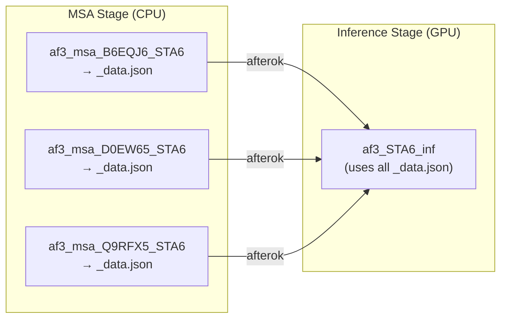
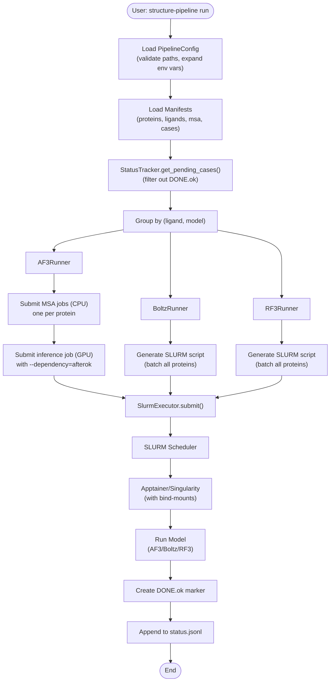

# Structure Pipeline

## TL;DR

- Run `structure-pipeline init-config` → edit `config/pipeline.yaml` with absolute paths to images/weights.
- Put inputs in `input/` (FASTA + ligand CIFs + MSA `.a3m` for Boltz/RF3).
- Generate manifests: `structure-pipeline manifest -c config/pipeline.yaml`.
- Submit jobs: `structure-pipeline run -c config/pipeline.yaml` (AF3 uses two-stage MSA→GPU).
- Check progress: `structure-pipeline status -c config/pipeline.yaml`.

---

[](https://www.python.org/downloads/)
[](https://opensource.org/licenses/MIT)

A production-oriented workflow automation system for running protein structure prediction at scale using **AlphaFold3**, **Boltz-2**, and **RoseTTAFold3** on HPC clusters with SLURM scheduling.

**Key Features:**
- 🔄 **Idempotent resume logic** – safely rerun after failures without recomputing completed work
- ⚡ **Efficient batching** – AF3 two-stage fan-in (MSA reuse), per-ligand batching for Boltz/RF3
- 🐳 **Containerized execution** – Apptainer/Singularity for reproducibility
- 📊 **Manifest-driven workflow** – auditable CSV-based execution plan
- 🎯 **Oligosaccharide support** – automatic multi-monomer handling for amylose/cellulose/chitin
- 🛠️ **Clean abstractions** – extensible executor and runner interfaces

## Supported Platforms

- **HPC Clusters:** SLURM with Apptainer/Singularity (tested on Olivia/Betzy)
- **Models:** AlphaFold3, Boltz-2, RoseTTAFold3
- **Input:** Single-chain proteins with CCD-format ligands

## Limitations & Requirements

- **Single-chain proteins only** – multi-chain paired MSAs are not supported
- **Pre-computed MSAs required** for Boltz-2 and RF3 (`.a3m` files from mmseqs/ColabFold)
- **AF3 generates MSAs natively** using jackhmmer/nhmmer (no pre-computed MSA needed)
- **CCD ligands** – ligands must be provided as CIF files in CCD format
- **Absolute paths required** in configuration (all paths must be accessible from compute nodes)

---

## Table of Contents

- [Installation](#installation)
- [Quick Start](#quick-start)
- [Architecture](#architecture)
- [Configuration Reference](#configuration-reference)
- [CLI Reference](#cli-reference)
- [Input File Specifications](#input-file-specifications)
- [Resume & Status Tracking](#resume--status-tracking)
- [Model-Specific Notes](#model-specific-notes)
- [Troubleshooting](#troubleshooting)
- [Testing](#testing)

---

## Installation

### Prerequisites

- Python 3.10+
- SLURM cluster with Apptainer/Singularity
- Access to model weights and container images

### Option 1: Use Pre-built Environment (Olivia HPC)

```bash
# Add to your ~/.bashrc or run each session
export PATH="/cluster/work/projects/nn1003k/eirik/conda/structure_pipeline_env/bin:$PATH"
export PATH="/cluster/work/projects/nn1003k/eirik/Masteroppgave/structure_pipeline/bin:$PATH"

# Verify installation
structure-pipeline --help
```

### Option 2: Build Your Own Environment

```bash
module load NRIS/CPU
module load hpc-container-wrapper

# Set proxy for conda downloads (Olivia-specific)
export http_proxy=http://10.63.2.48:3128/
export https_proxy=http://10.63.2.48:3128/

# Build containerized environment
conda-containerize new --mamba --prefix /path/to/your/install env.yml
export PATH="/path/to/your/install/bin:$PATH"

# Install pipeline in development mode
cd structure_pipeline
pip install -e .
```

> **⚠️ Path Issues:** Use `python -m structure_pipeline.cli` or the `bin/structure-pipeline` wrapper rather than the pip-installed entry point to avoid container path resolution issues.

---

## Quick Start

### 1. Initialize Configuration

Generate a template configuration file:

```bash
structure-pipeline init-config --output config/pipeline.yaml
```

Edit the generated file to set:
- Model weights paths (`af3_weights`, `boltz_weights`, `rf3_checkpoint`)
- Container image paths (`af3_gpu_image`, `boltz_image`, `rf3_image`)
- SLURM account and partitions
- Resource limits (memory, time, CPUs)

See [Configuration Reference](#configuration-reference) for all options.

### 2. Prepare Input Files

Organize your data following this structure:

```
structure_pipeline/
├── input/
│   ├── fasta/
│   │   └── proteins.fasta          # Protein sequences (see format below)
│   ├── ligand/
│   │   ├── amylose/                 # Organize by category (optional)
│   │   │   └── STA6.cif
│   │   ├── cellulose/
│   │   │   └── CEL6.cif
│   │   └── chitin/
│   │       └── NAG6.cif
│   ├── msa/                         # Pre-computed MSAs for Boltz/RF3
│   │   ├── B6EQJ6.a3m
│   │   ├── D0EW65.a3m
│   │   └── Q9RFX5.a3m
│   └── template/                    # (optional) template structures
│       ├── protein/
│       └── ligand/
```

**FASTA Format:**
```
>UniProtIDs_B6EQJ6_Aliivibrio_salmonicida_AA9_LPMO
MVTPETRGRLKGFAAPPPARSGRGQLLLLLLL
>UniProtIDs_D0EW65_Bacillus_thuringiensis_Unknown
MKKFIALVTLFTAISMAQAEEKPDCSGKSLVC
```

The first UniProt ID (before `;` if present) is used as `protein_id`.

**Ligand CIF Files:**
- Must be in CCD format (Chemical Component Dictionary)
- Filename determines the CCD code (e.g., `STA6.cif` → CCD code `STA6`)
- For oligosaccharides (amylose/cellulose/chitin), use `oligo_definitions.yaml` (see [Model-Specific Notes](#alphafold3))

### 3. Generate Manifests

Parse inputs and generate the execution plan:

```bash
structure-pipeline manifest -c config/pipeline.yaml
```

**Output:** Creates four CSV files in `manifest/`:
- `proteins.csv` – parsed from FASTA
- `ligands.csv` – scanned from `ligands_dir`
- `msa.csv` – matched from `msa_dir`
- `cases.csv` – Cartesian product of (protein × ligand × model)

**Preview manifests:**
```bash
head manifest/cases.csv
wc -l manifest/cases.csv  # Total number of prediction tasks
```

**Options:**
```bash
# Force regeneration (overwrites existing manifests)
structure-pipeline manifest -c config/pipeline.yaml --force

# Use CCD code list instead of scanning CIF files (faster)
structure-pipeline manifest -c config/pipeline.yaml --ligand-ccd-list ligands.txt
```

### 4. Validate Configuration

Check that all paths exist and are accessible:

```bash
structure-pipeline validate -c config/pipeline.yaml
```

This validates:
- Input files (FASTA, ligand directory, MSA directory)
- Model weights and container images
- SLURM configuration
- Output directory permissions

### 5. Submit Jobs

Submit prediction jobs to SLURM:

```bash
# Submit all pending jobs
structure-pipeline run -c config/pipeline.yaml

# Dry run (preview without submitting)
structure-pipeline run -c config/pipeline.yaml --dry-run

# Filter by model
structure-pipeline run -c config/pipeline.yaml --model af3
structure-pipeline run -c config/pipeline.yaml --model boltz

# Filter by protein
structure-pipeline run -c config/pipeline.yaml --protein B6EQJ6

# Override model parameters
structure-pipeline run -c config/pipeline.yaml \
  --af3-seeds 5 \
  --af3-diffusion-samples 3 \
  --boltz-recycling-steps 15

# Resume after failures (default behavior)
structure-pipeline run -c config/pipeline.yaml --resume

# Force rerun everything
structure-pipeline run -c config/pipeline.yaml --no-resume

# Local execution (no SLURM, runs as subprocess)
structure-pipeline run -c config/pipeline.yaml --local
```

**Job Grouping:**
- One SLURM job per `(ligand, model)` pair
- All proteins for a ligand are batched together
- AF3 submits MSA jobs first, then inference jobs with dependency

### 6. Monitor Progress

Check job status:

```bash
structure-pipeline status -c config/pipeline.yaml
```

**Output:**
```
Model   Completed   Pending   Failed
af3     10          5         0
boltz   8           7         0
rf3     12          3         0
```

**Check SLURM queue:**
```bash
squeue -u $USER
```

**Check logs:**
```bash
# Job-specific logs
tail -f work/{ligand_ccd}/{model}/slurm_*.err

# AF3 MSA logs
tail -f work/af3_msa/{protein}_{ligand}/slurm_*.err
```

---

## Architecture

### Design Philosophy

The pipeline uses a **manifest-driven workflow** with **clean abstraction layers**:

1. **Configuration Layer** (Pydantic) – validate paths, expand environment variables, set resource limits
2. **Manifest Layer** (CSV) – parse inputs into auditable execution plan
3. **Execution Layer** (Executors) – abstract job submission (SLURM or local)
4. **Workflow Layer** (Runners) – model-specific logic (AF3/Boltz/RF3)
5. **Status Layer** (JSONL) – append-only logs for resume capability

### Batching Strategy

**One SLURM job per (ligand, model)** – all proteins are batched together to share model-load overhead.

| Model | Architecture | Grouping | MSA Handling |
|-------|-------------|----------|--------------|
| **AlphaFold3** | Two-stage fan-in | MSA: one CPU job per (protein, ligand)<br/>Inference: one GPU job per ligand | Native (jackhmmer/nhmmer) |
| **Boltz-2** | Single-stage batch | One GPU job per ligand | Pre-computed (`.a3m` required) |
| **RoseTTAFold3** | Single-stage batch | One GPU job per ligand | Pre-computed (`.a3m` required) |

### AlphaFold3 Two-Stage Fan-In

AF3's expensive MSA computation is separated from inference to enable reuse across prediction seeds:



**Dependency Management:**
- MSA jobs run independently on CPU nodes
- Inference job has `--dependency=afterok:job1:job2:job3` (waits for all MSA jobs)
- If any MSA job fails, inference job is held indefinitely (manual intervention required)

### Directory Layout

```
work/
├── {ligand_ccd}/                      # e.g., STA6/
│   ├── af3/
│   │   ├── input/                     # Generated JSON input files
│   │   ├── runs/{SLURM_JOB_ID}/      # Per-run isolation
│   │   ├── latest -> runs/187025     # Symlink to most recent run
│   │   ├── status.jsonl               # Append-only event log
│   │   └── DONE.ok                    # Completion marker
│   ├── boltz/
│   │   ├── input/                     # One YAML per protein
│   │   │   ├── B6EQJ6_STA6.yaml
│   │   │   ├── D0EW65_STA6.yaml
│   │   │   └── Q9RFX5_STA6.yaml
│   │   ├── runs/{SLURM_JOB_ID}/
│   │   ├── latest -> runs/187026
│   │   ├── status.jsonl
│   │   └── DONE.ok
│   └── rf3/
│       ├── input/
│       │   └── rf3_input.json         # One JSON array with all proteins
│       ├── runs/{SLURM_JOB_ID}/
│       ├── latest -> runs/187027
│       ├── status.jsonl
│       └── DONE.ok
│
├── af3_msa/                           # AF3 MSA stage outputs
│   ├── B6EQJ6_STA6/
│   │   ├── input/
│   │   │   └── af3_msa_input.json
│   │   ├── runs/{SLURM_JOB_ID}/
│   │   │   └── fold_{protein}_{ligand}_data.json  # Pre-computed MSA
│   │   ├── latest -> runs/187025
│   │   └── DONE.ok
│   └── D0EW65_STA6/
│       └── ...
│
└── manifest/                          # Execution plan (CSV files)
    ├── proteins.csv
    ├── ligands.csv
    ├── msa.csv
    └── cases.csv
```

### Bind-Mount Optimization

The pipeline computes **minimal common-prefix bind-mounts** to avoid redundant mounts:

**Input paths:**
```
/cluster/projects/nn1003k/prog/foundry/checkpoints/rf3.ckpt
/cluster/projects/nn1003k/prog/foundry/models/rf3/src
/cluster/work/projects/nn1003k/eirik/tmp
```

**Computed mounts (2 instead of 3):**
```bash
--bind /cluster/projects/nn1003k/prog/foundry:/cluster/projects/nn1003k/prog/foundry
--bind /cluster/work/projects/nn1003k/eirik/tmp:/cluster/work/projects/nn1003k/eirik/tmp
```

**Preview mounts:**
```bash
structure-pipeline run -c config/pipeline.yaml --dry-run
```

### Data Flow



---

## Configuration Reference

### Complete Example: `pipeline.yaml`

```yaml
paths:
  # AlphaFold3
  af3_dir: /cluster/projects/nn1003k/prog/af3
  af3_cpu_image: /cluster/projects/nn1003k/prog/af3/af3_cpu_amd64.sif
  af3_gpu_image: /cluster/projects/nn1003k/prog/af3/af3_gpu_arm64.sif
  af3_weights: /cluster/projects/nn1003k/prog/af3/weights
  af3_databases: /cluster/shared/alphafold/public_databases

  # Boltz-2
  boltz_image: /cluster/projects/nn1003k/prog/boltz/boltz2_alt.sif
  boltz_weights: /cluster/projects/nn1003k/prog/boltz/weights

  # RoseTTAFold3
  rf3_foundry_root: /cluster/projects/nn1003k/prog/foundry
  rf3_image: /cluster/projects/nn1003k/prog/foundry/foundry.sif
  rf3_checkpoint: /cluster/projects/nn1003k/prog/foundry/checkpoints/rf3_foundry_01_24_latest_remapped.ckpt

slurm:
  account: nn1003k
  partition_cpu: normal
  partition_gpu: accel
  
  # Memory limits (per model overrides)
  mem_per_gpu: 80G                # Default for all models
  mem_per_gpu_af3: 80G            # Uniform 80G across models
  mem_per_gpu_boltz: 80G
  mem_per_gpu_rf3: 80G
  
  # Time limits
  time_msa: "02:00:00"            # AF3 MSA stage
  time_inference: "01:00:00"      # All inference jobs
  
  # Resource allocation
  gpus: 1
  cpus_msa: 8                     # AF3 MSA (jackhmmer)
  mem_per_cpu_msa: 10G
  
  # Temporary directory base
  tmp_base: /cluster/work/projects/nn1003k/eirik/tmp

af3:
  seeds: 10                        # Number of model seeds (≥1)
  num_diffusion_samples: 5         # Diffusion samples per seed (≥1)
  jackhmmer_n_cpu: 8               # CPUs for jackhmmer (MSA generation)

boltz:
  diffusion_samples: 5             # Diffusion samples (≥1)
  recycling_steps: 10              # Recycling steps (≥1)
  use_affinity: true               # Enable affinity prediction (YAML 'properties' field)
  use_msa_server: false            # Use MSA server (if false, requires pre-computed MSAs)

rf3:
  seed: 42
  diffusion_batch_size: 5          # Structures per diffusion batch (≥1)
  n_recycles: 10                   # Number of recycles (≥1)
  num_steps: 50                    # Diffusion steps (≥1)
  early_stopping_plddt_threshold: 0.5  # Early stopping threshold (0.0–1.0)
  skip_existing: false

inputs:
  proteins_fasta: input/fasta/proteins.fasta
  ligands_dir: input/ligand
  msa_dir: input/msa              # Optional (required for Boltz/RF3, not for AF3)
  
  # Optional: Pre-computed MSAs in squashfs files (not yet implemented)
  # msa_sqsh_files:
  #   - /path/to/msa_archive.sqsh
  # msa_sqsh_mount_point: /msa
  
  # Optional: Oligosaccharide definitions for AF3 multi-monomer handling
  # oligo_definitions: config/oligo_definitions.yaml

outputs:
  work_dir: work
  manifest_dir: manifest
  results_dir: results

models_enabled: [af3, boltz, rf3]   # Models to run (can disable any)
```

### Environment Variable Expansion

All paths in the `paths` section support environment variable expansion:

```yaml
paths:
  af3_weights: ${ALPHAFOLD_WEIGHTS}/af3
  boltz_image: $BOLTZ_HOME/boltz2_alt.sif
```

### Relative Path Resolution

Relative paths in `inputs` and `outputs` are converted to absolute paths using the config file's directory as base:

```yaml
inputs:
  proteins_fasta: input/fasta/proteins.fasta  # → /path/to/project/input/fasta/proteins.fasta
```

### Per-Model Memory Overrides

Use model-specific memory limits to optimize resource allocation:

```yaml
slurm:
  mem_per_gpu: 80G          # Fallback
  mem_per_gpu_af3: 80G      # Uniform 80G across models
  mem_per_gpu_boltz: 80G
  mem_per_gpu_rf3: 80G
```

The pipeline calls `SlurmConfig.get_mem_per_gpu(model)` to select the appropriate limit.

---

## CLI Reference

### Commands

| Command | Description |
|---------|-------------|
| `init-config` | Generate example configuration file |
| `manifest` | Parse inputs and generate case matrix (CSV manifests) |
| `validate` | Check all paths and dependencies |
| `run` | Submit prediction jobs to SLURM |
| `status` | Show job status summary (completed/pending/failed) |
| `version` | Show pipeline version |

### `structure-pipeline run` Options

```
Options:
  -c, --config PATH               Path to config YAML (default: auto-detect)
  -n, --dry-run                   Preview jobs without submitting
  -r, --resume / --no-resume      Skip completed jobs (default: --resume)
  -m, --model TEXT                Filter by model: af3, boltz, or rf3
  -p, --protein TEXT              Filter by protein ID
  --local                         Run as subprocess (no SLURM, for testing)
  
  # AlphaFold3 overrides
  --af3-seeds INT                 Number of model seeds (default: from config)
  --af3-diffusion-samples INT     Diffusion samples per seed (default: from config)
  
  # Boltz-2 overrides
  --boltz-diffusion-samples INT   Diffusion samples (default: from config)
  --boltz-recycling-steps INT     Recycling steps (default: from config)
  
  # RoseTTAFold3 overrides
  --rf3-seed INT                  Model seed (default: from config)
  --rf3-diffusion-batch-size INT  Structures per diffusion batch (default: from config)
  --rf3-n-recycles INT            Number of recycles (default: from config)
  --rf3-num-steps INT             Diffusion steps (default: from config)
  
  # Ligand/oligosaccharide options
  --ligand-ccd-list PATH          Path to CCD code list (alternative to scanning CIF files)
  --oligo-definitions PATH        Path to oligosaccharide definitions YAML
  
  --help                          Show this message and exit
```

### `structure-pipeline manifest` Options

```
Options:
  -c, --config PATH               Path to config YAML
  --force                         Force regeneration (overwrite existing manifests)
  --ligand-ccd-list PATH          Use CCD code list instead of scanning CIF files
  --help                          Show this message and exit
```

### Examples

```bash
# Initialize new project
structure-pipeline init-config --output config/pipeline.yaml

# Generate manifests
structure-pipeline manifest -c config/pipeline.yaml

# Regenerate manifests (overwrite existing)
structure-pipeline manifest -c config/pipeline.yaml --force

# Validate configuration
structure-pipeline validate -c config/pipeline.yaml

# Dry run (preview without submitting)
structure-pipeline run -c config/pipeline.yaml --dry-run

# Run specific model
structure-pipeline run -c config/pipeline.yaml --model af3

# Run specific protein
structure-pipeline run -c config/pipeline.yaml --protein B6EQJ6

# Override AF3 parameters
structure-pipeline run -c config/pipeline.yaml \
  --af3-seeds 5 \
  --af3-diffusion-samples 3

# Local execution (no SLURM)
structure-pipeline run -c config/pipeline.yaml --local --model rf3

# Force rerun everything
structure-pipeline run -c config/pipeline.yaml --no-resume

# Check status
structure-pipeline status -c config/pipeline.yaml

# Show version
structure-pipeline version
```

### Configuration File Discovery

If `-c/--config` is not specified, the pipeline searches for configuration in this order:

1. `$STRUCTURE_PIPELINE_CONFIG` environment variable
2. `./config/pipeline.yaml` (current directory)
3. `~/structure_pipeline.yaml` (home directory)

If no config is found, the command exits with an error.

---

## Input File Specifications

### FASTA Format

Protein sequences must be provided in standard FASTA format:

```fasta
>UniProtIDs_B6EQJ6_Aliivibrio_salmonicida_strain_LFI1238_AA9_LPMO
MVTPETRGRLKGFAAPPPARSGRGQLLLLLLL
>UniProtIDs_D0EW65;Q873G1_Bacillus_thuringiensis_Unknown
MKKFIALVTLFTAISMAQAEEKPDCSGKSLVC
```

**Header Parsing:**
- The first UniProt ID (before `;` if present) is used as `protein_id`
- Example: `UniProtIDs_B6EQJ6;Q873G1` → `protein_id = "B6EQJ6"`
- Full header is preserved in `proteins.csv` for reference

### Ligand CIF Files

Ligands must be provided as CIF files in CCD (Chemical Component Dictionary) format:

**Directory Structure:**
```
input/ligand/
├── amylose/
│   └── STA6.cif        # CCD code: STA6
├── cellulose/
│   └── CEL6.cif        # CCD code: CEL6
└── chitin/
    └── NAG6.cif        # CCD code: NAG6
```

**CCD Code Extraction:**
- Filename determines the CCD code (without `.cif` extension)
- Example: `STA6.cif` → CCD code `STA6`
- Category directories (e.g., `amylose/`) are for organization only (ignored by pipeline)

**CIF File Requirements:**
- Must be in mmCIF format (not legacy PDB format)
- Must contain `_chem_comp.id` field matching filename
- Atom coordinates must be present (`_chem_comp_atom`)
- Bond information must be present (`_chem_comp_bond`)

**Oligosaccharide Handling (AF3 only):**

For multi-monomer oligosaccharides (amylose, cellulose, chitin), provide a `config/oligo_definitions.yaml`:

```yaml
oligosaccharides:
  STA6:
    name: amylose
    repeat_count: 6
    monomer_ccd: STA
    bonded_atom_pairs:
      - [STA_1_O4, STA_2_C1]
      - [STA_2_O4, STA_3_C1]
      - [STA_3_O4, STA_4_C1]
      - [STA_4_O4, STA_5_C1]
      - [STA_5_O4, STA_6_C1]
  
  CEL6:
    name: cellulose
    repeat_count: 6
    monomer_ccd: CEL
    bonded_atom_pairs:
      - [CEL_1_O4, CEL_2_C1]
      - [CEL_2_O4, CEL_3_C1]
      - [CEL_3_O4, CEL_4_C1]
      - [CEL_4_O4, CEL_5_C1]
      - [CEL_5_O4, CEL_6_C1]
  
  NAG6:
    name: chitin
    repeat_count: 6
    monomer_ccd: NAG
    bonded_atom_pairs:
      - [NAG_1_O4, NAG_2_C1]
      - [NAG_2_O4, NAG_3_C1]
      - [NAG_3_O4, NAG_4_C1]
      - [NAG_4_O4, NAG_5_C1]
      - [NAG_5_O4, NAG_6_C1]
```

Then pass to `run` command:
```bash
structure-pipeline run -c config/pipeline.yaml \
  --oligo-definitions config/oligo_definitions.yaml
```

### MSA Files

Pre-computed MSAs are required for Boltz-2 and RF3 (AF3 generates MSAs internally).

**Format:** `.a3m` (FASTA-like with gap characters)

**Matching Logic:**

MSAs are matched to proteins by parsing the query header:

```
#B6EQJ6_UniProtIDs_Aliivibrio_salmonicida_AA9_LPMO
-MVTPETRGRLKGFAAPPPARSGRGQLLLLLLL
>UniRef100_A0KHI4 Uncharacterized protein (Fragment) n=1 Tax=Aliivibrio salmonicida...
-MVTPETRGRLKGFAAPPPARSGRGQLLLLLLL
```

The pipeline extracts UniProt IDs from:
1. Query header (first line starting with `#`)
2. Filename (e.g., `UniProtIDs_B6EQJ6_Aliivibrio_salmonicida.a3m`)

**Matching Strategy:**
- Extract all UniProt-like IDs (alphanumeric IDs matching `[A-Z0-9]{6,10}`)
- Match against `protein_id` from FASTA header
- First match wins

**Missing MSA Behavior:**
- Proteins without matching MSA are marked `SKIPPED` for Boltz/RF3
- Cases appear in `cases.csv` with `status=SKIPPED` and `error_message="Missing MSA"`
- These cases are not submitted to SLURM

### Alternative: CCD Code List

Instead of scanning CIF files, you can provide a text file with CCD codes (one per line):

```
# ligands.txt
STA6
CEL6
NAG6
CU
```

Then use:
```bash
structure-pipeline manifest -c config/pipeline.yaml \
  --ligand-ccd-list ligands.txt
```

**Trade-off:**
- ✅ Faster (no CIF parsing)
- ❌ No validation that CIF files exist or are valid
- ❌ No category metadata (all ligands treated equally)

---

## Resume & Status Tracking

### How Resume Works

The pipeline implements **idempotent resume logic** using two mechanisms:

1. **Completion Markers:** Each ligand/model job creates `DONE.ok` on success
2. **Event Logs:** Each job appends events to `status.jsonl` (JSONL format)

**Directory Structure:**
```
work/{ligand_ccd}/{model}/
├── status.jsonl       # Append-only event log
└── DONE.ok            # Completion marker (empty file)
```

**Resume Behavior:**
```bash
# Default: skip completed jobs (resume mode)
structure-pipeline run -c config/pipeline.yaml --resume

# Force rerun everything (ignores DONE.ok markers)
structure-pipeline run -c config/pipeline.yaml --no-resume
```

### Status Log Format

`status.jsonl` contains one JSON object per line (newline-delimited JSON):

```json
{"timestamp": "2026-02-23T14:30:52", "case_id": "a1b2c3d4e5f6", "protein_id": "B6EQJ6", "ligand_id": "STA6", "ligand_ccd_code": "STA6", "model": "af3", "event": "started", "message": "", "metadata": null}
{"timestamp": "2026-02-23T14:45:12", "case_id": "a1b2c3d4e5f6", "protein_id": "B6EQJ6", "ligand_id": "STA6", "ligand_ccd_code": "STA6", "model": "af3", "event": "completed", "message": "", "metadata": null}
```

**Event Types:**
- `started` – Job began execution
- `completed` – Job finished successfully
- `failed` – Job failed with error

**Note:** Failed jobs are logged but not automatically retried. Rerun with `--resume` to retry failed cases.

### Checking Status

```bash
structure-pipeline status -c config/pipeline.yaml
```

**Output:**
```
Model   Completed   Pending
af3     10          5
boltz   8           7
rf3     12          3
```

**Limitations:**
- ⚠️ Failed job count is not shown (check logs manually)
- ⚠️ Individual case status requires inspecting `status.jsonl`

### Manual Status Inspection

List completed jobs:
```bash
find work/ -name "DONE.ok"
```

Check failed jobs (SLURM logs):
```bash
grep -r "ERROR" work/*/af3/slurm_*.err
grep -r "FAILED" work/*/boltz/slurm_*.err
```

Parse event logs:
```bash
jq -r 'select(.event == "failed") | "\(.protein_id)_\(.ligand_id)_\(.model): \(.message)"' \
  work/*/*/status.jsonl
```

### Retry Strategy

**Automatic Retry:** Not implemented. Failed jobs must be manually rerun.

**Manual Retry:**
1. Identify failed jobs (check SLURM logs or `status.jsonl`)
2. Remove `DONE.ok` marker for failed ligand/model groups:
   ```bash
   rm work/{ligand_ccd}/{model}/DONE.ok
   ```
3. Rerun with `--resume`:
   ```bash
   structure-pipeline run -c config/pipeline.yaml --resume
   ```

### Concurrency Considerations

⚠️ **No distributed locking:** If multiple users (or multiple `run` commands) execute simultaneously on the same work directory, race conditions may occur:
- JSONL appends may interleave (usually safe)
- `DONE.ok` creation may race (last writer wins)

**Recommendation:** Use unique work directories per user or coordinate execution manually.

---

## Model-Specific Notes

### AlphaFold3

**Architecture:** Two-stage fan-in (MSA → Inference)

**MSA Generation:**
- Uses native AF3 MSA generation (jackhmmer/nhmmer)
- Does not require pre-computed MSAs (ignores `msa_dir`)
- One CPU job per `(protein, ligand)` pair
- Output: `{protein}_{ligand}_data.json` (contains preprocessed MSA)

**Inference:**
- One GPU job per ligand (batches all proteins)
- Reuses `_data.json` from MSA stage (no MSA regeneration)
- SLURM dependency: `--dependency=afterok:job1:job2:...` (waits for all MSA jobs)
- If any MSA job fails, inference job is held indefinitely

**Parameters:**
```yaml
af3:
  seeds: 10                    # Number of model seeds
  num_diffusion_samples: 5     # Diffusion samples per seed
  jackhmmer_n_cpu: 8           # CPUs for jackhmmer
```

**Oligosaccharide Support:**

AF3 can predict multi-monomer oligosaccharides (amylose, cellulose, chitin) by:
1. Defining monomer CCD codes in `oligo_definitions.yaml`
2. Specifying bonded atom pairs for inter-monomer bonds
3. Pipeline generates multiple ligand entries with `bondedAtomPairs` in JSON

Example oligosaccharide definition (see [Input File Specifications](#oligosaccharide-handling-af3-only)):
```yaml
oligosaccharides:
  STA6:
    monomer_ccd: STA
    repeat_count: 6
    bonded_atom_pairs: [...]
```

**Container Images:**
- `af3_cpu_image` – MSA stage (CPU, ARM64 or AMD64)
- `af3_gpu_image` – Inference stage (GPU, typically ARM64 for CUDA)

**Output Files:**
```
work/{ligand_ccd}/af3/runs/{SLURM_JOB_ID}/
├── fold_{protein}_{ligand}_model_0.cif
├── fold_{protein}_{ligand}_model_1.cif
├── ...
├── fold_{protein}_{ligand}_summary_confidences_0.json
└── fold_{protein}_{ligand}_data.json      # Preprocessed MSA (from MSA stage)
```

---

### Boltz-2

**Architecture:** Single-stage batch (one GPU job per ligand)

**MSA Requirements:**
- Requires pre-computed MSAs (`.a3m` files in `msa_dir`)
- Proteins without matching MSA are skipped
- Set `use_msa_server: true` to use Boltz MSA server (experimental)

**Input Format:**
- One YAML file per protein (all in `input/` directory)
- `boltz predict <dir>` processes all YAMLs sequentially

Example YAML:
```yaml
version: 1
sequences:
  - protein:
      id: A
      sequence: MVTPETRGRLK...
      msa: /path/to/B6EQJ6.a3m
  - ligand:
      id: B
      ccd: CU              # Copper ion (always included)
  - ligand:
      id: C
      ccd: STA6            # Oligosaccharide
properties:                # Optional: affinity prediction
  - affinity:
      binder: C
```

**Affinity Prediction:**

Enable via config (NOT via CLI flag, which doesn't exist):
```yaml
boltz:
  use_affinity: true
```

This adds a `properties` section to the YAML with the ligand as binder.

**Parameters:**
```yaml
boltz:
  diffusion_samples: 5       # Diffusion samples
  recycling_steps: 10        # Recycling steps
  use_affinity: true         # Enable affinity prediction
  use_msa_server: false      # Use MSA server (requires internet)
```

**Container:**
- Single image: `boltz_image`
- GPU image with `--nv` flag

**Output Files:**
```
work/{ligand_ccd}/boltz/runs/{SLURM_JOB_ID}/
├── {protein}_{ligand}/
│   ├── predictions/
│   │   ├── model_0.cif
│   │   ├── model_1.cif
│   │   └── ...
│   └── confidences.json
```

---

### RoseTTAFold3

**Architecture:** Single-stage batch (one GPU job per ligand)

**MSA Requirements:**
- Requires pre-computed MSAs (`.a3m` files in `msa_dir`)
- Proteins without matching MSA are skipped

**Input Format:**
- Single JSON file with array of examples (one per protein)
- All examples processed in one batch (shares model-load overhead)

Example JSON:
```json
[
  {
    "name": "B6EQJ6_STA6",
    "sequences": [
      {
        "protein": {
          "id": "A",
          "sequence": "MVTPETRGRLK...",
          "msa": "/path/to/B6EQJ6.a3m"
        }
      },
      {
        "ligand": {
          "id": "B",
          "ccd": "STA6"
        }
      }
    ]
  },
  {
    "name": "D0EW65_STA6",
    "sequences": [...]
  }
]
```

**Parameters:**
```yaml
rf3:
  seed: 42                               # Model seed
  diffusion_batch_size: 5                # Structures per diffusion batch
  n_recycles: 10                         # Number of recycles
  num_steps: 50                          # Diffusion steps
  early_stopping_plddt_threshold: 0.5    # Early stopping threshold
  skip_existing: false                   # Skip existing outputs
```

**Foundry Framework:**

RF3 uses the Foundry framework with Hydra CLI:
```bash
python -m rf3.run_inference \
  fold_input_path=/work/input/rf3_input.json \
  fold_output_path=/work/output \
  rf3_checkpoint_path=/weights/rf3.ckpt \
  fold_config.n_recycles=10 \
  fold_config.diffusion_batch_size=5
```

**Triton Installation:**

RF3 requires Triton 3.5.x. The pipeline:
1. Checks for Triton inside container
2. If missing, side-installs to `$TMPDIR/triton_install` (per-job isolation)
3. Sets `PYTHONPATH` to include side-installation

**Container:**
- Single image: `rf3_image` (Foundry container)
- Must contain RF3 checkpoint at `rf3_checkpoint` path
- Uses `--nv` flag for GPU support

**Output Files:**
```
work/{ligand_ccd}/rf3/runs/{SLURM_JOB_ID}/
├── {protein}_{ligand}/
│   ├── predictions/
│   │   ├── model_0.pdb
│   │   ├── model_1.pdb
│   │   └── ...
│   └── confidences.npz
```

---

## Troubleshooting

### Common Errors

#### "Missing MSA" Warnings

**Symptom:** Cases are marked `SKIPPED` with `error_message="Missing MSA"` in `cases.csv`.

**Cause:** Proteins without matching `.a3m` files are skipped for Boltz/RF3 (AF3 not affected).

**Solution:**
1. Check MSA filenames match protein IDs:
   ```bash
   ls input/msa/
   # Should see: B6EQJ6.a3m, D0EW65.a3m, etc.
   ```
2. Check query headers in `.a3m` files:
   ```bash
   head -n 1 input/msa/B6EQJ6.a3m
   # Should contain: #B6EQJ6 or UniProtIDs_B6EQJ6
   ```
3. Regenerate manifests:
   ```bash
   structure-pipeline manifest -c config/pipeline.yaml --force
   ```

#### SLURM Job Failures

**Symptom:** `squeue` shows job status `FAILED` or `CANCELLED`.

**Location:** Logs are in:
- `work/{ligand_ccd}/{model}/slurm_{SLURM_JOB_ID}.out` (stdout)
- `work/{ligand_ccd}/{model}/slurm_{SLURM_JOB_ID}.err` (stderr)
- AF3 MSA logs: `work/af3_msa/{protein}_{ligand}/slurm_{SLURM_JOB_ID}.err`

**Common Causes:**
1. **Out of memory:**
   ```
   slurmstepd: error: Detected 1 oom-kill event(s)
   ```
   **→ Solution:** Increase `mem_per_gpu` or `mem_per_cpu_msa` in config.

2. **Time limit exceeded:**
   ```
   slurmstepd: error: *** JOB CANCELLED AT ... DUE TO TIME LIMIT ***
   ```
   **→ Solution:** Increase `time_inference` or `time_msa` in config.

3. **Container image not found:**
   ```
   FATAL: container creation failed: mount /path/to/image.sif->...: no such file or directory
   ```
   **→ Solution:** Verify paths in `pipeline.yaml` are absolute and accessible from compute nodes.

4. **Missing weights:**
   ```
   FileNotFoundError: [Errno 2] No such file or directory: '/weights/rf3.ckpt'
   ```
   **→ Solution:** Check `rf3_checkpoint`, `af3_weights`, `boltz_weights` paths in config.

#### AF3 Inference Jobs Held Indefinitely

**Symptom:** `squeue` shows AF3 inference jobs with reason `Dependency`.

**Cause:** One or more MSA jobs failed, so the dependency `--dependency=afterok:...` is never satisfied.

**Solution:**
1. Check MSA job statuses:
   ```bash
   sacct -u $USER --format=JobID,JobName,State,ExitCode | grep af3_msa
   ```
2. Identify failed MSA jobs (look for `FAILED` or non-zero exit codes).
3. Cancel held inference jobs:
   ```bash
   scancel {inference_job_id}
   ```
4. Remove `DONE.ok` markers for failed ligands:
   ```bash
   rm work/af3_msa/{protein}_{ligand}/DONE.ok
   rm work/{ligand}/af3/DONE.ok
   ```
5. Rerun:
   ```bash
   structure-pipeline run -c config/pipeline.yaml --model af3 --resume
   ```

#### Container Path Issues

**Symptom:** Errors like:
```
FileNotFoundError: /work/input/rf3_input.json: No such file or directory
```

**Cause:** Paths inside container don't match host paths due to bind-mount misconfiguration.

**Solution:**
1. Preview bind-mounts:
   ```bash
   structure-pipeline run -c config/pipeline.yaml --dry-run
   ```
2. Verify all paths in config are absolute (not relative):
   ```bash
   grep "^  " config/pipeline.yaml | grep -v "^[[:space:]]*#"
   ```
3. Ensure paths are accessible from compute nodes (not login-node-only mounts).

#### Validation Errors

**Symptom:** `structure-pipeline validate` reports missing files.

**Solution:**
1. Check all paths exist:
   ```bash
   ls -lh /path/to/af3_weights
   ls -lh /path/to/boltz_image
   ```
2. Verify compute nodes can access paths:
   ```bash
   srun ls -lh /path/to/af3_weights
   ```
3. Fix typos in `pipeline.yaml`.

### Performance Tuning

#### Optimize Resource Limits

**Problem:** Jobs are killed due to insufficient memory.

**Solution:** Increase memory limits per model:
```yaml
slurm:
  mem_per_gpu_af3: 80G      # Uniform 80G across models
  mem_per_gpu_boltz: 80G
  mem_per_gpu_rf3: 80G
```

**Problem:** Jobs are slow due to insufficient CPU/memory for MSA generation.

**Solution:** Increase MSA resources:
```yaml
slurm:
  cpus_msa: 16              # More CPUs for jackhmmer
  mem_per_cpu_msa: 15G
```

#### Optimize Time Limits

**Problem:** Jobs are cancelled due to time limit.

**Solution:** Adjust time limits based on observed run times:
```yaml
slurm:
  time_msa: "04:00:00"        # AF3 MSA can be slow
  time_inference: "02:00:00"  # Larger proteins need more time
```

#### Optimize Batching

**Problem:** Too many SLURM jobs created (scheduler overhead).

**Solution:** The pipeline already batches by `(ligand, model)`. To reduce further:
- Combine ligands manually (requires code changes)
- Use fewer models (set `models_enabled: [af3]` in config)

### Debugging Tips

**Check SLURM job details:**
```bash
scontrol show job {SLURM_JOB_ID}
sacct -j {SLURM_JOB_ID} --format=JobID,JobName,State,ExitCode,Elapsed,MaxRSS,AllocCPUS
```

**Inspect generated SLURM scripts:**
```bash
cat work/{ligand_ccd}/{model}/{model}_{ligand}.sh
cat work/af3_msa/{protein}_{ligand}/af3_msa_{protein}_{ligand}.sh
```

**Check container environment:**
```bash
# Test container interactively
srun --account=nn1003k --partition=accel --gpus=1 --mem=80G --time=00:30:00 --pty bash
module load NRIS/GPU
apptainer shell --nv /path/to/boltz_image.sif
# Inside container:
ls /weights/
python -c "import torch; print(torch.cuda.is_available())"
```

**Parse event logs:**
```bash
# Show all failed cases
jq -r 'select(.event == "failed")' work/*/*/status.jsonl

# Count events by type
jq -r '.event' work/*/*/status.jsonl | sort | uniq -c
```

### Getting Help

1. **Check logs:** Always start with SLURM `.err` files and `status.jsonl`.
2. **Verify config:** Run `structure-pipeline validate` to catch path issues.
3. **Test locally:** Use `--local` flag to test without SLURM overhead.
4. **Dry run:** Use `--dry-run` to preview bind-mounts and job scripts.
5. **Inspect manifests:** Check `manifest/*.csv` files to verify expectations.

---

## Testing

### Running Tests

```bash
# Set up environment
export PATH="/cluster/work/projects/nn1003k/eirik/conda/structure_pipeline_env/bin:$PATH"
cd /cluster/work/projects/nn1003k/eirik/Masteroppgave/structure_pipeline

# Run all tests
pytest tests/ -v

# Run specific test file
pytest tests/test_af3_runner.py -v

# Run with coverage
pytest tests/ --cov=structure_pipeline --cov-report=html
```

### Test Coverage

The pipeline includes 11 test files covering:

- **Runners:** `test_af3_runner.py`, `test_boltz_runner.py`, `test_rf3_runner.py`
- **Manifest:** `test_proteins.py`, `test_ligands.py`, `test_ccd_list.py`
- **Cases:** `test_cases.py`
- **Utilities:** `test_oligo.py`, `test_ligand_utils.py` (inferred)
- **Executors:** Tests for SLURM script generation (inferred)
- **Integration:** `test_integration.py`

### Writing New Tests

Tests use pytest with fixtures for temporary directories and mock data:

```python
import pytest
from pathlib import Path
from structure_pipeline.runners.af3 import AF3Runner
from structure_pipeline.config import PipelineConfig

def test_af3_runner_build_input(tmp_path):
    """Test AF3 input file generation."""
    config = PipelineConfig(...)
    runner = AF3Runner(config)
    
    # Create test data
    cases = [...]
    protein_sequences = {"B6EQJ6": "MVTPETRGRLK..."}
    
    # Test
    input_file = runner.build_input_file(cases, protein_sequences, tmp_path)
    assert input_file.exists()
    
    # Validate JSON structure
    import json
    with open(input_file) as f:
        data = json.load(f)
    assert "sequences" in data
```

---

## Project Structure

```
structure_pipeline/
├── bin/
│   ├── run_pipeline.sh           # SLURM wrapper script (legacy)
│   └── structure-pipeline        # CLI wrapper
├── config/
│   ├── pipeline.yaml             # Main configuration
│   └── oligo_definitions.yaml    # Oligosaccharide definitions
├── src/
│   └── structure_pipeline/
│       ├── __init__.py
│       ├── cli.py                # Typer CLI commands
│       ├── config.py             # Pydantic configuration models
│       ├── cases.py              # Case generation and grouping
│       ├── resume.py             # Status tracking and resume logic
│       ├── executors/            # Job execution abstractions
│       │   ├── base.py           # ExecutorInterface, JobStatus
│       │   ├── local.py          # LocalExecutor (subprocess)
│       │   └── slurm.py          # SlurmExecutor (sbatch)
│       ├── manifest/             # Input parsing
│       │   ├── proteins.py       # FASTA parsing
│       │   ├── ligands.py        # CIF scanning
│       │   └── msa.py            # MSA matching
│       └── runners/              # Model workflows
│           ├── base.py           # RunnerInterface
│           ├── af3.py            # AF3Runner (two-stage)
│           ├── boltz.py          # BoltzRunner
│           ├── rf3.py            # RF3Runner
│           ├── ligand_utils.py   # Ligand entry builders
│           ├── mounts.py         # Bind-mount computation
│           └── oligo.py          # Oligosaccharide registry
├── tests/                        # Pytest test suite
├── input/                        # User input files
├── work/                         # Job outputs (work directory)
├── manifest/                     # Generated CSV manifests
├── results/                      # Aggregated results (future)
├── pyproject.toml                # Python package metadata
└── README.md                     # This file
```

---

## Contributing

### Development Setup

```bash
# Clone repository
git clone https://github.com/your-org/structure_pipeline.git
cd structure_pipeline

# Create development environment
conda env create -f env.yml
conda activate structure_pipeline_env

# Install in editable mode
pip install -e .

# Run tests
pytest tests/ -v
```

### Code Style

- **Formatting:** Use `black` for code formatting
- **Linting:** Use `ruff` for linting
- **Type Checking:** Use `mypy` for static type checking (recommended, not enforced)

```bash
black src/ tests/
ruff check src/ tests/
mypy src/
```

### Architecture Guidelines

1. **Separation of concerns:** Keep configuration, execution, and workflow logic separate
2. **Abstraction layers:** Use interfaces (ExecutorInterface, RunnerInterface) for extensibility
3. **Idempotency:** All operations should be safe to rerun (resume logic)
4. **Explicit is better than implicit:** Avoid magic; make paths and dependencies explicit
5. **Test coverage:** Add tests for new features (fixtures in `tests/conftest.py`)

### Adding a New Model

To add support for a new structure prediction model:

1. **Create runner:** Add `src/structure_pipeline/runners/mymodel.py` implementing `RunnerInterface`
2. **Add config:** Extend `config.py` with `MyModelConfig` class
3. **Update CLI:** Add CLI options in `cli.py run()` for model-specific parameters
4. **Add tests:** Create `tests/test_mymodel_runner.py`
5. **Update docs:** Add model-specific notes to README

Example runner skeleton:
```python
from .base import RunnerInterface, RunnerResult
from ..config import PipelineConfig

class MyModelRunner(RunnerInterface):
    def __init__(self, config: PipelineConfig):
        self.config = config
    
    @property
    def model_name(self) -> str:
        return "mymodel"
    
    def build_input_file(self, cases, protein_sequences, output_dir, **kwargs):
        # Generate input files
        pass
    
    def build_command(self, input_file, output_dir, **kwargs):
        # Generate container command
        pass
    
    def build_slurm_script(self, cases, protein_sequences, work_dir, job_name, **kwargs):
        # Generate SLURM script
        pass
```

---

## Known Limitations

1. **No automatic retry logic** – Failed jobs must be manually rerun
2. **No distributed locking** – Assumes single-user execution
3. **Squashfs MSA mounting not implemented** – Config fields exist but unused
4. **No centralized logging** – Uses `console.print()` only (no persistent logs)
5. **No resource profiling** – Cannot track actual CPU/GPU usage per job
6. **Single-chain proteins only** – Multi-chain paired MSAs not supported
7. **Failed job counts not shown** – `status` command only shows completed/pending
8. **AF3 dependency failures hold jobs indefinitely** – No automatic cancellation

See [CODE_WALKTHROUGH.md](CODE_WALKTHROUGH.md) for detailed analysis and recommendations.

---

## Roadmap

**Planned improvements** (in priority order):

1. ✅ Comprehensive documentation (CODE_WALKTHROUGH.md)
2. ⬜ Centralized logging (Python `logging` module with file handlers)
3. ⬜ Structured error reporting (custom exceptions, better diagnostics)
4. ⬜ Failed job tracking (`status` command shows failed counts)
5. ⬜ Automatic retry logic (with backoff and failure limits)
6. ⬜ User guide (setup, input specs, troubleshooting)
7. ⬜ Squashfs MSA mounting implementation
8. ⬜ Resource profiling (track actual usage per job)
9. ⬜ Multi-chain support (paired MSAs)
10. ⬜ CI/CD pipeline (GitHub Actions for pytest, linting, mypy)

---

## Citation

If you use this pipeline in your research, please cite:

```bibtex
@software{structure_pipeline_2026,
  author = {Eirik Rismo},
  title = {Structure Pipeline: Multi-model protein structure prediction workflow},
  year = {2026},
  url = {https://github.com/your-org/structure_pipeline}
}
```

**Model Citations:**

- **AlphaFold3:** Abramson et al. (2024) "Accurate structure prediction of biomolecular interactions with AlphaFold 3" *Nature*
- **Boltz-2:** Wohlwend et al. (2024) "Boltz-2: Fast and accurate protein structure prediction"
- **RoseTTAFold3:** Krishna et al. (2024) "Generalized biomolecular modeling and design with RoseTTAFold All-Atom" *Science*

---

## License

MIT License

Copyright (c) 2026 Eirik Rismo

Permission is hereby granted, free of charge, to any person obtaining a copy
of this software and associated documentation files (the "Software"), to deal
in the Software without restriction, including without limitation the rights
to use, copy, modify, merge, publish, distribute, sublicense, and/or sell
copies of the Software, and to permit persons to whom the Software is
furnished to do so, subject to the following conditions:

The above copyright notice and this permission notice shall be included in all
copies or substantial portions of the Software.

THE SOFTWARE IS PROVIDED "AS IS", WITHOUT WARRANTY OF ANY KIND, EXPRESS OR
IMPLIED, INCLUDING BUT NOT LIMITED TO THE WARRANTIES OF MERCHANTABILITY,
FITNESS FOR A PARTICULAR PURPOSE AND NONINFRINGEMENT. IN NO EVENT SHALL THE
AUTHORS OR COPYRIGHT HOLDERS BE LIABLE FOR ANY CLAIM, DAMAGES OR OTHER
LIABILITY, WHETHER IN AN ACTION OF CONTRACT, TORT OR OTHERWISE, ARISING FROM,
OUT OF OR IN CONNECTION WITH THE SOFTWARE OR THE USE OR OTHER DEALINGS IN THE
SOFTWARE.

---

## Acknowledgments

- **NRIS (Norwegian Research Infrastructure Services)** for HPC access (Olivia/Betzy clusters)
- **AlphaFold3, Boltz-2, RoseTTAFold3 teams** for open-source model implementations
- **Foundry framework** for RoseTTAFold3 workflow integration

---

**For detailed code analysis and architecture documentation, see [CODE_WALKTHROUGH.md](CODE_WALKTHROUGH.md).**
